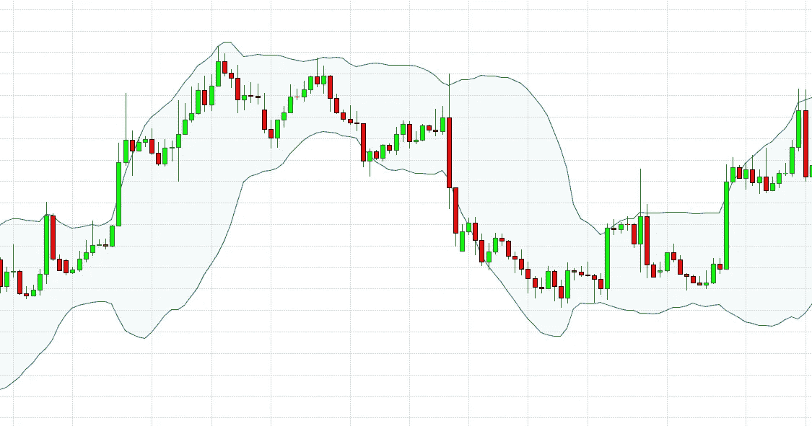
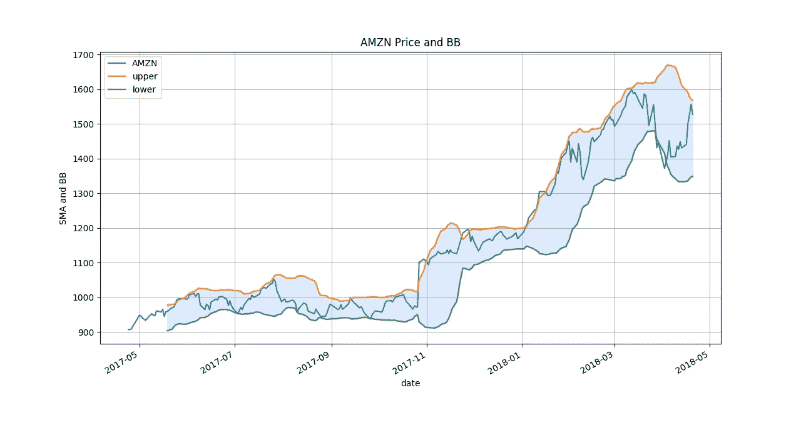

# 交易:用熊猫计算技术分析指标🐼

> 原文：<https://towardsdatascience.com/trading-technical-analysis-with-pandas-43e737a17861?source=collection_archive---------2----------------------->


(我的[博客](https://kylelix7.github.io/Calculate-Technical-Analysis-Indicators-with-Pandas/)里也有这个帖子)

在金融学中， [**技术分析**](https://en.wikipedia.org/wiki/Technical_analysis) 是通过研究过去的市场数据，主要是*价格*和*成交量*来预测价格走向的分析方法论。技术分析师依靠技术指标的组合来研究股票，并给出交易策略的见解。常用的技术指标有 [SMA](https://en.wikipedia.org/wiki/Moving_average#Simple_moving_average) 和[布林线](https://en.wikipedia.org/wiki/Bollinger_Bands)等。这是一份技术指标的清单。

在之前的一个[故事](https://medium.com/@kyle.jinhai.li/collect-trading-data-with-pandas-library-8904659f2122)中，我讲过如何用熊猫收集这样的信息。在这个故事中，我将演示如何计算布林线，并用它来提供潜在的买入/卖出信号。

**布林线**

**布林线**用于定义市场中的最高价和最低价，以表征金融工具或商品的交易区间。布林线是一个[波动](https://en.wikipedia.org/wiki/Volatility_(finance))指标。波段是由移动平均线(MA)组成的，有上波段和下波段。上下波段只是 MA 加和减标准差。标准差是波动性的度量。这就是为什么它是一个波动指标。

```
Upper Band = (MA + *Kσ*)Lower Band = (MA − *Kσ*)
```

MA 是典型的 20 天移动平均线，K 是 2。我将在这个例子中使用它们。



example of Bollinger Bands

先决条件环境设置(遵循此[帖子](https://medium.com/@kyle.jinhai.li/collect-trading-data-with-pandas-library-8904659f2122)中的步骤 1)

数据:

在本例中，我们将使用从之前的[帖子](https://medium.com/@kyle.jinhai.li/collect-trading-data-with-pandas-library-8904659f2122)中收集的 csv 文件(AMZN.csv)

代码:

```
**import** pandas **as** pd
**import** matplotlib.pyplot **as** plt

symbol=**'AMZN'** *# read csv file, use date as index and read close as a column* df = pd.read_csv(**'~/workspace/{}.csv'**.format(symbol), index_col=**'date'**,
                 parse_dates=**True**, usecols=[**'date'**, **'close'**],
                 na_values=**'nan'**)
*# rename the column header with symbol name* df = df.rename(columns={**'close'**: symbol})
df.dropna(inplace=**True**)

*# calculate Simple Moving Average with 20 days window* sma = df.rolling(window=20).mean()

*# calculate the standar deviation* rstd = df.rolling(window=20).std()

upper_band = sma + 2 * rstd
upper_band = upper_band.rename(columns={symbol: **'upper'**})
lower_band = sma - 2 * rstd
lower_band = lower_band.rename(columns={symbol: **'lower'**})

df = df.join(upper_band).join(lower_band)
ax = df.plot(title=**'{} Price and BB'**.format(symbol))
ax.fill_between(df.index, lower_band[**'lower'**], upper_band[**'upper'**], color=**'#ADCCFF'**, alpha=**'0.4'**)
ax.set_xlabel(**'date'**)
ax.set_ylabel(**'SMA and BB'**)
ax.grid()
plt.show()
```

输出



Amazon price and its Bollinger Bands

买入/卖出信号的解释

大约 90%的价格波动在两个波段之间。因此，波段可以用来识别潜在的超买或超卖情况。如果股价突破了上限，这可能是一个超买状态(做空的迹象)。同样，当它突破低波段时，可能是超卖状态(多头的迹象)。但是布林线不是一个独立的系统，总是给出准确的买入/卖出信号。应该考虑频带的整体趋势来识别信号。否则，只有布林线，一个人可以不断地做出错误的订单。在上面的亚马逊例子中，趋势是上升的。因此，只有在低频带被标记时，才应该做多。更多信息可以在[这里](https://www.investopedia.com/trading/using-bollinger-bands-to-gauge-trends/)找到。

这就是计算技术指标的简单方法🐼！

如果你想了解更多关于机器学习的知识，educative.io 网站上有一系列[课程很有帮助。这些课程包括像基本的 ML，NLP，图像识别等主题。](https://www.educative.io/profile/view/6083138522447872?aff=VEzk)

推荐阅读:

[动手机器学习](https://www.amazon.com/gp/product/1492032646/ref=as_li_tl?ie=UTF8&camp=1789&creative=9325&creativeASIN=1492032646&linkCode=as2&tag=blog023b-20&linkId=e6994d31d10e7ac4d35d9889cfe5622e)

[用于数据分析的 Python:与 Pandas、NumPy 和 IPython 的数据争论](https://www.amazon.com/gp/product/1491957662/ref=as_li_tl?ie=UTF8&camp=1789&creative=9325&creativeASIN=1491957662&linkCode=as2&tag=blog023b-20&linkId=be0bbd6ab4fd578397d9c14facc76911)

[对冲基金真正在做什么](https://www.amazon.com/gp/product/1631570897/ref=as_li_tl?ie=UTF8&camp=1789&creative=9325&creativeASIN=1631570897&linkCode=as2&tag=blog023b-20&linkId=d7bb68173b008df1b500073e3a8d054e)

我的帖子:

[我关于金融和科技的帖子](https://medium.com/@fin.techology/my-posts-about-finance-and-tech-7b7e6b2e57f4?source=your_stories_page---------------------------)

[我的 YouTube 频道](https://bit.ly/3bBOjtJ)

[我关于 FAANG 访谈的帖子](https://medium.com/@fin.techology/my-posts-about-faang-interview-20e529c5f13f?source=your_stories_page---------------------------)

[从 CRUD web 应用开发到语音助手中的 SDE——我正在进行的机器学习之旅](https://medium.com/@fin.techology/from-crud-app-dev-to-sde-in-voice-assistant-my-ongoing-journey-to-ml-4ea11ec4966e?)

[全栈开发教程:将 AWS Lambda 无服务器服务集成到 Angular SPA 中](/full-stack-development-tutorial-integrate-aws-lambda-serverless-service-into-angular-spa-abb70bcf417f)

[全栈开发教程:用运行在 AWS Lambda 上的无服务器 REST API 提供交易数据](/full-stack-development-tutorial-serverless-rest-api-running-on-aws-lambda-a9a501f54405)

[全栈开发教程:在 Angular SPA 上可视化交易数据(1)](/full-stack-development-tutorial-visualize-trading-data-on-angular-spa-7ec2a5749a38)

[强化学习:Q 学习简介](https://medium.com/@kyle.jinhai.li/reinforcement-learning-introduction-to-q-learning-444c951e292c)