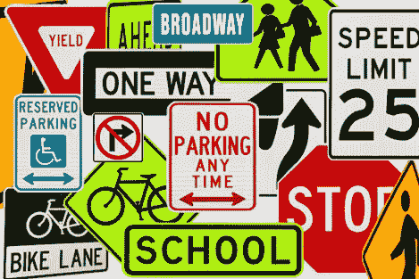
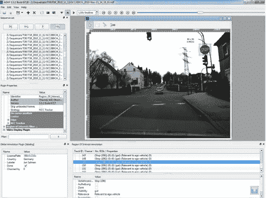
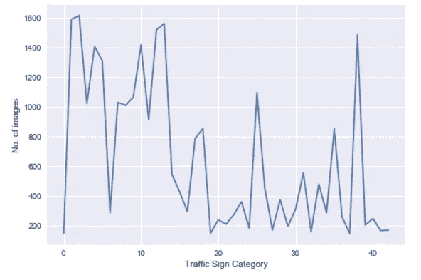
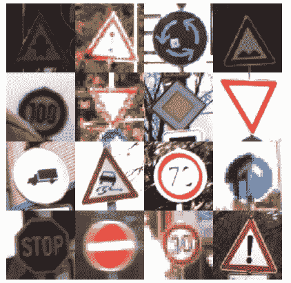
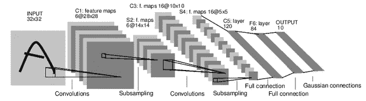
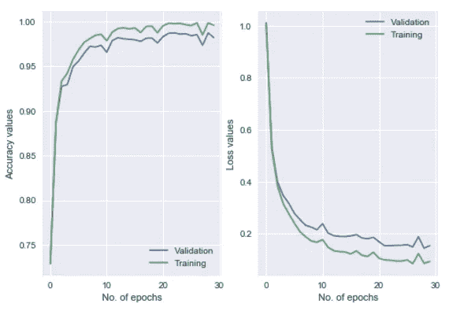
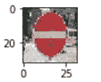
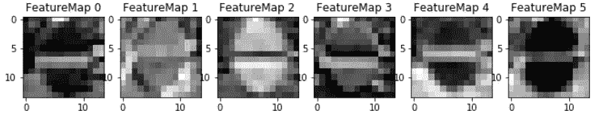
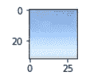
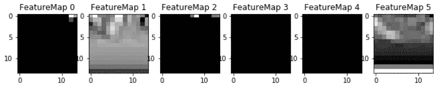

# 像人类一样准确地阅读交通标志

> 原文：<https://towardsdatascience.com/traffic-signs-classification-for-self-driving-car-67ce57877c33?source=collection_archive---------4----------------------->

*用数据做酷事*

自动驾驶汽车将不得不实时解读我们道路上的所有交通标志，并在驾驶中考虑这些因素。在这篇博客中，我们使用深度学习来训练汽车以 93%的准确率对交通标志进行分类。

我已经用 Python 分享了我的 [**GitHub**](https://github.com/priya-dwivedi/CarND/blob/master/CarND-Traffic-Sign-Classifier-P2/Traffic_Sign_Classifier_pd.ipynb) 的链接和全部代码。

Traffic Signs!

## **数据集**

这个练习使用的数据集(可以从[这里](http://benchmark.ini.rub.de/?section=gtsrb&subsection=dataset)下载)由德国道路上看到的 43 个不同的交通标志组成。交通标志图像是从实际道路图像中裁剪出来的，因此处于不同的光照条件下，如下所示。

Cropping stop sign from actual road images

它总共有 5 万张图片。图像为 32x32 像素，并且是彩色的。

**理解数据**

任何建模练习的第一步都应该是熟悉所涉及的数据。这里有 43 个不同的交通标志。如下图所示，数据分布不均匀。一些标志只有 200 张图片，而另一些有超过 1200 张图片。

如下图所示，可视化数据集中的图像，我们可以看到图像很小，具有不同的亮度，有些图像很模糊。此外，交通标志并不总是在图像的中心。

Traffic Sign images from the dataset

**数据预处理**

在将图像输入神经网络之前，我对图像进行了归一化处理，使像素值介于 0 和 0.5 之间。我这样做是通过将所有像素值除以 255。这样做是因为当原始数据在 0 和 1 之间时，神经网络表现得更好。我决定使用彩色交通标志，而不是将其转换为灰色，因为人类使用标志的颜色进行分类，所以机器也可以受益于这些额外的信息。最后，我将数据集分为训练集、验证集和测试集。测试集是模型永远看不到的 30%的样本。

## **模型架构**

对于这个项目，我决定使用 LeNet 架构，这是一个简单的卷积神经网络(CNN)，在 MNIST 数据集上表现良好。如下所示，该模型有两个卷积层，后跟两个最大池层。第一个卷积层使用 5x5 的面片大小和深度为 6 的过滤器。第二个卷积层也使用 5x5 的面片大小，但深度为 16 的过滤器。在卷积之后，我们展平输出，然后使用两个完全连接的层。第一个有 120 个神经元，第二个有 84 个神经元。在所有层之间使用 RELU 激活。最后，我们有一个输出层，它使用 Softmax 将图像分为 43 类。

LeNet Architecture

LeNet 架构在这个问题上表现得非常好，在 30 个时期内，我们在验证样本上获得了 98%以上的准确率。请参见下面的准确度和损失图:

Model training using LeNet Architecture

从未接触过该模型的测试样本的准确度约为 93%,这是相当可靠的。

如果我们使用图像增强——亮度、旋转、平移等方面的变化，精确度可以进一步提高。增加样本量。

## **可视化神经网络**

虽然神经网络可以是一个很好的学习设备，但它们通常被称为黑盒。我们可以通过绘制其特征图来了解神经网络正在学习什么——这是过滤器的输出。从这些绘制的特征地图中，可以看出网络对图像的哪些特征感兴趣。对于标志，内部网络要素地图可能会对标志的边界轮廓或标志的着色符号中的对比度做出高度激活的反应。

查看这个[链接](https://cs231n.github.io/understanding-cnn/)，了解更多关于可视化神经网络的信息。

让我们看看第一个卷积层的 6 个不同的过滤器如何响应“请勿进入”的标志。这里亮点反映了神经元被激活的地方。可以看出，网络集中在圆形标志和中间的扁平线上。

Do Not Enter Sign

Feature map — Do Not Enter Sign

相比之下，我们从没有交通标志的天空图像来看特征图。大多数过滤器是黑色的，这意味着神经网络无法识别该图像中的任何明显特征。

这不是超级有趣吗！

**其他著述**:[https://medium.com/@priya.dwivedi/](https://medium.com/@priya.dwivedi/)

PS:我住在多伦多，我希望将职业生涯转向深度学习。如果你喜欢我的帖子，并能把我联系到任何人，我将不胜感激:)。我的电子邮件是 priya.toronto3@gmail.com

**参考文献:**

[Udacity](https://www.udacity.com/) 无人驾驶汽车 Nano Degree——感谢 Udacity 和巴斯蒂安·特龙给我机会成为他们新的无人驾驶汽车项目的一部分。这是一次非常有趣的旅程。我使用的大部分代码都是在课堂讲课中建议的。这里的图片和视频参考也在讲座中分享

德国交通标志数据集:[http://benchmark.ini.rub.de/?section=gtsrb&分部=数据集](http://benchmark.ini.rub.de/?section=gtsrb&subsection=dataset)