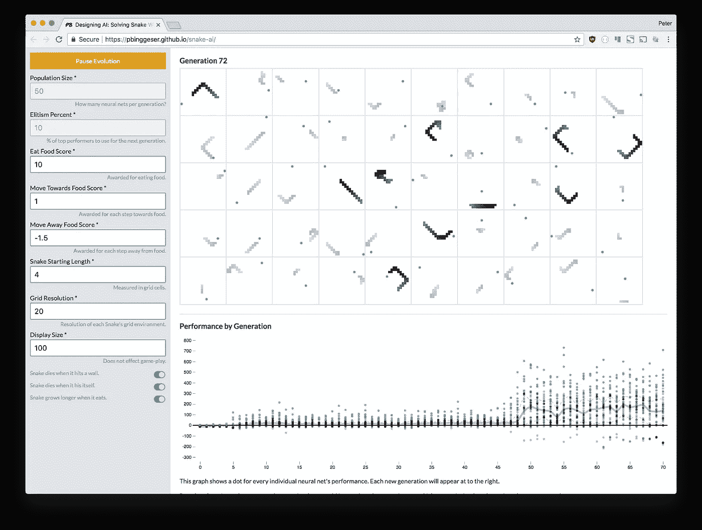
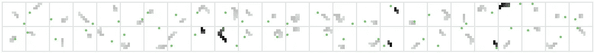

# 训练人工智能在你的浏览器中玩蛇

> 原文：<https://towardsdatascience.com/train-ai-to-play-snake-in-your-browser-ca657097d707?source=collection_archive---------2----------------------->

最近，我[写了一篇文章](https://medium.com/@peterbinggeser/designing-ai-solving-snake-with-evolution-f3dd6a9da867),讲述了我设计能够自己学习玩贪吃蛇游戏的人工智能的过程。人工智能的设计过程很复杂。许多早期的小决定会导致完全不同的结果。现在，经过一点清理后，任何人都可以在他们的浏览器中调整、调整和发展他们自己的蛇形人工智能。

 [## 设计人工智能:用进化解决蛇

### 在你的浏览器中训练、调整和调整人工智能。

pbingeser . github . io](https://pbinggeser.github.io/snake-ai/) 

## 可调参数

**群体规模—** 每一代要创建的神经网络的数量

**精英百分比—** 用于培育下一代的优秀员工的百分比

**美食积分—** 因食用美食而获得的积分

**迈向美食得分—** 迈向美食的每一步所获得的分数

**远离食物得分—** 远离食物每一步的得分

**蛇的起始长度—** 每条蛇的初始长度，在网格单元中测量

**网格分辨率—** 组成蛇的环境的网格单元的宽度(和高度)的数量

**显示尺寸—** 每个贪吃蛇游戏占多少像素宽*(不影响游戏)*

## **游戏性切换**

1.  蛇撞墙就死了。
2.  蛇打自己就死了。
3.  蛇吃东西的时候会变长。

耐心点。有时，有利的随机突变发生得很快，有时这些突变证明最好谨慎行事，有时它们似乎永远不会发生…

# 🐍

