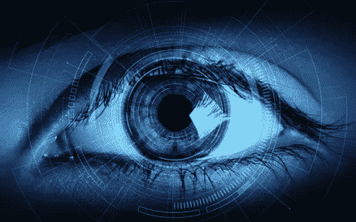
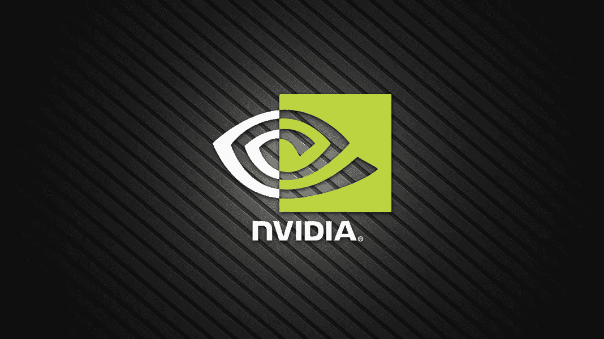
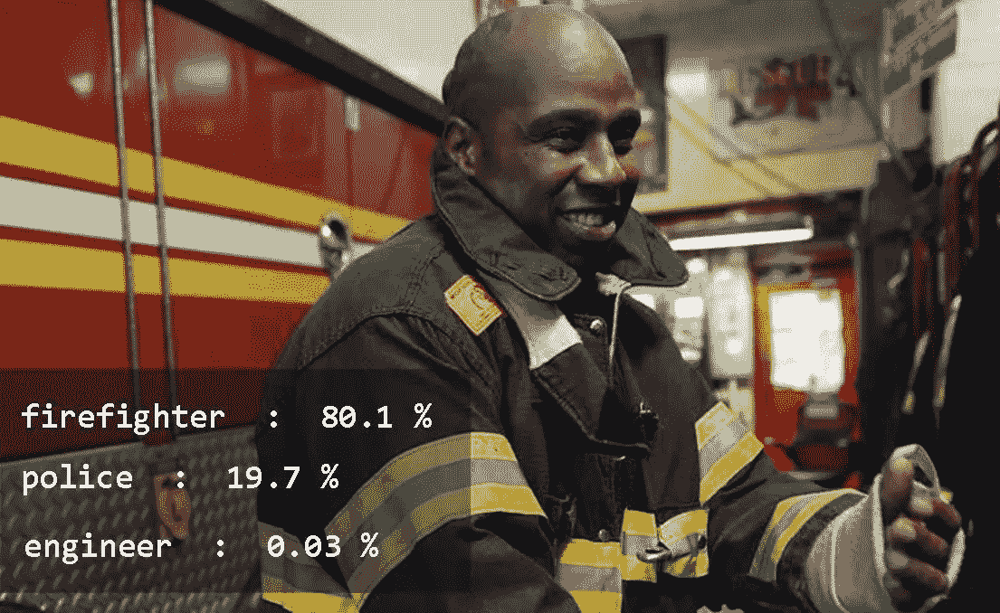
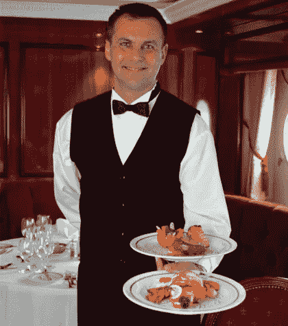

# 用 5 行代码训练图像识别人工智能

> 原文：<https://towardsdatascience.com/train-image-recognition-ai-with-5-lines-of-code-8ed0bdd8d9ba?source=collection_archive---------0----------------------->

在本文中，我们将简要介绍人工智能领域，特别是计算机视觉领域，所涉及的挑战，现有的应对这些挑战的现代解决方案，以及如何方便、轻松地应用这些解决方案，而无需花费太多时间和精力。

几十年来，人工智能一直是一个研究领域，科学家和工程师们都在努力解开让机器和计算机感知和理解我们的世界，从而采取适当行动为人类服务的谜团。这项研究工作最重要的一个方面是让计算机理解我们周围每天产生的视觉信息**(图像和视频)**。这个让计算机感知和理解视觉信息的领域被称为计算机视觉。



在 20 世纪 50 年代**到 80 年代**人工智能研究的兴起期间，计算机被人工告知如何识别图像、图像中的物体以及需要注意哪些特征。这种方法是传统的算法，被称为**专家系统**，因为它们需要人类费力地为每个必须识别的物体的独特场景识别特征，并以计算机可以理解的数学模型来表示这些特征。这涉及到大量繁琐的工作，因为有成千上万种不同的方法可以表示一个对象，并且有成千上万(甚至数百万)不同的场景和对象是唯一存在的，因此找到优化和精确的数学模型来表示每个对象或场景的所有可能的特征，并且对于所有可能的对象或场景，更多的工作将永远持续下去。****

然后，在 **1990** 年代，引入了**机器学习**的概念，它开创了一个时代，不再告诉计算机在识别图像和视频中的场景和对象时要注意什么，而是我们可以设计算法，让计算机学习如何自己识别图像中的场景和对象，就像孩子通过探索学习理解他/她的环境一样。机器学习为计算机学习识别我们想要的几乎任何场景或物体开辟了道路。



随着功能强大的计算机的出现，如 NVIDIA GPU 和最先进的图像识别深度学习算法，如 Alex Krizhevsky 等人在 2012 年推出的 T4 Alex net、Kaeming He 等人在 2015 年推出的 ResNet、Forrest Landola 等人在 2016 年推出的 SqueezeNet 和 DenseNet 可以将许多图片(更像计算机的图画书)放在一起，并定义一个人工智能模型来自己学习这些图片中的场景和对象的特征，并使用从学习过程中获得的知识来识别它之后将遇到的该类型场景或对象的所有其他实例。

要训练一个人工智能模型，让它能够识别你希望它在图片中识别的任何东西，传统上需要大量应用数学方面的专业知识和深度学习库的使用，更不用说你必须经历的时间和压力来编写算法代码并使代码适合你的图像。这是我们提供解决方案的地方。

我们在[**AI Commons**](https://commons.specpal.science)**的团队开发了一个 python 库，可以让你训练一个人工智能模型，它可以识别你希望它在图像中识别的任何对象，只需使用**5 行简单的 python 代码。**python 库是[**ImageAI**](https://github.com/OlafenwaMoses/ImageAI)**，这个库旨在让学生、开发人员和具有各种专业知识水平的研究人员使用 **5 到 15 行简单代码来构建具有最先进的计算机视觉功能的系统和应用程序。现在，让我们带你创建你的第一个人工智能模型，它可以识别你想要它识别的任何东西。******

****

**为了训练你的人工智能模型，你需要一个名为**数据集的图像集合。**一个数据集包含成百上千个你希望你的人工智能模型识别的对象的样本图像。**但是你不用担心！**我们不是要求你现在就去下载成千上万的图片，只是为了训练你的人工智能模型。对于本教程，我们提供了一个名为 [**IdenProf**](https://github.com/OlafenwaMoses/IdenProf) 的数据集。identified prof(可识别的专业人士)是一个数据集，包含 10 种不同专业人士的 **11，000 张**照片，人类可以通过他们的穿着模式来查看和识别他们的工作。照片在该数据集中的专业人员类别如下:**

****厨师****

****医生****

****工程师****

****农民****

****消防员****

****法官****

****机械师****

****先导****

****警察****

****服务员****

**这个数据集被分割成 **9000** (每个职业 900 张)张图片来训练人工智能模型，以及 **2000** (每个职业 200 张)张图片来测试人工智能模型在训练时的性能。IdenProf 已经被妥善安排，准备好训练你的人工智能模型，通过穿着方式识别专业人士。作为参考，如果您使用自己的图像数据集，您必须为您希望人工智能模型识别的每个对象或场景收集至少 500 张图片。要使用 **ImageAI、**训练您自己收集的任何图像数据集，您必须将图像排列在文件夹中，如下例所示:**

```
**idenprof//train//chef// 900 images of chefs****idenprof//train//doctor// 900 images of doctors****idenprof//train//engineer// 900 images of engineer****idenprof//train//farmer// 900 images of farmers****idenprof//train//firefighter// 900 images of firefighters****idenprof//train//judge// 900 images of judges****idenprof//train//mechanic// 900 images of mechanics****idenprof//train//pilot// 900 images of pilots****idenprof//train//chef// 900 images of chef****idenprof//train//police// 900 images of police****idenprof//train//waiter// 900 images of waiters****idenprof//test//chef// 200 images of chefs****idenprof//test//doctor// 200 images of doctors****idenprof//test//engineer// 200 images of engineer****idenprof//test//farmer// 200 images of farmers****idenprof//test//firefighter// 200 images of firefighters****idenprof//test//judge// 200 images of judges****idenprof//test//mechanic// 200 images of mechanics****idenprof//test//pilot// 200 images of pilots****idenprof//test//chef// 200 images of chef****idenprof//test//police// 200 images of police****idenprof//test//waiter// 200 images of waiters**
```

**现在，您已经了解了如何准备自己的图像数据集来训练人工智能模型，我们现在将继续指导您使用 **ImageAI 训练人工智能模型来识别专业人员。****

**首先你必须通过这个[链接](https://github.com/OlafenwaMoses/IdenProf/releases/download/v1.0/idenprof-jpg.zip)下载 **IdenProf** 数据集的 zip 文件。你也可以在 IdenProf GitHub 知识库中查看人工智能模型的所有细节和样本结果，这些人工智能模型经过训练可以识别职业，其链接如下。**

**[https://github.com/OlafenwaMoses/IdenProf](https://github.com/OlafenwaMoses/IdenProf)**

**因为训练人工智能模型需要高性能的计算机系统，我强烈建议你确保你要用于这次训练的电脑/笔记本电脑有**英伟达 GPU。**或者，你可以使用**谷歌 Colab** 进行这个实验，它提供了一个免费的 **NVIDIA K80 GPU** 用于实验。**

**然后你必须安装 **ImageAI** 及其依赖项。**

*****安装 Python 3.7.6 和 pip*****

**(如果您已经安装了 Python 3.7.6，请跳过本节)**

**[](https://www.python.org/downloads/release/python-376/) [## Python 版本 Python 3.7.6

### 发布日期:2019 年 12 月 18 日现在 Python 3.7 有了更新的 bugfix 版本，取代了 3.7.6，Python 3.8 是…

www.python.org](https://www.python.org/downloads/release/python-376/) 

***安装 ImageAI 和依赖关系***

(如果您已经安装了库，请跳过本节中的任何安装说明)

**-张量流**

```
pip install tensorflow==2.4.0
```

**-其他**

```
pip install keras==2.4.3 numpy==1.19.3 pillow==7.0.0 scipy==1.4.1 h5py==2.10.0 matplotlib==3.3.2 opencv-python keras-resnet==0.2.0
```

***安装 ImageAI 库***

```
pip install imageai --upgrade
```

创建一个 python 文件，使用您想要的任何名称，例如 **"FirstTraining.py"** 。

将 **IdenProf 数据集**的 zip 文件复制到 Python 文件所在的文件夹中。然后解压到同一个文件夹。

然后将下面的代码复制到 python 文件中(例如 **FirstTraining.py** )。

**就是这样！这就是你训练人工智能模型所需的全部代码。在您运行代码开始培训之前，让我们解释一下代码。**

在第一行，我们导入了 ImageAI 的模型培训班。在第二行中，我们创建了模型训练类的一个实例。在第三行中，我们将模型类型设置为 **ResNet50** (有四种模型类型可用，分别是 **MobileNetv2** 、 **ResNet50** 、 **InceptionV3** 和 **DenseNet121** )。在第四行，我们将**数据目录**(数据集目录)设置为您解压缩的**数据集** zip 文件的文件夹。然后在第五行中，我们调用了 **trainModel** 函数，并指定了以下值:
**number _ objects**:这是指 IdenProf 数据集中不同类型专业人员的数量。
**num _ experiments**:这是模型训练者为了达到最大精度而研究 idenprof 数据集中所有图像的次数。
**Enhance _ data(可选)**:这是告诉模型训练员在 IdenProf 数据集中创建图像的修改副本，以确保达到最大的准确性。
**batch _ size:**这是指模型训练器在研究完 IdenProf 数据集中的所有图像之前，一次研究的图像集的数量。
**Show _ network _ summary(可选)**:这是为了显示你正在用来训练人工智能模型的模型类型的结构。

现在，您可以开始运行 Python 文件并开始培训。当培训开始时，您将看到如下结果:

```
=====================================

Total params: 23,608,202

Trainable params: 23,555,082

Non-trainable params: 53,120

______________________________________

Using Enhanced Data Generation

Found 4000 images belonging to 4 classes.

Found 800 images belonging to 4 classes.

JSON Mapping for the model classes saved to  C:\Users\User\PycharmProjects\FirstTraining\idenprof\json\model_class.json

Number of experiments (Epochs) :  200Epoch 1/100

 1/280 [>.............................] - ETA: 52s - loss: 2.3026 - acc: 0.25002/280 [>.............................] - ETA: 52s - loss: 2.3026 - acc: 0.25003/280 [>.............................] - ETA: 52s - loss: 2.3026 - acc: 0.2500..............................,
..............................,
..............................,279/280 [===========================>..] - ETA: 1s - loss: 2.3097 - acc: 0.0625Epoch 00000: saving model to C:\Users\User\PycharmProjects\FirstTraining\idenprof\models\model_ex-000_acc-0.100000.h5

280/280 [==============================] - 51s - loss: 2.3095 - acc: 0.0600 - val_loss: 2.3026 - val_acc: 0.1000
```

让我们解释一下上面显示的细节:

1.语句“**保存到 C:\ Users \ User \ PycharmProjects \ first training \ idenprof \ JSON \ model _ class . JSON**的模型类的 JSON 映射”意味着模型训练器已经为 iden prof 数据集保存了一个 **JSON** 文件，您可以使用该文件来识别带有自定义图像预测类的其他图片(进一步阅读时可获得解释)。

2.线 **Epoch 1/200** 意味着网络正在执行目标 200
3 的第一次训练。线 **1/280 [ > …………………..]—ETA:52s—loss:2.3026—ACC:0.2500**代表本实验已经训练好的批次数
4。行 **Epoch 00000:保存模型到 C:\ Users \ User \ PycharmProjects \ first training \ iden prof \ models \ model _ ex-000 _ ACC-0.100000 . H5**是指本次训练后保存的模型。 **ex_000** 表示本阶段的实验，而**ACC*0.100000****和****val*ACC:0.1000**表示本次实验后测试图像上模型的精度(精度的最大值为 1.0)。此结果有助于了解可用于自定义图像预测的最佳执行模型。

一旦你完成了对你的人工智能模型的训练，你就可以使用" **CustomImagePrediction** "类来执行图像预测，你就是达到最高准确度的模型。

为了防止您由于无法访问 **NVIDIA GPU** 而无法自己训练人工智能模型，出于本教程的目的，我们提供了一个我们在 **IdenProf** 数据集上训练的人工智能模型，您现在可以使用它来预测数据集中 10 位专业人士中任何一位的新图像。经过 **61** 训练实验，该模型达到了超过 **79%** 的准确率。点击此[链接](https://github.com/OlafenwaMoses/IdenProf/releases/download/v1.0/idenprof_061-0.7933.h5)下载模型。此外，如果您自己没有进行培训，也可以通过此[链接](https://github.com/OlafenwaMoses/IdenProf/blob/master/idenprof_model_class.json)下载 idenprof 模型的 **JSON** 文件。然后，你就可以开始使用训练好的人工智能模型识别专业人士了。请按照下面的说明操作。

接下来，创建另一个 Python 文件并给它命名，例如**firstcustomimagerecognition . py**。复制你在上面下载的人工智能模型或你训练的达到最高准确度的模型，并将其粘贴到你的新 python 文件所在的文件夹中(例如**firstcustomimagerecognition . py**)。另外，复制您下载的或者由您的训练生成的 **JSON** 文件，并将其粘贴到与您的新 python 文件相同的文件夹中。将属于 IdenProf 数据集中类别的任何专业人员的样本图像复制到与新 python 文件相同的文件夹中。

然后复制下面的代码，并将其放入新的 python 文件中

查看下面的样本图像和结果。



```
waiter  :  99.99997615814209chef  :  1.568847380895022e-05judge  :  1.0255866556008186e-05
```

那很容易！现在让我们解释一下上面产生这个预测结果的代码。

上面的第一行和第二行代码导入了 ImageAI 的**CustomImageClassification** 类和 python **os** 类，其中 CustomImageClassification 类用于使用训练好的模型预测和识别图像。第三行代码创建一个变量，该变量保存对包含您的 python 文件(在本例中是您的**firstcustomimagerecognition . py**)和您自己下载或训练的 **ResNet50** 模型文件的路径的引用。在上面的代码中，我们在第四行创建了一个**CustomImageClassification()**类的实例，然后我们通过调用。第五行中的 setModelTypeAsResNet50() 然后我们将预测对象的模型路径设置为我们复制到第六行的项目文件夹文件夹中的人工智能模型文件(**iden prof _ 061–0.7933 . H5**)的路径。在第七行，我们设置了复制到第七行的文件夹中的 **JSON** 文件的路径，并在第八十行加载了模型。最后，我们对复制到文件夹中的图像进行预测，并将结果打印到**命令行界面**。

到目前为止，你已经学会了如何使用 **ImageAI** 来轻松训练你自己的人工智能模型，它可以预测图像中任何类型的对象或对象集。

> *如果您想通过链接了解更多有用和实用的资源，请访问下面链接的* ***图像识别指南*** *。*

[](https://www.fritz.ai/image-recognition/) [## 图像识别指南

### 现在我们知道了一些关于什么是图像识别，不同类型的图像识别之间的区别…

www.fritz.ai](https://www.fritz.ai/image-recognition/) 

你可以在官方 GitHub 知识库上找到使用 **ImageAI** 训练定制人工智能模型的所有细节和文档，以及包含在 **ImageAI** 中的其他计算机视觉功能。

[](https://github.com/OlafenwaMoses/ImageAI) [## OlafenwaMoses/ImageAI

### 这是一个开源 python 库，旨在使开发人员能够使用自包含的深度…

github.com](https://github.com/OlafenwaMoses/ImageAI) 

如果你觉得这篇文章很有帮助并且喜欢，请给它一个**的掌声**。此外，请随意与朋友和同事分享。

你有什么问题、建议或者想要联系我吗？给我发邮件到[guymodscientist@gmail.com](mailto:guymodscientist@gmail.com)。我也可以通过账号 [@OlafenwaMoses](https://twitter.com/OlafenwaMoses) 在 twitter 上联系，通过[https://www.facebook.com/moses.olafenwa](https://www.facebook.com/moses.olafenwa)在脸书联系。**