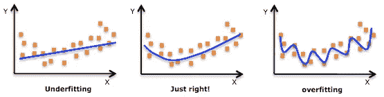
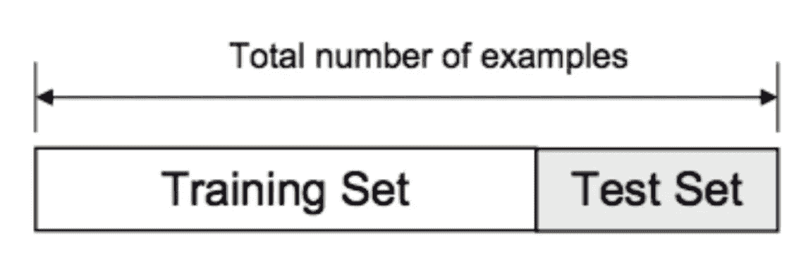
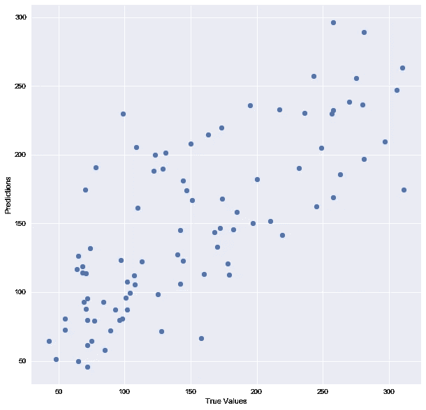
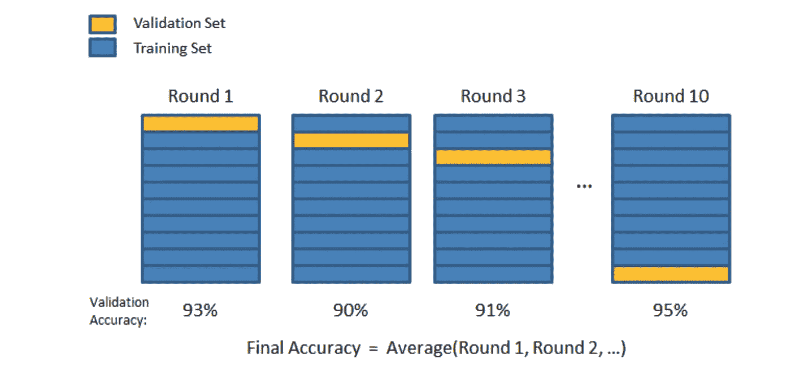
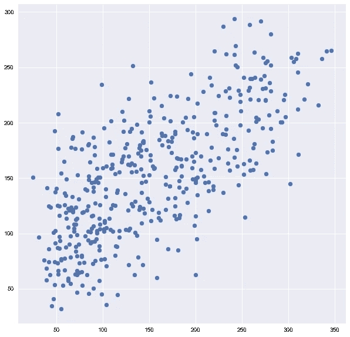

# 在 Python 中训练/测试分割和交叉验证

> 原文：<https://towardsdatascience.com/train-test-split-and-cross-validation-in-python-80b61beca4b6?source=collection_archive---------0----------------------->

大家好！在我上一篇关于 Python 中的[线性回归的文章之后，我认为写一篇关于训练/测试分割和交叉验证的文章是很自然的。像往常一样，我将对这个主题做一个简短的概述，然后给出一个用 Python 实现它的例子。这是数据科学和数据分析中两个相当重要的概念，被用作防止(或至少最小化)](https://medium.com/towards-data-science/simple-and-multiple-linear-regression-in-python-c928425168f9)[过度拟合](https://en.wikipedia.org/wiki/Overfitting)的工具。我将解释这是什么-当我们使用统计模型(例如线性回归)时，我们通常将模型拟合到训练集，以便对未经训练的数据(一般数据)进行预测。过度拟合意味着我们对模型的拟合过于依赖训练数据。很快就会明白的，我保证！

# 什么是过度拟合/欠拟合模型？

如上所述，在统计学和机器学习中，我们通常将数据分为两个子集:训练数据和测试数据(有时分为三个子集:训练、验证和测试)，并根据训练数据拟合我们的模型，以便对测试数据进行预测。当我们这样做时，可能会发生两种情况之一:我们使模型过拟合或者使模型欠拟合。我们不希望这些事情发生，因为它们会影响我们模型的可预测性——我们可能会使用一个准确性较低和/或不通用的模型(这意味着你不能根据其他数据概括你的预测)。让我们来看看欠拟合和过拟合的实际含义:

## 过度拟合

过度拟合意味着我们训练的模型已经训练得“太好”,并且现在与训练数据集太接近了。这通常发生在模型过于复杂的时候(例如，与观察值相比，特征/变量太多)。该模型在训练数据上非常准确，但在未训练或新数据上可能非常不准确。这是因为这个模型不是一般化的(或者说不是一般化的)，这意味着你可以对结果进行一般化，而不能对其他数据进行任何推断，而这正是你最终想要做的。基本上，当这种情况发生时，模型学习或描述训练数据中的“噪声”,而不是数据中变量之间的实际关系。显然，这种噪声不是任何新数据集的一部分，也不能应用于它。

## 欠拟合

与过度拟合相反，当模型拟合不足时，意味着模型不适合训练数据，因此错过了数据中的趋势。这也意味着该模型不能推广到新的数据。正如你可能猜到的(或者想出来的！)，这通常是一个非常简单的模型(没有足够的预测器/自变量)的结果。例如，当我们用线性模型(如[线性回归](https://medium.com/towards-data-science/simple-and-multiple-linear-regression-in-python-c928425168f9))拟合非线性数据时，也会发生这种情况。几乎不言而喻，这个模型的预测能力会很差(对训练数据，无法推广到其他数据)。



An example of overfitting, underfitting and a model that’s “just right!”

值得注意的是，适配不足不像适配过度那样普遍。然而，我们希望在数据分析中避免这两个问题。你可能会说，我们正试图找到一个中间地带之间的不足和过度拟合我们的模型。正如您将看到的，训练/测试分割和交叉验证有助于避免过度拟合多于欠拟合。让我们深入了解这两个问题！

# 训练/测试分割

我之前说过，我们使用的数据通常分为训练数据和测试数据。训练集包含一个已知的输出，模型学习这个数据，以便以后推广到其他数据。我们有测试数据集(或子集)来测试我们的模型对这个子集的预测。



Train/Test Split

让我们看看如何在 Python 中实现这一点。我们将使用 [Scikit-Learn 库](http://scikit-learn.org/stable/index.html)，特别是 [train_test_split 方法](http://scikit-learn.org/stable/modules/generated/sklearn.model_selection.train_test_split.html)来完成这项工作。我们将从导入必要的库开始:

```
import pandas as pd
from sklearn import datasets, linear_model
from sklearn.model_selection import train_test_split
from matplotlib import pyplot as plt
```

让我们快速浏览一下我导入的库:

*   **Pandas** —加载数据文件作为 Pandas 数据框并分析数据。如果你想了解更多关于熊猫的信息，请随时查看我的帖子！
*   从 **Sklearn** 中，我已经导入了*数据集*模块，因此我可以加载一个样本数据集，以及 *linear_model* ，因此我可以运行一个线性回归
*   从 **Sklearn，**子库 **model_selection** ，我已经导入了 *train_test_split* ，这样我就可以，嗯，拆分到训练集和测试集
*   从 **Matplotlib** 中，我导入了 *pyplot* 来绘制数据的图形

好了，都准备好了！让我们加载[糖尿病数据集](http://scikit-learn.org/stable/modules/generated/sklearn.datasets.load_diabetes.html)，将其转换为数据框并定义列名:

```
# Load the Diabetes dataset
columns = “age sex bmi map tc ldl hdl tch ltg glu”.split() # Declare the columns names
diabetes = datasets.load_diabetes() # Call the diabetes dataset from sklearn
df = pd.DataFrame(diabetes.data, columns=columns) # load the dataset as a pandas data frame
y = diabetes.target # define the target variable (dependent variable) as y
```

现在我们可以使用 train_test_split 函数来进行拆分。函数中的 *test_size=0.2* 表示应该保留下来进行测试的数据的百分比。一般是 80/20 或者 70/30 左右。

```
# create training and testing vars
X_train, X_test, y_train, y_test = train_test_split(df, y, test_size=0.2)
print X_train.shape, y_train.shape
print X_test.shape, y_test.shape(353, 10) (353,)
(89, 10) (89,)
```

现在，我们将根据训练数据拟合模型:

```
# fit a model
lm = linear_model.LinearRegression()model = lm.fit(X_train, y_train)
predictions = lm.predict(X_test)
```

如您所见，我们正在根据训练数据拟合模型，并尝试预测测试数据。让我们看看有哪些预测:

```
predictions[0:5]
array([ 205.68012533,   64.58785513,  175.12880278,  169.95993301,
        128.92035866])
```

注意:因为我在预测后使用了[0:5],所以它只显示了前五个预测值。删除[0:5]会使它打印出我们的模型创建的所有预测值。

让我们绘制模型:

```
## The line / model
plt.scatter(y_test, predictions)
plt.xlabel(“True Values”)
plt.ylabel(“Predictions”)
```



并打印准确度分数:

```
print “Score:”, model.score(X_test, y_test)Score: 0.485829586737
```

这就对了。以下是我所做工作的总结:我加载了数据，将其分为训练集和测试集，对训练数据拟合了回归模型，基于这些数据进行了预测，并对测试数据的预测进行了测试。看起来不错，对吧？但是训练/测试分割确实有它的危险——如果我们做的分割不是随机的呢？如果我们数据的一个子集只有某个州的人，有某个收入水平的员工，而没有其他收入水平的，只有女性或只有某个年龄的人，会怎么样？(想象一个由这些文件之一排序的文件)。这将导致过度拟合，即使我们试图避免它！这就是交叉验证的用武之地。

# 交互效度分析

在前一段中，我提到了训练/测试分割方法中的注意事项。为了避免这种情况，我们可以执行一种叫做[的交叉验证](https://en.wikipedia.org/wiki/Cross-validation_(statistics))。它非常类似于训练/测试分割，但是它适用于更多的子集。也就是说，我们将数据分成 k 个子集，并在其中的 k-1 个子集上进行训练。我们要做的是保留最后一个子集进行测试。我们可以对每个子集都这样做。


Visual Representation of Train/Test Split and Cross Validation. H/t to my [DSI](https://generalassemb.ly/education/data-science-immersive) instructor, [Joseph Nelson](https://medium.com/u/690e8d667b35?source=post_page-----80b61beca4b6--------------------------------)!

有很多交叉验证方法，我将介绍其中的两种:第一种是 **K 重交叉验证**第二种是**留一交叉验证** (LOOCV)

## k 重交叉验证

在 K 折叠交叉验证中，我们将数据分成 K 个不同的子集(或折叠)。我们使用 k-1 个子集来训练我们的数据，并将最后一个子集(或最后一个折叠)作为测试数据。然后，我们根据每个褶皱对模型进行平均，然后最终确定我们的模型。之后，我们用测试集来测试它。



Visual representation of K-Folds. Again, H/t to [Joseph Nelson](https://medium.com/u/690e8d667b35?source=post_page-----80b61beca4b6--------------------------------)!

这里有一个来自 K 折叠的 [Sklearn 文档](http://scikit-learn.org/stable/modules/generated/sklearn.model_selection.KFold.html#sklearn-model-selection-kfold)的非常简单的例子:

```
from sklearn.model_selection import KFold # import KFold
X = np.array([[1, 2], [3, 4], [1, 2], [3, 4]]) # create an array
y = np.array([1, 2, 3, 4]) # Create another array
kf = KFold(n_splits=2) # Define the split - into 2 folds 
kf.get_n_splits(X) # returns the number of splitting iterations in the cross-validatorprint(kf) KFold(n_splits=2, random_state=None, shuffle=False)
```

让我们看看结果——褶皱:

```
for train_index, test_index in kf.split(X):
 print(“TRAIN:”, train_index, “TEST:”, test_index)
 X_train, X_test = X[train_index], X[test_index]
 y_train, y_test = y[train_index], y[test_index]('TRAIN:', array([2, 3]), 'TEST:', array([0, 1]))
('TRAIN:', array([0, 1]), 'TEST:', array([2, 3]))
```

如您所见，该函数将原始数据分割成不同的数据子集。再次，非常简单的例子，但我认为它很好地解释了这个概念。

## 遗漏一项交叉验证(LOOCV)

这是另一种交叉验证的方法，[省去一个交叉验证](http://scikit-learn.org/stable/modules/generated/sklearn.model_selection.LeaveOneOut.html#sklearn.model_selection.LeaveOneOut)(顺便说一下，这些方法不是唯一的两种，还有一堆其他的交叉验证的方法。在 [Sklearn 网站](http://scikit-learn.org/stable/modules/classes.html#module-sklearn.model_selection)查看。在这种类型的交叉验证中，折叠(子集)的数量等于我们在数据集中的观察数量。然后，我们对所有这些折叠进行平均，并用平均值构建我们的模型。然后，我们根据最后一次折叠测试模型。因为我们会得到大量的训练集(等于样本数)，这种方法计算量很大，应该在小数据集上使用。如果数据集很大，最好使用不同的方法，比如 kfold。

让我们看看 Sklearn 的另一个例子:

```
**from** **sklearn.model_selection** **import** LeaveOneOut 
X = np.array([[1, 2], [3, 4]])
y = np.array([1, 2])
loo = LeaveOneOut()
loo.get_n_splits(X)

**for** train_index, test_index **in** loo.split(X):
   print("TRAIN:", train_index, "TEST:", test_index)
   X_train, X_test = X[train_index], X[test_index]
   y_train, y_test = y[train_index], y[test_index]
   print(X_train, X_test, y_train, y_test)
```

这是输出结果:

```
('TRAIN:', array([1]), 'TEST:', array([0]))
(array([[3, 4]]), array([[1, 2]]), array([2]), array([1]))
('TRAIN:', array([0]), 'TEST:', array([1]))
(array([[1, 2]]), array([[3, 4]]), array([1]), array([2]))
```

再次，简单的例子，但我真的认为它有助于理解这个方法的基本概念。

那么，我们应该用什么方法呢？多少折？我们有越多的折叠，我们将减少由于偏差引起的误差，但是增加由于方差引起的误差；显然，计算成本也会上升——折叠次数越多，计算时间就越长，并且需要更多内存。随着折叠次数的减少，我们减少了方差引起的误差，但偏差引起的误差会更大。这也将在计算上更便宜。因此，在大数据集中，通常建议 k=3。在较小的数据集中，正如我之前提到的，最好使用 LOOCV。

让我们看看我之前使用的例子，这次是使用交叉验证。我将使用 *cross_val_predict* 函数返回测试切片中每个数据点的预测值。

```
# Necessary imports: 
from sklearn.model_selection import cross_val_score, cross_val_predict
from sklearn import metrics
```

如您所知，之前我已经为糖尿病数据集创建了训练/测试分割，并拟合了一个模型。我们来看看交叉验证后的分数是多少:

```
# Perform 6-fold cross validation
scores = cross_val_score(model, df, y, cv=6)
print “Cross-validated scores:”, scoresCross-validated scores: [ 0.4554861   0.46138572  0.40094084  0.55220736  0.43942775  0.56923406]
```

如你所见，最后一次折叠提高了原始模型的分数——从 0.485 提高到 0.569。不是一个惊人的结果，但嘿，我们会采取我们能得到的:)

现在，让我们在执行交叉验证后，绘制新的预测:

```
# Make cross validated predictions
predictions = cross_val_predict(model, df, y, cv=6)
plt.scatter(y, predictions)
```



你可以看到它与早期的原始情节有很大的不同。因为我用了 cv=6，所以是原图的 6 倍多。

最后，让我们检查模型的 R 得分(R 是一个“表示从自变量可预测的因变量中方差的比例的数字)”。基本上，我们的模型有多精确):

```
accuracy = metrics.r2_score(y, predictions)
print “Cross-Predicted Accuracy:”, accuracyCross-Predicted Accuracy: 0.490806583864
```

这次到此为止！我希望你喜欢这篇文章。一如既往，我欢迎大家就您想阅读的主题提出问题、笔记、评论和请求。下次见！