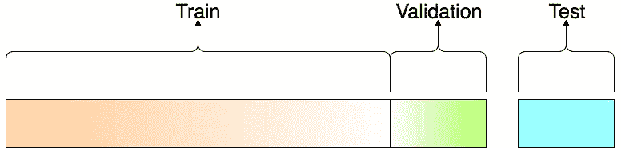

# 关于机器学习中训练、验证和测试集

> 原文：<https://towardsdatascience.com/train-validation-and-test-sets-72cb40cba9e7?source=collection_archive---------0----------------------->

这旨在成为任何需要在训练机器学习模型时了解各种数据集分割之间的差异的人的简短入门。

对于这篇文章，我会引用 Jason Brownlee 的优秀文章中关于同一主题的基本定义，它非常全面，请查看更多细节。

# **训练数据集**

> **训练数据集**:用于拟合模型的数据样本。

我们用来训练模型的实际数据集(神经网络中的权重和偏差)。模型*看到*并且*从该数据中学习*。

# **验证数据集**

> **验证数据集**:在调整模型超参数时，用于对模型拟合训练数据集提供无偏评估的数据样本。随着验证数据集的技能融入到模型配置中，评估变得更有偏差。

验证集用于评估给定的模型，但这是为了频繁的评估。作为机器学习工程师，我们使用这些数据来微调模型超参数。因此，模型偶尔*会看到*该数据，但绝不会从该数据中“学习”。我们使用验证集结果，并更新更高级别的超参数。所以验证集影响模型，但只是间接的。验证集也称为开发集或开发集。这是有意义的，因为该数据集在模型的“开发”阶段有所帮助。

# **测试数据集**

> **测试数据集**:用于提供最终模型在训练数据集上的无偏评估的数据样本。

测试数据集提供了用于评估模型的黄金标准。它仅在模型完全定型后使用(使用定型和验证集)。测试集通常用于评估竞争模型(例如，在许多 Kaggle 竞争中，验证集最初与训练集一起发布，而实际测试集仅在竞争即将结束时发布，测试集上的模型结果决定了获胜者)。很多时候，验证集被用作测试集，但这不是一个好的实践。测试集通常是精心策划的。它包含在现实世界中使用时，模型将面临的各种类别的仔细采样数据。

A visualization of the splits

## 关于数据集分割比率

既然您已经知道了这些数据集的作用，您可能正在寻找关于如何将数据集划分为训练集、验证集和测试集的建议。

这主要取决于 2 件事。首先是数据中的样本总数，其次是您正在训练的实际模型。

有些模型需要大量数据来进行训练，因此在这种情况下，您应该针对更大的训练集进行优化。具有很少超参数的模型将易于验证和调整，因此您可能会减少验证集的大小，但是如果您的模型具有许多超参数，您也将希望拥有一个大的验证集(尽管您还应该考虑交叉验证)。此外，如果您碰巧有一个没有超参数或者不容易调优的模型，您可能也不需要验证集！

总而言之，就像机器学习中的许多其他事情一样，训练-测试-验证分流比也非常具体地取决于你的用例，随着你训练和建立越来越多的模型，做出判断变得越来越容易。

交叉验证的注意事项:很多时候，人们首先将他们的数据集分成两部分——训练和测试。在此之后，他们将测试集放在一边，并随机选择其训练数据集的 X%作为实际的 ***训练*** *集，剩余的(100-X)%作为* ***验证*** *集，其中 X 是一个固定的数(比如 80%)，然后在这些不同的集上对模型进行迭代训练和验证。有多种方法可以做到这一点，通常称为交叉验证。基本上，您使用训练集来生成训练集和验证集的多个拆分。交叉验证避免了过度拟合，并且变得越来越流行，K-fold 交叉验证是最流行的交叉验证方法。* [*查看本*](https://en.wikipedia.org/wiki/Cross-validation_(statistics)) *出更多。*

如果你想进一步讨论这个问题，请在评论中告诉我。和你们许多人一样，我也是一个初学者，但我肯定会尽我所能帮助你们🙂

最初发现于
[http://tarangshah . com/blog/2017-12-03/train-validation-and-test-sets/](http://tarangshah.com/blog/2017-12-03/train-validation-and-test-sets/)