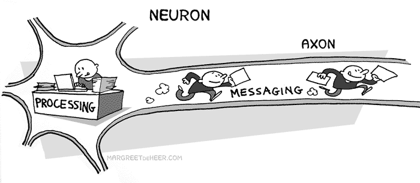
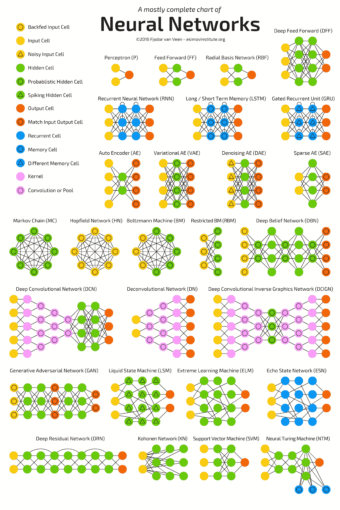
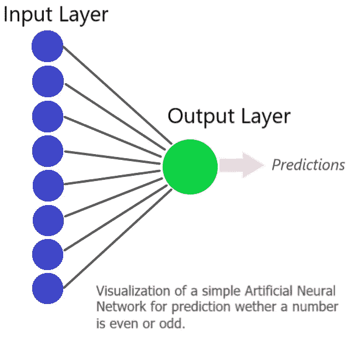

# 在人工神经网络上训练你的神经元

> 原文：<https://towardsdatascience.com/train-your-neurons-on-artificial-neural-networks-featuring-keras-2757f51bb7ed?source=collection_archive---------8----------------------->


Photo by [Lurm](https://unsplash.com/photos/kCrrUx7US04?utm_source=unsplash&utm_medium=referral&utm_content=creditCopyText) on [Unsplash](https://unsplash.com/search/photos/patterns?utm_source=unsplash&utm_medium=referral&utm_content=creditCopyText)

C**祝贺！你刚刚迈出了成为巫师的第一步。拿杯咖啡坐下。**

神经网络像魔法一样工作！使用 ResNet50 用不到 50 行代码就可以实现一个图像识别神经网络，它会以相当高的准确度识别你的猫或狗的图片。这是纯粹的魔法，这在今天成为可能的本质，即使在理解了它是如何工作的之后，对我来说仍然像是魔法。理解深度学习不是知道这不是魔术而是纯粹的统计和代码，而是理解这种魔术是如何工作的。它是知道如何成为一个数据向导。

我打算让这篇文章尽可能地让对神经网络了解很少或没有背景的人容易理解。在揭开它的神秘面纱之后，我们将在 Keras 上训练一个简单的神经网络(没有什么太复杂的。我们暂时不会深入到图像识别或 GANs 中去寻找乐趣。我将提供链接和其他资源，以便更好地直观理解，我强烈建议您在阅读本文时浏览它们。在文章的最后，我会添加我个人用来发展我对任何概念的理解的所有资源，我相信这些资源对于任何在这个领域入门的人来说都是非常棒的。

来回答人们关于深度学习最常见和最受欢迎的问题之一:

> 我学习深度学习和制作神经网络需要多少时间？是不是涉及很多复杂的数学(微积分和矩阵)？
> 
> 在深度学习中发展任何重要的技能都需要花费大量的时间。领域很大！当然，你可以凭直觉知道代码在做什么，然后立刻构建一些奇特的项目，但是你真的想这么做吗？至于第二部分，是的，它确实涉及大量的数学尤其是微积分。最初的主题很容易理解，但随着你在该领域的进展，复杂性成了一个切线斜率。我发现很多话题真的很难理解。但是有一次我联系了一个研究生，告诉他我发现数学对我的水平来说有点太复杂了。我得到的建议是我得到过的最好的建议之一:找出你为什么要学习深度学习？如果原因是为了挣钱或者跟风，很容易迷失方向。找到你想做的东西，并为之努力。老实说，这是我听到的最好的事情，我想它一直伴随着我。

***拥抱！***

# 神经网络是如何出现的

关于神经网络和深度学习的工作和研究可以追溯到 20 世纪 50 年代，当时研究人员实际上使用了*电路来实现一个简单的神经网络*。这项研究的潜在灵感是实现我们实际的神经元如何工作，以及是否有可能实现一种可以以类似方式工作的机器。从那以后，关于这个话题的研究越来越多。但直到最近几年，我们才找到在日常生活中实现这些算法的方法，以最大限度地提高效率并降低复杂性。

我们从感知器开始，最终出现了更有用的概念，如支持向量机、反向传播和针对不同应用的不同类型的神经网络。我们已经达到了这样一个阶段，我们可以使用一个预先训练好的模型，只需修改它的末端，使它适用于我们的使用(转移学习)，这就像把记忆从一个大脑转移到另一个大脑一样！

*因此，我们有了这个完全基于数据的蓬勃发展的产业。*

你可以通过以下链接了解更多关于神经网络的历史。它们真的很有趣，知道这些概念是如何产生的总是好的:


Chris Bishop. Source: Wikipedia

*   [关于神经网络基础的研究论文](http://www.ijritcc.org/download/Research%20Paper%20on%20Basic%20of%20Artificial%20Neural%20Network.pdf)
*   [斯坦福大学 1940 年至 1970 年的历史](https://cs.stanford.edu/people/eroberts/courses/soco/projects/neural-networks/History/history1.html)

> “机器学习的基础。。。深度神经网络”
> 
> 克里斯·毕晓普

# 神经网络如何工作

理解神经网络的最好方法是用可视化的例子。在这一节的最后，我会提供一些很棒的资源，但重要的是要从文本上理解这个主题，或者为了更好的理解而阅读一遍。

> 需要记住的一件重要事情是，人工神经网络与我们大脑中的神经网络密切相关。

唯一的区别是，我们大脑的网络能够理解更广泛的领域，而人工神经网络仅限于一个或几个理解领域。你可以认为这是音乐家和音乐播放器之间的区别。一个音乐家可以发明、修改和演奏一种音乐类型等等。音乐播放器可以播放你输入的任何歌曲。它将能够一遍又一遍地播放同样的音乐，没有任何错误。一个音乐家在这里会失败，因为无论他多么努力，在再次演奏同一首曲子时总会有一些不同。也许一个和弦以一种微不足道的不同力量敲击着。但问题是，如果我们把音乐播放器想象成一个神经网络，它能够做音乐家能做的事情。但它仅限于一件事(或一个应用领域)。除了它能做的一件事，它什么也做不了，而且从不失败。

神经网络通常以这种方式工作:

*   你把信息输入到网络的输入端。
*   信息流经网络的边缘和节点。
*   最后，我们只剩下一个最终输出。这个输出不一定是一个数字，而是输出是一个对象的概率，以防我们对某个东西进行分类。因此，在分类的情况下，我们将剩下神经网络来告诉我们输出的概率。这是我们的网络的理解，它认为哪个输出与输入匹配得更好。


Source: [https://www.extremetech.com](https://www.extremetech.com)

一个神经网络由 3 种类型的层组成:**输入层(我们在其中输入)，隐藏层(处理发生的地方)和输出层(我们获得的结果)**。你可能想知道为什么我们堆叠神经元的“层”来构建神经网络，以及我们如何确定我们需要的层数或每层中的节点数。这是一个非常简短的主题，没有选择层数和节点数的硬性编码规则。有一些通用的方法，但是层数和节点数决定了你的模型的*过拟合*和*欠拟合*。因此，通常我们必须测试和评估我们的模型，以检查哪一个效果最好。说到层的概念，学习是将许多小信息包组合成一个大信息包的过程。假设让你解这个方程:“4 + 7”。你会立刻得出答案是 11。但是让我们想一想。这个信息是硬编码到你的大脑中的吗，无论何时你看到这个等式，你都可以推导出它等于 11？不会，举个例子:“1234 * 432”。我相信你需要一点时间来解决这个问题，但你最终会的。当我们看一个等式时，我们的大脑首先把它分解成小的信息包。在这种情况下，我们首先看到的是“4”、“7”和“+”运算符。我们的大脑假设“4”和“7”是操作数。我们大脑的下一步是决定我们需要对这两个数做什么运算，或者在我们的例子中做加法。所以我们的大脑最终决定，我们必须将这两个数字相加，输出结果是“11”。为什么我们这么快就评估了这两个数字，而不是另外两个更大的数字？这就是“权重”概念的由来。当我们在很小的时候就开始学习数学时，我们的大脑是在较小的数字例子上接受训练的。随着我们的成长，我们倾向于做更多这样的小操作。“2*2”是“4”，我们几乎不需要一个分数来确定这个原因，因为在我们的生活中，我们通常要处理这个方程成千上万次。每一次，我们的大脑都在输入“2*2”和“4”之间增加权重，就像我们的神经网络在每一层映射不同的神经元一样。这两层的边连接被赋予权重，随着时间的推移我们重复这个等式，权重继续增加。我们对输出为“4”感觉更积极，而我们肯定地知道输出不会是“5”(因此，连接输入和输出的边的权重是“0”)。

确定神经网络输出的概念完全基于*“激活”*。神经网络的神经元只保存一个数字。在输入层的不同神经元中可能有不同的数目，或者可能没有(等于 0)。所有神经元的数据通过加权边流向下一层。边缘被加权以表示哪些神经元在决定我们的结果时更重要。当加权数据到达下一层神经元时，它会遇到一个激活函数。另外，我们称这个网络为*前馈神经网络*，因为信息向前流动。激活函数的作用是:它只是将输入转换为正值或负值，同时增加一些复杂性以支持梯度下降算法。通过将输入转换为带符号的值，我们可以确定神经元是否应该激活/激发，也就是说，它是否应该向前传递信息。神经元本质上决定这个输入对我们的下一步是否重要，或者如果我们就此停止会更好，因为它不会增加更多的价值，只会混淆我们的网络。

但是，即使在激活之后，我们也可以预期一些不需要的值会到达输出，以防我们的神经网络无法访问足够多的信息，使其足够智能来识别这些差异。假设我们必须识别一个“5”，那么我们可能得到两个输出:一个“5”和一个“S ”,因为它们在某种程度上在视觉上是相似的。输出有一个 0 到 1 之间的数字，它告诉我们输出是我们实际答案的概率。因此，如果我们的神经网络完全愚蠢，它可能更喜欢“S”而不是“5 ”,但如果它相当聪明，它可能会说输入是“5”的概率是 0.78，而输入是“S”的概率是 0.52。我们的神经网络非常真实。他们不会说谎。如果他们感到不确定，他们会简单地告诉我们，他们认为两个或更多的输出是可能的，但他们觉得其中一个比其他的更有可能。

以下是关于神经网络如何工作一些极好的视觉解释:

*   [3Blue1Brown 关于神经网络的 Youtube 视频](https://www.youtube.com/watch?v=aircAruvnKk&list=WL&index=5&t=0s)
*   [Brandon Rohrer 关于卷积神经网络的 Youtube 视频](https://www.youtube.com/watch?v=5aHRBCVTNKE)
*   [谷歌博客上关于神经网络内部运作的文章](https://www.blog.google/topics/machine-learning/understanding-inner-workings-neural-networks/)

# 人工神经网络中的一些重要概念



Source: [https://nbmpub.com/](https://nbmpub.com/)

**反向传播:**反向传播的概念对于理解深度神经网络的训练非常重要。一开始，当我们的神经网络结构固定时，我们对模型的所有边初始化一些随机权重。之后，我们开始通过神经网络传递训练数据。当然，大多数时候，我们在开始时不会得到一个正确的输出，因为我们的模型没有为它调整，因为我们随机初始化了边的权重。这就是反向传播概念发挥作用的地方。当我们得到一个输出时，我们可以计算出与实际值相比的输出的*误差*。我们将这个误差反馈给我们的神经网络，并告诉它调整它的权重和模型参数，以最小化这个误差，从而提高它的准确性。这是使用梯度下降和链式法则完成的。([观看 RimstarOrg 的视频，它直观地解释了这个概念](https://www.youtube.com/watch?v=WZDMNM36PsM))

如果你想理解这个概念背后的数学原理，这里有一个很好的资源解释了反向传播。[*Brilliant.org 上的反向传播*](https://brilliant.org/wiki/backpropagation/)

**激活功能:**当一个神经元接收到一个输入时，该神经元被分配两个任务: **1。根据需要修改输入产生输出& 2。决定是否将其作为输出传递**。激活函数主要为我们提供了一个*非线性函数*，这对于训练神经网络来解决复杂问题是必不可少的。没有激活函数的神经网络只是一个线性回归模型。*为了实现反向传播，我们需要使用梯度下降，如果我们有一个线性函数*就不能实现。如果来自激活函数的输出是正的和相关的，神经元将把它传递给下一个神经元，否则忽略它。

有许多种激活函数在它们自己的应用领域中更有效(举几个流行的例子，*二进制步进分类器，ReLU，Tanh* )。请参考以下资源，深入了解激活功能及其类型，以及如何为您的应用选择一种功能:

*   [激活功能维基百科](https://en.wikipedia.org/wiki/Activation_function)
*   [分析 Vidhya 文章](https://www.analyticsvidhya.com/blog/2017/10/fundamentals-deep-learning-activation-functions-when-to-use-them/)
*   [Quora 讨论](https://www.quora.com/How-should-I-choose-a-proper-activation-function-for-the-neural-network)

**正则化:**在神经网络中需要正则化以避免过度拟合。“惩罚”一词与正规化的概念产生了很好的共鸣。有许多方法可以通过调整神经网络的参数来调整它。

理解正则化技术的参考:

*   [根据安德烈·卡帕西的材料制作的幻灯片](http://Andrej Karpathy)
*   詹姆斯·d·麦卡弗里的博客

**迁移学习:**迁移学习可用于这样的情况:我们已经有了一个训练好的模型，我们想用它来完成与该模型所训练的任务相似的其他任务。想象一个被训练识别各种动物的模型。这个模型应该在一个大的训练集上被训练过。现在我们有了这个模型，但是我们不想识别所有的动物。我们想建立一个可以识别狗品种的模型。为此，我们不必训练一个全新的模型。我们已经有了一个高效的模型。我们需要做的就是根据我们的需要调整这个模型。**这种调整是通过改变预训练神经网络的最后一层来完成的，以便根据我们的需要进行预测。**

一个很好的例子就是 *ImageNet* 模型，这是一个高效的预训练模型，可用于图像识别。我们可以直接在 Keras 中拉动模型，移除最后一层，并根据我们希望它识别的对象为其提供我们的最后一层。

点击此处了解有关迁移学习的更多信息:

*   [关于图像再训练的 Tensorflow 教程](https://www.tensorflow.org/tutorials/image_retraining)
*   [CS231 课程笔记](http://cs231n.github.io/transfer-learning/)
*   [塞巴斯蒂安·鲁德的博客](http://ruder.io/transfer-learning/)【非常详细】

**优化:**我们说神经网络优化，其实是指*减少目标函数中的误差，也就是均方误差函数(损失/代价函数)*。我们必须优化神经网络的权重以最小化目标函数。反向传播是目前最广泛使用的训练神经网络的优化技术，但它的范围在一定程度上是有限的。此外，还有其他优化方法可能会产生相同的结果，但可以显著减少训练时间，这是深度学习中的一个重要商品。这些其他优化技术易于使用，并且可以在训练 Keras 模型时使用参数进行设置。

阅读优化技术很重要，因为我们在训练模型时会经常用到它们。这些是我用来了解其他优化技术基础的一些好资源:

*   [伊恩·古德菲勒深度学习著作中的优化相关章节](http://www.deeplearningbook.org/contents/optimization.html)
*   [学习优化神经网络——李柯和吉滕德拉·马利克的论文](https://arxiv.org/pdf/1703.00441.pdf)
*   【CS231n 的参数更新部分

**死亡神经元:**如果我们使用类似 ReLU( *整流线性单元*)的激活函数，我们可能会面临死亡神经元的问题。如果输出为正，ReLU 函数返回整数，如果输出为负(经过校正)，则返回零。有些情况下，神经元必须处理许多负值作为其输入，这些输入的梯度将始终为 0，因为负输入的梯度始终为 0。由于激活功能的这种性质，一些神经元可能永远不会因为训练集的性质而调整和死亡。一般来说，当使用 ReLU 激活时，我们会处理网络中的一些死亡神经元，但这不是问题。但在某些情况下，如果死亡神经元的数量过多，我们的训练可能会出现重大问题。*对此的解决方案可以是使用泄漏 ReLU 激活功能*。

## 神经网络的类型

神经网络的类型如此之多，以至于可能需要一整篇文章来讨论高级别的基本概念。



Source: asimovinstitute.org

每组应用程序都有一个神经网络。最受欢迎的肯定是*卷积神经网络* (CNN)，因为它在从图像中学习方面具有出色的能力，这是深度学习最常用的应用之一。

但是你不能用 CNN，如果假设，你想开发一个程序，可以生成梵高风格的艺术。你需要使用*生成对抗网络* (GAN)。gan 是神经网络中最好的部分，我喜欢它！如果深度学习是魔法，那么 GANs 就是下一个维度。**谷歌大脑团队利用敌对网络开发了一种新的加密形式。这是一篇非常有趣的论文。一定要去看看！** [**官方论文来自 arXiv**](https://arxiv.org/pdf/1610.06918.pdf)

旁边的图片总结了目前可用的所有类型的神经网络。一定要看一看。试着想想它们之间有什么不同。

## Python 的深度学习库

> 说到制造人工神经网络，数据科学社区拥有大量的工具和选择！

一些最受欢迎的是:

*   [谷歌的 Tensorflow](https://www.tensorflow.org/)
*   [theno](http://deeplearning.net/software/theano/)
*   [微软认知工具包(CNTK)](https://www.microsoft.com/en-us/cognitive-toolkit/)

对于初学者来说，使用这些库可能有点困难，因为对于完全陌生的人来说，理解它们的代码可能有点复杂。所以有更好的，*易于理解和直观的框架可用*，它使用上面提到的库作为它们的后端。因此，构建新模型变得非常容易，代码也很短，而且非常直观。最受欢迎的两个是:

*   [Keras](https://keras.io/#getting-started-30-seconds-to-keras)
*   [咖啡馆](http://caffe.berkeleyvision.org/)

所有这些库都非常灵活，易于设置和开始。个人比较喜欢 Tensorflow 后端的 Keras。我非常喜欢 Keras 的一个原因是因为神经元层的堆叠和编译模型非常直观和简单。您可以随意查看所有代码示例，看看哪一个对您来说更直观。

# Keras 简介


Source: blog.keras.io

如果要我说为什么我更喜欢 Keras 而不是其他框架，我只会说:“ **Keras 优先考虑开发者体验**”。这很重要。大多数框架在构建时都有一个主要目标，那就是使它们快速高效，由于这个原因，大多数时候它们错过了开发人员的体验，即开发人员使用它们和学习使用它们有多容易。

Keras 支持 Python 从 2.7 到 3.6 的所有主要版本，根据对 Stackoverflow 和 arXiv 论文的分析，它是最受欢迎的深度学习库之一。

Keras 还支持许多硬件配置，包括 Nvidia GPUs 和 Google TPUs，后者扩展到多 GPU 和分布式培训支持。

下面是来自 Keras 主页的示例代码。你能猜出它在做什么吗？

```
**from** keras.models **import** Sequential 
**from** keras.layers **import** Dense, Activationmodel = Sequential() 
model.add(Dense(32, input_dim=784)) 
model.add(Activation('relu'))
```

***如果你能从样本代码中做出一些推论，你将❤️·克拉斯！***

***请浏览其主页上的*** [***Kera 入门***](https://keras.io/getting-started/sequential-model-guide/) ***指南，看看 Keras 在行动。***

# 在 Keras 中实现神经网络

好吧！所以这是最好的部分。我们将在 Keras 中实现一个非常简单的神经网络。(*《15 行代码之下》还有 yada yada！*)

我们将向神经网络输入一个 8 位二进制值的样本。它必须识别出哪一个是奇数。下面是一个例子，说明我们将向神经网络输入什么，以及它应该产生什么输出:

```
__________________________
Input             | Output   
__________________________
1 1 1 0 0 1 1 1 1 |  1
1 0 0 0 1 0 0 0 0 |  0
1 1 0 0 1 1 0 1 0 |  0
1 0 0 1 0 1 0 0 0 |  0
1 0 0 1 1 0 1 0 1 |  1
0 0 1 0 0 0 0 1 1 |  1
__________________________  . . . and so on.
```



这个任务看起来相当简单！" n%2 "，我们就完事了。但话又说回来，目的不是将其作为一种应用，而是以最简单的方式演示神经网络如何学习。

对于这个应用，我们将只需要 2 层神经元。我们现在不需要任何隐藏层，因为基本上不需要它们。你可以在左边的插图中看到我们的神经网络。

我们将 Keras 与 Tensorflow 后端一起使用。

```
*#We set the seed value with a constant number to get consistent #results every time our neural network is trained. 
#This is because when we create a model in Keras, it is assigned #random weights every time. Due to this, we might receive different #results every time we train our model.
#However this won't be a general issue, our training set is small, #so we take this precaution*
**import numpy as np
np.random.seed(1)
import tensorflow as tf
tf.set_random_seed(1)
import keras***#We create a training set of fifteen 8-bit binary numbers* **train_X = np.array([[0,0,0,0,0,0,0,0], [0,0,0,0,0,0,0,1], [0,0,0,0,0,0,1,0], [0,0,0,0,0,0,1,1], [0,0,0,0,0,1,0,0], [0,0,0,0,0,1,0,1], [0,0,0,0,0,1,1,0], [0,0,0,0,0,1,1,1], [0,0,0,0,1,0,0,0], [0,0,0,0,1,0,0,1], [0,0,0,0,1,0,1,0], [0,0,0,0,1,0,1,1], [0,0,0,0,1,1,0,0], [0,0,0,0,1,1,0,1], [0,0,0,0,1,1,1,0], [0,0,0,0,1,1,1,1]]) 
train_y = np.array([0,1,0,1,0,1,0,1,0,1,0,1,0,1,0,1]) 
test_X = np.array([[1,0,0,1,1,1,0,1], [1,0,0,0,0,1,1,0]])***#We create a Sequential model* **model = keras.models.Sequential()***#In the next line, we add both the required layers to our model
#The input_dim parameter is the number of input neurons and the #first parameter, "1" is the number of neurons in our first hidden #layer(which happens to be the output layer)* **model.add(keras.layers.Dense(1, input_dim=8, activation='sigmoid'))***#Configuring the model for training*
**model.compile(loss='binary_crossentropy', optimizer=keras.optimizers.SGD(lr=1.0), metrics=['accuracy'])***#We have defined all parameters, so we train our model with the training data we created.
#epochs: Number of times the dataset is passed through the network
#batch_size: Number of samples passed at a time*
**model.fit(train_X, train_y, epochs= 20, batch_size= 5)***#Our Neural Network has been trained now. We pass two inputs to the #model to check the results it produce.
#The results would be in the range of 0.98 or 0.02 cause we might #still be left with some error rate(which could've been fixed if we #used a bigger training set or different model parameters.
#Since we desire binary results, we just round the results using the #round function of Python.
#The predictions are actually in* 
**print([round(x[0]) for x in model.predict(test_X)])**
```

我们清楚地知道，输入的第 8 位决定了数字是偶数还是奇数。但这并不为神经网络所知。它在创建时已被分配了随机权重。现在，我们知道，要判断一个偶数或奇数，我们只需要关心最后一位，因此直观地说，将最后一位连接到输出的神经元应该是唯一被激活的神经元(应该将权重设置为“1”)，而其余的应该在训练过程结束时死亡。这就是所发生的一切！神经网络确定输出误差，并使用反向传播，逐渐改变权重，直到前七个神经元全部死亡。因此，我们的神经网络决定一个偶数或奇数。

> 恭喜你！你已经建立了你的第一个人工神经网络！

## 进一步的学习资源

正如我在开始时提到的，这里有一些优秀的资源可以用来开始深度学习。我从一般的路线走了弯路，以一种非常随意的方式学习，没有致力于一种资源，这不是一种非常有效的做法。但我发现的一件事是，在互联网上四处搜寻，寻找一个能教会你关于深度学习一切的最佳课程/书籍/视频，实际上是没有用的。

可能有更多更好的学习资源可用，但我只提到其中的一些，因为我个人使用这些资源作为参考。

Youtube 频道:

*   [编码序列](https://www.youtube.com/user/shiffman)
*   [3 蓝色 1 棕色](https://www.youtube.com/channel/UCYO_jab_esuFRV4b17AJtAw)
*   [send ex](https://www.youtube.com/user/sentdex)
*   Siraj Raval
*   [布兰登·罗尔](https://www.youtube.com/user/BrandonRohrer)

书籍(这两本书都可以在网上免费阅读):

*   [伊恩·古德菲勒的深度学习书籍](http://www.deeplearningbook.org/)
*   [Trevor Hastie 的《统计学习的要素》](https://web.stanford.edu/~hastie/ElemStatLearn/)

一些网站:

*   [分析 Vidhya](https://www.analyticsvidhya.com/)
*   [机器学习掌握](https://machinelearningmastery.com/)
*   [EliteDataScience](https://elitedatascience.com/)

关于论文，你可以去 arXiv.org 找。

我还没有参加过任何课程，但我确实打算很快参加。社区中真正受欢迎的两门课程是:

*   [Fast.ai](https://www.fast.ai)
*   [Deeplearning.ai](https://www.deeplearning.ai/)