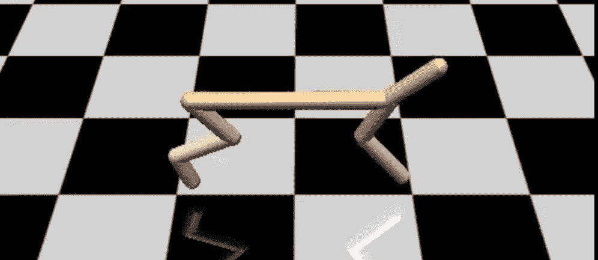
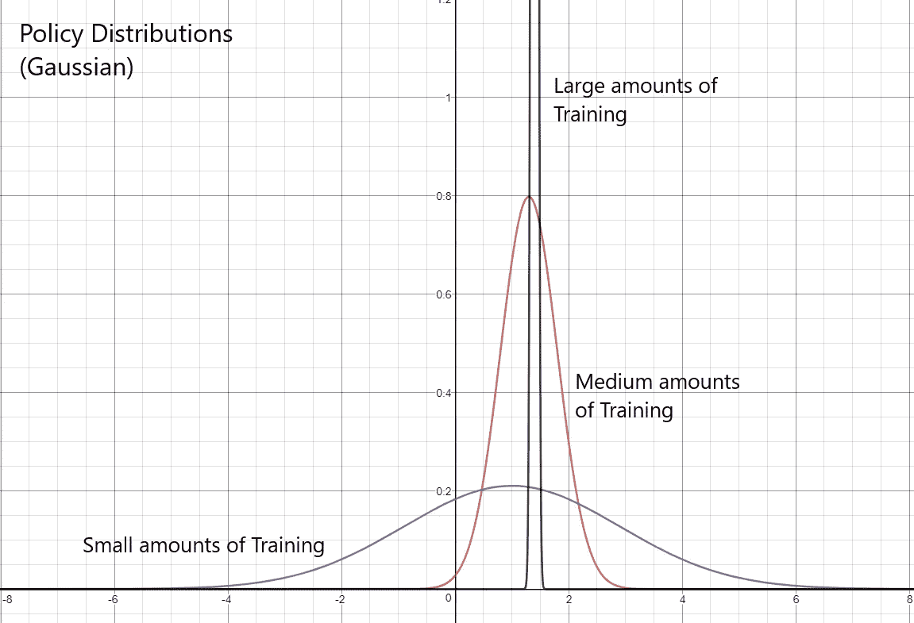
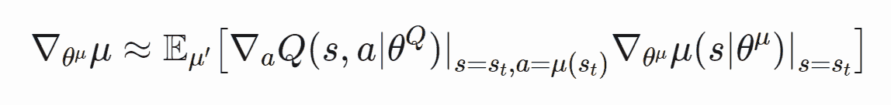
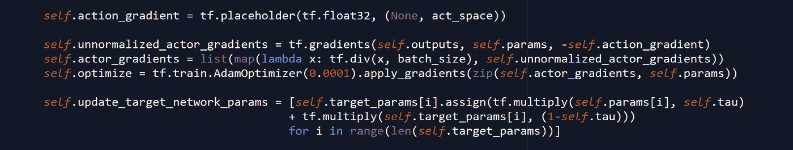
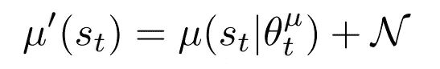

# 用深度强化学习训练猎豹奔跑

> 原文：<https://towardsdatascience.com/training-a-cheetah-to-run-with-deep-reinforcement-learning-6dca2975443a?source=collection_archive---------16----------------------->

HalfCheetah Model featured by OpenAI Gym + MujoCo

猎豹可能有点夸张，但使用深度强化学习，我能够训练一个基于猎豹的物理模型来运行！

虽然这可能看起来并不令人兴奋，但让我这么说吧——在训练之前，代理(猎豹)没有任何关于运动的先验知识。它可以进入它的行动空间和观察空间，并且知道它必须尽可能地移动，但仅此而已！任何协调的运动都只是使用强化学习算法训练的产物。

在这篇文章中，我将分解我如何训练我的代理运行，以及我用来这样做的 DRL 算法。

Video of my trained Agent

# 连续动作空间中的强化学习

由于 half cheetah 模型使用连续的动作空间而不是离散的动作空间(即，其中一组实数被用作动作，而不是一组可能的选项)，所以基于值近似值的方法不能很好地工作。通常，值函数需要使用 argmax 来确定最优策略，这反过来会使处理连续动作空间变得非常不方便，因为动作空间需要离散化。因此，我们转向策略梯度方法作为我们的算法选择。

与基于价值的方法相反，策略梯度直接逼近代理的策略！这反过来使得它非常方便地用于连续动作空间，因为不再需要使用 argmax 之类的东西(从而提高了准确性，并且通常需要较少的计算能力)。

# DDPG 算法

通常，策略梯度会在动作空间上产生一个概率分布，其中动作在从该分布抽样后返回。然而，在训练期间，概率分布变得更窄，最终导致特定动作(即最优动作)的峰值概率。

*X axis would be the action space*

DDPG 算法(深度确定性政策梯度)利用了这一事实——鉴于政策梯度产生的概率分布将总是收敛于特定的行动，DDPG 只产生单一输出。简单概述一下，DDPG 是一种被称为“参与者评价算法”的东西，它同时逼近一个价值函数(评价者)和一个政策函数(参与者)。直觉上，演员要对动作负责，而评论家帮助演员决定它的动作有多好。

评论家通过使用称为 TD 误差的东西作为其梯度的损失来更新自身，而演员使用以下梯度进行更新:

*As mentioned before, the critic is used to help the actor determine how good its action was — as such, the gradient of the critic is used in finding the gradient of the actor.*

虽然这看起来非常复杂，但是实现起来非常简单。

Gradients are divided by batch_size for normalization, as batches of data may be used as inputs.

# 较小的变化

虽然 DDPG 算法采用了许多在 DRL 使用的标准技术(例如，经验回放)，但它调整了两件事——目标网络的更新程序，以及如何执行探索。

**目标网络:**

DDPG 算法不是周期性地将目标网络设置为主要参与者和批评者网络，而是用“软”更新来更新目标网络。参考上面的代码片段，通过用当前主网络逐步替换少量(tau)目标网络来更新目标参数，从而使目标网络更新更稳定，并提高训练效率。

**探索:**

由于使用了连续的动作空间，诸如 epsilon greedy 的探索技术就不能再使用了。话虽如此，DDPG 通过在预测的行动中增加噪音来使用探索——这反过来又给政策增加了一些“随机性”。

The noise can be generated with many different methods —a zero centered gaussian was used for my program.

就是这样！在用 DDPG 训练了我的特工几百集之后，我的猎豹特工学会了跑步是最快的移动方式。

# 结论

DQNs 等基于值的方法可能对强化学习至关重要，但 DDPG 等算法提供的效用简直疯狂。虽然本文只关注它在训练猎豹奔跑中的应用，但潜在的影响要深远得多。以机器人技术为例——如果 DDPG 能够训练机器猎豹奔跑，那么是什么阻止了它训练更复杂的机器人呢？

最终，我们仍然面临着一系列障碍，这些障碍目前阻止我们在复杂的机器人技术中使用深度 RL。然而，随着 DRL 不断发展，基于政策梯度的方法，如 DDPG，很可能有一天会成为这种技术的支柱。

最后，这里是我文章中的一些摘录:

1.  处理连续动作空间与处理离散动作空间非常不同
2.  DDPG 是一种行动者批评策略梯度算法，它利用了正常策略梯度的分布在特定行动时达到峰值的事实
3.  DDPG 使用噪音进行探索(随机性)，使用“软”目标网络更新来实现稳定性

https://github.com/JL321/PolicyGradients-torch[DDPG 更新实现的代码可以在这里找到](https://github.com/JL321/PolicyGradients-torch)

## 如果你喜欢这篇文章，一定要拍下这篇文章，并与你的网络分享！

## 另外，如果你有兴趣关注我在媒体之外做的一些事情，那么请在 [LinkedIn](https://www.linkedin.com/in/james-l-3b150b134/) 上联系我！