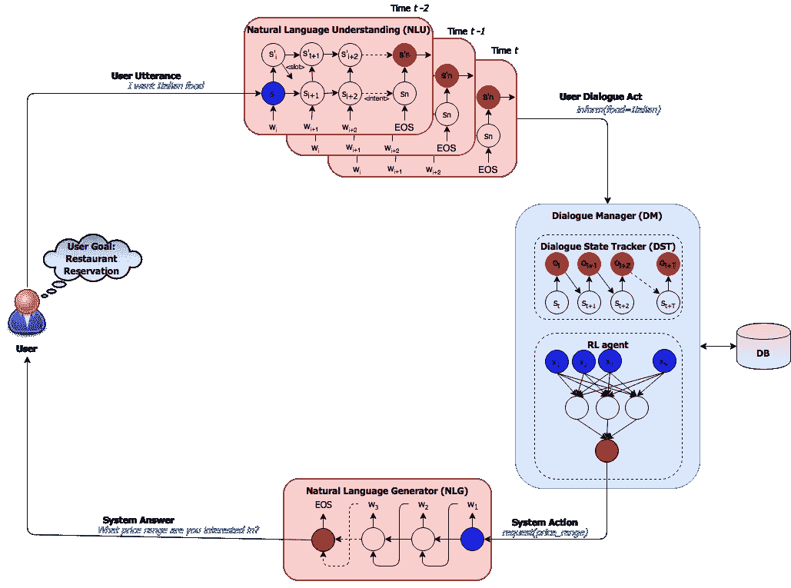
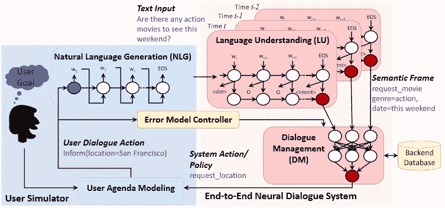

# 用深度强化学习训练面向目标的聊天机器人——第一部分

> 原文：<https://towardsdatascience.com/training-a-goal-oriented-chatbot-with-deep-reinforcement-learning-part-i-introduction-and-dce3af21d383?source=collection_archive---------2----------------------->

## 第一部分:介绍和培训循环

在这个系列中，我们将学习面向目标的聊天机器人，并用 python 训练一个具有深度强化学习的聊天机器人！一切从零开始！这个系列教程的代码可以在这里找到。

## 系列内容

第一部分:介绍和培训循环

[第二部分:DQN 代理商](https://medium.com/@maxbrenner110/training-a-goal-oriented-chatbot-with-deep-reinforcement-learning-part-ii-dqn-agent-f84122cc995c)

[第三部分:对话状态跟踪器](https://medium.com/@maxbrenner110/training-a-goal-oriented-chatbot-with-deep-reinforcement-learning-part-iii-dialogue-state-d29c2828ce2a)

[第四部分:用户模拟器和误差模型控制器](https://medium.com/@maxbrenner110/training-a-goal-oriented-chatbot-with-deep-reinforcement-learning-part-iv-user-simulator-and-a0efd3829364)

[第五部分:运行代理和未来研究](https://medium.com/@maxbrenner110/training-a-goal-oriented-chatbot-with-deep-reinforcement-learning-part-v-running-the-agent-and-63d8cd27d1d)

# 什么是面向目标的聊天机器人？

面向目标(GO)的聊天机器人试图为用户解决特定的问题。这些聊天机器人可以帮助人们订票、寻找预定等。训练围棋聊天机器人有两种主要方式:使用编码器-解码器直接将用户对话映射到响应的监督学习，以及通过与真实用户或基于规则的用户模拟器的试错对话来训练聊天机器人的强化学习。通过深度强化学习训练的围棋聊天机器人是一个非常令人兴奋和成熟的研究领域，有许多实际应用！

## 对话系统

使用强化学习的围棋聊天机器人的对话系统分为三个主要部分:对话管理器(DM)、自然语言理解(NLU)单元和自然语言生成器(NLG)单元。此外，DM 被分成对话状态跟踪器(DST)或仅状态跟踪器(ST)和用于代理本身的策略，在许多情况下，代理由神经网络表示。此外，系统循环包含具有用户目标的用户。用户目标代表用户希望从对话中得到什么，在下图的情况下是餐馆预订。

Dialogue flow for a GO chatbot system

在这个循环中，用户说出一些由 NLU 组件处理成所谓的*语义框架*的东西，语义框架是可以由代理处理的自然语言话语的低级表示。DST 将用户对话行为(语义框架)和当前对话的历史处理成代理策略可以使用的状态表示。然后，这个状态被输入到代理的策略或神经网络中，并以语义框架的形式输出一个动作。还可以查询数据库(DB)以向代理动作添加信息，例如餐馆信息或电影票信息。然后，代理(在此图中也称为“系统”)动作由 NLG 组件处理，该组件将其转换为用户可读的自然语言。

## MiuLab TC-Bot

Dialogue flow for TC-Bot

本教程和附带的代码是基于 MiuLab 的一个对话系统，名为 [TC-Bot](https://github.com/MiuLab/TC-Bot) 。他们的[论文](https://arxiv.org/pdf/1703.01008.pdf)的主要贡献是，它展示了如何使用基本规则模拟用户，以便与用真人训练代理相比，代理可以用强化学习非常快速地训练。其他论文也做了同样的事情，但是这篇论文是一个很好的例子(有代码！)如何制定一个成功的培训体系。

## 用户模拟器和误差模型控制器

我们将在后面的系列文章中更详细地介绍用户 sim，但是现在要理解它是一个基于确定性规则的模拟器，试图模拟一个真实的用户。在这种情况下，它基于用户议程建模，这意味着它使用代表用户 sim 的约束和需求的内部状态。这种内部状态跟踪当前的对话，以及完成当前目标还需要做什么。目标是从可用用户目标列表中随机挑选的，其中目标由一组约束和其他信息组成，这些约束和信息在用户 sim 试图实现其当前目标时指导用户 sim 的动作。误差模型控制器(EMC)被用于在语义框架的级别上向用户 sim 的动作添加误差，这被显示为改善训练的结果。

## 对于这个系列教程，您应该知道什么

下面是您应该知道的一些事情，这些事情不会在本系列中涉及，但是对于理解代码非常重要:

*   非常了解如何用 python 编码
*   知道如何使用 python 中的[字典，因为我们会经常用到它们！](https://realpython.com/python-dicts/)
*   知道如何编写简单的代码 [DQN](https://jaromiru.com/2016/10/21/lets-make-a-dqn-full-dqn/)
*   知道如何用 [Keras](https://github.com/keras-team/keras) 制作一个非常简单的神经网络模型

我们将使用 Python ≥ 3.5、 [Keras](https://github.com/keras-team/keras) (任何最新版本)，当然还有 numpy。

现在让我们继续讨论我们将要使用的数据！在这一部分，我们将讨论`[train.py](https://github.com/maxbren/GO-Bot-DRL/blob/master/train.py)`。

# 电影票数据

[**数据库**](https://github.com/maxbren/GO-Bot-DRL/blob/master/data/movie_db.txt) :该数据库为不同属性的电影票或*时段*。以下是其中几项(排名不分先后):

它被组织成一个字典，关键字是长整型(类似整数)票的索引，值也是包含票代表的电影信息的字典。如您所见，并非所有的票据都有相同的属性，显然也不总是相同的值！

[**数据库字典**](https://github.com/maxbren/GO-Bot-DRL/blob/master/data/movie_dict.txt) :另一个文件包含一个字典，其中的键是可以在一个标签中的不同槽，值是每个槽的可能值的列表。以下是一些不同的项目(截断值列表):

[**用户目标列表**](https://github.com/maxbren/GO-Bot-DRL/blob/master/data/movie_user_goals.txt) :最后，我们将用户目标作为包含每个目标的请求和通知槽的字典列表。稍后我们将更详细地讨论这意味着什么。示例:

该数据库的目标是让代理商找到一张符合用户约束的票，该约束由该集的用户目标给出。这不是一件容易的事，因为每张票都是独一无二的，而且大多数都有不同的位置！

## 动作剖析

理解这个系统中动作的结构是非常重要的。如果我们暂时忽略自然语言，用户 sim 和代理都以*语义框架*的形式作为输入和输出动作。动作包含意图、通知和请求槽。本教程系列中的 Slot 指的是键、值对，通常指的是单个通知或请求。例如，在字典`{‘starttime’: ’tonight’, ‘theater’: ’regal 16’}`中，`‘starttime’: ’tonight’`和`‘theater’: ’regal 16’`都是插槽。示例操作:

意图代表行动的类型，如下所列。剩下的动作被分成包含约束的通知槽和包含需要填写的信息的请求槽。可能的关键字列表在`[dialogue_config.py](https://github.com/maxbren/GO-Bot-DRL/blob/master/dialogue_config.py)`中列出，它们的值在上面提到的数据库字典中。通知槽是发送者希望接收者知道的信息。它由键列表中的一个键和该键的值列表中的一个值组成。请求槽包含一个键，发送方希望从接收方找到该键的值。所以它是密钥列表中的一个密钥，而值`‘UNK’`意味着“未知”,因为发送者还不知道什么值适用于这个槽。

## 所有意图

*   通知:以通知槽的形式提供约束
*   请求:请求用值填充请求槽
*   感谢:仅供用户使用；它只是向代理表明它已经做了一些好事，或者用户已经准备好结束对话
*   找到匹配项:仅由代理使用；向用户表明它有一个它认为将满足用户目标的匹配
*   拒绝:仅供用户使用；仅用于响应具有匹配意图的代理操作，表明匹配不符合其约束条件
*   完成:代理使用此功能来结束对话，并查看是否已完成当前目标，当情节持续时间过长时，用户操作会自动执行此意图

## 状态

ST 创建一个状态作为代理选择适当动作的输入。这是来自当前对话历史的有用信息的 numpy 数组。我们将在第二部分对此进行更深入的讨论。

现在簿记已经完成，让我们进入训练循环和一些代码！

# 培训代理

Our training loop

这个图代表了训练中一个完整循环的流程。该系统的 4 个主要部分是代理`dqn_agent`、对话状态跟踪器`state_tracker`、用户(或用户模拟器)`user`和 EMC `emc`。让我们来看看一轮比赛的各个阶段:

1.  获取当前状态，该状态相当于之前的下一个状态，或者如果这是情节的开始，则获取初始状态，并将其作为输入发送到代理的 get action 方法
2.  获取代理的操作，并将其发送到 ST update 方法以获取代理操作:ST 在该方法中更新自己的当前会话历史，并使用数据库查询信息更新代理操作
3.  更新的代理动作作为输入被发送到用户的步骤方法中:在步骤中，用户 sim 制作其自己的基于规则的响应，并且还输出奖励和成功信息(未示出)
4.  用户操作被 EMC 注入了错误
5.  带有错误的用户操作被作为输入发送到用户操作的 ST 更新方法中:类似于带有代理操作的 ST 更新方法，但是，它只是在其历史中保存信息，而不是以重要的方式更新用户操作
6.  最后，从 ST 的 get 状态输出下一个状态，这完成了添加到代理的存储器中的该轮的当前经验元组

Code of diagram

一个重要的注意事项是，与任何 DQN 代理一样，内存缓冲区在某种程度上是在“预热”阶段填充的。与 dqn 在游戏中的许多用途不同，代理在这个阶段不采取随机行动。相反，在预热期间，它使用一个非常简单的基于规则的算法，这将在第二部分解释。

如你所见，我们没有使用任何自然语言(NL)组件，所以动作总是语义框架。在本系列中，我们将培训不需要 NL 的 DM。NLG 和 NLU 与代理分开进行预训练，不需要了解如何用 DRL 训练代理。不要烦恼！你仍然会学到很多，老实说，学习如何用 DRL 训练代理比知道如何用监督学习训练 NL 组件有趣得多。看一看本系列的第五部分，看看在哪里可以学习添加 NL 组件！

## 情节重置

在我们开始热身和训练循环之前，这里是每集之前调用的集重置功能。还要注意的是,*对话和一集是一回事，我可以互换使用。*

简而言之，剧集重置会刷新对象并获取该剧集的初始用户操作。

## 预热代理

首先，我们定义外部循环只运行到代理的内存被填充到`WARMUP_MEM`或者它的内存缓冲区完全满了。接下来，我们必须重置每个循环的情节，并获得初始状态。内部循环运行`run_round(state, warmup=True)`直到`done == true`意味着这一集结束。

## 培训代理

忽略一些额外的变量，循环与预热非常相似。到目前为止，主要的区别是，当剧集数量达到`NUM_EP_TRAIN`时，该方法结束其外部循环。

## 训练模块的工作原理

在一定数量的剧集(`TRAIN_FREQ`)的每个*周期*之后，代理人被训练其对经历的记忆。

1.  如果该周期的成功率大于或等于当前最佳成功率(在`train_run()`开始时初始化为 0.0)，并且高于某个`SUCCESS_RATE_THRESHOLD`，则清空代理的内存。这是为了消除基于先前版本的代理模型的动作的旧经验，即由次优模型采取的动作。然后，这允许来自模型的更好版本的更新的体验填充存储器。这样，训练和表现是稳定的。
2.  接下来，代理的行为模型权重被复制到目标模型中，这是今天使用的所有 dqn 所需要的，以稳定学习。
3.  最后，代理被训练，这意味着当前的记忆被用于提高模型的权重。

## 培训总结

请看一下`[train.py](https://github.com/maxbren/GO-Bot-DRL/blob/master/train.py)`中的完整代码，了解全貌！

1.  加载数据库数据
2.  创建对象
3.  呼叫`warmup_run()`
4.  打电话给`train_run()`

这就是 DRL 训练的围棋聊天机器人的主要训练循环。理解图表很重要。[接下来](https://medium.com/@maxbrenner110/training-a-goal-oriented-chatbot-with-deep-reinforcement-learning-part-ii-dqn-agent-f84122cc995c)我们将了解代理、它可以采取的行动种类、预热政策和内部权重优化流程。

**那里见！**