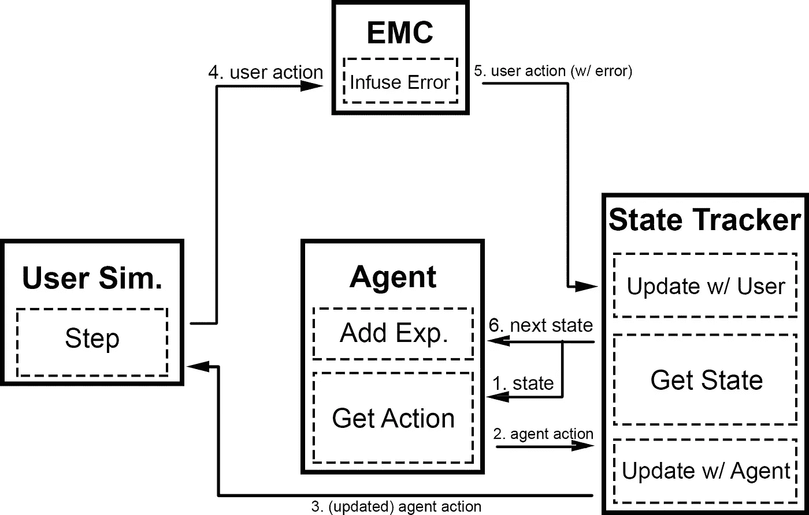
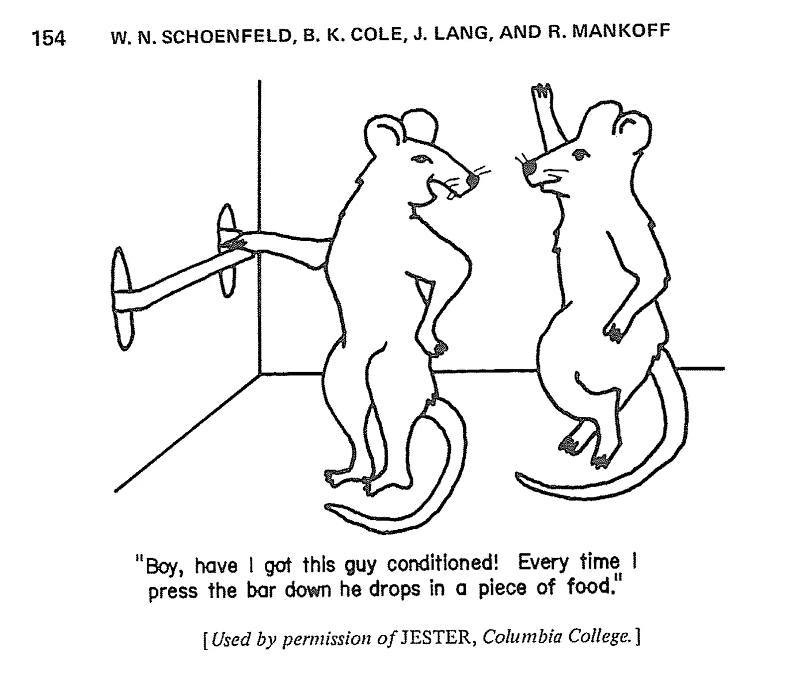

# 用深度强化学习训练面向目标的聊天机器人——第二部分

> 原文：<https://towardsdatascience.com/training-a-goal-oriented-chatbot-with-deep-reinforcement-learning-part-ii-dqn-agent-f84122cc995c?source=collection_archive---------6----------------------->

## 第二部分:DQN 代理人

如果你还不知道什么是面向目标的聊天机器人，我们正在使用的数据库和我们对话系统的训练循环，看看这个系列教程的[的前一部分](https://medium.com/@maxbrenner110/training-a-goal-oriented-chatbot-with-deep-reinforcement-learning-part-i-introduction-and-dce3af21d383)！

在这一部分，我们将深入探讨代理人，在这种情况下，代理人由 DQN 代表。

本教程和附带的代码是基于 MiuLab 的 TC-Bot。本教程的代码可以在[这里](https://github.com/maxbren/GO-Bot-DRL)找到。我们将从`[dqn_agent.py](https://github.com/maxbren/GO-Bot-DRL/blob/master/dqn_agent.py)`开始这一部分的工作。

我们正在遵循的总体图表:

Dialogue flow of a single round

# 代理的目的是什么？

面向目标(GO)的聊天机器人代理的目的是接受训练，以便熟练地与真实用户交谈，从而完成一个目标，例如找到一个符合用户约束的预订或电影票。代理的主要工作是采取一种状态，并产生一个接近最优的行动。具体来说，代理从对话状态跟踪器(ST)接收表示当前对话历史的状态，并选择要采取的对话响应。

## 深度 Q 网(DQN)

dqn 的细节超出了本教程的范围，所以请查看这些资源以了解更多信息:[编码一，](https://jaromiru.com/2016/09/27/lets-make-a-dqn-theory/) [以不同的方式编码一](https://becominghuman.ai/lets-build-an-atari-ai-part-1-dqn-df57e8ff3b26)

现在让我们来看一些代码！

## 代理的对话配置

以下是代理使用的`[dialogue_config.py](https://github.com/maxbren/GO-Bot-DRL/blob/master/dialogue_config.py)`中的对话配置常量:

`agent_inform_slots`是座席代表通知的所有可能的关键值。`agent_request_slots`是代理请求的所有可能的键值。还显示了可能的代理操作。

## 神经网络模型

我们使用 [Keras](https://github.com/keras-team/keras) 来建立代理的模型。该模型是一个单隐层神经网络。这很简单，但是对这个问题有很好的效果。

该代码片段中的实例变量被分配给`[constants.json](https://github.com/maxbren/GO-Bot-DRL/blob/master/constants.json)`中“agent”下的常量

# 政策

在给定的状态下，代理用来选择动作的策略取决于对话是处于预热阶段还是训练阶段。在训练前运行热身，通常使用随机策略来填充代理的记忆。在这种情况下，代理在预热期间使用非常基本的基于规则的策略。在训练中，行为模型被用来选择一个动作。在这种情况下，`use_rule`表示预热。

这个方法返回动作的索引和动作本身。

## 基于规则的策略

在预热期间，采用一个简单的基于规则的策略。

首先注意代理的重置方法，该方法仅用于重置该基于规则的策略的几个变量:

该策略简单地请求请求槽列表中的下一个槽，直到它没有更多的请求为止，然后它采取“找到匹配”动作，最后在最后一轮采取“完成”动作。

我们将在第三部分和第四部分讨论 match found 和 done 含义。

下面是一个使用这个简单策略的单集示例:

这个策略对于以某种有意义的方式热启动代理很重要。这是一个简单的策略，但比采取随机行动能改善结果。

## DQN 政策

培训期间使用:

# 训练方法

正如在系列的第一部分中所描述的,`dqn_agent.train()`在训练中每隔几集就会被调用一次。

Note: Some of this code is based off of an awesome tutorial by [Jaromír](https://github.com/jaromiru) which can be found [here](https://jaromiru.com/2016/09/27/lets-make-a-dqn-theory/).

我不打算遍历这段代码的大部分，因为它是非常基本的，你们中的许多人应该已经看到了 DQN 代码，看起来很像现在这样。然而，我要指出的是，与许多其他 DQN 训练方法不同的是，这个代码并不是随机抽取一批样本。相反，它会计算当前内存中有多少批次，然后根据这些批次训练权重。这有点奇怪，但对 TC-Bot 的原始代码是准确的。摆弄一下这个，看看你能否用不同的批量取样技术得到更好的结果！

在**摘要**中，该代理根据一个状态选择一个动作，该状态的策略要么是预热期间的一个简单请求列表，要么是训练期间的单个隐藏层行为模型。这种训练方法很简单，与其他 DQN 训练方法只有几处不同。尝试模型的架构，添加[优先体验回放](https://arxiv.org/abs/1511.05952)并制定更高级的基于规则的策略！

[下一部分](https://medium.com/@maxbrenner110/training-a-goal-oriented-chatbot-with-deep-reinforcement-learning-part-iii-dialogue-state-d29c2828ce2a)将涵盖 ST 和查询系统！在那里，您将了解 ST 如何更新其历史/对对话的理解，以及状态准备是什么样的。