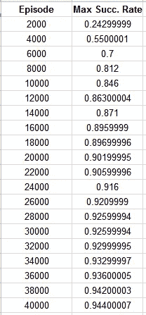
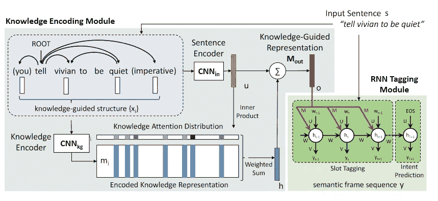
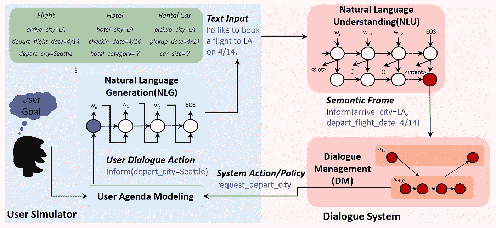

# 用深度强化学习训练面向目标的聊天机器人——第五部分

> 原文：<https://towardsdatascience.com/training-a-goal-oriented-chatbot-with-deep-reinforcement-learning-part-v-running-the-agent-and-63d8cd27d1d?source=collection_archive---------15----------------------->

## 第五部分:代理运行及未来研究

[https://www.nasa.gov/mission_pages/shuttle/shuttlemissions/sts127/launch/index.html](https://www.nasa.gov/mission_pages/shuttle/shuttlemissions/sts127/launch/index.html)

在前面的部分中，我们介绍了面向目标的代理的所有部分和代码！

这是第五部分，也是最后一部分，我们将介绍如何运行代码以及未来的研究和改进！

这个系列教程是基于 [TC-Bot](https://github.com/MiuLab/TC-Bot) 的。这个系列的代码可以在[这里](https://github.com/maxbren/GO-Bot-DRL)找到。在这一部分，我们将快速回顾一下`[user.py](https://github.com/maxbren/GO-Bot-DRL/blob/master/user.py)`和`[test.py.](https://github.com/maxbren/GO-Bot-DRL/blob/master/test.py)`

# 运行代码

您既可以培训代理，也可以测试经过培训的代理。此外，代替使用用户模拟器，你可以作为一个真正的用户自己输入动作。

## 培训代理

运行`train.py`，用给定的`constants.json`文件从头开始训练。改变常数值，看看是否能找到更好的超参数。

## 保存和加载模型权重

通过将`constants.json`中的`"save_weights_file_path”`设置为您想要保存行为和目标模型权重的相对文件路径，您可以将训练模型的权重保存在一个目录中。要加载保存的重量，将`"load_weights_file_path”`设置到相同的路径。例如，要加载回购中的权重，将其设置为`"weights/model.h5"`。权重文件必须是. h5 文件，这是 Keras 使用的文件类型。您可以加载已经训练好的重量，并对其进行更多训练！

## 测试代理

通过运行`test.py`并将`"load_weights_file_path”`设置为正确的文件路径，可以使用经过训练的权重对代理进行测试。

## 用真实用户测试(或培训)代理

您可以通过将`constants.json`中`“run”`下的`"usersim”`设置为`false`，以用户身份输入您自己的动作(而不是使用用户 sim)来测试代理。你在控制台中输入一个动作和一个成功指示器。动作输入的格式是:意图/通知槽/请求槽。

动作输入示例:

*   请求/电影名称:房间，日期:星期五/开始时间，城市，剧院
*   通知/电影名称:疯狂动物城/
*   请求//开始时间
*   完成//

此外，控制台将询问代理是否成功的指示器(除了在一集的初始动作输入之后)。允许的输入是-1 表示失败，0 表示没有结果，1 表示成功。

与训练有素的代理人一起玩得开心，并定性测试您的改进！

## 结果

我的数据是使用`[constants.json](https://github.com/maxbren/GO-Bot-DRL/blob/master/constants.json)`中设置的超参数收集的，并且是 10 次训练运行的平均值。

常数:

按*一段时间的最大成功率*/到该集为止的训练频率(每 100 集)列出的集数(每 40000 集中的 2000 集)表:

# 未来的研究和实验

我们刚刚编写的代码是一个非常简单的面向目标的聊天机器人系统的例子。用户 sim 不是太先进，不像 TC-Bot 在这个系统中没有自然语言组件。代理还有很大的改进空间，包括允许更复杂的操作。然而，这是进一步研究和试验这个主题的一个非常好的起点。这里有一些重要的地方需要改进或添加到现有的代码中，或者只是为了研究:

## 自然语言

Diagram from an NTU and Microsoft paper

在 TC-Bot 中添加自然语言组件，这样您就可以在更真实的对话环境中测试它。请记住，自然语言组件不是用这种深度强化学习循环来训练的，它们是用 LSTMs 使用不同的通常受监督的学习方法单独进行预训练的。这里有几个关于这个话题的资源:[媒体文章](https://medium.com/analytics-vidhya/building-a-simple-chatbot-in-python-using-nltk-7c8c8215ac6e)、 [NTU 论文](https://www.csie.ntu.edu.tw/~yvchen/doc/IS16_MultiJoint.pdf)、 [NTU 和微软](https://www.csie.ntu.edu.tw/~yvchen/doc/SLT16_SyntaxSemantics.pdf)当然还有 [TC-Bot](https://github.com/MiuLab/TC-Bot) 及其[论文](http://aclweb.org/anthology/I17-1074)。

## 其他数据集和语料库

我们只看到了这个系统如何与一个简单的电影票数据库一起工作。在与此数据库结构相同的另一个数据库上尝试它。请确保相应地更改对话配置，但记住这是一个简单的系统，它只能以找到单个项目来实现用户目标为目标。看看你是否能改变它来找到一个目标需要的多个项目！这里有一些谷歌数据集和一个来自 T2 斯坦福大学的数据集。但是外面还有很多。

## 对话状态跟踪

状态跟踪的发展可能是聊天机器人中最突出的话题。对于系统的状态跟踪器来说,*准备一个有用的状态让代理采取接近最优的行动是非常重要的。如果重要的信息丢失了，比如用户的行为是什么，那么代理就很难很好的回复。此外，这些信息的编码方式以及是否有无用信息也会影响所采取行动的优化。这里有一些关于 ST: [剑桥论文](https://arxiv.org/pdf/1506.07190.pdf)、[雅虎](https://www.sigdial.org/files/workshops/conference17/proceedings/pdf/SIGDIAL02.pdf)和[对话状态跟踪挑战](https://pdfs.semanticscholar.org/4ba3/39bd571585fadb1fb1d14ef902b6784f574f.pdf)的资源。*

## 高级 DRL 算法

虽然我找不到任何讨论这一点的论文或其他资源，但我尝试了更高级/不同的 DRL 算法，如 A3C、PPO、TRPO、ACKTR、基于模型的方法、基于混合模型的方法等。将是一个伟大的领域进行实验的围棋机器人！请记住，因为这段代码中的训练方法集中在使用内存和在特定时间刷新内存，所以新的训练方法必须伴随不使用内存池的算法(这是大多数算法)。

## 高级用户模拟器

目前有很多关于创建更像人类的用户模拟器的研究，因为这对于获得高质量的培训很重要。这里构建的用户 sim 是可靠的，但仍然可以大大改进。这篇[论文](http://alborz-geramifard.com/workshops/nips17-Conversational-AI/Papers/17nipsw-cai-collaboration-based-simulator.pdf)用于构建真实的用户模拟人生。

## 复杂域

Hierarchical successor to TC-Bot

这里涉及的电影票领域是 GO 聊天机器人的一个实际用例，但仍然非常简单。在大多数情况下，问题的复杂性在现实世界中是上升的，在这里也是如此。面向目标的问题往往是复合的和分层次的，这意味着问题实际上是一堆必须完成的子问题。这篇[论文](https://www.microsoft.com/en-us/research/uploads/prod/2017/04/emnlp2017_arxiv.pdf)解释了如何增强现有的 TC-Bot 框架，以允许完成更复杂的层次目标。这又可以添加到这里创建的代码中。

## 更多资源

*   [高级实战训练](http://aclweb.org/anthology/N18-3006)
*   [用围棋机器人转移学习](https://arxiv.org/pdf/1802.00500.pdf)
*   [深度学习中的一切围棋机器人概述](https://arxiv.org/pdf/1809.08267.pdf)
*   [深度学习中的一切 GO 机器人的另一个概述](https://www.poly-ai.com/docs/naacl18.pdf)
*   [在聊天机器人上拥有大量资源的大型媒体帖子](https://medium.com/gobeyond-ai/a-reading-list-and-mini-survey-of-conversational-ai-32fceea97180)

*用您目前所学的知识和编码进行实验！随着机器和深度学习的新功能，这个领域正在快速发展！*

**感谢您的关注，希望您能从这个系列和代码中获益良多！如有任何问题，欢迎随时评论！**