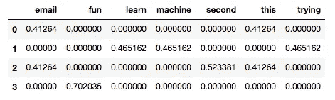
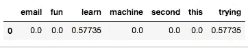

# 训练朴素贝叶斯模型以识别电子邮件或文档的作者

> 原文：<https://towardsdatascience.com/training-a-naive-bayes-model-to-identify-the-author-of-an-email-or-document-17dc85fa630a?source=collection_archive---------4----------------------->


“brown track and field” by [Adi Goldstein](https://unsplash.com/@adigold1?utm_source=medium&utm_medium=referral) on [Unsplash](https://unsplash.com?utm_source=medium&utm_medium=referral)

在这个例子中，我们使用由两个不同的人写的一组电子邮件或文档。目的是训练一个朴素贝叶斯模型，使其能够根据文档/电子邮件中使用的单词来预测是谁写的文档/电子邮件

包含本例中使用的文件的 Github 存储库可以在[这里](https://github.com/duranivan/naivebayes-email-author)找到。文件`nb_email_author.py`包含加载数据、训练模型以及查找训练和测试集预测得分的脚本。

在这里，我们解释脚本的主要部分和结果。

# **加载数据**

脚本的第一部分加载数据。这里唯一的特殊性是‘pickle’用于反序列化原始数据文件(关于 pickle 和序列化/反序列化的更多信息，请看这个[链接](https://docs.python.org/3/library/pickle.html))。

加载两个文件，一个包含电子邮件或文档，另一个只包含电子邮件的作者。一旦我们反序列化并加载文件，我们就有两个数组(列表)，一个名为`words`，一个名为`authors`，大小都是 17，578。`words`中的每个元素都是包含电子邮件或文档的单个字符串。“authors”中的每个元素不是 0 就是 1。

像往常一样，我们使用 Scikit-learn 方法`sklearn.model_selection.train_test_split`将数据分成训练集和测试集。

```
*from* sklearn.model_selection *import* train_test_splitfeatures_train, features_test, labels_train, labels_test = train_test_split(words, authors, *test_size*=0.1, *random_state*=10)
```

# **文本矢量化**

在机器学习中处理文本时，将文本转换成易于分析和量化的数据是很常见的。

对于这一点，最常用的技术是 **tf-idf** 简称“词频-逆文档频”，基本反映了一个词在集合或语料库(我们的一组邮件或文档)中对一个文档(邮件)有多重要。

**tf-idf** 是一个统计量，随着一个单词在文档中出现的次数而增加，由语料库中包含该单词的文档数量来惩罚( [Wikipedia](https://en.wikipedia.org/wiki/Tf%E2%80%93idf) )。

幸运的是，Scikit-learn 有一个方法可以做到这一点(`sklearn.feature_extraction.text.TfidfVectorizer`)。见文档[此处](http://scikit-learn.org/stable/modules/generated/sklearn.feature_extraction.text.TfidfVectorizer.html)。

因此，我们以如下方式将此方法应用于我们的数据:

```
*from* sklearn.feature_extraction.text *import* TfidfVectorizervectorizer = TfidfVectorizer(*sublinear_tf*=True, *max_df*=0.5, *stop_words*='english')features_train = vectorizer.fit_transform(features_train)
features_test = vectorizer.transform(features_test)
```

`TfidfVectorizer`设置矢量器。这里我们将`sublinear_tf`改为 true，用 **1 + log(tf)** 代替 **tf** 。这解决了“一个术语在一个文档中出现二十次”不代表“一次出现的重要性的二十倍”([链接](https://nlp.stanford.edu/IR-book/html/htmledition/sublinear-tf-scaling-1.html))的问题。因此降低了高频词的重要性(注意 **1+log(1) = 1** ，而 **1+log(20) = 2.3** )。

此外，`stop_words`被设置为“英语”，因此在这种情况下，诸如“和”、“the”、“him”之类的停用词将被忽略，而`max_df=0.5`意味着我们将忽略文档频率高于 0.5 的术语(即，出现该术语的文档的比例)。

接下来，我们对训练集和测试集的特征(在我们的例子中是术语或单词)进行拟合和转换。注意，对于训练集，我们使用`fit_transform`，对于测试集，我们只使用`transform`。

这是有意义的，因为我们希望模型通过训练集学习词汇和文档频率，然后将训练特征转换为术语-文档矩阵。对于测试集，我们只想使用学习到的文档频率(idf)和词汇将其转换为术语-文档矩阵。

**让我们用一个简化的例子来看看这个是什么样子的:**

假设我们有以下训练语料库，同样，每个条目代表一个文档/电子邮件:

```
corpus = [
    "This is my first email.",
    "I'm trying to learn machine learning.",
    "This is the second email",
    "Learning is fun"
]
```

现在，让我们来适应和改造它:

```
vectorizer = TfidfVectorizer()X = vectorizer.fit_transform(corpus)
print(X.__str__)*# <4x13 sparse matrix of type ‘<class ‘numpy.float64’>’ with 18 stored elements in Compressed Sparse Row format>*
```

`fit_transform`返回一个稀疏矩阵:

```
print(X)*# (0, 10)   0.41263976171812644
# (0, 3)    0.3340674500232949
# (0, 7)    0.5233812152405496
# (0, 1)    0.5233812152405496
# (0, 0)    0.41263976171812644
# (1, 12)   0.4651619335222394
# (1, 11)   0.4651619335222394
# (1, 4)    0.4651619335222394
# (1, 6)    0.4651619335222394
# (1, 5)    0.3667390112974172
# (2, 10)   0.41263976171812644
# (2, 3)    0.3340674500232949
# (2, 0)    0.41263976171812644
# (2, 9)    0.5233812152405496
# (2, 8)    0.5233812152405496
# (3, 3)    0.4480997313625986
# (3, 5)    0.5534923152870045
# (3, 2)    0.7020348194149619*
```

如果我们将`X`转换成一个 2D 数组，它看起来像这样(总共有 13 列，每一列代表一个单词/术语，为了简洁起见，奇数列被省略):

```
vocabulary = vectorizer.get_feature_names()pd.DataFrame(*data*=X.toarray(), *columns*=vocabulary).iloc[:,0::2]
```



TFIDF Matrix (Training Set)

```
print(vocabulary)*# [‘email’, ‘first’, ‘fun’, ‘is’, ‘learn’, ‘learning’, ‘machine’, ‘my’, ‘second’, ‘the’, ‘this’, ‘to’, ‘trying’]*
```

现在让我们假设我们有下面的“测试”文档:

```
test = [“I’m also trying to learn python”]
```

让我们转换一下，看看它:

```
X_test = vectorizer.transform(test)pd.DataFrame(*data*=X_test.toarray(), *columns*=vocabulary).iloc[:, 0::2]
```



TFIDF Matrix (Test Set)

就这样，这就是文本或文档如何被矢量化以供进一步分析的过程。

# **选择一组较小的特征**

虽然选择一个较小的特征集并不是绝对必要的，但用太多的单词或特征来训练模型可能在计算上具有挑战性。

在本例中，我们使用 Scikit-learn 的`SelectPercentile`来选择得分最高的特性([文档](http://scikit-learn.org/stable/modules/generated/sklearn.feature_selection.SelectPercentile.html)):

```
*from* sklearn.feature_selection *import* SelectPercentile, f_classifselector = SelectPercentile(f_classif, *percentile*=10)
selector.fit(features_train, labels_train)features_train = selector.transform(features_train).toarray()
features_test = selector.transform(features_test).toarray()
```

选择器使用`f_classif`作为得分函数，计算样本的方差分析 F 值。基本上，我们选择具有最大 F 值的术语(即，在不同类别或作者中，频率均值最有可能不同的术语或单词)。这是常见的，以便选择跨类的最佳区别特征(在最初的 38，209 个单词中，我们最终得到 3，821 个)。

# **训练一个朴素贝叶斯模型**

对于这个例子，我们使用高斯朴素贝叶斯(NB)实现(Scikit-learn 文档[这里](http://scikit-learn.org/stable/modules/generated/sklearn.naive_bayes.GaussianNB.html#sklearn.naive_bayes.GaussianNB))。在以后的文章中，我们将详细讨论朴素贝叶斯背后的理论。

目前，值得一提的是，NB 是基于应用贝叶斯规则来计算一组单词(文档/电子邮件)由某人或某个类编写的概率或可能性(例如 **P("Chris"| "learn "、" machine "、" trying "，……)**)。

然而，没有所谓的朴素贝叶斯法则。“天真”一词的出现是由于假设特征彼此独立(条件独立)，这意味着，对于我们的电子邮件分析，我们假设单词在句子中的位置是完全随机的(即，“am”或“robot”同样可能跟在单词“I”后面，这当然不是真的)。

## **NB 带 Scikit-learn**

一般来说，用 Scikit-learn 训练机器学习模型很简单，通常遵循相同的模式:

*   初始化类模型的实例，
*   拟合训练数据，
*   预测测试数据(我们在这里省略了这一点)，
*   计算训练集和测试集分数。

```
*from* sklearn.naive_bayes *import* GaussianNB
*from* time *import* timet0 = time()
model = GaussianNB()
model.fit(features_train, labels_train)print(f”\nTraining time: {round(time()-t0, 3)}s”)t0 = time()
score_train = model.score(features_train, labels_train)
print(f”Prediction time (train): {round(time()-t0, 3)}s”)t0 = time()
score_test = model.score(features_test, labels_test)
print(f”Prediction time (test): {round(time()-t0, 3)}s”)print(“\nTrain set score:”, score_train)
print(“Test set score:”, score_test)
```

结果如下:

```
>>> Training time: 1.601s
>>> Prediction time (train): 1.787s
>>> Prediction time (test): 0.151s
>>> Train set score: 0.9785082174462706
>>> Test set score: 0.9783845278725825
```

还不错！