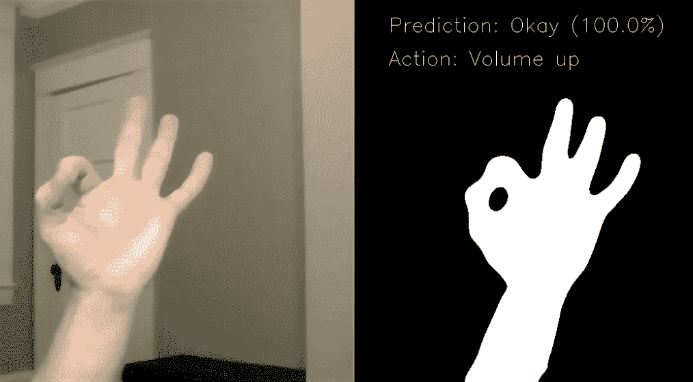
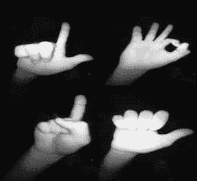
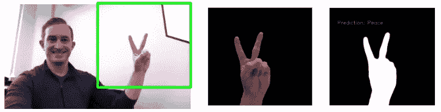
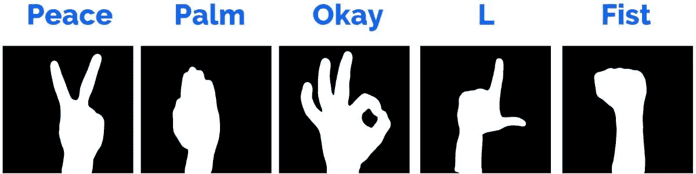
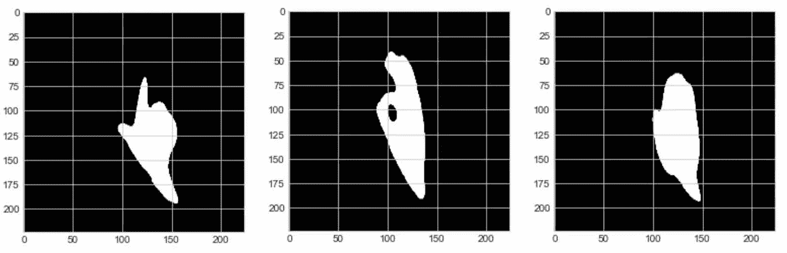

# 用 Python 中的 OpenCV 训练神经网络检测手势

> 原文：<https://towardsdatascience.com/training-a-neural-network-to-detect-gestures-with-opencv-in-python-e09b0a12bdf1?source=collection_archive---------4----------------------->

## 我如何用一个网络摄像头和一个梦想构建了类似微软 Kinect 的功能。

Gesture → Prediction → Action

*您可以在这里* *找到 Github 项目资源库中的* [*代码，或者在这里*](https://github.com/athena15/project_kojak) *查看* [*最终演示幻灯片。*](https://docs.google.com/presentation/d/1UY3uWE5sUjKRfV7u9DXqY0Cwk6sDNSalZoI2hbSD1o8/edit?usp=sharing)

## 灵感

想象一下，你正在为心爱的人举办生日聚会。每个人都玩得很开心，音乐在播放，派对很吵。突然，该吃生日蛋糕了！使用 Alexa 太大声了，而不是寻找你的手机或遥控器，如果你在谈话中简单地举起一只手，你的智能家居设备会识别这个手势，并关闭音乐，会怎么样？用同样的手势，你可以调暗灯光——正好可以看到生日蜡烛照亮生日男孩或女孩的脸。那不是很神奇吗？

## 背景

我对手势检测很好奇很久了。我记得当第一台微软 Kinect 问世时——我玩游戏、用手一挥就能控制屏幕，玩得非常开心。随着时间的推移，谷歌 Home 和亚马逊 Alexa 等设备的发布，手势检测似乎不再受到关注，而是转向了语音。尽管如此，我还是想知道，既然像脸书门户网站和亚马逊 Echo Show 这样的视频设备正在出现，它是否有可能经历一次复兴。考虑到这一点，我想看看是否有可能建立一个神经网络，它可以实时识别我的手势，并操作我的智能家居设备！

## 数据，和我早期的模型

我对这个想法很兴奋，并很快付诸实施，就像我从大炮中被射出来一样。我开始在[Kaggle.com](https://www.kaggle.com/benenharrington/hand-gesture-recognition-database-with-cnn)上使用手势识别数据库，并探索这些数据。它由 20，000 个带标签的手势组成，如下图所示。

Odd images, but labeled and plentiful.

当我读入图像时，我遇到的第一个问题是我的图像是黑白的。这意味着 NumPy 阵列只有一个通道，而不是三个通道(即，每个阵列的形状是(224，224，1))。因此，我无法将这些图像用于 VGG-16 预训练模型，因为该模型需要 RGB 3 通道图像。这是通过在图像列表上使用 np.stack，X_data:

一旦我克服了这个障碍，我就开始建立一个模型，使用一个训练测试分割，这个分割完全展示了 10 个人中的 2 个人的照片。在重新运行基于 VGG-16 架构构建的模型后，我的模型总体上获得了 0.74 的 F1 分数。这已经很不错了，平均来说，随机猜测 10 个类别的准确率只有 10%。

然而，训练模型从同质数据集中识别图像是一回事。训练它实时识别以前从未见过的图像是另一个问题。我试着调整照片的光线，使用深色背景——模仿模特训练过的照片。

我还尝试了图像增强——翻转、倾斜、旋转等等。虽然这些图像比以前做得更好，但我仍然有不可预测的——在我看来是不可接受的——结果。我有一种挥之不去的感觉，我需要重新思考这个问题，并想出一个创造性的方法来使这个项目工作。

***要点:在尽可能接近它在现实世界中可能看到的图像上训练你的模型。***

## 重新思考这个问题

我决定转向尝试新的东西。在我看来，训练数据的奇怪外观和我的模型在现实生活中可能看到的图像之间存在明显的脱节。我决定尝试建立自己的数据集。

我一直在使用 OpenCV，一个开源的计算机视觉库，我需要一个工程师的解决方案，从屏幕上抓取图像，然后调整图像的大小，并将其转换为我的模型可以理解的 NumPy 数组。我用来转换数据的方法如下:

简而言之，一旦你启动并运行相机，你就可以抓取帧，变换它，并从你的模型中得到一个预测:

让网络摄像头和我的模型之间的管道连接是一个巨大的成功。我开始思考什么是适合我的模型的理想图像。一个明显的障碍是很难将感兴趣的区域(在我们的例子中是一只手)从背景中分离出来。

## 提取手势

我采用的方法是任何玩过 Photoshop 的人都熟悉的——背景减除法。这是一件美好的事情！从本质上说，如果你在你的手放进去之前拍摄一张场景的照片，你可以创建一个“遮罩”，它将删除新图像中除了你的手以外的所有东西。

Background masking and binary image thresholding.

一旦我从我的图像中减去背景，我就使用二进制阈值来使目标手势完全为白色，而背景完全为黑色。我选择这种方法有两个原因:它使手的轮廓清晰明了，并且它使模型更容易在不同肤色的用户中推广。这就产生了我最终用来训练我的模型的“剪影”般的照片。

## 构建新数据集

既然我可以在图像中准确地检测到我的手，我决定尝试一些新的东西。我的旧模型没有很好地概括，我的最终目标是建立一个可以实时识别我的手势的模型——所以我决定建立自己的数据集！

我选择关注 5 个手势:

我有策略地选择了 4 个手势，它们也包含在 Kaggle 的数据集中，这样我可以在以后对照这些图像交叉验证我的模型。我还添加了和平手势，尽管这个手势在 Kaggle 数据集中没有类似的。

在这里，我通过设置我的网络摄像头来构建数据集，并在 OpenCV 中创建一个 click binding 来捕获和保存具有唯一文件名的图像。我试图改变框架中手势的位置和大小，这样我的模型会更健壮。很快，我就建立了一个包含 550 张剪影图片的数据集。是的，你没看错——我拍摄了 2700 多张照片。

## 培训新模型

然后我用 Keras & TensorFlow 构建了一个卷积神经网络。我从优秀的 VGG-16 预训练模型开始，并添加了 4 个密集层以及顶部的辍学层。

然后，我采取了不同寻常的步骤，选择在我之前尝试过的原始 Kaggle 数据集上交叉验证我的模型。这一点很关键——如果我的新模型不能推广到以前没有训练过的其他人的手的图像，那么它并不比我的原始模型好。

为了做到这一点，我对每个 Kaggle 图像应用了与应用于我的训练数据相同的变换——背景减除和二进制阈值处理。这给了他们一个我的模型所熟悉的相似的“外观”。

L, Okay, and Palm gestures from Kaggle data set after transformation.

## 结果

模特的表现超出了我的预期。它对测试集中的几乎每个手势都进行了正确的分类，最终得到了 98%的 F1 分数，以及 98%的精确度和准确度分数。这是个好消息！

然而，任何经验丰富的研究人员都知道，一个在实验室表现良好但在现实生活中表现不佳的模型价值不大。在我最初的模型上经历了同样的失败后，我谨慎乐观地认为这个模型将在实时手势上表现良好。

## 智能家居集成

在测试我的模型之前，我想添加另一个扭曲。我一直是一个智能家居爱好者，我的愿景一直是只用我的手势来控制我的 Sonos 和飞利浦 Hue 灯。为了方便地访问飞利浦 Hue 和 Sonos APIs，我分别使用了 [phue](https://github.com/studioimaginaire/phue) 和 [SoCo](https://github.com/SoCo/SoCo) 库。它们使用起来都非常简单，如下所示:

使用 SoCo 通过 web API 控制 Sonos 可以说更加容易:

然后，我为不同的手势创建了绑定，以便用我的智能家居设备做不同的事情:

当我最终实时测试我的模型时，我对结果非常满意。我的模型在大部分时间里准确地预测了我的手势，我能够用这些手势来控制灯光和音乐。观看下面的视频进行演示:

我希望你喜欢这个结果！感谢阅读。你可以在推特上找到我，这里是 T1，在 T2 的领英上找到我，这里是 T3。最近，我一直在为 Databricks 写内容，用简单的术语解释复杂的主题，就像[这个页面解释数据湖](https://databricks.com/discover/data-lakes/introduction)。最后，我定期给数据博客投稿。向前向上！