# 训练随机森林以识别恶性乳腺癌肿瘤

> 原文：<https://towardsdatascience.com/training-a-random-forest-to-identify-malignant-breast-cancer-tumors-49e8a69fc964?source=collection_archive---------5----------------------->

在 Sklearn Python 库中，有一组可以导入的示例数据集。在这些数据集中，有一个二元分类乳腺癌数据集，是从威斯康星州的观察中提取的。我选择为一个个人项目研究这个数据集，因为它提出了一个我认为有影响力和有趣的主题(也是练习我在数据科学方面的技能的好方法)——**我的目标是训练一个分类模型来识别恶性乳腺癌肿瘤，准确率为> 95%** 。数据集可以按如下方式导入:

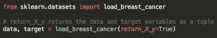

Importing the Data Set

# 构建用于比较的基线模型

在对数据集进行任何分析之前，**通常最好建立一个基线分类模型，该模型可以用作基准**来决定机器学习模型是否有效。为了建立这个基线模型，我观察了数据集中“恶性”(标记为 1)和“良性”(标记为 0)观察值的分布。根据这些分类类别中哪一个更有可能(或发生率更高)，我预测每个观察结果都属于更有可能的类别。下图显示了两个目标类别的分布情况:

Distribution of the Output Variable

从该图可以看出，大约有 350 个“恶性”观察值和大约 220 个“良性”观察值。因此，如果每个观察结果都被预测为恶性，就会创建一个大约 61%准确的模型**——这个简单的模型将被用作未来比较的基准。**

# **数据清理和预处理**

**在定义了简单的基线模型之后，我执行了一些快速的数据清理和观察，例如**检查空值**，**查看数据集中每个特性的数据类型**，以及**查看集合中观察值的总数**。在这种情况下，因为数据来自 Sklearn python 库中维护的示例集，所以不需要做太多的数据清理工作。如果数据集存储在 pandas 数据框中，可以使用以下命令检查每一列中 null 值的总数:**

**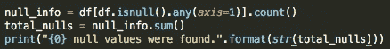**

**Checking for Null Values with Pandas**

**在这种情况下，**在数据集**中不存在空值，因此不需要替换/清除数据中的空值。此外，当检查每一列的数据类型时(使用熊猫数据框的**“dtypes”**属性)，发现所有数据都是类型**“float 64”**。因此，因为所有的特征都已经是数字的，所以不必进行数据清理来创建可以直接输入到机器学习模型中的特征。这个预处理阶段唯一有趣的发现是数据集只包含 569 个观察值。这是用于训练机器学习模型的非常少量的数据，并且可能在未来产生问题(即，模型的过度拟合或缺乏准确性)，因此在选择使用随机森林对数据进行分类时，这一点得到了充分的考虑(随机森林对过度拟合有很强的抵抗力，在此[阅读更多关于它们的信息](https://www.kdnuggets.com/2017/10/random-forests-explained.html))。**

# ****探索性数据分析(EDA)****

**为了更好地理解数据集以及哪些特征可能对机器学习模型有用，进行了简单的数据分析和可视化。对数据集进行的第一个查询是可视化数据集中所有不同特征的相关性矩阵(在熊猫数据帧上使用**“corr”**方法计算相关性)。该关联图**揭示了哪些特征为问题提供了新信息，哪些特征与集合中的其他特征**相似。相关矩阵被绘制为热图，这使得数据集中各要素之间的相关性变得易于查看。看起来如下:**

**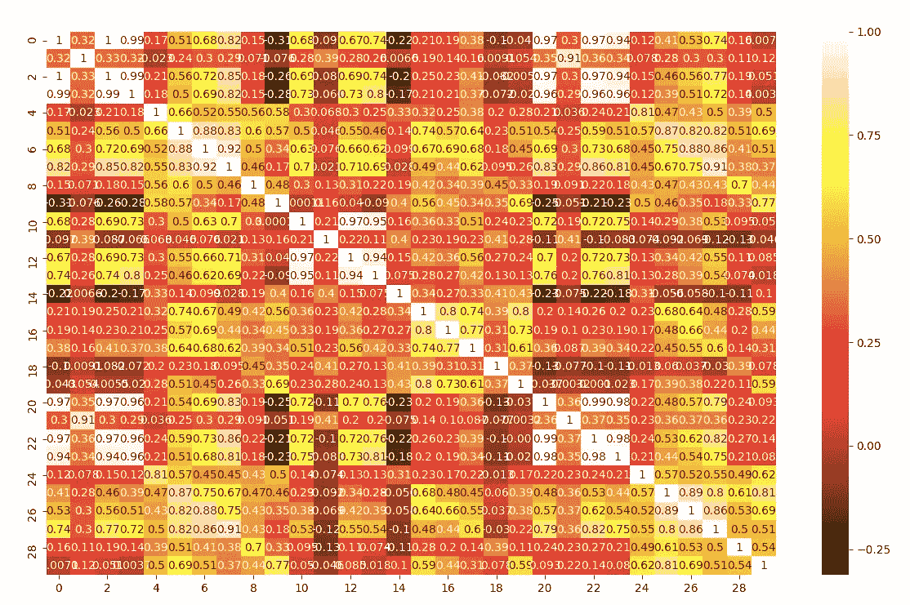**

**Correlation Heat Map for the Breast Cancer Data Set**

**在这种情况下，具有白色的特征对彼此高度相关，因此呈现出与问题相似的信息。例如，特征对(0，2)、(0，3)和(2，3)都高度相关。后来，当为机器学习模型选择特征时，考虑了这种高相关性，并且消除了与其他特征具有非常高相关性(> 98%)的特征。**

**除了可视化相关性，还对数据集中的每个特征进行了单变量分析和可视化。更具体地说，创建了特征值及其相关分类的散点图和每个目标类别的平均特征量图。单独查看每个特征的分布会使**更好地理解每个目标类别**之间哪些特征具有明显/可见的差异，从而揭示哪些特征在创建分类模型时会有用。这些可视化的一些结果如下:**

**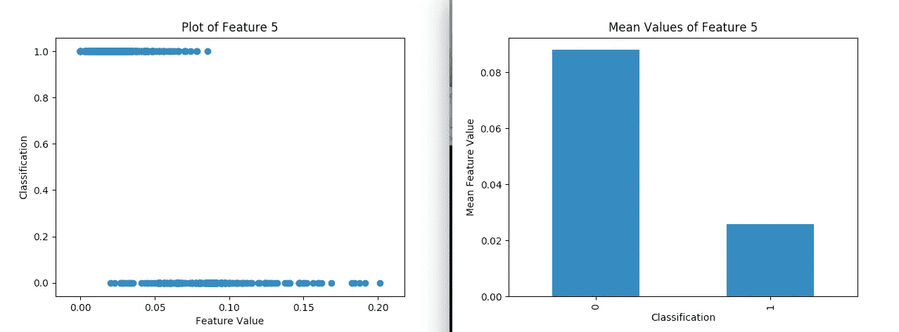**

**Univariate Visualization Ex. 1**

**在这种情况下，特征 5 显示了两个目标分类类别之间值的**明显差异，其中分类为“良性”(0)的观察值似乎比分类为“恶性”(1)的观察值更高。因此，该可视化暗示特征 5 可能是包括在最终分类模型中的有用特征。****

**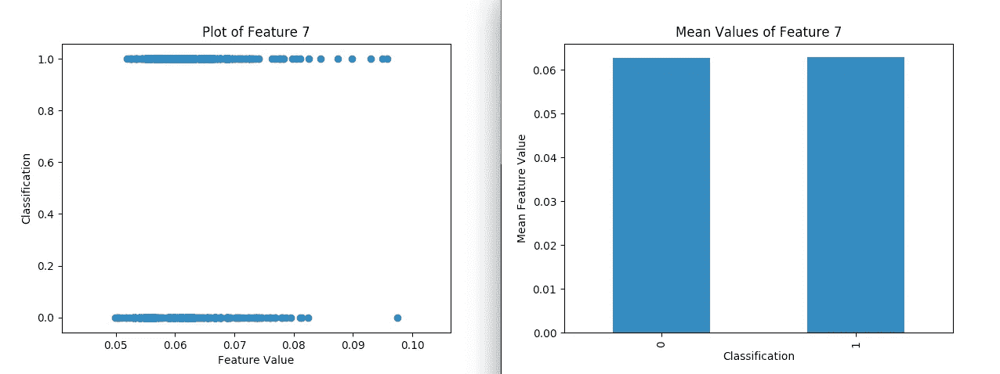**

**Univariate Visualization Ex. 2**

**在上面的可视化中，特征 7 似乎在两个目标类别之间具有**相似的特征——散点图上 1 和 0 大致相似的位置以及相似的平均特征值。因此，这种可视化暗示了特征 7 在确定准确分类时对我们的模型可能不是那么有用。****

**当决定在训练机器学习模型中使用哪个特征时，在两个目标分类类别之间表现出显著特征差异的特征被保留，而没有表现出这种差异的特征被去除。一旦排除了这些特性，就创建了一个聚合可视化(使用 seaborn python 库中的 **"pairplot"** 方法)来查看集合中最有趣的特性的整体属性。结果如下:**

**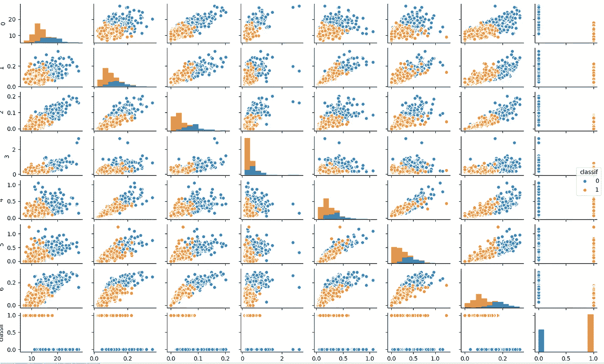**

**Pair Plot of Selected Features**

**上面的图由每个观察值的分类值着色。对于配对图中的每个特征，可以注意到，在大多数情况下，可以注意到两个目标分类类别之间的值的差异。**

# ****特征工程/选择****

**在数据集上执行简单的 EDA 之后，哪些特征将对机器学习模型有用变得非常清楚。因此，在选择/创建特征时没有做太多额外的工作。尝试用于自动特征选择的一些方法包括:**

*   **使用 Sklearn 创建多项式和交互式特征。**
*   **运行简单的随机森林，并根据要素对模型的重要性选择要素。**
*   **消除与集合中其他特征高度相关的特征。**

**创建多项式要素并没有提高随机森林模型的性能(精度实际上降低了)。然而，**使用随机森林的“feature_importances_”属性**过滤特征非常有用，并最终提高了最终模型的准确性。为了创建这样的过滤器，在现有特征集(不包括多项式特征)上训练默认随机森林，并且通过参考训练的随机森林的“feature_importances_”属性来确定每个特征的重要性。为重要性低的特征设置阈值**，重要性低于重要性阈值的所有特征都从数据集中删除**。测试了几个重要性阈值，以确定哪一个性能最好，结果如下:**

**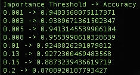**

**Feature Filtering on Different Importance Thresholds**

**从上面的报告中可以看出，最佳过滤阈值是 0.008，准确率为 95.5%(高于我最初的目标！).在特征工程的最后一步之后，工作开始建立最终模型。**

# **构建随机森林模型**

**对于这个实验，使用 Sklearn 随机森林分类器对数据进行分类。可以使用以下代码导入该模型并使其适合一组观察值:**

**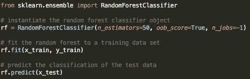**

**Example of Constructing a Random Forest Classifier**

**上面的代码从 Sklearn 库中导入随机森林，用 50 棵树的大小实例化它( **n_estimators** 是将被构造来形成随机森林对象的决策树的数量)，并使随机森林适合一组测试数据。在这个实验中，使用 Sklearn.model_selection 中的 **"train_test_split"** 方法将数据分成训练集和测试集，该方法根据所需的比率将数据分成训练组和测试组。当随机森林使用分区的训练和测试数据进行训练时，结果如下:**

**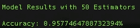**

**Random Forest Accuracy**

**从上面可以看出，50 棵决策树的随机森林在数据集上获得了 95.77% 的**准确率！这超过了该实验最初设定的 95%的准确率目标。然而，在实验结束之前，对随机森林的不同数量的估计量进行了测试，以查看模型是否可以变得更加精确。此外，最高性能随机森林的**精度和召回**被观察以获得关于模型的整体质量的另一个度量。****

# **测试不同的随机森林大小**

**选择了 25、50、75、100、125 和 150 的随机森林大小，并测试了每个模型的准确性，以确定哪种大小的随机森林最有效。结果如下:**

**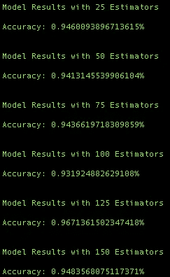**

**Accuracy with Different Forest Sizes**

**在上面的报告中，可以看到最准确的森林大小是 125，准确率为 96.7%！这样的准确率远远高于 95%的最初目标，因此**该模型被选为表现最好的**，然后观察该模型的精确度和召回率以评估其整体质量。**

# **精确度和召回率**

**因为原始数据集有些不平衡(目标分类类别不是均匀分布的)，**除了准确性**之外，对我的模型的质量进行度量是一种很好的做法——具有不平衡目标变量分布的模型可能会获得较高的准确性，但实际上并没有很好地拟合数据。因此，决定观察每个目标分类类别的模型的**精度**和**召回**。如果你对这些术语不熟悉，我推荐你阅读[这篇文章](http://scikit-learn.org/stable/auto_examples/model_selection/plot_precision_recall.html)来更好地理解它们。与准确度一样，精确度和召回率也是评估机器学习模型有效性的一个指标。使用以下代码可以观察随机森林模型的精度和召回率:**

**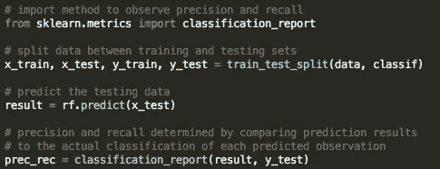**

**Code for Finding Precision and Recall**

**使用上述代码，评估了 125 估计量随机森林模型的精度和召回率，以获得以下结果:**

**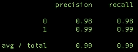**

**Precision/Recall Score**

**该模型平均获得了 **99%的精确度和**99%的召回率，这是一个非常好的分数(1.0 是这两个分数的最高分)。观察到这一指标后，很明显随机森林分类模型与数据吻合得很好，准确率超过 96%，精确度/召回分数为 99% 。**

# **结论**

**在这篇文章中，我使用 Sklearn 乳腺癌数据集建立了一个随机森林分类模型，将乳腺癌肿瘤分为“恶性”或“良性”。我最初的目标是获得一个至少 95%准确的模型。在对简单的 EDA 进行预成型以确定数据集中最重要的特征，分析各种选定特征的特征重要性，并测试不同大小的随机森林后，我得到了一个最终的模型，其准确率为 **96.7%** ！**

**如果你想看看这个项目的源代码，你可以看看为它创建的 [*GitHub 库*](https://github.com/wolfecameron/MachineLearning/blob/master/breast_cancer_classification.py) ！如果你有任何问题或者想关注我未来的帖子，请随时评论这篇帖子或者通过 [*LinkedIn*](https://www.linkedin.com/in/cameron-wolfe-9b2511144/) 与我联系。 ***非常感谢您的阅读！*****