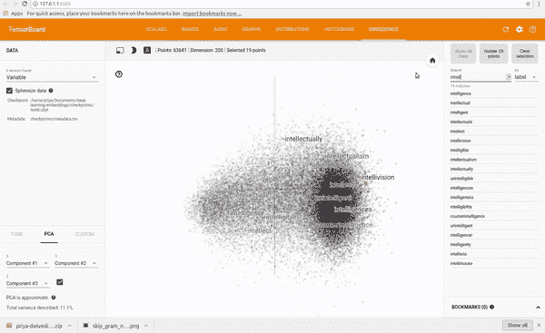

# 训练和可视化单词向量

> 原文：<https://towardsdatascience.com/training-and-visualising-word-vectors-2f946c6430f8?source=collection_archive---------0----------------------->

*用数据做酷事！*

在本教程中，我想展示如何在 tensorflow 中实现 skip gram 模型，为您正在处理的任何文本生成单词向量，然后使用 tensorboard 将它们可视化。我发现这个练习非常有用，有助于我理解 skip gram 模型是如何工作的，以及在你将它们用于 CNN 或 RNNs 之前，感受一下这些向量捕捉到的关于你的文本的关系。

我在 text8 数据集上训练了一个 skip gram 模型，该数据集是英文维基百科文章的集合。我用 Tensorboard 来可视化嵌入。Tensorboard 通过使用 PCA 选择 3 个主轴来投影数据，可以让您看到整个单词云。超级爽！你可以输入任何单词，它会显示它的邻居。你也可以分离出最接近它的 101 个点。

参见下面的剪辑。



你可以在我的 [Github](https://github.com/priya-dwivedi/Deep-Learning/blob/master/word2vec_skipgram/Skip-Grams-Solution.ipynb) repo 上找到完整的代码。

为了可视化训练，我还查看了与一组随机单词最接近的预测单词。在第一次迭代中，最接近的预测字看起来非常任意，这是有意义的，因为所有的字向量都是随机初始化的

```
**Nearest to cost:** sensationalism, adversity, ldp, durians, hennepin, expound, skylark, wolfowitz,

**Nearest to engine:** vdash, alloys, fsb, seafaring, tundra, frot, arsenic, invalidate,

**Nearest to construction:** dolphins, camels, quantifier, hellenes, accents, contemporary, colm, cyprian,

**Nearest to http:** internally, chaffee, avoid, oilers, mystic, chappell, vascones, cruciger,
```

训练结束时，该模型在寻找单词之间的关系方面变得更好。

```
**Nearest to cost:** expense, expensive, purchase, technologies, inconsistent, part, dollars, commercial,

**Nearest to engine:** engines, combustion, piston, stroke, exhaust, cylinder, jet, thrust,

**Nearest to construction:** completed, constructed, bridge, tourism, built, materials, building, designed,

**Nearest to http:** www, htm, com, edu, html, org, php, ac,
```

## **Word2Vec 和 Skip Gram 型号**

创建单词向量是这样的过程，即获取大量文本并为每个单词创建向量，使得在语料库中共享共同上下文的单词在向量空间中彼此非常接近。

这些单词向量可以非常好地捕捉单词之间的上下文关系(例如，黑色、白色和红色的向量会很接近)，并且我们使用这些向量代替原始单词来执行 NLP 任务(如文本分类或新文本生成)会获得更好的性能。

生成这些词向量有两种主要的模型——连续词袋(CBOW)和跳格模型。CBOW 模型试图预测给定上下文单词的中心单词，而 skip gram 模型试图预测给定中心单词的上下文单词。一个简单的例子是:

CBOW:猫吃了 _____。填空，在这种情况下，是“食物”。

跳过-gram: ___ ___ __ 食物。完成单词的上下文。在这种情况下，是“猫吃了”

如果你对这两种方法的更详细的比较感兴趣，那么请看这个[链接](https://iksinc.wordpress.com/tag/continuous-bag-of-words-cbow/)。

各种各样的论文已经发现 Skip gram 模型可以产生更好的单词向量，所以我一直致力于实现它

## **在 Tensorflow 中实现 Skip Gram 模型**

这里我将列出构建模型的主要步骤。请看我的 [Github](https://github.com/priya-dwivedi/Deep-Learning/blob/master/word2vec_skipgram/Skip-Grams-Solution.ipynb) 上的详细实现

1.  预处理数据

我们首先清理我们的数据。删除所有标点符号、数字，将文本拆分成单个单词。因为程序处理整数比处理单词好得多，所以我们通过创建一个 vocab to int 字典将每个单词映射到一个 int。代码如下。

```
counts = collections.Counter(words)
vocab = sorted(counts, key=counts.get, reverse=True)
vocab_to_int = {word: ii for ii, word in enumerate(vocab, 0)}
```

2.二次抽样

经常出现的单词，如“the”、“of”和“for ”,不会为附近的单词提供太多的上下文信息。如果我们丢弃其中一些，我们可以从数据中去除一些噪声，反过来得到更快的训练和更好的表示。这个过程被[米科洛夫](https://arxiv.org/pdf/1301.3781.pdf)称为子采样。对于训练集中的每个单词，我们将根据其频率的倒数给出的概率将其丢弃。

3.创建输入和目标

skip gram 的输入是每个单词(编码为 int ),目标是该窗口周围的单词。Mikolov 等人发现，如果这个窗口的大小是可变的，并且更靠近中心单词的单词被更频繁地采样，那么性能会更好。

“由于距离较远的单词通常比距离较近的单词与当前单词的关系更小，因此我们在训练示例中通过从这些单词中抽取较少的样本来降低距离较远的单词的权重……如果我们选择窗口大小=5，则对于每个训练单词，我们将在 1 和窗口大小之间随机选择一个数字 R，然后使用当前单词的历史中的 R 个单词和未来中的 R 个单词作为正确的标签。”

```
 R = np.random.randint(1, window_size+1)
 start = idx — R if (idx — R) > 0 else 0
 stop = idx + R
 target_words = set(words[start:idx] + words[idx+1:stop+1])
```

4.构建模型

从 [Chris McCormick 的博客](http://mccormickml.com/2016/04/19/word2vec-tutorial-the-skip-gram-model/)中，我们可以看到我们将要建立的网络的大致结构。


我们将把像“蚂蚁”这样的输入单词表示为一个热向量。这个向量将有 10，000 个分量(我们词汇表中的每个单词一个分量)，我们将在对应于单词“ants”的位置放置一个“1”，在所有其他位置放置 0。

网络的输出是一个单一的向量(也有 10，000 个分量),它包含我们词汇表中的每个单词，随机选择的邻近单词是该词汇表单词的概率。

在训练结束时，隐藏层将具有训练过的单词向量。隐藏层的大小对应于我们的向量的维数。在上面的例子中，每个单词都有一个长度为 300 的向量。

您可能已经注意到，skip-gram 神经网络包含大量的权重……对于我们有 300 个特征和 10，000 个单词的 vocab 的示例，隐藏层和输出层各有 3M 个权重！在大型数据集上进行这种训练是不允许的，因此 word2vec 的作者引入了一些调整来使训练可行。你可以在[链接](http://mccormickml.com/2017/01/11/word2vec-tutorial-part-2-negative-sampling/)中了解更多信息。 [Github](https://github.com/priya-dwivedi/Deep-Learning/blob/master/word2vec_skipgram/Skip-Grams-Solution.ipynb) 上的代码实现这些来加速训练。

5.使用 Tensorboard 可视化

您可以使用 Tensorboard 中的嵌入投影仪来可视化嵌入。为此，您需要做几件事:

*   在培训结束时，将您的模型保存在检查点目录中
*   创建一个 metadata.tsv 文件，将每个 int 映射回 word，以便 Tensorboard 显示单词而不是 int。将这个 tsv 文件保存在同一个检查点目录中
*   运行以下代码:

```
from tensorflow.contrib.tensorboard.plugins import projector
summary_writer = tf.summary.FileWriter(‘checkpoints’, sess.graph)
config = projector.ProjectorConfig()
embedding_conf = config.embeddings.add()
# embedding_conf.tensor_name = ‘embedding:0’
embedding_conf.metadata_path = os.path.join(‘checkpoints’, ‘metadata.tsv’)
projector.visualize_embeddings(summary_writer, config)
```

*   通过将 tensorboard 指向检查点目录来打开它

就是这样！

给我一个❤️，如果你喜欢这个职位:)希望你拉代码，并尝试自己。如果你对这个话题有其他想法，请在这篇文章上发表评论，或者给我发邮件，地址是 priya.toronto3@gmail.com

**其他著述**:[http://deeplearninganalytics.org/blog](http://deeplearninganalytics.org/blog)

PS:我有自己的深度学习咨询公司，喜欢研究有趣的问题。我已经帮助几家初创公司部署了基于人工智能的创新解决方案。请到 http://deeplearninganalytics.org/[来看看我们。](http://deeplearninganalytics.org/)

如果你有一个我们可以合作的项目，请通过我的网站或 priya.toronto3@gmail.com 联系我

**参考文献:**

*   [Udacity](https://www.udacity.com/) 深度学习纳米度