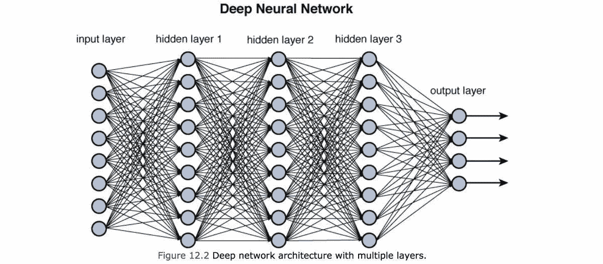
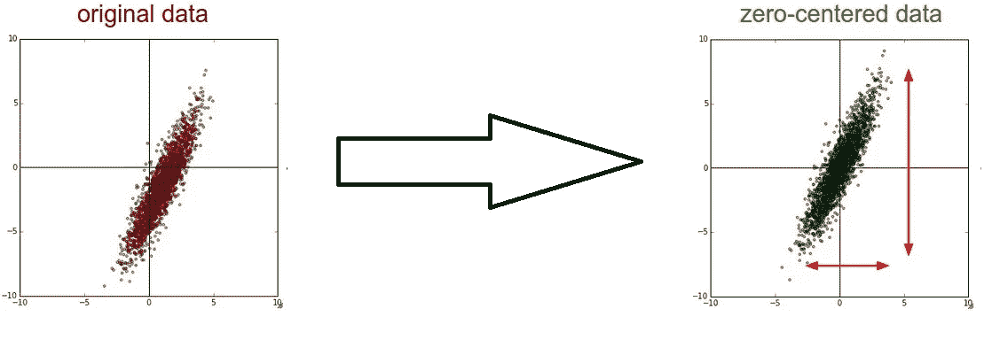
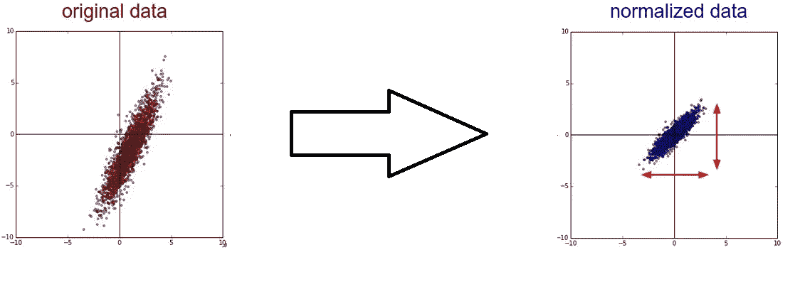
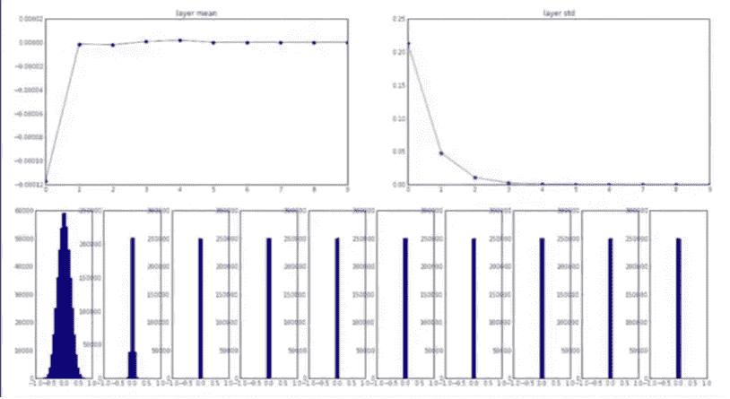
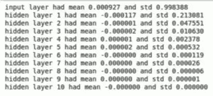
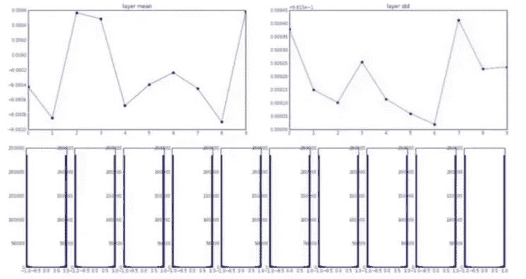
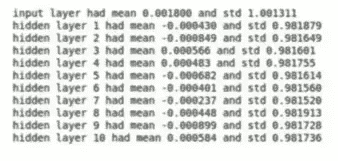
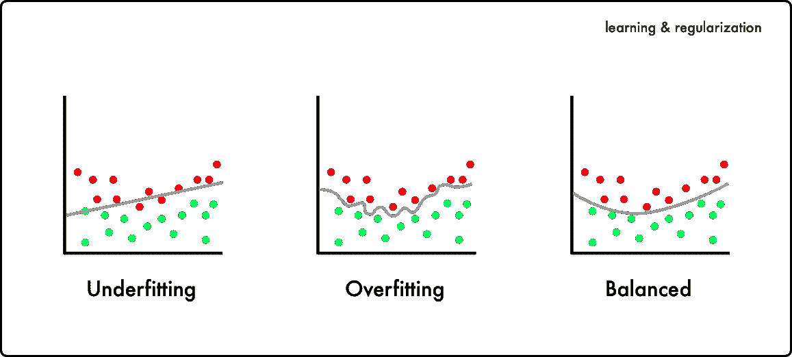
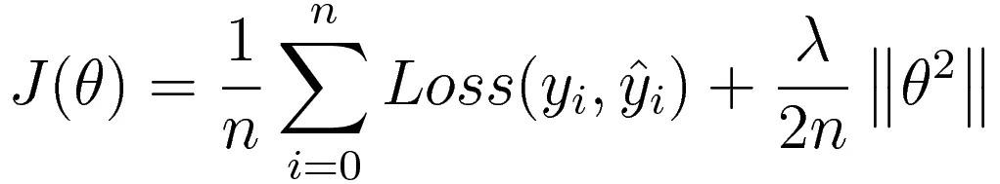
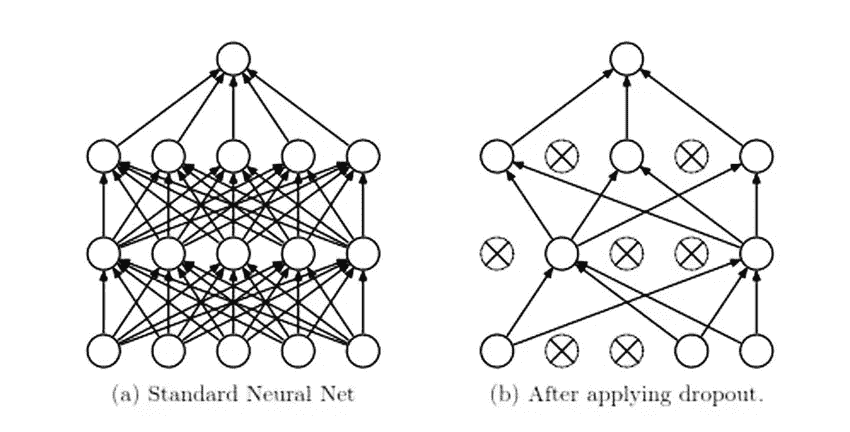

# 训练深度神经网络

> 原文：<https://towardsdatascience.com/training-deep-neural-networks-9fdb1964b964?source=collection_archive---------3----------------------->

## 深度学习配件



深度神经网络是计算机视觉和语音识别领域的关键突破。在过去的十年里，深度网络使机器能够识别图像、语音，甚至以人类几乎不可能的精度玩游戏。为了达到高水平的准确性，需要大量的数据和计算能力来训练这些网络。然而，尽管涉及到计算的复杂性，我们可以遵循某些准则来减少训练的时间和提高模型的准确性。在本文中，我们将介绍其中的一些技术。

## 数据预处理

数据预处理的重要性只能通过这样一个事实来强调，即您的神经网络仅与用于训练它的输入数据一样好。如果重要的数据输入丢失，神经网络可能无法达到所需的精确度。另一方面，如果数据没有被预先处理，它会影响网络的准确性和性能。

**均值减法(零居中)**

这是从每个数据点中减去平均值使其以零为中心的过程。考虑神经元(单元)输入全为正或全为负的情况。在这种情况下，反向传播期间计算的梯度将是正的或负的(与输入的符号相同)。因此参数更新只限于特定方向，这反过来会使收敛效率低下。



Mean subtraction (Zero centering the data)

**数据正常化**

*归一化*是指将数据归一化，使其在所有维度上具有相同的尺度。通常的方法是将每个维度的数据除以其标准偏差。然而，只有当你有理由相信*不同的输入特征具有不同的尺度，但它们对学习算法*具有同等的重要性时，这才有意义。



Normalization of data across both dimensions

## 参数初始化

*深度神经网络*对数百万或数十亿的参数并不陌生。这些参数的初始化方式可以决定我们的学习算法收敛的速度以及最终的精确度。最直接的方法是将它们全部初始化为零。然而，如果我们将层的权重初始化为全零，则对于层中的每个单元，计算的梯度将是相同的，因此对于所有单元，权重的更新将是相同的。因此，该层与单个[逻辑回归](/logistic-regression-detailed-overview-46c4da4303bc)单元一样好。

当然，我们可以通过用一些小随机数初始化权重来做得更好。不是吗？好吧，让我们用一个 10 层深度神经网络来分析这个假设的有效性，每个神经网络由 500 个单元组成，并使用双曲正切激活函数。*【在继续下一步之前，请注意 tanh 激活】。*


Tanh activation function

*左边是 tanh 激活函数的图。随着我们继续进行，有几个要点需要记住:-*

*   *该激活以零为中心。*
*   *输入为大正数或大负数时饱和。*

首先，我们从具有零均值和 1 e-2 标准偏差的标准高斯初始化所有权重。

```
 **W = 0.01 * np.random.randn(fan_in, fan_out)**
```

不幸的是，这仅适用于小型网络。为了了解它对更深层次的网络造成了什么问题，用不同的参数生成了图。随着我们深入网络，这些图描绘了每一层的平均值、标准偏差和激活度。



Mean, standard deviation and activation across layers



注意，平均值总是在零附近，这很明显，因为我们使用的是以零为中心的非线性。然而，随着我们深入网络，标准差逐渐缩小，直到它崩溃为零。这也是显而易见的，因为我们在每一层用非常小的权重乘以输入。因此，计算的梯度也将非常小，因此对权重的更新将可以忽略。

嗯不太好！！！接下来让我们尝试用非常大的数字初始化权重。为此，让我们从均值和标准差为零的标准高斯样本中抽取权重作为 **1.0** (而不是 **0.01** )。

```
 **W = 1.0 * np.random.randn(fan_in, fan_out)**
```

下图显示了所有层的平均值、标准偏差和激活度。



Mean, standard deviation and activation across layers



请注意，每一层的激活要么接近 1，要么接近-1，因为我们将输入乘以非常大的权重，然后将其馈送到 *tanh 非线性*(挤压到+1 到-1 的范围)。因此，当 tanh 在这些区域饱和时，计算的梯度也将非常接近于零(导数为零)。最后，对重量的更新也几乎可以忽略不计。

实际上， [Xavier 初始化](https://medium.com/@shiyan/xavier-initialization-and-batch-normalization-my-understanding-b5b91268c25c)用于初始化所有层的权重。Xavier 初始化背后的动机是以这样一种方式初始化权重，使得它们不会在 tanh 激活的饱和状态中结束，即使用不太小也不太大的值进行初始化。为了实现这一点，我们在从标准高斯随机采样的同时，根据输入的数量进行缩放。

```
**W = 1.0 * np.random.randn(fan_in, fan_out) / np.sqrt(fan_in)**
```

然而，这在假设 tanh 用于激活的情况下工作得很好。如果有其他激活功能，例如 ReLu，这肯定会中断。毫无疑问，正确的初始化仍然是一个活跃的研究领域。

## 批量标准化

这与我们到目前为止所讨论的内容有些关联。请记住，我们在将输入输入到我们的网络之前对其进行了标准化。这样做的一个原因是考虑到网络中由*协方差偏移引起的不稳定性。*

> 它解释了为什么即使在学习了从一些输入到输出的映射之后，我们还需要重新训练学习算法，以便在输入的数据分布改变的情况下学习从相同的输入到输出的映射。

然而，这个问题并没有在这里得到解决，因为数据分布在更深的层中也可能发生变化。每一层的激活会导致不同的数据分布。因此，为了增加深度神经网络的稳定性，我们需要通过减去平均值并除以标准偏差来标准化每一层的数据*。[有一篇文章](/batch-normalization-in-neural-networks-1ac91516821c)对此进行了深入的解释。*

## 正规化

训练深度神经网络最常见的问题之一是*过拟合。*当你的网络在训练数据上表现出色，但在测试数据上表现不佳时，你就会意识到过度拟合。这是因为我们的学习算法试图拟合输入中的每个数据点，即使它们代表一些随机采样的噪声，如下图所示。



[Source](https://www.google.com/url?sa=i&rct=j&q=&esrc=s&source=images&cd=&cad=rja&uact=8&ved=2ahUKEwiu2L7c7a_dAhUG148KHUIhBjcQjB16BAgBEAQ&url=https%3A%2F%2Fmedium.freecodecamp.org%2Fdeep-learning-for-developers-tools-you-can-use-to-code-neural-networks-on-day-1-34c4435ae6b&psig=AOvVaw0zkZFmgiIZ1BtRgFgYTcDD&ust=1536648985107959)

*正则化*通过惩罚网络的权重来帮助避免过度拟合。为了进一步解释，考虑为神经网络上的分类任务定义的损失函数如下:



Loss function

```
**J(theta) - Overall objective function to minimize.
n        - Number of training samples.
y(i)     - Actual label for ith training sample.
y_hat(i) - Predicted label for ith training sample.
Loss     - Cross entropy loss.
Theta    - Weights of neural network.
Lambda   - Regularization parameter.**
```

请注意，*正则化参数* (lambda)如何用于控制权重对最终目标函数的影响。因此，在λ取非常大的值的情况下，网络的权重应该接近于零，以便最小化目标函数。但是，当我们让权重崩溃为零时，我们会抵消层中许多单元的影响，因此网络并不比具有几个逻辑回归单元的单个线性分类器好。出乎意料的是，这将把我们扔进所谓的欠拟合状态，这并不比过拟合好多少。显然，我们必须非常小心地选择λ的值，以便最终我们的模型落入平衡类别(图中的第三个图)。

## 辍学正规化

除了我们所讨论的，还有一种更强大的技术来减少深度神经网络中的过拟合，称为*退出正则化*。

> 关键思想是在训练网络时随机丢弃单元，以便我们在每次迭代中使用更小的神经网络。丢弃一个单元等同于在向前传播或向后传播期间忽略那些单元。在某种意义上，这阻止了网络适应一些特定的特征集。



[Source](https://www.google.com/url?sa=i&rct=j&q=&esrc=s&source=images&cd=&cad=rja&uact=8&ved=2ahUKEwj2-6regrDdAhXKtY8KHQ5TCjcQjB16BAgBEAQ&url=https%3A%2F%2Fwww.researchgate.net%2Ffigure%2FDropout-Neural-Net-Model-14_fig1_308916211&psig=AOvVaw2fUW3-YrCEO4K0NcnUO2KQ&ust=1536654624593452)

在每次迭代中，我们会从网络中随机删除一些单元。因此，我们强迫每个单位不要依赖(不要给高权重)前一层的任何特定单位，因为它们中的任何一个都可能随机爆炸。这种分散权重的方式最终会缩小单个单元级别的权重，类似于我们在 L 2 正则化中所讨论的。

*大部分内容可以归功于*

[](http://cs231n.stanford.edu/) [## 斯坦福大学 CS231n:用于视觉识别的卷积神经网络

### 计算机视觉在我们的社会中已经变得无处不在，在搜索、图像理解、应用程序、地图绘制…

cs231n.stanford.edu](http://cs231n.stanford.edu/) 

*请通过您的评论让我知道文章中需要的任何修改/改进。*