# 使用谷歌合作实验室训练甘斯！

> 原文：<https://towardsdatascience.com/training-gans-using-google-colaboratory-f91d4e6f61fe?source=collection_archive---------5----------------------->

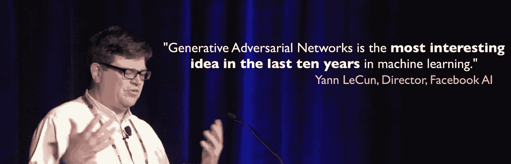

在我们开始之前，我只想让读者明白，这篇文章旨在做两件事:

1.  Google Colab 入门(及其免费的 K80 GPUs😛)
2.  训练一个生成性的对抗网络(即使你是深度学习的新手或不熟悉，也没关系，只要享受输出就好了……哦，孩子😈)

现在，你已经知道的*是什么，让我们直接进入主题:*

# **什么是谷歌联合实验室？**

如果你的电脑中没有足够好的 GPU 或 CPU，那么现在合作实验室是你最好的选择。

Colaboratory 是 Google 的免费 Jupyter 笔记本环境，不需要设置，完全在云中运行。通常缩写为“ *Colab”，*这是目前可用的最佳选择。它完全免费使用，并且已经安装了许多 Python 库和包。它还在笔记本本身提供了一个终端接口，你可以通过 *pip* 安装任何其他的库。

Colab 由强大的 K80 GPUs 支持，也支持本地运行时。这使得它比 Paperspace 或 AWS 等任何其他云平台都更好。

所以现在就去拿你的 Google Colab 笔记本吧！😸

 [## 谷歌联合实验室

### 编辑描述

colab.research.google.com](https://colab.research.google.com/) 

# 什么是‘生成性对抗网络’？

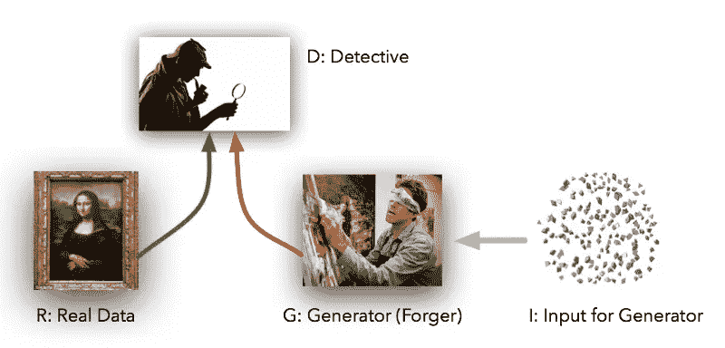

生成对抗网络(GANs)是深度学习中的下一个大事件。顾名思义，GAN 是各种深度学习模型的组合( *s* )，这些深度学习模型试图相互竞争，以满足任何深度学习项目中最基本的需求: ***生成*** ***更多数据以在*上训练😛**。

在这里，我们将训练一个由两个模型组成的 GAN:

1.  发电机。(它将试图从现有数据中生成*伪造数据*，并最终试图欺骗侦探，使其相信这是*真实数据*)
2.  鉴别器。(这将是我们的侦探😃试图找出生成器生成的伪造数据)

这两个模型相互竞争，将会给我们最好的可能的 ***新的*** 和 ***看不到的*** 数据。

如果您对深度学习更感兴趣，并且需要关于什么是 GAN 的更多细节，您可以稍后关注这篇文章:

 [## 什么是生成式对手网络？

### 从无到有创造一些东西是最伟大的感觉之一，...简直是天堂。

medium.com](https://medium.com/@jonathan_hui/gan-whats-generative-adversarial-networks-and-its-application-f39ed278ef09) 

# 我们自己培养一个甘吧！

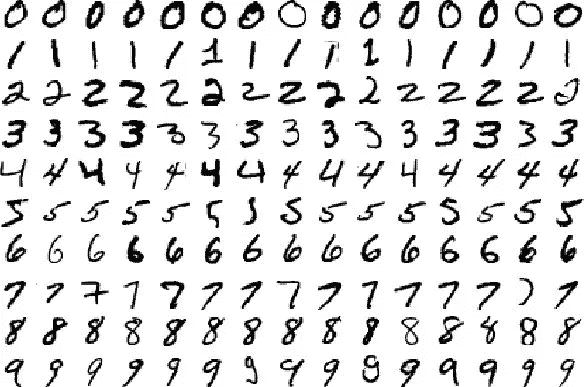

从现在开始，我们的讨论将遵循我的 Colab 笔记本的内容，您可以在这里找到:

 [## 谷歌联合实验室

### 编辑描述

colab.research.google.com](https://colab.research.google.com/github/rajaswa/Google_Collaboratory_Projects/blob/master/Digit_Generation_by_GAN.ipynb) 

这个笔记本已经实现了所有代码，并且已经运行过一次。您可以使用自己的笔记本从头开始，也可以一步一步地运行笔记本中的单元。

## #第一步:

Google Colab 没有这个项目的一些依赖项。所以我们将使用 colab 中的终端接口通过 *pip* 安装它们。(运行前三个单元格)

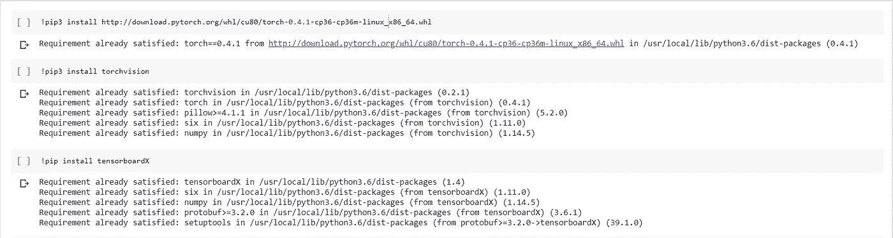

Installing Pytorch, torchvision and tensorboardX via pip (run first three cells to install them)

只是为了确保您确实从 Colab 获得了 GPU 支持，运行笔记本中的最后一个单元格(上面写着: *torch.cuda.is_available。*如果它返回一个 ***假*** 值，那么从顶部菜单改变运行时设置

## #第二步:

接下来，让我们导入所有需要的库并创建一个 logger 类，它将帮助我们监控我们的训练进度。(这并不重要，如果您没有完全理解 logger 类中正在做什么也没关系)

## #第三步:

我们将在这里使用的数据集是 MNIST 手写数字图像数据集。因此，让我们创建数据集类，下载数据集并初始化数据加载器，数据加载器将迭代地向模型提供数据。

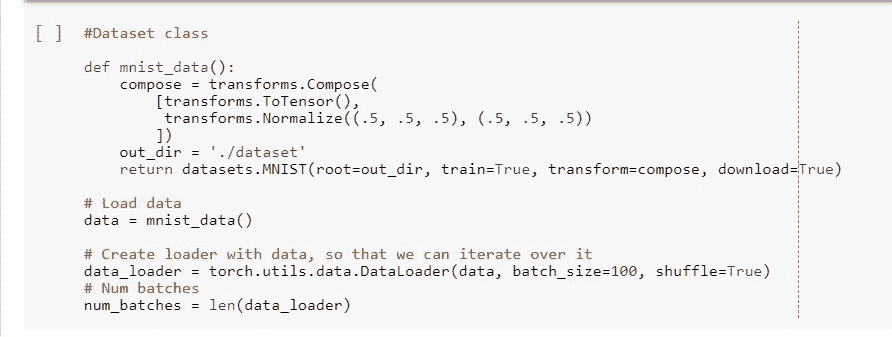

## #第四步:

现在，让我们创建生成器和鉴别器模型。这些将是 3 层深度神经网络，在每个隐藏层中具有顺序->线性->泄漏 ReLU 函数。

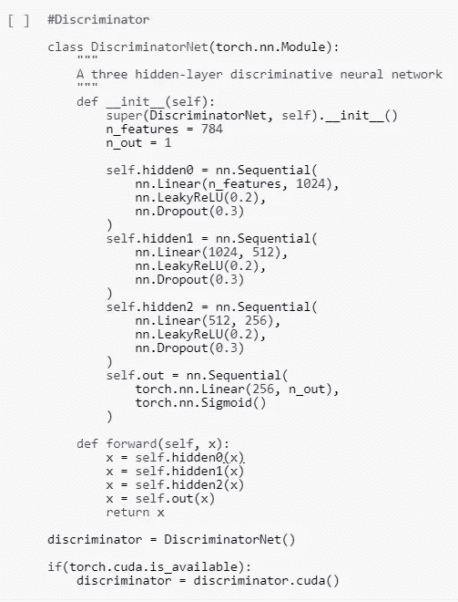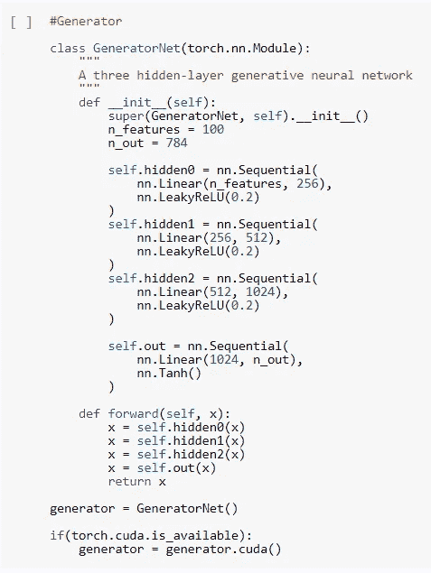

## #第五步:

接下来，让我们创建噪声采样器(我们将馈送给生成器)，初始化优化器，初始化损失函数(我们使用 BCE 损失进行生成器和鉴别器之间的最小-最大对抗游戏)。我们还将定义一些函数，这些函数将在以后帮助我们定位或标记真假图像。

然后，让我们为生成器和鉴别器模型定义训练函数。

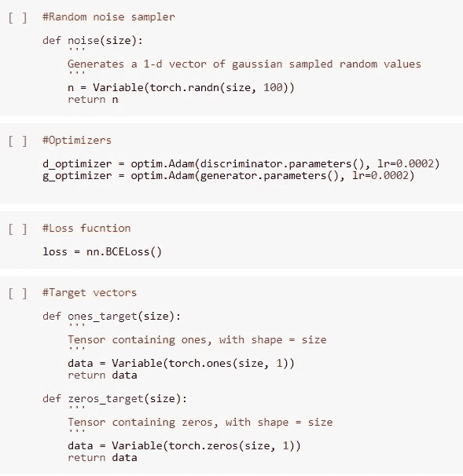

## #第六步:

最后，让我们交叉手指，开始训练吧！😃

*注意:众所周知，Colab 在 PIL 模块方面存在一些问题。如果出现任何与 PIL 相关的错误，只需重启内核，并使用顶部菜单中的运行时选项重新运行所有单元。*

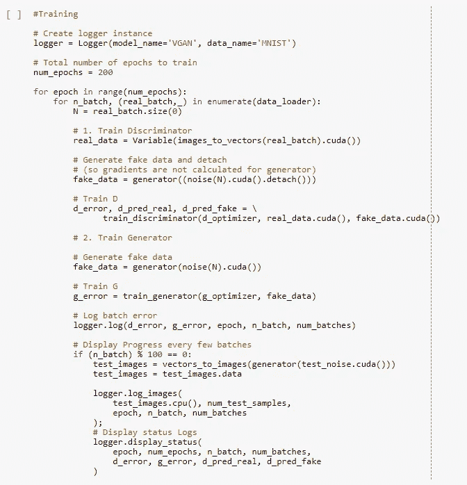

在这里，我们应该在 Colab 上训练 200 个纪元，大约需要 1.5-2 小时。笔记本已经训练了 139 个纪元，我们可以清楚地看到它在短短的 139 个纪元中提供了什么输出。你可以前进，训练它完成 200 个历元，以得到完美书写的数字。

## #输出:

最初，输出几乎都是有噪声的图像，但是几个时期之后，你会看到模型开始学习手写数字的模式:(从左到右，学习的进度)

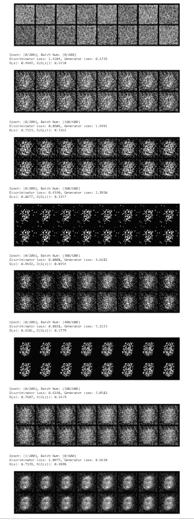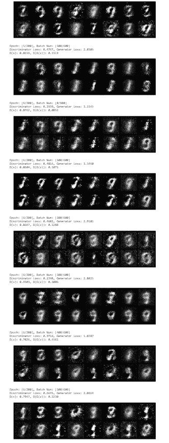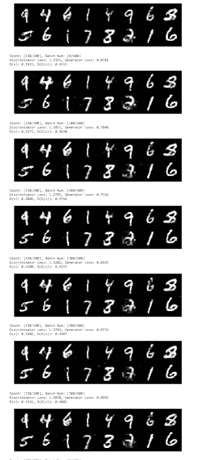

# 那么，我们实际上取得了什么呢？

到目前为止，我们已经看到了如何轻松地使用 Google Colaboratory，以及如何使用 Colaboratory 的 GPU 支持来实现基本的 GAN。我希望这个小项目已经让你有足够的信心在 Colab 笔记本上编写代码、安装外部库、下载数据等。

## 几个小时的训练有什么结果？

正如我们可以在训练单元的输出中看到的，通过训练这个 GAN，我们得到了全新的手写图像。这里要注意的最重要的一点是，这些新形成的图像是 ***而不是从实际数据集中复制的*** (正如我们的侦探，鉴别者所确保的)。

相反，它们是由生成器模型生成的*原始*图像。所以，这些是我们甘*培训前*从未见过的新图像。😏**

## **所有这些与人工智能有一点点联系吗？无论如何，生成模型有什么特别之处吗？**

****

**为了通俗地提出这一点，让我们通过一个例子来看这个…..**

**既然我们在这里使用了手写数字数据，让我们考虑这样一种情况:你希望你的人工智能尽可能有效地读取、识别和正确分类人类手写数字*。为了实现这一点，你需要你的模型事先查看尽可能多的手写数字，也就是尽可能多的不同书写风格的手写数字。那么，你想如何获得更多的这些原始手写数字图像呢？是通过*一个人一个人地跑，让他们都写下所有的数字，最终手动收集成千上万的图像*还是通过*让 GAN 在几个小时内为你生成原始图像*？😏***

*你可以想象，这是一个非常简单的例子，有一个深度学习的数据集😛对于庞大而复杂的数据，生成模型的优势被进一步放大。*

* [## GAN——GAN 的一些酷应用。

### 在 GAN 开发的最初几年，我们取得了令人瞩目的进展。再也没有邮票大小的面部照片了…

medium.com](https://medium.com/@jonathan_hui/gan-some-cool-applications-of-gans-4c9ecca35900)* 

*我希望这对你来说是一次有趣的经历。如果你还没有开始深度学习，我相信这本书已经让你渴望并有动力开始你的人工智能之旅，如果你还没有使用 Google Colab，我相信你现在会自信地开始使用它！😃*

**干杯！**

**快乐编码！**

*如果你觉得这很有趣，你可以联系我，在这里找到我在 Github 上的其他作品。*

*你可以在 LinkedIn [这里](https://www.linkedin.com/in/rajaswa-patil/)和我联系。*