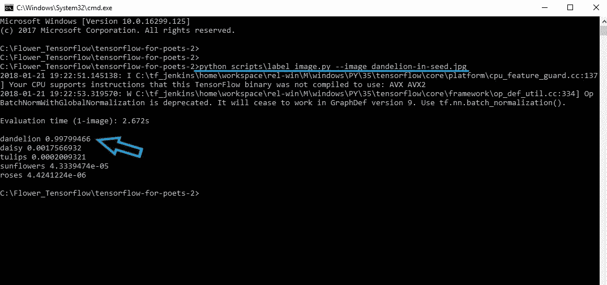
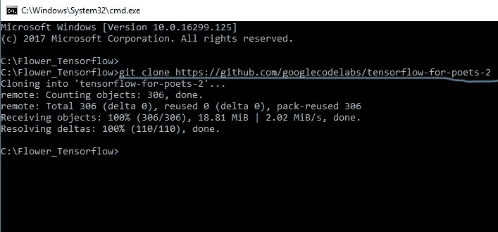
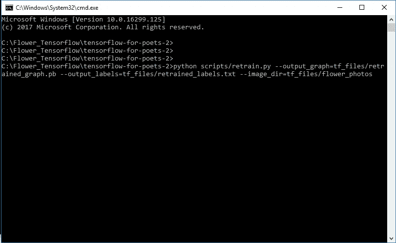
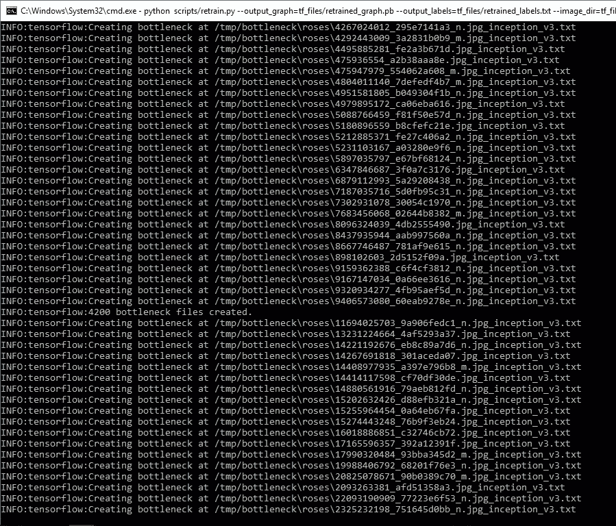
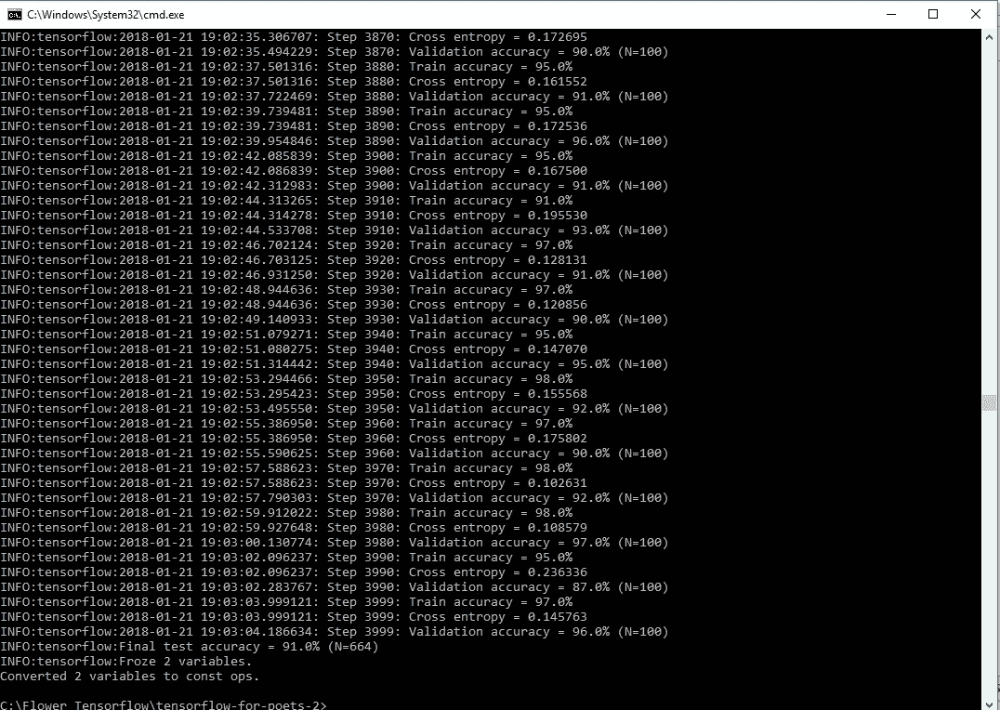
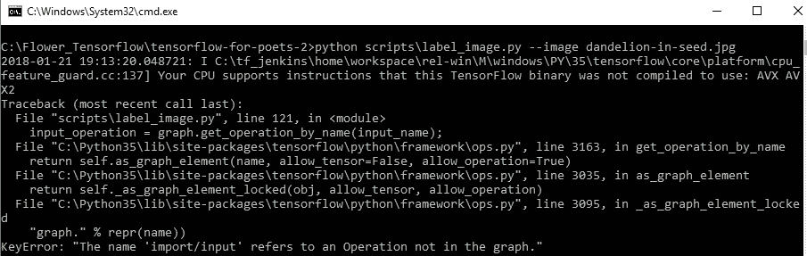
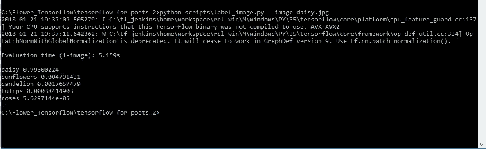
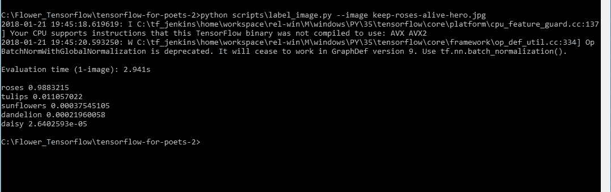
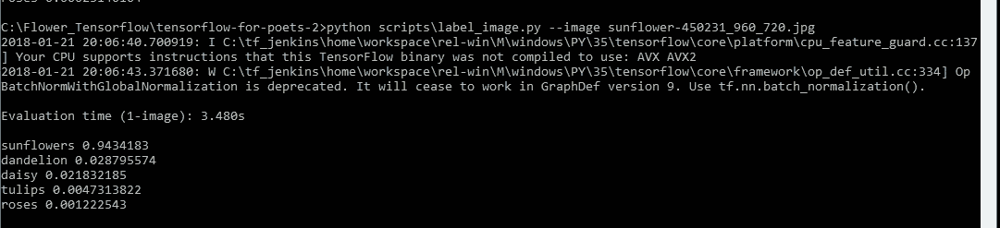
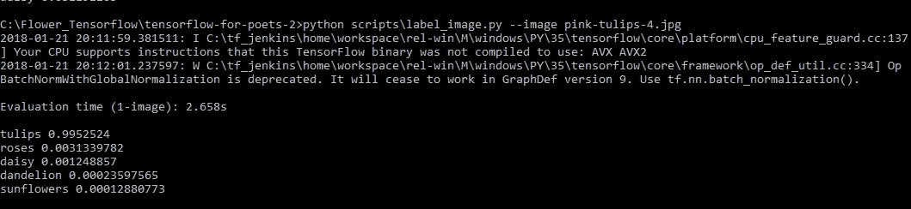

# 使用 CPU 上的自定义图像训练初始状态

> 原文：<https://towardsdatascience.com/training-inception-with-tensorflow-on-custom-images-using-cpu-8ecd91595f26?source=collection_archive---------4----------------------->

## 使用 Tensorflow 使用您自己的图像进行训练

在我之前的帖子中，我们看到了如何在 CPU 上使用 Python API 使用 TensorFlow 进行[图像识别，而无需任何培训。我们使用的是](/tensorflow-image-recognition-python-api-e35f7d412a70) [Inception-v3](https://arxiv.org/abs/1512.00567) 模型，它已经被谷歌在 [1000 个类](http://image-net.org/challenges/LSVRC/2014/browse-synsets)上训练过，但是如果我们想用我们自己的图像做同样的事情呢。我们将使用迁移学习，这将帮助我们**重新培训**已经培训过的 Inception-v3 模型的最后一层，从头开始添加新的类别。在笔记本电脑上大约需要 30 分钟，没有任何 GPU。要了解更多信息，请参考这个[链接](https://www.tensorflow.org/tutorials/image_retraining)或者那些只想要 linux 命令的人去他的[链接](https://codelabs.developers.google.com/codelabs/tensorflow-for-poets/#0)。

我们将在 tensorflow 托管的免费下载的花卉数据上训练模型。在我们开始之前，让我们在我的 CPU 上对一个随机的蒲公英图像做一个测试。


[dandelion-in-seed.jpg](https://www.google.com/url?sa=i&rct=j&q=&esrc=s&source=images&cd=&cad=rja&uact=8&ved=0ahUKEwjryKGp9OjYAhXILY8KHdGuAF4QjRwIBw&url=https%3A%2F%2Fcantbeatemeatem.com%2Frecipes%2Fdandelion%2F&psig=AOvVaw1wwYluemWr3qaXdwYgm6Tv&ust=1516618228601337)

结果是…



我们将使用 Python 3 和 TensorFlow 1.4

如果您的 tensorflow 不是最新的，请使用以下命令进行更新。

```
pip install --upgrade tensorflow
```

数据集的训练可以仅通过如下 4 个步骤来完成:

## 1.下载面向诗人的张量流-2

先新建一个文件夹 *Flowers_Tensorflow。*现在在这里打开命令提示符并键入…

```
git clone https://github.com/googlecodelabs/tensorflow-for-poets-2
```



这将从 you Flower_Tensorflow 文件夹中的 tensorflow 存储库中下载“tensor flow-for-poets-2”*文件夹。*

*这个文件夹包含脚本、tf_folder 等文件。*

## *2.下载数据集*

*去这个[链接](http://download.tensorflow.org/example_images/flower_photos.tgz)下载花数据。然后从文件夹中提取“flower_photos”文件夹。tgz 文件，并将其粘贴到 tf_files 文件夹中。这个文件夹包含 5 类雏菊，蒲公英，玫瑰，向日葵，郁金香和一个 LICENSE.txt 文件。*

## *3.重新训练模型*

*在“tensorflow-for-poets-2”文件夹中打开命令提示符，然后键入*

```
*python scripts/retrain.py --output_graph=tf_files/retrained_graph.pb --output_labels=tf_files/retrained_labels.txt --image_dir=tf_files/flower_photos*
```

**

> *注意:这是一行。只需从上面复制完整的东西，并粘贴到命令提示符。*

*按回车键后，程序将开始创建。C:/tmp/through/roses 等中的 txt 文件。它将产生大约 7300 个瓶颈。txt 文件，看起来像这样。*

**

*在这之后，它将开始训练并完成大约 4000 步，就像这样…*

**

*当您的计算机正在对新的花卉数据集进行训练时，让我分解命令并解释我们刚刚做了什么..*

*整个命令可以分为 4 个部分*

*调用/运行 retrain.py 脚本。*

```
*python scripts/retrain.py*
```

***在 tf_files 文件夹下新建一个图形文件**(训练完成后)。*

```
*--output_graph=tf_files/retrained_graph.pb*
```

***在 tf_files 文件夹下新建一个标签文件**(训练完成后)**。***

```
*--output_labels=tf_files/retrained_labels.txt*
```

***指向花卉数据集目录。***

```
*--image_dir=tf_files/flower_photos*
```

*注意:您可以在上面的命令中添加/更改参数*

***更改除 Inception-v3 之外的型号** [**Mobilenet 型号**](https://research.googleblog.com/2017/06/mobilenets-open-source-models-for.html)*

```
***--architecture mobilenet_1.0_224***
```

*****张量板*****

```
***--summaries_dir=tf_files/training_summaries/${write the architecture here}***
```

*****改变瓶颈目录*****

```
***--bottleneck_dir=tf_files/bottlenecks***
```

*****改变训练步骤*****

```
***--how_many_training_steps=500***
```

## ***4.测试新训练的模型***

***要测试该模型，只需下载任何图像并粘贴到“tensorflow-for-poets-2”中，然后键入(其中*image.png*是文件的名称)。***

```
***python scripts/label_image.py --image image.png***
```

***但是您可能会得到一个错误。***

******

***要解决此错误，请打开脚本文件夹中的 **label_image.py** 文件。***

*****转到第 74 行并更改数值**或转到此[链接](https://github.com/googlecodelabs/tensorflow-for-poets-2/issues/3)。***

***改变:***

```
***input_height = 224
input_width = 224
input_mean = 128
input_std = 128
input_layer = "input"***
```

***收件人:***

```
***input_height = 299
input_width = 299
input_mean = 0
input_std = 255
input_layer = "Mul"***
```

***现在，我们已经作出了改变，让我们这样做在其他花卉。***

## *****菊花*****

******

***[**daisy.jpg**](https://www.google.com/url?sa=i&rct=j&q=&esrc=s&source=images&cd=&cad=rja&uact=8&ved=0ahUKEwj02KiwnunYAhULr48KHe37BeYQjRwIBw&url=http%3A%2F%2Fwww.goodskins.com%2Fdaisy%2F&psig=AOvVaw3jl08eqWC53X-ic06RvXGm&ust=1516629903620736)***

******

## *****玫瑰*****

******

***[keep-roses-alive-hero.jpg](https://www.google.com/url?sa=i&rct=j&q=&esrc=s&source=images&cd=&cad=rja&uact=8&ved=0ahUKEwjqvNLsnunYAhUGu48KHZUfCAUQjRwIBw&url=http%3A%2F%2Fwww.more.com%2Flifestyle%2Fstylish-home%2Fhow-keep-roses-alive&psig=AOvVaw3vU5PtVniUHSuntps3c-70&ust=1516630440087963)***

******

## ***向日葵***

******

***[sunflower-450231_960_720.jpg](https://www.google.com/url?sa=i&rct=j&q=&esrc=s&source=images&cd=&cad=rja&uact=8&ved=0ahUKEwiZhJqhpunYAhUMsY8KHdDEDsUQjRwIBw&url=https%3A%2F%2Fpixabay.com%2Fen%2Fsunflower-flower-yellow-plant-450231%2F&psig=AOvVaw3u8b-5SBxI3oxwESl8tGkg&ust=1516631588168987)***

******

## ***郁金香***

******

***[pink-tulips-4.jpg](https://www.google.com/url?sa=i&rct=j&q=&esrc=s&source=images&cd=&cad=rja&uact=8&ved=0ahUKEwiZ8djzpOnYAhUBOI8KHZ9pBmsQjRwIBw&url=http%3A%2F%2Feskipaper.com%2Fpink-tulips-4.html&psig=AOvVaw2dOWNrv0icXGWtDQ2aiUup&ust=1516631977835689)***

******

***好了，让我们停止吧。找了这么多花我都想吐了…***

## ***如果你想在移动平台上对一个视频直播进行同样的实验。***

***[](/tensorflow-on-mobile-tutorial-1-744703297267) [## 手机上的 TensorFlow:教程

### 在 Android 和 iOS 上

towardsdatascience.com](/tensorflow-on-mobile-tutorial-1-744703297267) 

## 但是先鼓掌这个！！！*** 

***我已经尽力让文章尽可能准确易懂。有什么意见，建议或者有什么问题，**写在评论里吧。*****

***关注我[中](https://medium.com/@sagarsharma4244)、[脸书](https://www.facebook.com/profile.php?id=100003188718299)、[推特](https://twitter.com/SagarSharma4244)、 [LinkedIn](https://www.linkedin.com/in/sagar-sharma-232a06148/) 、 [Google+](https://plus.google.com/u/0/+SAGARSHARMA4244) 、 [Quora](https://www.quora.com/profile/Sagar-Sharma-71) 看类似帖子。***

*****鼓掌吧！分享一下！跟我来。*****

***乐意帮忙。荣誉……..***

# ***你会喜欢的以前的故事:***

1.  ***[“张量流”中的“张量”到底是什么？](https://hackernoon.com/what-the-hell-is-tensor-in-tensorflow-e40dbf0253ee)***

***2.[纪元 vs 批量 vs 迭代](/epoch-vs-iterations-vs-batch-size-4dfb9c7ce9c9)***

***3. [TensorFlow 图像识别 Python API 教程 CPU 上](/tensorflow-image-recognition-python-api-e35f7d412a70)***

***4.[激活函数解释:神经网络](https://medium.com/towards-data-science/activation-functions-neural-networks-1cbd9f8d91d6)***