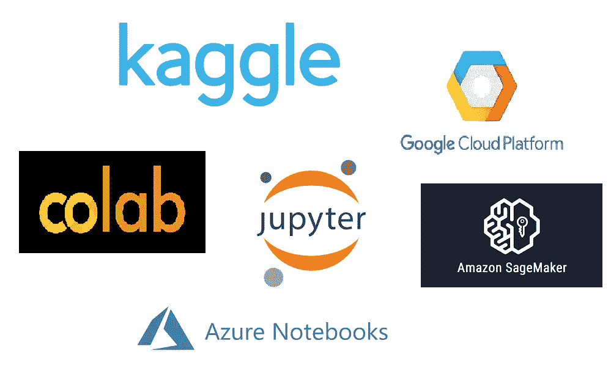
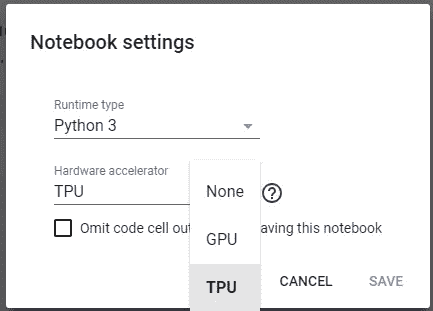
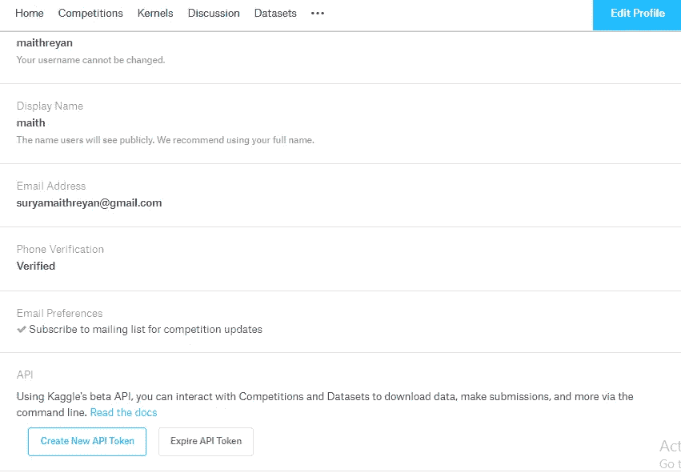
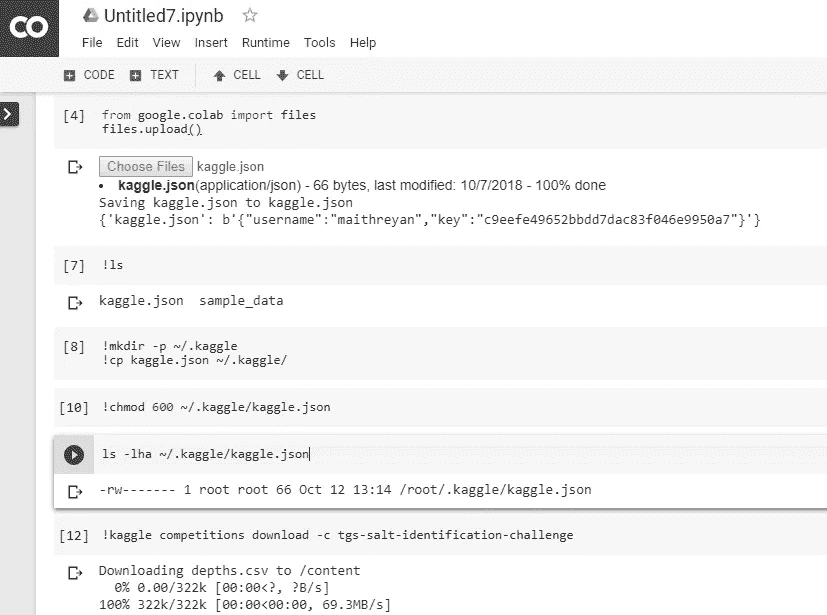
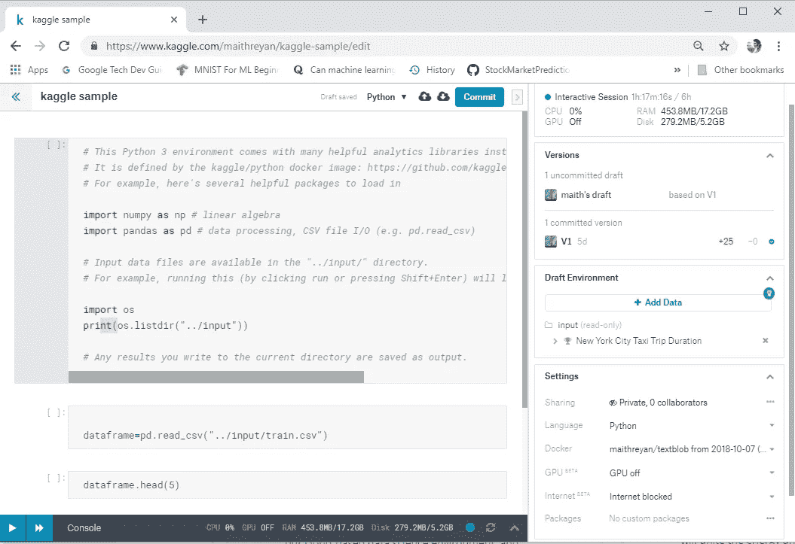
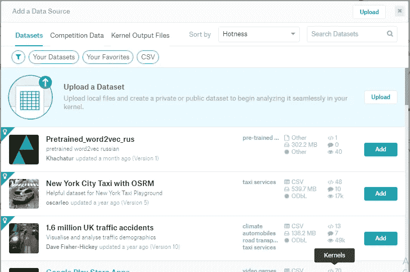
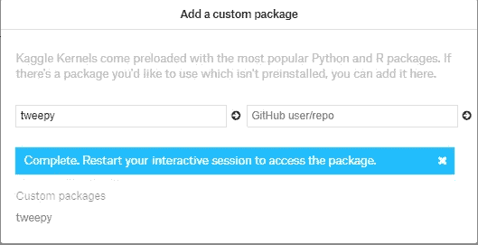
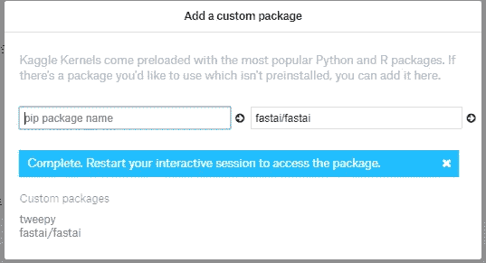

# 免费在线训练机器学习模型(GPU，TPU 启用)！！！

> 原文：<https://towardsdatascience.com/training-machine-learning-models-online-for-free-gpu-tpu-enabled-5def6a5c1ce3?source=collection_archive---------5----------------------->

在大数据集上训练机器学习和深度学习模型所需的计算能力，一直是机器学习爱好者的巨大障碍。但是有了运行在云上的 jupyter notebook，任何有学习热情的人都可以训练并取得很好的成绩。



在这篇文章中，我将提供关于各种服务的信息，这些服务为我们训练模型提供了计算能力。

1.  Google Colab
2.  凯格尔内核
3.  关于 GCP 的朱庇特笔记本
4.  亚马逊 SageMaker
5.  Azure 笔记本

# **1)Google Colab**

Colaboratory 是谷歌的一个研究项目，旨在帮助传播机器学习教育和研究。Colaboratory (colab)提供免费的 Jupyter 笔记本环境，不需要设置，完全在云中运行。它预装了大多数机器学习库，它是一个完美的地方，你可以即插即用，尝试那些不存在依赖性和计算问题的东西。

笔记本连接到你的 google drive，所以你可以随时访问它，也可以从 github 上传或下载笔记本。

## **GPU 和 TPU 使能**

首先，你需要为笔记本电脑启用 GPU 或 TPU。

导航至编辑→笔记本设置，并从硬件加速器下拉列表中选择 TPU。



用于检查 TPU 是否已启用的代码

```
import os
import pprint
import tensorflow as tfif ‘COLAB_TPU_ADDR’ not in os.environ:
 print(‘ERROR: Not connected to a TPU runtime; please see the first cell in this notebook for instructions!’)
else:
 tpu_address = ‘grpc://’ + os.environ[‘COLAB_TPU_ADDR’]
 print (‘TPU address is’, tpu_address)with tf.Session(tpu_address) as session:
 devices = session.list_devices()

 print(‘TPU devices:’)
 pprint.pprint(devices)
```

## **安装库**

Colab 安装了大多数 ml 库，但是您也可以轻松地添加没有预安装的库。

Colab 支持`pip`和`apt`包管理器。

```
!pip install torch
```

apt 命令

```
!apt-get install graphviz -y
```

这两个命令在 colab 中都有效，别忘了还有**！**(感叹句)在命令之前。

## **上传数据集**

有许多方法可以将数据集上传到笔记本

*   用户可以从本地机器上传文件。
*   从 google drive 上传文件
*   人们也可以直接从 kaggle 上传数据集

**从本地上传的代码**

```
from google.colab import files
uploaded = files.upload()
```

您可以浏览并选择文件。

**从 google drive 上传文件**

PyDrive 库用于从 google drive 上传文件

```
!pip install -U -q PyDrivefrom pydrive.auth import GoogleAuth
from pydrive.drive import GoogleDrive
from google.colab import auth
from oauth2client.client import GoogleCredentials# 1\. Authenticate and create the PyDrive client.
auth.authenticate_user()
gauth = GoogleAuth()
gauth.credentials = GoogleCredentials.get_application_default()
drive = GoogleDrive(gauth)# PyDrive reference:
# [https://gsuitedevs.github.io/PyDrive/docs/build/html/index.html](https://gsuitedevs.github.io/PyDrive/docs/build/html/index.html)# 2\. Create & upload a file text file.
uploaded = drive.CreateFile({'title': 'Sample upload.txt'})
uploaded.SetContentString('Sample upload file content')
uploaded.Upload()
print('Uploaded file with ID {}'.format(uploaded.get('id')))# 3\. Load a file by ID and print its contents.
downloaded = drive.CreateFile({'id': uploaded.get('id')})
print('Downloaded content "{}"'.format(downloaded.GetContentString()))
```

你可以得到你想要上传的文件的 id，并使用上面的代码。

获取更多资源从[谷歌服务](https://colab.research.google.com/notebooks/io.ipynb)上传文件。

**从 kaggle 上传数据集**

我们需要安装 kaggle api 并添加认证 json 文件，可以从 kaggle 网站下载(API_TOKEN)。



```
!pip install kaggle
```

通过从本地机器上传文件，将 json 文件上传到笔记本。

创建一个/。kaggle 目录

```
!mkdir -p ~/.kaggle
```

将 json 文件复制到 kaggle 目录

更改文件权限

```
!cp kaggle.json ~/.kaggle/
!chmod 600 ~/.kaggle/kaggle.json
```

现在，您可以使用命令从 kaggle 下载任何数据集

```
kaggle datasets download -d lazyjustin/pubgplayerstats
```

现在你可以使用下面的方法从 kaggle 下载比赛数据，但是你必须参加比赛。

```
!kaggle competitions download -c tgs-salt-identification-challenge
```



在这里你可以在线培训和运行 fashion_mnist，没有任何依赖性[。](https://colab.research.google.com/github/tensorflow/docs/blob/master/site/en/tutorials/keras/basic_classification.ipynb)

对于每个对机器学习感兴趣的人来说，Colab 是一个很棒的工具，所有使用 colab 的教育资源和代码片段都在[官方网站](https://colab.research.google.com/)上提供，并附有[笔记本示例](https://colab.research.google.com/notebooks/)。

# 2)Kaggle 核

Kaggle Kernels 是一个云计算环境，支持可重复的协作分析。

人们可以在 kaggle 内核中运行 Python 和 R 代码

Kaggle 内核运行在远程计算环境中。他们提供所需的硬件。

在撰写本文时，每个内核编辑会话都提供有以下资源:

**CPU 规格**

4 个 CPU 内核

17gb 内存

6 小时执行时间

5gb 自动节省的磁盘空间(/kaggle/working)

16gb 的临时暂存磁盘空间(外部/ka ggle/工作)

**GPU 规格**

2 个 CPU 内核

14 千兆字节内存

# 运行中的内核

一旦我们在[kaggle.com](http://kaggle.com)创建了一个账户，我们就可以选择一个数据集来玩，只需点击几下鼠标，就可以运行一个新的内核。

点击创建**新内核**



你将拥有 jupyter 笔记本。底部是您可以使用的控制台，右侧是各种选项，如

## 版本

当你提交和运行一个内核时，你在一个独立于你的交互会话的会话中从上到下执行内核。一旦完成，您将生成一个新的内核版本。内核版本是您工作的快照，包括您编译的代码、日志文件、输出文件、数据源等等。内核的最新版本是在内核查看器中显示给用户的。

## 数据环境

当您为数据集创建内核时，数据集将被预加载到笔记本的输入目录中

```
../input/
```

您也可以点击**添加数据源**，添加其他数据集



设置

**分享:**你可以把你的内核私有，也可以把它公开，让别人可以学习你的内核。

**添加 GPU:** 你可以在你的内核中添加单个 NVIDIA Tesla K80。与本地机器或您自己的虚拟机相比，使用内核的一个主要好处是内核环境已经预先配置了 GPU 就绪的软件和软件包，这可能非常耗时，而且设置起来令人沮丧。要添加 GPU，请从内核编辑器导航到“设置”窗格，然后单击“启用 GPU”选项。

**自定义包**:内核有默认的包，如果你需要任何其他的包，可以通过以下方式轻松添加

*   只要输入库名，kaggle 就会为你下载。



*   输入用户名/回购名称



这两种方法都能很好地添加定制包。

Kaggle 是一个完美的平台，既可以提供数据，也可以通过计算来处理提供的大量数据。它还举办各种比赛，人们可以尝试提高自己的技能。

更多关于 kaggle link [的资源请点击这里](http://blog.kaggle.com/)。如果你是 kaggle 的新手，你绝对应该尝试一下[泰坦尼克号数据集](https://www.kaggle.com/c/titanic)它有很棒的教程。

其他关于 kaggle、colab 和机器学习的资源关注 [Siraj Raval](https://medium.com/u/54526471f9bf?source=post_page-----5def6a5c1ce3--------------------------------) 和[Yufeng](https://medium.com/u/2a2ae028a675?source=post_page-----5def6a5c1ce3--------------------------------)。

由于我无法在这篇文章中涵盖在线培训 ml 模型的所有服务，这篇文章将有**第 2 部分**。

学习和练习机器学习所需的所有资源都是开源的，可以在线获得。从计算、数据集、算法到各种高质量的在线免费教程，你需要的只是一个**互联网连接和学习的热情。**

感谢你一直读到最后，我希望这篇文章会有用，因为它解决了那些开始走向机器学习和数据科学的人所面临的主要问题。如果你喜欢这篇文章，请让我知道，为文章鼓掌。欢迎查询，您可以关注我在[maithreyan surya](https://medium.com/u/f3acb9881998?source=post_page-----5def6a5c1ce3--------------------------------)中的帖子，也可以在这里给我发邮件[。](http://suryamaithreyan@gmail.com)

有效使用 Colab 的视频简介:[https://www.youtube.com/playlist?list = pl 9 a 4 goxnjut 3 qyy 56 ay 6 q 9 z B2 nm 4c Q3 tu](https://www.youtube.com/playlist?list=PL9a4goxNJut3qyy56AY6Q9Zb2Nm4CQ3Tu)

**机器学习有潜力改变世界，你也一样。**