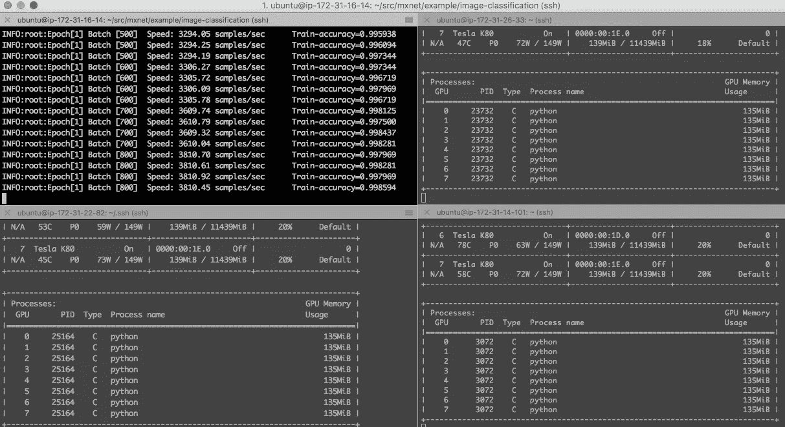
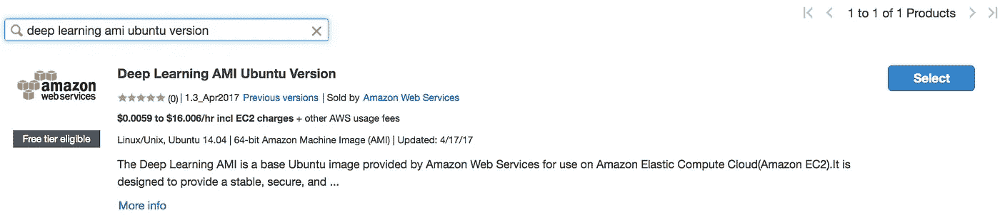
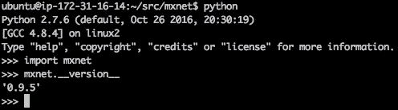
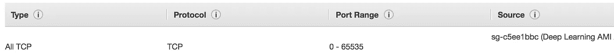
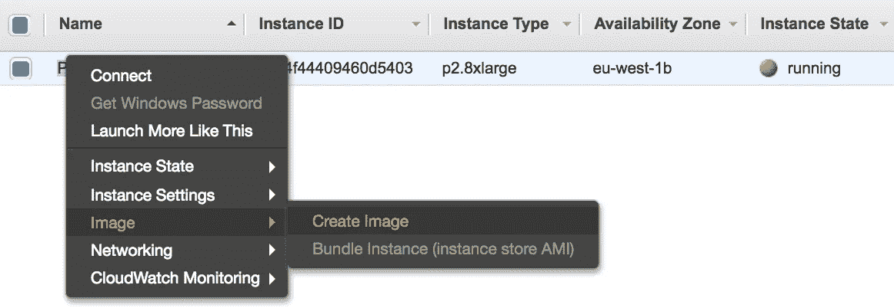
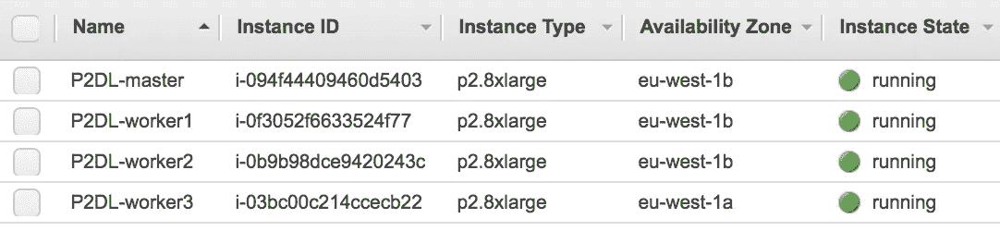
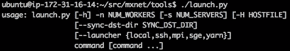
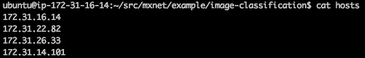

# 培训 MXNet 第 4 部分:分布式培训

> 原文：<https://towardsdatascience.com/training-mxnet-part-4-distributed-training-91def5ea3bb7?source=collection_archive---------6----------------------->

在[第 3 部分](https://medium.com/@julsimon/training-mxnet-part-3-cifar-10-redux-ecab17346aa0)中，我们使用了 [CIFAR-10](https://www.cs.toronto.edu/~kriz/cifar.html) 数据集，并学习了如何调整优化参数。我们最终使用一个 [g2.8xlarge](https://aws.amazon.com/blogs/aws/new-g2-instance-type-with-4x-more-gpu-power/) 实例的所有 4 个 GPU 训练了一个 110 层的 ResNext 模型……这花了大约 12 个小时。

在本文中，我将向您展示如何使用多个实例来显著加快训练速度。系好安全带。

Training CIFAR-10 on 4 instances and 32 GPUs. Read on!

## 创建主节点

我们将使用运行**深度学习 AMI** 、 [Ubuntu edition](https://aws.amazon.com/about-aws/whats-new/2017/04/deep-learning-ami-for-ubuntu-v-1-3-apr-2017-now-supports-caffe2/) 的 [p2.8xlarge](https://aws.amazon.com/blogs/aws/new-p2-instance-type-for-amazon-ec2-up-to-16-gpus/) 实例。然而，您可以很容易地用任何类型的 EC2 实例或者甚至在您办公桌下运行的一堆 PC 上复制这一点:)

让我们开始吧。我们将按照我们喜欢的方式配置主节点，然后我们将**克隆**它以向我们的 MXNet 集群添加更多实例。第一步是转到 EC2 控制台的市场部分，找到深度学习 AMI。

然后，选择您想要使用的实例类型。请注意实例成本:一个 p2.8xlarge 每小时的成本是 7.20 美元。不要担心，您实际上可以使用任何实例类型，因为 MXNet 能够使用实例的 CPU 或 GPU。很明显，GPU 实例会比 t2.micros 快很多:)

再点击几下就完成了。只需确保 **SSH 端口**是打开的，并且您已经为实例创建了一个新的**密钥对**(姑且称之为 *ec2* )。几分钟后，您可以使用 *ubuntu* 用户(不是 *ec2-user* )进入主节点。

## 在 MXNET 中启用分布式培训

默认情况下，在源代码发行版中没有启用分布式培训，这意味着我们可能必须从源代码中重新构建 MXNet。如果您的构建已经包括分布式培训，您可以跳过这一部分。

深度学习 AMI 包括 MXNet 源代码:我们只需将它们变成我们自己的，并刷新到最新的稳定版本( **0.9.5** 在撰写本文时)。

然后，我们需要配置我们的**构建选项**。最后一个实际上实现了分布式训练。

现在我们可以构建和安装库了。不需要添加依赖项，因为它们已经包含在 AMI 中了。我在 32 个内核上运行并行 make，因为这是 p2.8xlarge 所拥有的。

一旦安装了这个库，运行一个快速的 Python 检查是一个好主意。

好的，这个看起来不错。我们继续吧。

## 为分布式培训打开端口

主节点和工作节点需要相互通信以共享**数据集**以及**训练结果**。因此，我们需要改变我们的安全组的配置来允许这样做。

做到这一点最简单的方法是允许 MXNet 集群实例之间的**所有 TCP** 通信，即使用**相同安全组**的实例。

为此，请转到 EC2 控制台，编辑主节点的安全组的入站规则。添加一条规则，允许**所有 TCP 流量**，并使用安全组的实际名称**限制**源流量。

我们的实例现在已经准备好了。让我们创建工作节点。

## 创建工作节点

我们将基于主节点创建一个**新 AMI** 。然后，我们用它来发动工人。在 EC2 控制台中找到您的实例并创建一个映像。

几分钟后，您将在 EC2 控制台的“Images”部分看到新的 AMI。您现在可以使用它来启动您的工作节点。

这里没有什么复杂的:选择您想要启动的**实例类型**、实例的**数量**(在我的例子中是 3 个)和与主节点相同的安全组**。**

再过几分钟，您的实例就准备好了。

很可爱。记下每个实例的私有 IP 地址，我们马上会用到它们。

## 配置集群

让我们登录到主节点，移动到*工具*目录并查看启动器。

这是我们将用来在所有节点(包括主节点)上开始训练的工具。它做两件事:

*   使用 rsync，**在每个节点上复制 */tmp/mxnet* 中的数据集**。或者，我们可以通过与自制的 NFS 或亚马逊 EFS 共享节点上的数据集来避免这种情况。
*   使用 ssh，**运行开始训练的 python 脚本**。如您所见，其他协议也是可用的，但我们今天不讨论它们。

## 创建主机文件

*launch.py* 需要在一个文件中声明所有节点(包括主节点)的私有 IP 地址。它应该看起来像这样。

## 配置 SSH

我们需要主节点和工作节点之间的无密码 ssh 访问。如果您已经准备好了，可以跳过这一部分。

为了简单起见，我们将在本地计算机上创建一个新的密钥对，并在集群中分发它。

> **请**不要重复使用 *ec2* 密钥对，这是不好的做法。另外，有些人可能想在 AMI 中烘焙密钥对，以避免将它分发给所有实例，但是我建议不要这样做，因为这意味着将私钥存储在所有节点上，而不仅仅是主节点上。还有[宋承宪代理转发也不好](https://heipei.github.io/2015/02/26/SSH-Agent-Forwarding-considered-harmful/)。

接下来，还是从我们的本地计算机，我们将把**公钥**复制到所有节点(包括主节点),只把**私钥**复制到主节点。

最后，在主节点上，我们将启动 *ssh-agent* 并添加 *mxnet* 身份。

现在，您应该能够从主节点登录到每个工作节点(包括主节点本身)。在继续之前，请确保此功能正常工作。

如果是的话，你已经准备好训练了，伙计:)

## 开展分布式培训

下面是这个神奇的命令: *hosts* 文件中列出的 4 个节点将通过 *rsync* 接收一份 */tmp/mxnet* 中数据集的副本。然后，主节点将在每个节点上运行 *train_cifar10.py* 脚本，在所有 8 个 GPU 上训练一个 110 层的 ResNext 模型。

> 如果您运行在 CPU 实例上，只需删除 GPU 参数。

PS_VERBOSE 变量将输出额外的信息。万一出了问题，非常有用；)

您可以通过登录不同的节点并运行' *nvidia-smi -l* '命令来检查进度。

那么这有多快呢？正如我之前提到的，在一个 g2.8xlarge 实例的 4 个 GPU 上运行 300 个 epochs 需要大约 12 个小时。4 个 p2.8xlarge 实例的 32 个 GPU 加起来用了 **91 分钟！**

这是一个**8 倍的加速**，这是有道理的，因为我们有**8 倍多的 GPU**。我曾经读到过，现在我亲眼看到了:**确实是线性缩放**！这让我想把它推到 256 个 GPU:毕竟它只需要 16 个 p 2.16 大:D

最后但同样重要的是，我的同事 Naveen Swamy 和 Joseph Spisak 写了一篇非常有趣的[博文](https://aws.amazon.com/blogs/compute/distributed-deep-learning-made-easy/)，讲述了如何使用 AWS CloudFormation 自动完成大部分工作。如果你在 AWS 中运行所有的东西，这绝对值得一读。

今天到此为止。非常感谢你的阅读和最近给我的友好支持。这对我意义重大！

接下来:

[第 5 部分——分布式培训，EFS 版](https://medium.com/@julsimon/training-mxnet-part-5-distributed-training-efs-edition-1c2a13cd5460)