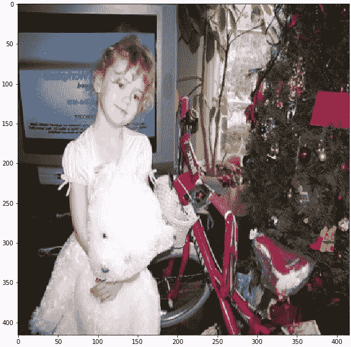
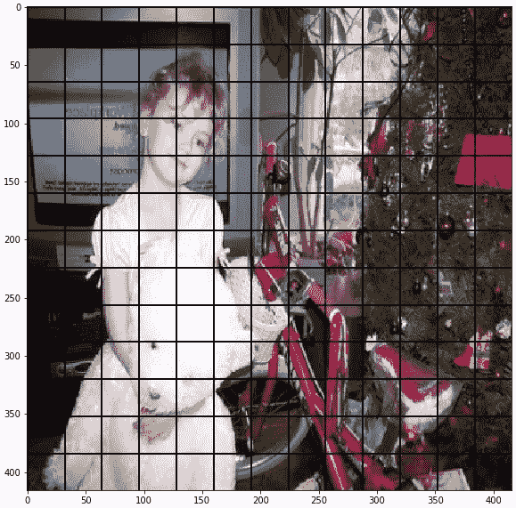
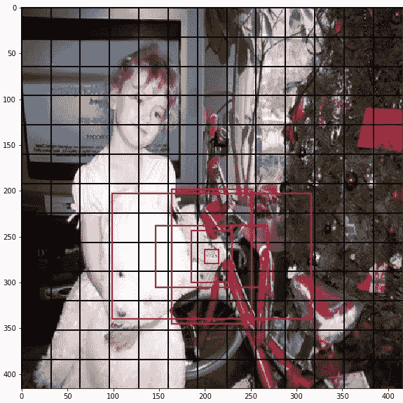
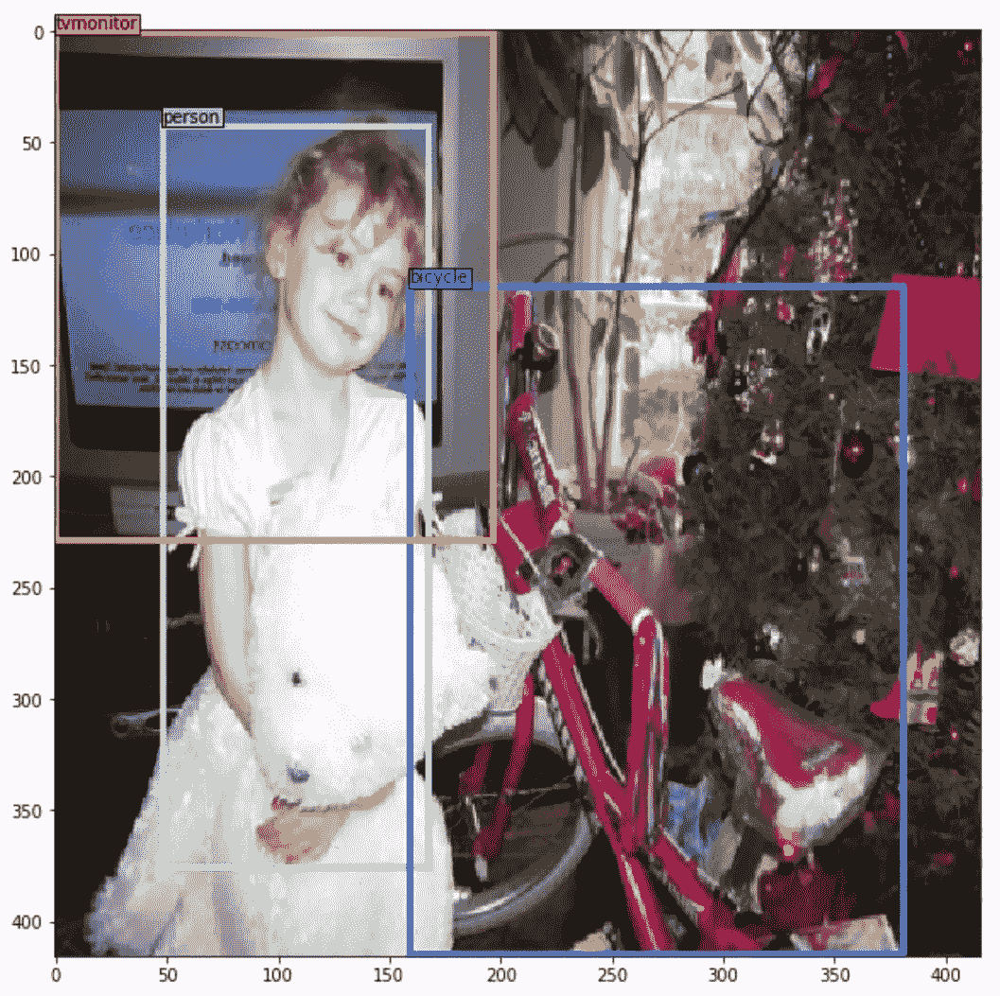
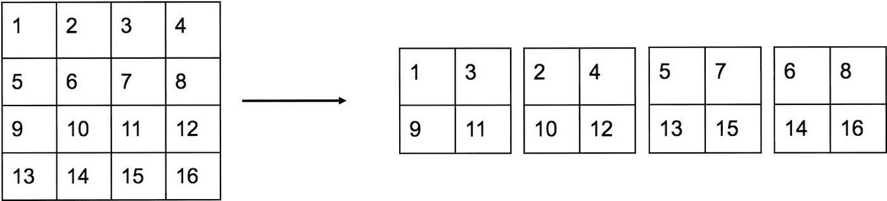
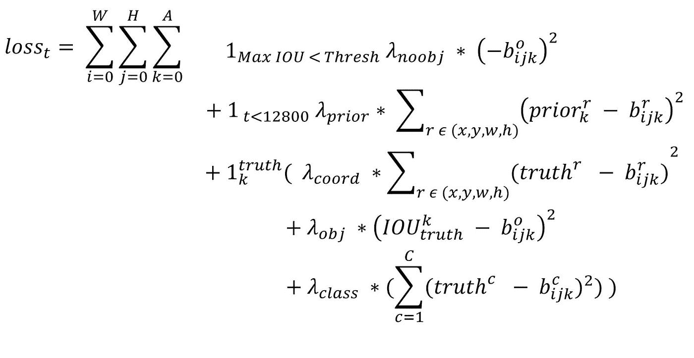

# 使用循环学习率从头开始训练对象检测(YOLOv2)

> 原文：<https://towardsdatascience.com/training-object-detection-yolov2-from-scratch-using-cyclic-learning-rates-b3364f7e4755?source=collection_archive---------2----------------------->

对象检测的任务是识别图像中的所有对象以及它们的类别标签和边界框。这是一项具有挑战性的计算机视觉任务，最近已被 Faster-RCNN、SSD、Yolo 等深度学习算法接管。这篇文章重点介绍了最新的 Yolo v2 算法，据说它是最快的(在 Titan X 上运行时，在低分辨率图像上大约 90 FPS)，比 SSD 更准确，在少数数据集上比 RCNN 更快。我将讨论 Yolo v2 的工作原理和训练步骤。如果你想更深入地了解物体检测算法，你可以参考[这里](http://cv-tricks.com/object-detection/faster-r-cnn-yolo-ssd/)和[这里](https://github.com/Nikasa1889/HistoryObjectRecognition/blob/master/HistoryOfObjectRecognition.png)。

这篇文章假设你对[卷积层](https://www.youtube.com/embed/Oqm9vsf_hvU?start=265&end=396)，最大池，[批处理](https://www.coursera.org/learn/deep-neural-network/lecture/81oTm/why-does-batch-norm-work)有基本的了解。如果没有，我建议你在附加的链接中得到一个关于主题的简要想法。

# Yolo v2:你只看一次

在下图中，我们需要识别人、电视监视器和自行车的边界框。

按照 Yolo 算法，我们将输入图像分成 N×N(这里是 13x13)个正方形。

在每个方块中，Yolo 网络(下面讨论)预测 5 个具有不同纵横比的边界框。

An example of 5 boxes is shown for a square positioned at (7, 9) from top left.

对于每个边界框，Yolo 网络预测其在正方形内的中心位置、框的宽度、高度、图像宽度、高度和在该框中具有任何对象的置信度得分，以及属于 M 个类别中的每一个的概率。

然而，不是每个边界框都有一个对象。给定这些预测，为了找到最终的边界框，我们需要执行以下两个步骤:

1.  移除没有对象的边界框。移除预测置信度得分小于阈值 0.24 的边界框
2.  在声称有对象的边界框中，使用[非最大抑制](https://www.coursera.org/learn/convolutional-neural-networks/lecture/dvrjH/non-max-suppression)和[并集上的交集](https://www.coursera.org/learn/convolutional-neural-networks/lecture/p9gxz/intersection-over-union)去除了识别相同对象的冗余。

Predicted bounding boxes

# YOLOv2 网络:

以上步骤是图像通过 Yolo 网络后得到最终包围盒所需的后处理步骤。然而，我们还没有讨论 Yolo 网络如何产生这种输出。在这里，我要讨论一下 Yolo 网络。

YOLOv2 的架构可以在这里看到[。将鼠标悬停在块上可以看到可视化中每个块的详细信息。除了最后一个卷积块之外，每个卷积块都有 BatchNorm 归一化和泄漏 Relu 激活。](http://ethereon.github.io/netscope/#/gist/d08a41711e48cf111e330827b1279c31)

Conv13_512 之后的重组层(参见[可视化](http://ethereon.github.io/netscope/#/gist/d08a41711e48cf111e330827b1279c31))是一个重组层。如果输入图像的尺寸为 3x416x416(通道 x 高度 x 宽度— CHW)，则 Conv13_512 的输出尺寸为 512x26x26 (CHW)。重组层将每一个交替的像素放入不同的通道。让我们以一个 4x4 像素的单通道为例，如下所示。重组层将大小减少一半，并创建 4 个通道，相邻像素位于不同的通道中。因此，来自 Conv13_512 的 Reorg 层的输出将是 2048x13x13。

Reorg layer in YOLO v2

concat 层接受 Reorg 层的输出(大小:2048x13x13)和 Conv20_1024 的输出(大小:1024x13x13)，并生成大小为 3072x13x13 的连接层。

# 损失函数:

目标函数是多部分函数，如

YOLO v2 Loss function

上述函数定义了迭代 t 的损失函数。如果边界框没有任何对象，则需要降低其对象置信度，并将其表示为第一损失项。因为边界框坐标预测需要与我们的先验信息对齐，所以为少数迭代(t < 12800)添加了减少先验和预测之间的差异的损失项。如果边界框 k 负责真值框，那么预测需要与表示为第三损失项的真值对齐。𝞴值是每个损失项的预定义权重。

# 训练 YOLOv2:

在训练 YOLOv2 之前，作者定义了一个架构，称为 Darknet-19，用于在 ImageNet 数据集上训练。Darknet-19 具有与 YOLOv2 网络相同的前 19 层(直到 Conv18_1024)，然后附加了 1024 个滤波器的 1x1 卷积，之后是全局 AvgPool 和 Softmax 层。Darknet-19 在 ImageNet 上训练，达到 91.2%的 top-5 精度，并且训练的权重直到层 Conv18_1024 稍后在训练 YOLOv2 网络时使用。

我已经用 SGD 和 Adam 做了几次实验。我已经尝试过使用动量，如论文中提到的重量衰减。我不能在使用 SGD 的测试中得到 65.7 以上的地图。然而，亚当能够比 SGD 达到 68.2 地图表现更好。

后来，我尝试了在精彩的[快速人工智能](https://www.youtube.com/embed/JNxcznsrRb8?start=1155&end=3447)讲座中解释的重启循环学习率。这是一个非常有趣的技术，因为我发现在使用 lr_find()找到的学习率开始训练后，测试精度在短短 4 个时期内就开始从以前的结果提高。我遵循的策略是:

1.  使用 lr_find 技术发现学习率为 0.00025，我使用 PyTorch 重新实现了该技术
2.  用 n _ epochs 训练最后的层 5 个周期，每个周期加倍，得到 31 个 epoch。我在 PyTorch 中使用 CosineAnnealingLR 方法实现了循环学习率。
3.  以不同的学习速率训练所有层 3 个周期，每个周期的时期加倍。

使用上述策略，我可以在测试中获得 71.8 的地图，这比论文中提到的策略要好，我也可以在更短的时间内获得。但离论文中提到的精度(76.8 图)还是有相当大的差距。我相信我还需要进一步尝试一些东西，以接近论文中提到的精度。

1.  多尺度训练，因为我无法在 PyTorch 中定期重复多尺度训练
2.  为更多的时代而训练。
3.  处理困难样品(包围盒的宽度或高度【https://github.com/santoshgsk/yolov2-pytorch 

I will be adding the code soon. Hit the clap if you like the post and please do let me know your thoughts about this finding.

I would like to thank Jeremy Howard and Rachel Thomas for their incredible effort of sharing useful tips on training neural networks.

Please find the code here: [https://github.com/santoshgsk/yolov2-pytorch](https://github.com/santoshgsk/yolov2-pytorch)