# 基于 Supervisely、Tensorflow 和 UNet 的城市道路场景分割训练

> 原文：<https://towardsdatascience.com/training-road-scene-segmentation-on-cityscapes-with-supervisely-tensorflow-and-unet-1232314781a8?source=collection_archive---------0----------------------->

自 2012 年 Alex Krizhevsky 发表他的开创性 AlexNet 以来，深度学习工具集已经走过了漫长的道路，从一堆 CUDA C++文件到像 Tensorflow 和 Caffe 这样的易用框架，配备了像 UNet 或 SSD 这样的强大架构。

也有很多来自不同领域的免费数据集，如标志识别或图像字幕。

现在每个人都可以建立和训练自己的模型。此时此地有这么多东西——还会出什么差错呢？


Cooking data may be hard.

不幸的是，有几件事你应该担心:

1.  首先，你需要获得有趣的数据集。有时，这并不是一件容易的事情，因为一些链接断开了，一些数据集需要你发送请求并等待几天(或几周，或永远)。
2.  你必须小心统计和分布。如果不太了解你的数据，很容易花很多时间训练你的模型却没有结果。
3.  有时你想注释一些特定的东西，这些东西在公共数据集中还没有。例如，您可以在汽车牌照上标注实际的车牌号码或标记道路缺陷。
4.  (在深度学习中)数据越多越好。将几个数据集组合在一起使训练更容易总是一个好主意。当然，您应该首先做一些预处理:例如，在一个数据集中，您只有“车辆”，而在另一个数据集中，您有“汽车”、“自行车”和“公共汽车”。重新映射类标签是必须做的事情。
5.  扩充也是一个让数据变大的好主意。是的，大多数框架都没有这个特性。

在 [Deep Systems](https://deepsystems.ai) 这里，我们每天都会遇到这种困难。准备数据并不是构建模型的乐趣所在，但却非常重要，因此我们创建了一个服务来帮助解决上述所有问题(甚至更多！).

在本文中，我们想向您介绍 [Supervise.ly](https://supervise.ly) ，并向您展示一个现实世界问题的例子:我们将在 Tensorflow、Keras 和名为 UNet 的有前途的架构的帮助下，在几个公开可用的数据集的组合上训练我们自己的道路分割模型。

> **免责声明**:你可以跳过监督数据准备部分，自己做，但是可能会花更多的时间。

# 准备城市景观

Cityscapes 是一个来自 50 个城市的街道场景数据集。它有 5000 个高质量的注释帧和 30 个类，如“人行道”或“摩托车”。

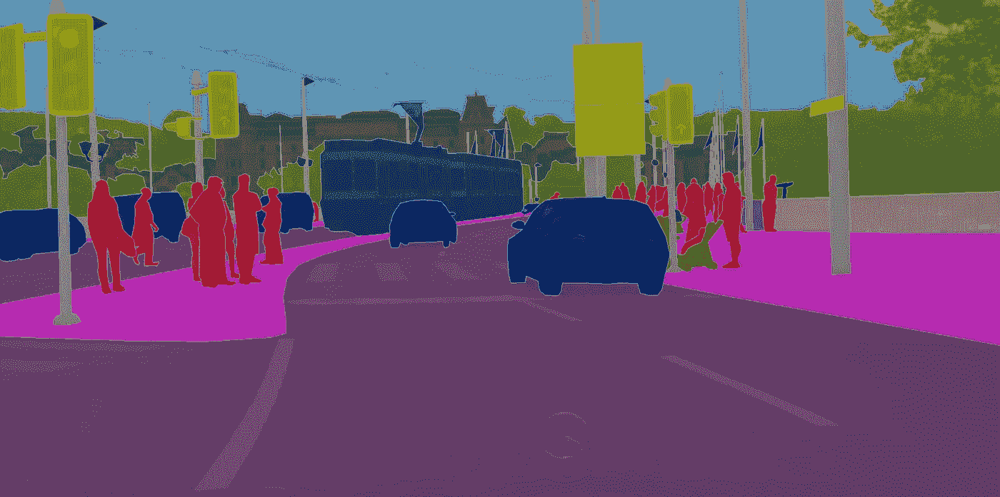

Cityscapes annotation example

与类似数据集不同的是，Cityscapes 以多边形和点的形式提供标注，而不仅仅是大位图。

## 步骤 1:下载数据集

你可以在这里获得数据集[——你可能需要等一两天才能获得确认链接:数据集许可不允许分发。](https://www.cityscapes-dataset.com/downloads/)

登录后，下载以下档案:`gtFine_trainvaltest.zip (241MB)`和`leftImg8bit_trainvaltest.zip (11GB)`。

我们只对 Cityscapes 数据集的像素级子集感兴趣，所以您不必下载其他档案。

现在，将下载的归档文件解压缩到一个文件夹中，这样您将以下面的结构结束:

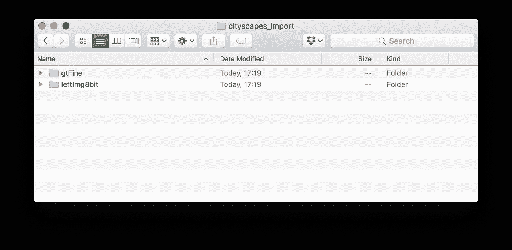

`gtFine`和`leftImg8bit`都包含类似`train`和`val`的文件夹，这些文件夹包含类似`aachen`的文件夹-城市。

如你所见，Cityscapes 是一个大数据集。如果您愿意，可以使用整个 Cityscapes 数据集来完成本教程，但我们建议只留下几个城市:至少对于第一次尝试来说是这样。所以，最后，你应该有这样的东西:

```
$ tree -d
.
├── gtFine
│   ├── train
│   │   ├── aachen
│   │   ├── bochum
│   │   └── bremen
│   └── val
│       └── frankfurt
└── leftImg8bit
    ├── train
    │   ├── aachen
    │   ├── bochum
    │   └── bremen
    └── val
        └── frankfurt
```

将整个目录打包到一个新的归档文件中，使用一种支持的超级导入格式:`.zip`、`.tar`或`.tar.gz`。现在我们准备向前迈进。

## 第二步:注册 Supervise.ly

[创建一个账户](https://app.supervise.ly/signup)——只需一分钟，完全免费。

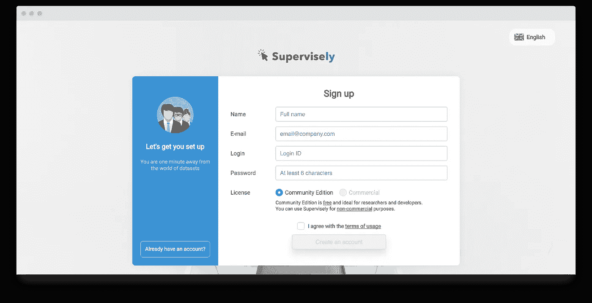

Signup page

## 步骤 3:导入 Cityscapes 数据集

太好了！现在你没有超级数据集——是时候创建你的第一个数据集了。你可以上传自己的图片，但现在我们将使用城市景观。打开“导入”页面，选择“开源数据集格式”选项。我们支持几个最流行的公共数据集。选择“城市景观”。在右侧，您会看到一个您必须上传的归档示例—这是我们在第一步中创建的文件。

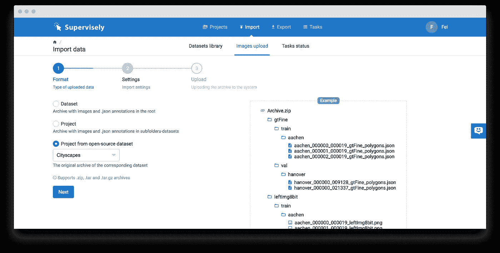

输入项目名称(对于本教程，输入“cityscapes”)并移动到最后一步:在您的计算机上选择准备好的存档并开始上传。

您可以在“任务状态”页面监控进度。

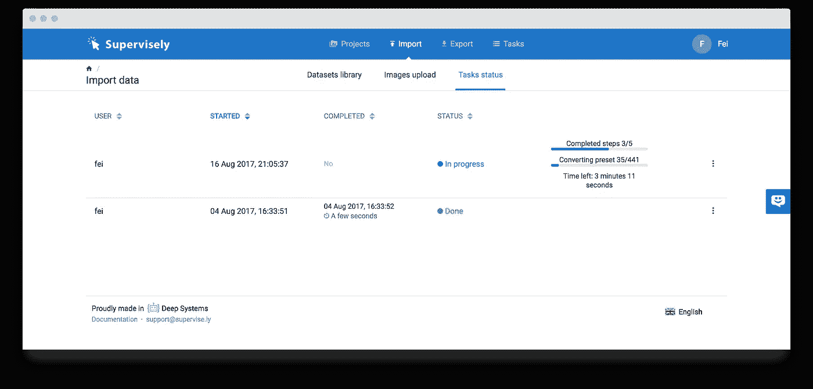

## 第四步:查看统计数据

当你看到任务的状态是“完成”时，这意味着一切正常，你可以开始用你的图像做一些很酷的事情了。

首先，我们来看看一些数字。打开你新创建的项目“cityscapes ”,进入“Statistics”页面。

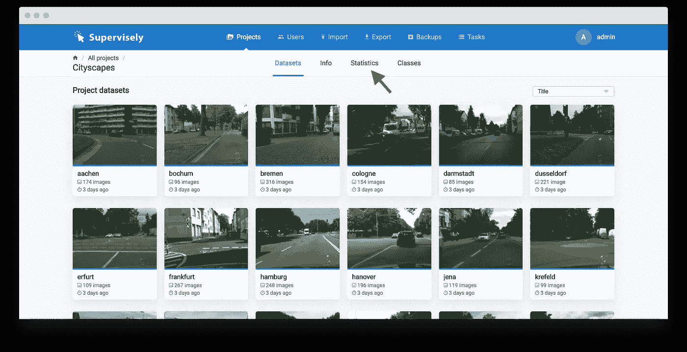

在这里你将会得到一些关于班级分布，人物区域和更多的信息。你可以从这里的数据中获得一些见解。例如，人们可以看到，只有 10%的图像至少有一辆公共汽车，或者电线杆多于汽车。

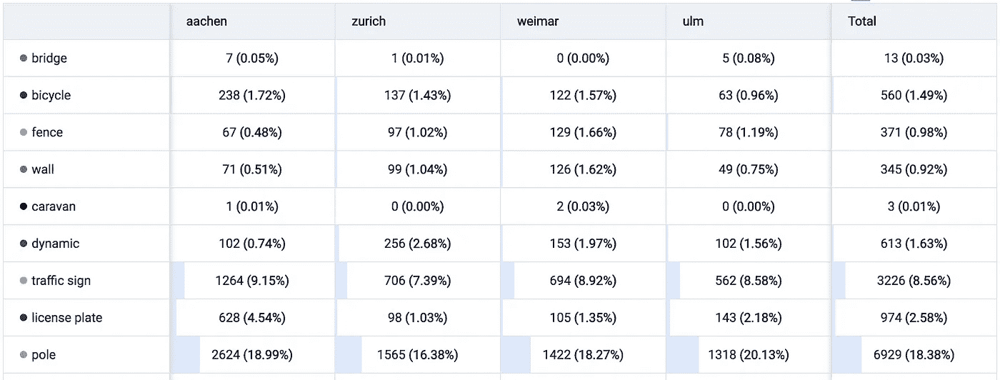

## 步骤 5:导出数据

我们不想改变数据集中的注释，所以我们可以直接跳到导出。

Supervise.ly 最强大的功能之一是导出工具。它允许您使用简单的基于 JSON 的配置来建立转换管道。我们在那里支持许多有用的东西:

*   图像裁剪和旋转
*   亮度和对比度校正
*   过滤掉一些数字
*   重新映射分类标签
*   分割数据集以进行训练和验证

还有更多。

您可以保存和传输这些配置，在不同的项目中使用它们，当然，不需要编码。

为了培训 UNet，我们需要:

*   将类别数量从 30 个减少到几个(例如，四个:“bg”、“车辆”、“道路”和“中性”)
*   将图像调整为固定大小(例如，224x224)
*   过滤掉非常小的数字(例如，小于面积的 0.15%)
*   根据数据集名称(基本上按城市)拆分数据以进行训练和验证
*   用“中性”类填充背景
*   生成地面实况位图

我们将使用 Supervise.ly 导出配置来完成上述所有工作。

单击“导出”选项卡开始新的导出。在左侧，您可以使用 JSON 定义您的导出配置，或者通过按“添加层”按钮在 UI 中添加新的转换层。

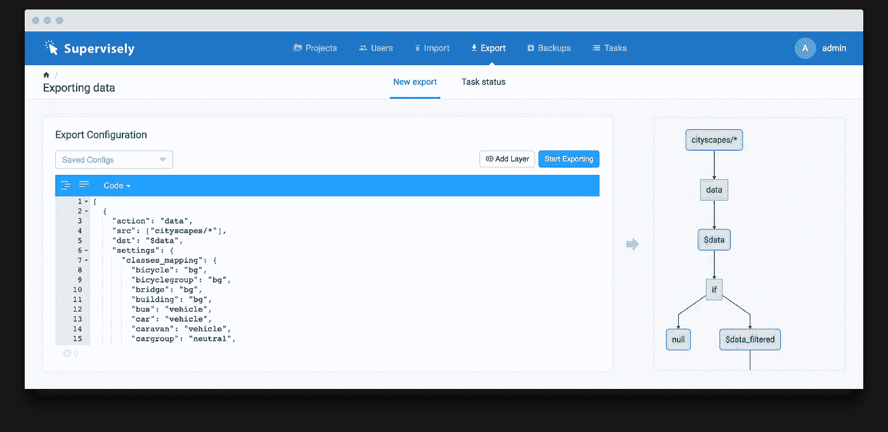

每一个改变都会更新右边，你会看到一个代表导出转换的图表。

我们为本教程做了一个预定义的配置。您可以通过克隆我们的存储库来获得它:

```
git clone [https://github.com/DeepSystems/supervisely-tutorials](https://github.com/DeepSystems/supervisely-tutorials)
```

然后从`unet_training/src/experiment_001/config.json`文件中复制配置并将内容粘贴到左侧面板的编辑器中。

你会看到类似上面截图的东西。让我解释一下这是怎么回事:


你可以在[文档](https://docs.supervise.ly)中阅读更多关于导出和图层的内容。

点击“开始导出”，输入本次导出的名称，Supervise.ly 将开始准备您的数据。您可以在“任务”页面上监控进度。

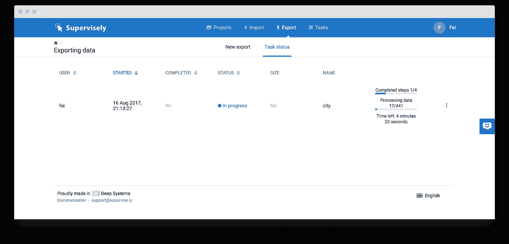

导出完成后，您将看到“完成”状态。点击“三点”图标，然后点击“下载”。

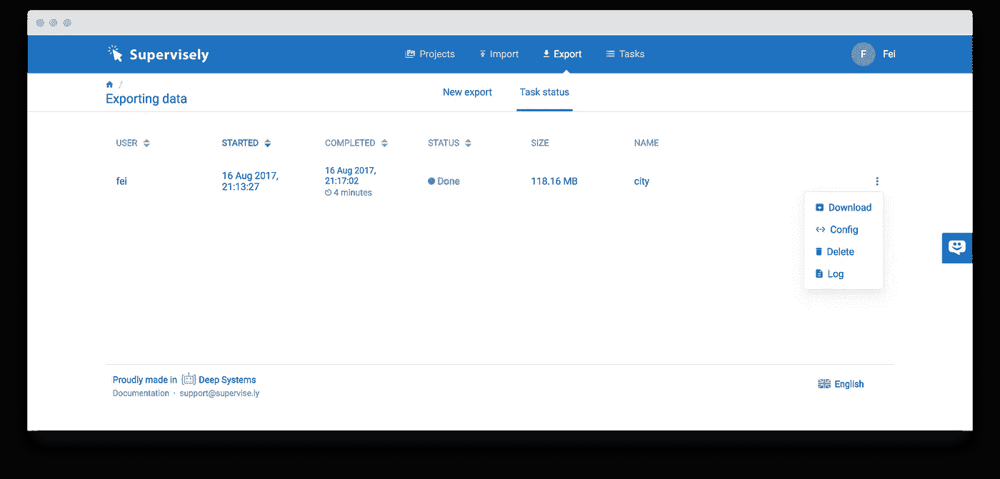

# 培训 UNet

现在，您应该有一个包含理想图像的档案。让我们看一些图片。

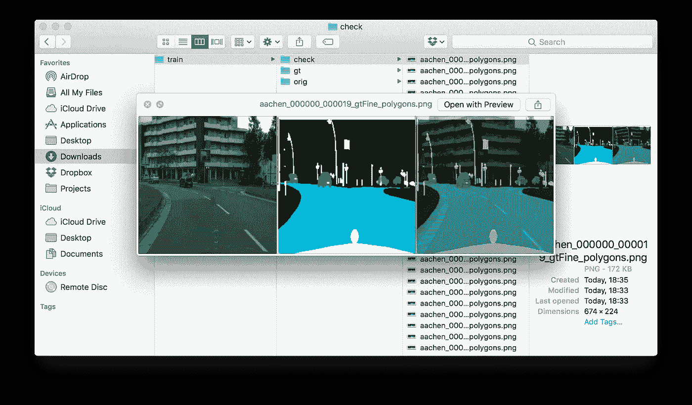

Folder “check” contains debug output with original and ground-truth images

是时候训练我们的模特了。在 Github 库`supervisely-tutorials`中，我们已经做好了一切准备。

解压文件夹`unet_training/data/cityscapes`中下载的档案。您将得到类似这样的结果:

```
$ cd unet_training/data
$ tree -d
.
└── cityscapes
    └── city2
        ├── aachen
        │   └── train
        │       ├── check
        │       ├── gt
        │       └── orig
        └── frankfurt
            └── val
                ├── check
                ├── gt
                └── orig
```

要开始训练，你需要 GPU Cuda，Tensorflow 和 libs。有可能解决所有的依赖并手动安装库或者(更好的主意！)只需构建并运行 docker 映像:

```
cd unet_training/docker
./build.sh
./run.sh
```

Docker 将构建包含 Tensorflow 和 GPU 支持的图像。它还会在容器内安装文件夹`src`和`data/cityscapes`。现在将 Jupyter 笔记本中的链接复制到您最喜欢的浏览器中。

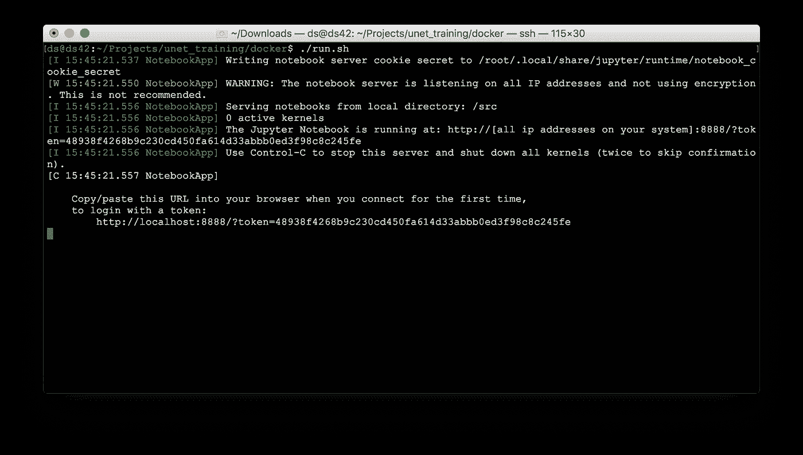

在上面的例子中，链接是`[http://localhost:8888/?token=48938f4268b9c230cd450fa614d33abbb0ed3f98c8c245fe](http://localhost:8888/?token=48938f4268b9c230cd450fa614d33abbb0ed3f98c8c245fe)`。

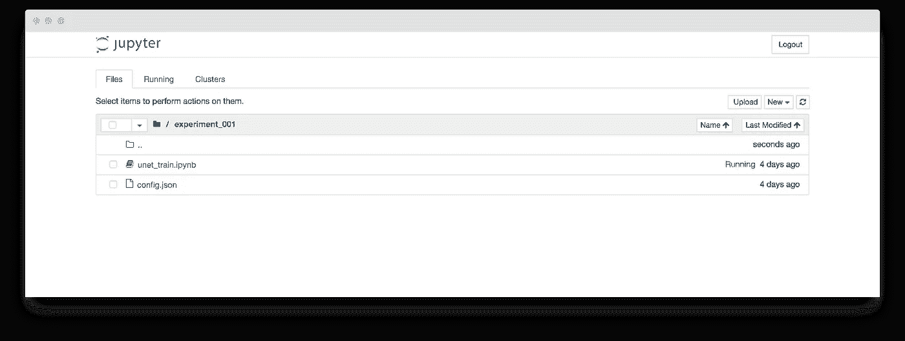

导航到文件夹`experiment_001`并打开`unet_train.ipynb`。

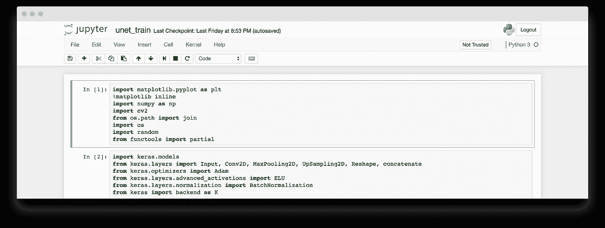

点击`Cell → Run All`运行笔记本。如果一切顺利，您将在几个时期后看到一些结果。

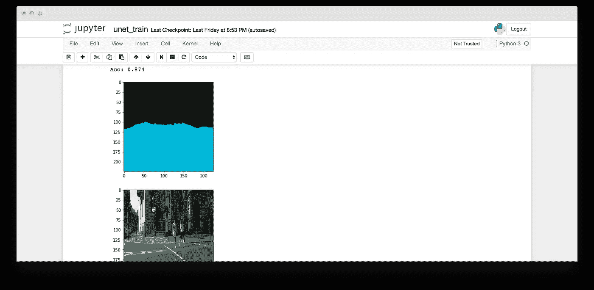

The road is recognised (kinda). Do more epochs to get better results.

经过一天的训练，你可以达到这样的效果(这里我们使用了更多的类):

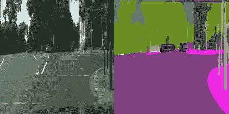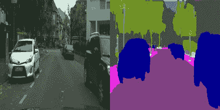

## 结论

我们已经完成了从下载数据集到探索数据、使用 Tensorflow 和 Keras 进行导出转换和训练模型的每一步。

你也可以尝试使用其他可用的道路场景数据集，像[的瞳孔数据集](https://www.mapillary.com/dataset/)——超级支持它。

如果你有问题，我们很乐意帮助你。

前期教程:[用 Supervisely 和 Tensorflow 进行车牌检测](https://medium.com/p/e84c74d4382c)。