# 基于 Kaggle 核的迁移学习和图像分类。

> 原文：<https://towardsdatascience.com/transfer-learning-and-image-classification-using-keras-on-kaggle-kernels-c76d3b030649?source=collection_archive---------7----------------------->

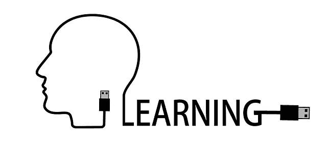

在我上一篇 [**帖子**](https://medium.com/@risingdeveloper/dog-vs-cats-detection-in-keras-beginner-super-friendly-intermediate-refreshing-expert-boring-f314872006c9) 中，我们训练了一只 **convnet** 来区分狗和猫。我们从零开始训练 convnet，得到了 80%左右的准确率。对于在非常少的数据集(4000 张图像)上训练的模型来说，这已经不错了。

但是在现实世界/生产场景中，我们的模型实际上表现不佳。

尽管我们建议调整一些**超参数**——历元、学习率、输入大小、网络深度、反向传播算法等——看看我们是否能提高我们的准确度。

> 嗯，我试过了…

事实是，在调音、重新调音、不调音之后，我的准确度不会超过 90%,在某个点上它是无用的。

> 当然，有更多的数据会有助于我们的模型；但请记住，我们正在处理一个小数据集，这是深度学习领域的一个常见问题。

但是唉！有一种方法…

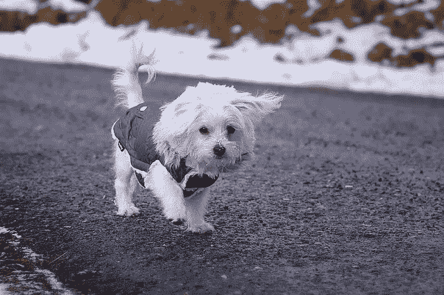

Image from pixabay

> **转学走进…**

但接下来你会问，什么是迁移学习？

嗯，TL(迁移学习)是深度学习中常用的训练技术；其中已经为任务训练的模型被重新用作另一个模型的基础/起点。

为了训练一个图像分类器，使其在图像分类上达到接近或超过人类水平的精度，我们需要大量的数据、强大的计算能力和大量的时间。这一点我相信我们大多数人都没有。

知道这对于资源很少或没有资源的人来说是一个问题，一些聪明的研究人员建立了模型，在大型图像数据集上进行训练，如[**【ImageNet】**](http://www.image-net.org/)[**COCO**](http://cocodataset.org/)[**Open Images**](https://github.com/openimages/dataset)，并决定将他们的模型分享给公众以供重用。

Image from [**Marvel comics**](https://www.google.com.ng/url?sa=i&source=images&cd=&cad=rja&uact=8&ved=0ahUKEwjQ2fmX3LPeAhWkAsAKHQVdDhcQMwhqKAAwAA&url=http%3A%2F%2Fmarvelcinematicuniverse.wikia.com%2Fwiki%2FThanos&psig=AOvVaw0B8RoTQmwXOotpH8y4U-DZ&ust=1541179772078051&ictx=3&uact=3)

这意味着你再也不用从头开始训练图像分类器了，除非你有一个非常非常大的不同于上面的数据集，或者你想成为一个**英雄或者 thanos。**

我知道你有疑问，比如…

*   迁移学习为什么有效？

井转移学习对图像分类问题有效，因为神经网络以越来越复杂的方式学习。也就是说，你在网络中走得越深，学到的图像特定特征就越多。

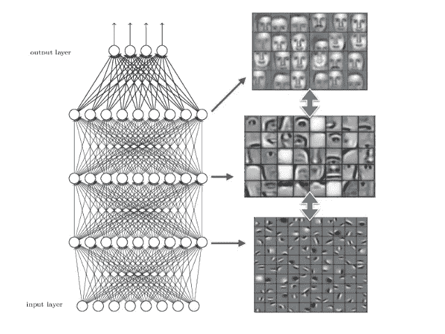

**A neural network learns to detect objects in increasing level of complexity** | Image source: cnnetss.com

让我们建立一些直觉来更好地理解这一点。在一个试图检测人脸的神经网络中，我们注意到网络学习检测第一层中的边缘，第二层中的一些基本形状以及随着深入的复杂特征。

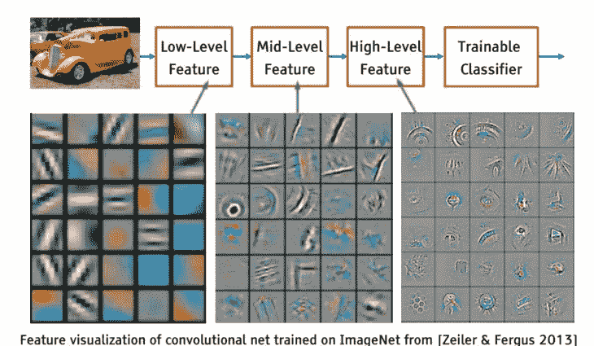

因此，这里的想法是，所有的图像都有形状和边缘，只有当我们开始提取更高层次的特征时，我们才能识别它们之间的差异，比如说脸上的鼻子或汽车的轮胎。只有这样我们才能说，好吧；这是一个人，因为它有鼻子，这是一辆汽车，因为它有轮胎。

这里的要点是，神经网络的早期层将总是检测汽车和人的图片中存在的相同的基本形状和边缘。

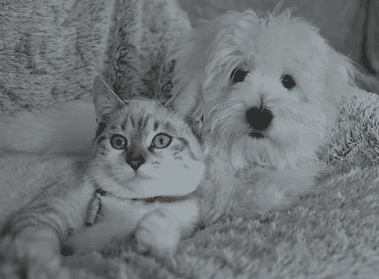

现在，将这种直觉用于我们区分狗和猫的问题，这意味着我们可以使用在包含不同类型动物的庞大数据集上训练过的模型。
这很有效，因为这些模型已经学会了动物的基本形状和结构，因此我们需要做的就是教会它(模型)我们新图像的高级特征。

我想说的是，我们需要一个已经在大型图像数据集上训练过的网络，如 **ImageNet** (包含大约 140 万张标记图像和 1000 个不同类别，包括动物和日常物品)。
既然这个模型已经知道如何对不同的动物进行分类，那么我们可以利用这些现有的知识快速训练一个新的分类器来识别我们的特定类别(猫和狗)。

> 我的意思是一个会煮鸡蛋的人应该知道如何煮水，对吗？

既然我们对什么是迁移学习有了理解/直觉，我们就来谈谈**预训练**网络。

**预训练**网络有不同的变体，每种都有自己的架构、速度、大小、优点和缺点。

**Keras** 预装了许多类型的这些**预训练**模型。其中一些是:

*   **VGGNET**:Simon Yan 和 Zisserman 在他们 2014 年的论文 [*中介绍了用于大规模图像识别的超深度卷积网络*](https://arxiv.org/abs/1409.1556) 。
*   **RESNET** :由何等人在 2015 年的论文 [*中首次提出，用于图像识别的深度残差学习*](https://arxiv.org/abs/1512.03385)
*   **INCEPTION**:“INCEPTION”微体系结构是由 Szegedy 等人在他们 2014 年的论文 [*中首次提出的，该论文名为“用卷积进行深入研究*](https://arxiv.org/abs/1409.4842) :
*   例外(XCEPTION):例外是由 **Keras** 图书馆的创建者[弗朗索瓦·乔莱](https://twitter.com/fchollet)提出的。

还有很多。其中一些架构的详细解释可以在 [**这里**](https://www.pyimagesearch.com/2017/03/20/imagenet-vggnet-resnet-inception-xception-keras/) **找到。**

我们将在本教程中使用 **InceptionResNetV2** ，请随意尝试其他模型。

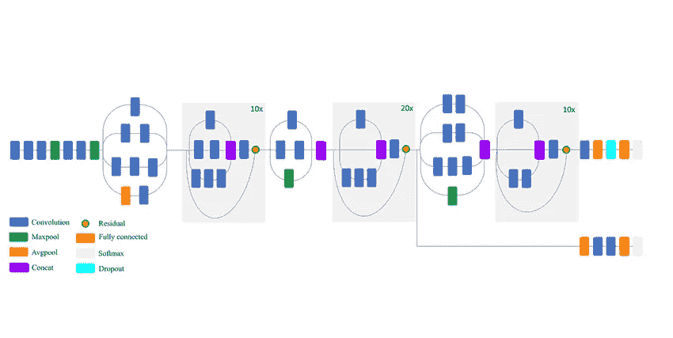

InceptionResNetV2 model | Image source: [researchgate](https://www.researchgate.net/figure/Schematic-diagram-of-InceptionResNetV2-model-compressed-view_fig9_326421398)

**InceptionResNetV2** 是来自 **INCEPTION** 系列的最新架构。它确实工作得很好，并且由于许多原因超级快，但是为了简洁起见，我们将留下细节并坚持在这篇文章中使用它。

如果你对**盗梦空间**模式如何运作的细节感兴趣，那么就去 [**这里**](https://medium.com/@sh.tsang/review-inception-v3-1st-runner-up-image-classification-in-ilsvrc-2015-17915421f77c) **。**

> 不那么简单的介绍结束后，让我们开始实际的编码。

我们将使用第一个笔记本中几乎相同的代码，不同之处非常简单明了，因为 Keras 使调用预训练模型变得很容易。

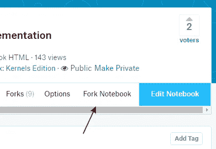

Fork your previous notebook on kaggle

如果你遵循了我之前的 [**帖子**](/image-detection-from-scratch-in-keras-f314872006c9) 并且已经在 [**kaggle**](http://kaggle.com/) 上有了内核，那么简单地分叉你的笔记本创建一个新版本。我们将编辑这个版本。

将为您创建上一个笔记本的分支，如下所示

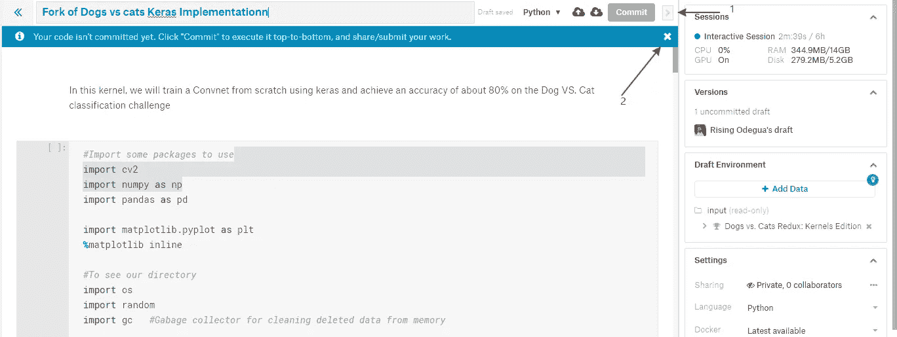

The new version opens like this.

1.  关闭设置栏，因为我们的 GPU 已经被激活。请确认您的 GPU 已打开，因为这可能会极大地影响培训时间。
2.  取消提交消息。暂时不要提交您的工作，因为我们还没有做出任何更改。

现在，从头开始一个接一个地运行代码块，直到到达我们创建 **Keras** 模型的单元格，如下所示。

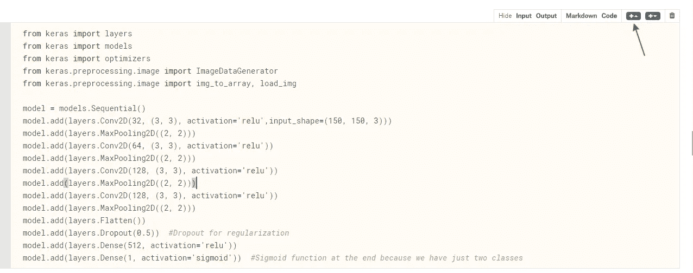

Keras model block

点击箭头指向上方的 **+按钮**，在当前代码单元格的基础上创建一个新的代码单元格。

empty code cell created

> 现在，让我们称我们的预训练模型为…

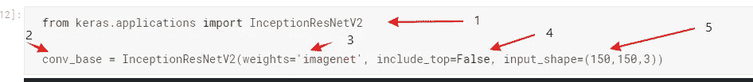

1.  这里我们导入 **InceptionResNetV2** 模型。
2.  这里，我们告诉 **keras** 下载模型的**预训练的**权重，并保存在变量**conv _ 基地中。** 为了配置我们实际下载的内容，我们传入一些重要的参数，例如:
3.  *权重* [ **imagenet** ]:我们告诉 keras 获取在 **imagenet** 数据集上训练的 InceptionReNetV2。
4.  *include _ top*[**False**]:这告诉 **Keras** 不要下载预训练模型的完全连接层。这是因为顶层(完全连接的层)进行最终分类。
    即在卷积层从输入图像中提取边缘、斑点或线条等基本特征后，全连接层将它们分类。
    由于我们只需要两个类(狗和猫)分类器，我们将删除前者并添加我们自己的分类器。

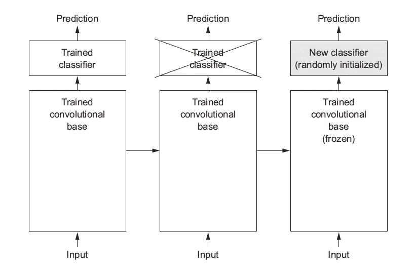

**Removing the top classifier and adding our own**. Image source: [Deep Learning with Python](https://www.amazon.com/Deep-Learning-Python-Francois-Chollet/dp/1617294438) by Francois Chollet

5.这里我们指定我们的输入维度。

点击 **shift+Enter** 运行代码块。

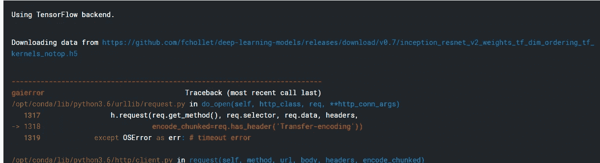

This error appears when your internet on kaggle is blocked.

如果您在运行代码时遇到这个错误，那么您在 Kaggle 内核上的互联网访问被阻止了。

要激活它，打开您的设置菜单，向下滚动并点击**互联网**并选择 ***互联网连接。*** 你的内核自动刷新。因此，您必须从头开始再次运行每个单元格，直到到达当前单元格。

重新运行代码从 [**github**](https://github.com/fchollet/deep-learning-models) 上的 **keras** 库下载预训练的模型。

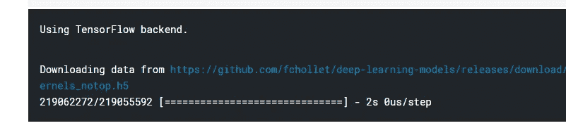

Downloading our pretrained model from github

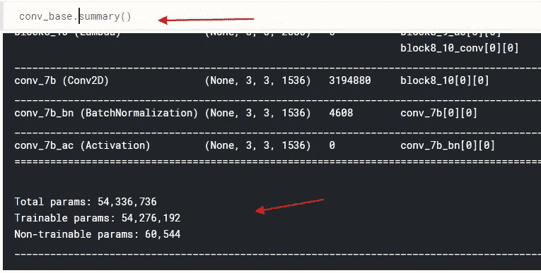

我们可以给。 ***summary( )*** 我们下载的模型上的函数可以看到它的架构和参数个数。
你注意到一个令人欢呼的 5400 万 plus 参数。这是巨大的，我们肯定不能从头开始训练它。但是由于迁移学习，我们可以简单地重复使用它而无需培训。

接下来，我们创建完全连接的层(分类器),并将其添加到我们下载的模型之上。这是我们要训练的分类器。即在将 **InceptionResNetV2** 连接到我们的分类器后，我们将告诉 keras 只训练我们的分类器，并冻结 **InceptionResNetV2** 模型。

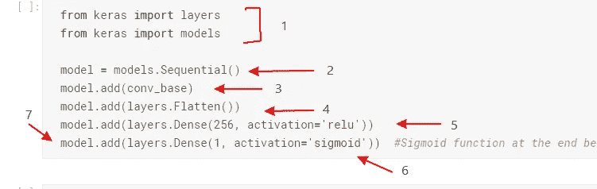

1.  我们从 keras 导入层和模型。
2.  我们创建一个序列模型。
3.  **重要的**！别担心，我没有尖叫…这里我们将我们的**conv _ 基地(** InceptionResNetV2)添加到模型中。
4.  这里，我们展平来自**conv _ 基地**的输出，因为我们想把它传递给我们完全连接的层(分类器)。
5.  为了简单起见，我添加了一个输出为 256 ( **号不固定**)的**密集**网络，并使用了我们在我上一篇 [**帖子**](https://medium.com/@risingdeveloper/dog-vs-cats-detection-in-keras-beginner-super-friendly-intermediate-refreshing-expert-boring-f314872006c9) **中谈到的流行的 **ReLU** 激活。**
6.  我们像上次一样用一个**s 形**做最后一层。
7.  最后一层只有一个输出。(职业概率)
    见我上一篇 [**帖子**](https://medium.com/@risingdeveloper/dog-vs-cats-detection-in-keras-beginner-super-friendly-intermediate-refreshing-expert-boring-f314872006c9) 了解更多澄清。

> 按住 **Shift+Enter** 运行您的代码。

接下来，让我们预览一下我们的架构:

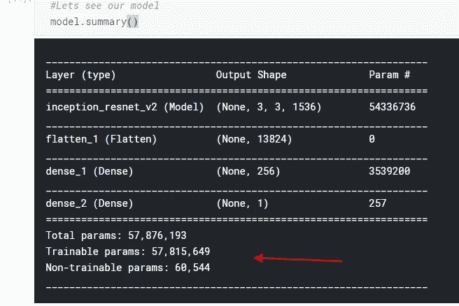

Full model summary

我们可以看到，我们的参数从大约 5400 万增加到将近 5800 万，这意味着我们的分类器有大约 300 万个参数。

现在我们要冻结 conv 的**基地，只训练我们自己的。**

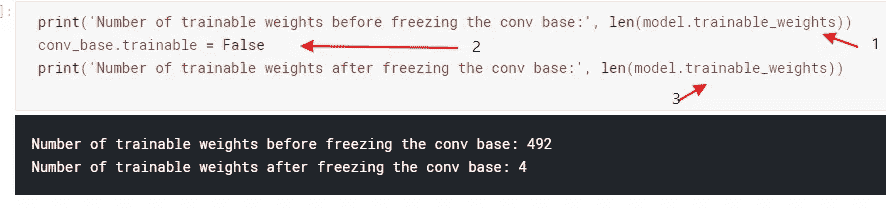

Freeze!

1.  我们在冻结**conv _ base(***492***)之前打印模型中的重量数。**
2.  在这里，我们将**conv _ 基地**图层的 ***可训练*** 属性设置为 False(我们不想训练你)。
3.  打印冻结 **conv_base 后的重量数(** *下降到刚好 4 个* **)。**

几乎完成，只是一些小的变化，我们可以开始训练我们的模型。

第一个小小的改变是将我们的学习率从我们上一款中的**0.0001(*1****e-5***)**略微提高到**0.0002(***2e-5***)。**经过一些试验后，我决定使用 **0.0002** ，它工作起来更好一些**。(**你可以*做*这里再调一些 **)**

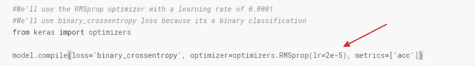

Increase the learning rate slightly

接下来，运行**模型下的所有单元格。*编译*** 块，直到到达我们在模型上称之为 **fit** 的单元格。这里我们将改变最后一个参数，即**纪元**大小。

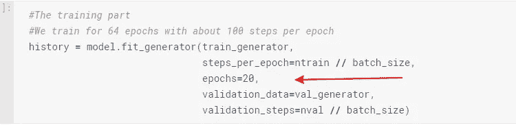

我们将时段大小减少到 **20** 。当我们稍后绘制精度和损耗图时，其原因会更清楚。
**注:**我尝试了不同的数字后决定用 20。这就是深度学习中我们所说的 ***超参数*** 调优。

# 终于，开始训练的时间到了。

# 运行你的代码，去喝杯水。不，不是咖啡！水，因为水是生命。

嗯，我还没来得及喝水，我的模特就训练完了。所以我们来评价一下它的性能。

> 展示迁移学习力量的图片。

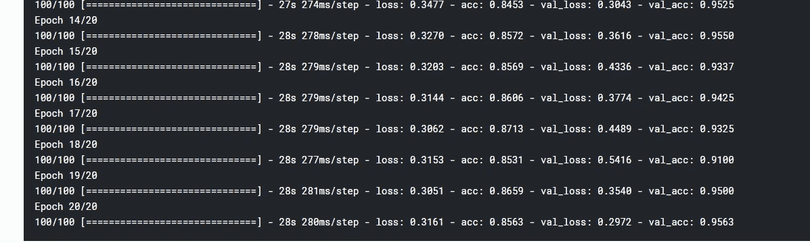

We reach an accuracy of about 96% in just 20 epochs

我们清楚地看到，在仅仅 20 个时期内，我们已经达到了大约 96%的准确度。超级快速准确。

如果 ***狗 vs 猫*** 的比赛没有结束，我们用这个模型预测，我们就算不是第一，也一定会名列前茅。
请记住，我们仅使用了 25，000 张图片中的 4000 张。

当我们使用所有 25000 幅图像结合我们刚刚学习的技术(迁移学习)进行训练时，会发生什么？

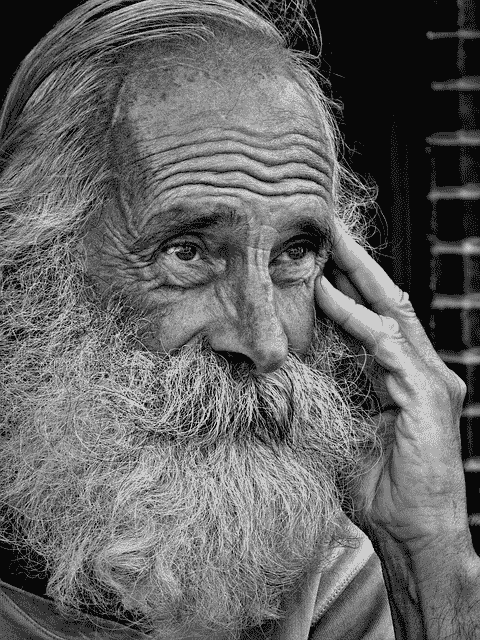

A wise man thinking… Image source [**Pixabay**](https://pixabay.com/en/people-wisdom-wise-man-person-882078/)

> 嗯，一位非常聪明的科学家曾经说过…

> 拥有足够数据的不太花哨的算法肯定会比拥有少量数据的花哨算法做得更好。

事实证明这是真的！

好了，我们已经讨论了一段时间的数字，让我们来看一些图像…

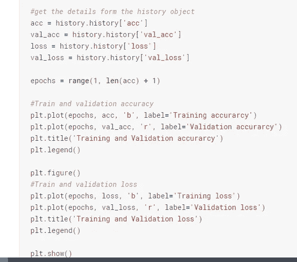

在不更改打印代码的情况下，运行单元块以绘制一些精度和损耗图。

我们得到了下面这些图…

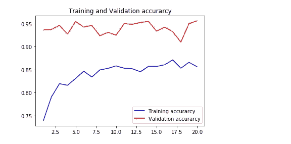

那么我们能从这个情节中读到什么呢？我们可以清楚地看到，我们的验证准确性甚至从一开始就表现良好，然后在几个时期后就稳定下来了。现在你知道我为什么把我的纪元大小从 64 减少到 20 了。

最后，我们来看一些预测。我们将使用相同的预测代码。只需运行代码块。

> **运行我的后，我得到了 10 张图像的预测，如下所示…**

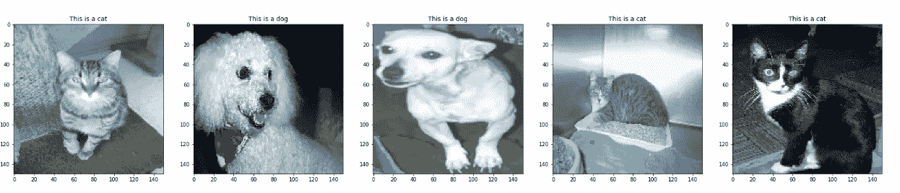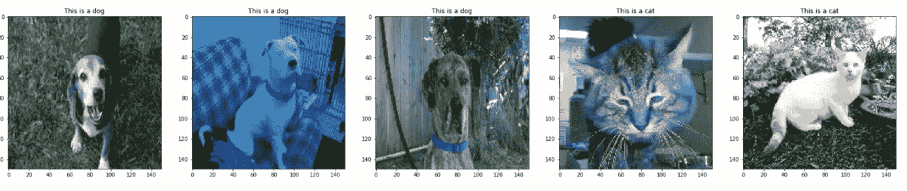

Predictions for ten Images from our test set

> 我们的分类器得到了满分 10 分。很好很简单，对吧？

嗯，就是这样。这就是我停止打字的地方，让你去驾驭迁移学习的力量。

所以，编码快乐…

[**在 Kaggle **上链接到本笔记本****](https://www.kaggle.com/risingdeveloper/transfer-learning-in-keras-on-dogs-vs-cats) 。

[**链接到本笔记本**](https://github.com/risenW/medium_tutorial_notebooks/blob/master/transfer-learning-in-keras-on-dogs-vs-cats.ipynb) 上的 Github **。**

我引用了一些令人惊叹的帖子和文章。

*   [用于视觉识别的 CS231n 卷积神经网络](http://cs231n.github.io/)。
*   Keras 的创建者 Francois Chollet 用 python 进行深度学习。
*   [协进化神经网络基础知识](https://pythonprogramming.net/convolutional-neural-network-cnn-machine-learning-tutorial/)。
*   [一个关于迁移学习的很棒的媒体帖子](https://medium.com/@14prakash/transfer-learning-using-keras-d804b2e04ef8)。
*   [又一个关于盗梦空间模型的媒体帖子](/review-inception-v4-evolved-from-googlenet-merged-with-resnet-idea-image-classification-5e8c339d18bc)。
*   [一种温和的迁移学习方法](https://machinelearningmastery.com/transfer-learning-for-deep-learning/)。

> 欢迎提问、评论和投稿。

> 在 [**twitter**](https://twitter.com/risingodegua) **上和我联系。**
> 
> 在[**insta gram**](https://www.instagram.com/rising_developer/)**上跟我连线。**