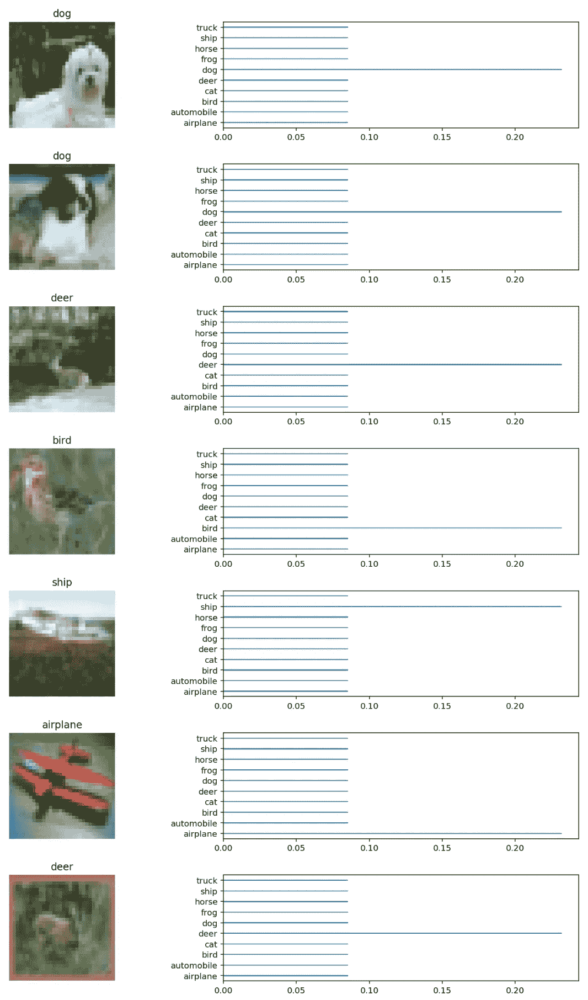

# Tensorflow 中的迁移学习(CIFAR-10 上的 VGG19):第二部分

> 原文：<https://towardsdatascience.com/transfer-learning-in-tensorflow-5d2b6ad495cb?source=collection_archive---------3----------------------->

Photo by [Lacie Slezak](https://unsplash.com/@nbb_photos?utm_source=medium&utm_medium=referral) on [Unsplash](https://unsplash.com?utm_source=medium&utm_medium=referral)

这是 Tensorflow 中迁移学习的第二部分(CIFAR-10 上的 VGG19)。第一部分可以在这里找到[。前一篇文章已经给出了关于“迁移学习”、“模型选择”、“模型实现选择”、“知道如何创建模型”和“知道最后一层”的描述。](https://medium.com/@parkchansung/transfer-learning-in-tensorflow-9e4f7eae3bb4)

简而言之，第一部分是训练和预测前的准备工作。在本文(第 2 部分)中，我将介绍如何加载预先训练的参数，如何重新缩放输入图像，如何选择批量大小，然后我们将研究结果。你可以在我的 Github 库上找到 [jupyter 笔记本。](https://github.com/deep-diver/CIFAR10-VGG19-Tensorflow)

# 知道如何加载预先训练好的重量

如果您从官方网站下载重量，并试图将它们加载到您自己的模型中，这将是一项艰巨的工作。这将在一个单独的故事中解释，我以后会写它。然而，如果您已经找到了一个方便的实现，那么这一步就没有必要了。事实上，几乎每个第三方实现都附带了实用函数。

对于张量网，当你在 tf 上运行 pretrained()方法时。会话，它将开始下载预先训练好的参数并为您加载。这很简单。(提醒一下，logits 是 tensornets 自己创建的 VGG19 模型。VGG19())

# 知道如何重新缩放原始图像(数据)以适合模型

在第 1 部分中，我们看到 ImageNet 的输入图像的形状是(224，224，3)，我们准备了大小完全相同的 tf.placeholder。然而， [CIFAR-10](https://www.cs.toronto.edu/~kriz/cifar.html) 中的图像有一个不同的形状，(32，32，3)，相当小。不同形状的图像不能输入到现有的模型中，因为矩阵乘法不起作用。相反，我们应该做的是将图像重新缩放到(224，224，3)。

重新缩放的过程可以通过***skimage . transform***包来处理。***skim age . transform***包附带了[***resize***](http://scikit-image.org/docs/dev/api/skimage.transform.html#skimage.transform.resize)*方法。它有点像 ***resize(image，output_shape，…)*** 。有很多参数需要传递，但前两个是最重要的。您传递带有所需 output_shape 的原始图像，在我们的例子中是(224，224，3)，然后 ***resize*** 将返回重新缩放的图像。*

*在重新缩放图像之后，我们需要将它们堆叠在一个数组中，以便可以将一批图像输入到模型中。*

# *批量*

*批量大小会受到您的设置环境和您选择的模型的影响。如第 1 部分所示，VGG16 和 VGG19 的尺寸相对较大。这意味着如果你批量分配大量的输入图像，物理内存将无法处理它。如果在 GPU 上运行，这个问题可能会更敏感，因为 GPU 通常内存较少。*

*就我而言，我已经在 11GB 内存的英伟达 GTX 1080Ti 上运行了培训。我已经试验过像 256 这样的大批量，并且随着时间的推移我减少了这个数量。原来我的 GPU 一次只能负担 32 的批量大小。*

# *有效集内的精度测量*

*如果你在那里寻找一些简单的深度学习例子，你会发现他们试图评估整个有效集的准确性。但是，我发现 VGG16 和 VGG19 型号并不是这样。正如我在上一节中解释的那样，我的 GPU 一次只能处理 32 张图片，而我的有效图片集中有 5000 张图片。*

*因此，我决定对批处理中的有效集运行精度测量过程。*

# *结果*

*下面的截图就是结果。我从测试集中随机抽取了 10 张图片。正如你所看到的，VGG19 模型在 CIFAR-10 图像数据集上学习得很好，即使它只有这么小的图像。*

**

# *摘要*

*在结束这个故事之前，我想简单总结一下。*

*   ***迁移学习**是**建立图像分类系统的良好起点***
*   *选择**型号取决于**你的**物理(硬件)** **环境**和**你的团队的目标**(有多少种类？).*
*   *选择**模型实现**并不重要，但是**有助于简化整个过程**。*
*   *使用**第三方实现**时，要知道三件事。**‘如何创建模型？’、‘最后一层是什么？’，以及“如何加载预训练参数？**'*
*   ***重要的是**到**知道如何重新缩放**你自己的输入图像以适合所选的模型(使用 skimage.transform 包)。*
*   ***应根据您的物理(硬件)环境仔细考虑批次大小**。*