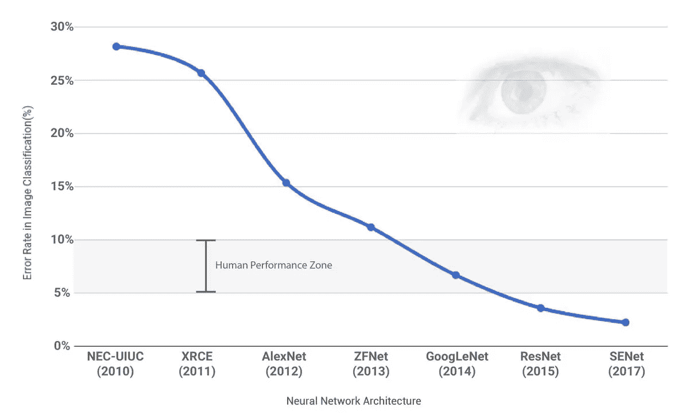
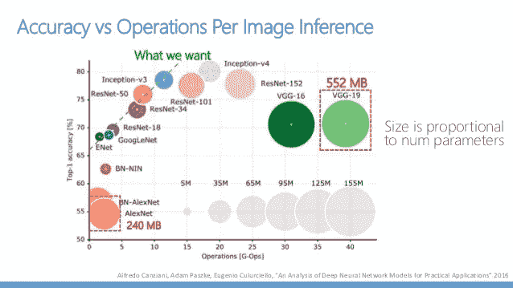
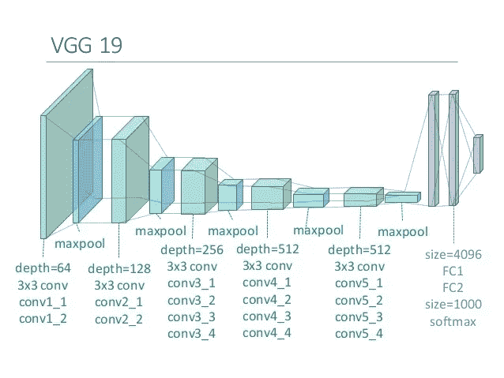
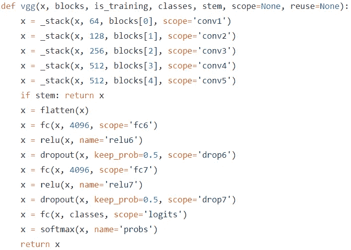

# Tensorflow 中的迁移学习(CIFAR-10 上的 VGG19):第 1 部分

> 原文：<https://towardsdatascience.com/transfer-learning-in-tensorflow-9e4f7eae3bb4?source=collection_archive---------2----------------------->

# **简介**

*这个故事的第二部分可以在这里找到***。**

*这个故事介绍了如何用预训练的 VGG19 模型训练 CIFAR-10 数据集。我将使用 [tensornets](https://github.com/taehoonlee/tensornets) 中包含的 VGG19。本文的主要目标是理解迁移学习的概念，以及在这个过程中应该关注哪些步骤。你可以在这里找到这个故事的笔记本。*

*我之前写过一个[笔记本](https://github.com/deep-diver/CIFAR10-img-classification-tensorflow)和一个[故事](https://medium.com/@parkchansung/cifar-10-image-classification-in-tensorflow-5b501f7dc77c)关于建立经典 CNN 模型来训练 CIFAR-10 数据集。这样，我可以比较最先进的 CNN 模型和基本的 CNN 模型之间的性能。*

# ***迁移学习***

**

***Winners of ILSVRC since ‘10***

*自 2012 年 AlexNet 出现以来，基于深度学习的图像分类任务得到了极大的改善。一路走来，已经提出了很多 CNN 模型。即使其中一些没有赢得 ILSVRC，但它们如 VGG16 因其简单和低损失率而受到欢迎。*

*即使使用高端 GPU，针对整个 ImageNet 数据库训练模型也需要几周时间。如果我们能够重用来自 ILSVRC 的经过验证的模型，这将是理想的，这样我们就不需要在训练和验证上花费大量时间。迁移学习正是我们想要的。*

*迁移学习就是从别人那里借用 CNN 架构及其预先训练好的参数。当我们在预训练参数的基础上训练我们自己的数据时，我们可以很容易地达到目标精度。*

# *型号选择*

*在潜入之前，你必须选择选择哪种型号。这完全与你的物理环境和你的团队的目标有关。*

*由于 ILSVRC 要求模型对 1000 种图像进行分类，因此一些建议的模型无法显示出超强的性能。然而，如果你的目标是对 10 到 100 类图像进行分类，这些模型可能适合你的情况。*

*随着 CNN 模型的发展，最近的模型显示出相当复杂的结构。如果我们想要改变/修改整个层的某些部分，或者如果我们想要解决哪个部分是我们问题的瓶颈，理解模型在幕后如何工作是至关重要的。*

**

*from [AN ANALYSIS OF DEEP NEURAL NETWORK MODELS FOR PRACTICAL APPLICATIONS](https://arxiv.org/abs/1605.07678)*

*模型有多大？这通常与参数数量或层数有关。他们会提示你需要花多长时间进行训练。特别是，当你使用 GPU 硬件时，应该充分考虑参数的数量，因为 GPU 的内存资源有限。*

*对于我来说，出于某些原因，我选择了 VGG19 型号。**第一名**，尽管它没有赢得 ILSVRC，但它取得了第二名的好成绩。我只需要 10 类图像，所以我认为 VGG19 对于 CIFAR-10 已经足够了。**第二**，VGG19 架构很简单。如果你了解基本的 CNN 模型，你会立刻注意到 VGG19 看起来很相似。**第三个**，我有 11GB 内存的英伟达 GTX 1080Ti。这不是最好的选择，但我认为即使 VGG19 的尺寸很大，运行 VGG19 也足够了。**最后**，由于很多人使用 VGG16，我想尝试一下 VGG19。*

**

# *模型实现的选择*

*实际上，您可以为所选的 CNN 模型使用自己的实现。因为来自 ILSVRC 的模型在他们的网页上分享他们的成果，包括权重，你可以下载(像 [VGG](http://www.robots.ox.ac.uk/~vgg/research/very_deep/) )并把权重注入到你的实现中。*

*然而，不实现模型本身，而是从文件和验证任务中转换/注入权重，这需要相当长的时间。幸运的是，Github 中有一些开源的实现。只需要在搜索你想要哪个 CNN 模型，你要像 Tensorflow 或者 PyTorch 一样达到哪个平台(框架)就可以了。*

*对于我来说，我用的是 Tensorflow，碰巧选择了 VGG19。我发现了两个开源实现， [tensornets](https://github.com/taehoonlee/tensornets) 和 [vgg-tensorflow](https://github.com/machrisaa/tensorflow-vgg) 。有趣的是，tensornets 提供了几乎所有流行的 CNN 模型，包括像 YOLO 这样的本地化模型。我想我将来可能会经常使用它们中的一些，所以这就是为什么我选择 tensornets 来熟悉它。*

# *知道如何创建模型*

*没有比仔细阅读 README 文档更简单的方法来了解所选实现的用法。一般来说，第一步是知道如何创建/构建模型图。建立模型后，您可以将预先训练的参数(权重)加载到模型中。不用说，没有预先训练好的参数，就不是迁移学习而只是借用架构。*

*具体来说，对于张量网，VGG19()创建模型。你只需要指定两个自定义参数， ***is_training*** ，和 ***classes*** 。当您要针对 ImageNet 以外的数据集训练模型时，应将 ***is_training*** 设置为 ***True*** 。 ***classes*** 是要预测的图像的类别数，因此设置为 10，因为数据集来自 CIFAR-10。*

*需要记住的一点是，输入张量的形状应该始终是 ***【无，224，224，3】***。因为来自 ILSVRC 的每个模型都是在 ImageNet 提供的形状为(224，224，3)的图像上训练的，所以即使您自己的数据具有不同大小的图像，这也不应该改变。*

# *了解最后一层*

*您选择的模型的实际实现通常会有所不同。您应该知道模型的最后一层是什么，以便应用损失函数、优化器和执行准确性测试。通过代码本身，你可以很容易地发现模型是如何构建的。以下截图摘自 tensornets github repo。*

**

*可以看到，tensornets 的 VGG19 返回最后一层作为 softmax 激活函数。稍微了解 Tensorflow 的话，***TF . nn . soft max _ cross _ entropy _ with _ logits()***函数用的有些重。然而，这个函数是为了同时应用 softmax 函数和交叉熵损失函数，所以这里不应该用于张量网。相反，可以使用仅提供交叉熵损失函数的***TF . losses . soft max _ cross _ entropy()***函数。除了应用内部 softmax 函数之外，这一个与前一个等效。*

*这是第一部分的全部内容。[在下一部分](/transfer-learning-in-tensorflow-5d2b6ad495cb)中，我会解释以下问题。*

1.  *如何进行预训练的负重？*
2.  *如何重新缩放图像大小以适合？*
3.  *怎么训练？如何衡量准确度？*
4.  *表演*

*我的深度学习背景是[uda city { Deep Learning N](https://www.udacity.com/course/deep-learning-nanodegree--nd101)D&[AI-nd](https://www.udacity.com/course/ai-artificial-intelligence-nanodegree--nd898)with contentrations([CV](https://www.udacity.com/course/computer-vision-nanodegree--nd891)， [NLP](https://www.udacity.com/course/natural-language-processing-nanodegree--nd892) ，VUI)}，[Coursera Deep Learning . AI Specialization](https://www.coursera.org/specializations/deep-learning)(AI-ND 被拆分成了 4 个不同的部分，我是和之前版本的 ND 一起完成的)。还有，我目前正在服用 [Udacity 数据分析师 ND](https://www.udacity.com/course/data-analyst-nanodegree--nd002) ，已经 80%完成。*

*最近在 [neptune.ai](https://neptune.ai/) 上发现了一篇非常有用的关于迁移学习的博文。由于我的帖子有些过时，如果你有机会，请查看更多最新技术，更深入的解释。*

*   *[迁移学习指南:包含 Keras 中图像和文本示例的实用教程](https://neptune.ai/blog/transfer-learning-guide-examples-for-images-and-text-in-keras)*