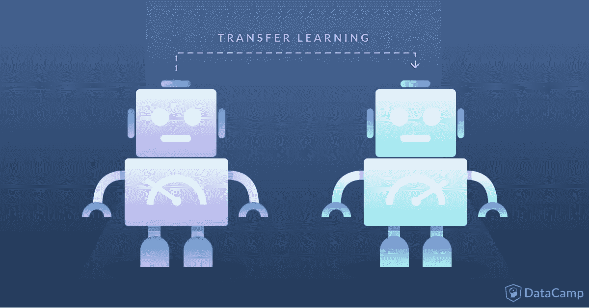
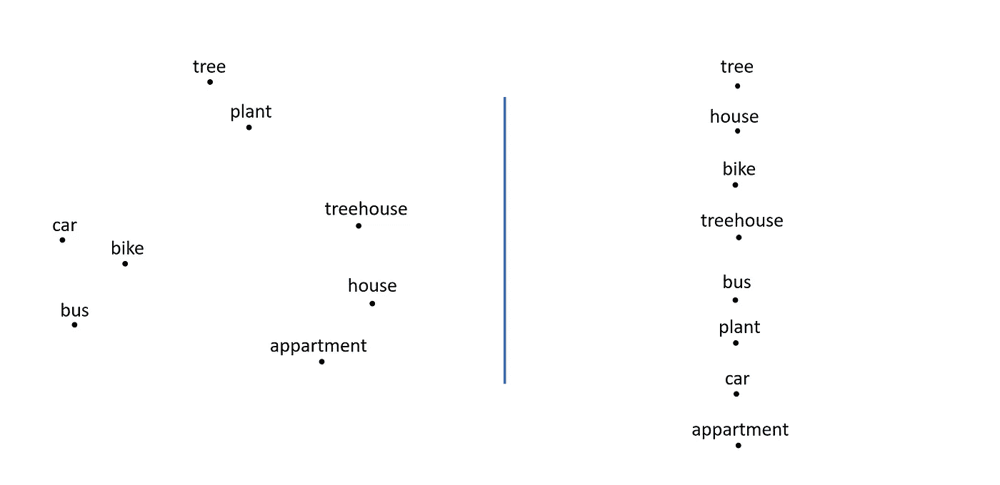
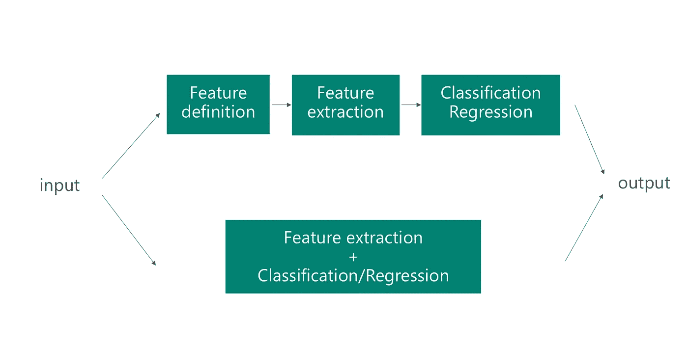

# 迁移学习:利用大数据集的洞察力

> 原文：<https://towardsdatascience.com/transfer-learning-leveraging-insights-from-large-data-sets-d5435071ec5a?source=collection_archive---------2----------------------->

在这篇博文中，您将了解什么是迁移学习，它的一些应用是什么，以及为什么它是数据科学家的关键技能。

迁移学习不是机器学习模型或技术；它更像是机器学习中的一种“设计方法论”。例如，另一种“设计方法”是主动学习。

Originally published at [https://www.datacamp.com/community/tutorials/transfer-learning](https://www.datacamp.com/community/tutorials/transfer-learning)

这篇博文是迁移学习系列的第一篇。你可以在这里找到第二篇博文，讨论迁移学习的两个应用[。](https://medium.com/@lars.hulstaert/applying-transfer-learning-in-nlp-and-cv-d4aaddd7ca90)

在后续的博客文章中，我将解释如何将主动学习与迁移学习结合起来，以最佳方式利用现有的(和新的)数据。从广义上讲，当机器学习应用利用外部信息来提高性能或泛化能力时，它们使用迁移学习。

**迁移学习:一个定义**

迁移学习的一般思想是在只有少量标记数据的环境中，使用从有大量标记数据的任务中学到的知识。创建带标签的数据非常昂贵，因此最大限度地利用现有数据集是关键。

在传统的机器学习模型中，主要目标是基于从训练数据中学习到的模式来概括看不见的数据。在迁移学习中，你试图从已经学习的不同任务的模式开始启动这一概括过程。本质上，你不是从一张白纸(通常是随机初始化的)开始学习过程，而是从已经学会的解决不同任务的模式开始。

Being able to distinguish lines and shapes (left) from an image makes it easier to determine if something is a 'car' than having to start from the raw pixel values. Transfer learning allows you to leverage learned patterns from other computer vision models.

Different approaches exist to represent words in NLP (a word embedding like representation on the left and a BoW like representation on the right). With transfer learning a machine learning model can leverage the relationships that exist between different words.

知识和模式的转移在许多领域都是可能的。今天的帖子将通过查看这些不同领域的几个例子来说明迁移学习。目标是激励数据科学家在他们的机器学习项目中尝试迁移学习，并让他们意识到优势和劣势。

我认为对迁移学习的良好理解是数据科学家的一项关键技能，原因有三:

*   迁移学习在任何学习中都是必不可少的。人类并不是为了成功完成每一项任务或问题而被教会的。每个人都会遇到从未遇到过的情况，而我们仍然能够以临时的方式解决问题。从大量经验中学习并将“知识”输出到新环境中的能力正是迁移学习的意义所在。从这个角度来看，迁移学习和概括在概念层面上非常相似。主要区别在于迁移学习通常用于“跨任务转移知识，而不是在特定任务内概括”。因此，迁移学习本质上与所有机器学习模型中必需的一般化思想相关联。
*   迁移学习是确保深度学习技术在大量小数据设置中取得突破的关键。深度学习在研究中几乎无处不在，但许多现实生活中的场景通常没有数百万个带标签的数据点来训练模型。深度学习技术需要大量数据来调整神经网络中的数百万个参数。特别是在监督学习的情况下，这意味着你需要大量(非常昂贵的)标记数据。给图像加标签听起来微不足道，但例如在自然语言处理(NLP)中，需要专业知识来创建一个大的带标签的数据集。例如，Penn treebank，一个词性标注语料库，历时 7 年，需要许多训练有素的语言学家的密切合作。为了使神经网络成为可行的选择，迁移学习是减少所需数据集大小的一种方式。其他可行的选择正在转向更受概率启发的模型，这些模型通常更适合处理有限的数据集。
*   迁移学习有明显的优点也有缺点。理解这些缺点对于成功的机器学习应用至关重要。知识的转移只有在“适当”的时候才是可能的。在这种情况下，准确定义适当的含义并不容易，通常需要进行实验。你不应该相信一个开着玩具车到处跑的小孩会开法拉利。同样的原则也适用于迁移学习:虽然很难量化，但迁移学习是有上限的。这不是一个适合所有问题的解决方案。

**迁移学习的一般概念**

*迁移学习的要求*

迁移学习，顾名思义，需要将知识从一个领域转移到另一个领域的能力。迁移学习可以从较高的层面来解释。一个例子是 NLP 中的体系结构可以在序列预测问题中重用，因为许多 NLP 问题可以固有地简化为序列预测问题。迁移学习也可以从一个较低的层面来理解，你实际上是在一个不同的模型中重复使用一个模型的参数(跳格，连续单词袋，等等。).迁移学习的要求一方面是问题特定的，另一方面是模型特定的。接下来的两节将分别讨论迁移学习的高级和低级方法。尽管在文献中你会发现这些概念有不同的名称，迁移学习的总体概念仍然存在。

*多任务学习*

在多任务学习中，你同时在不同的任务上训练一个模型。通常，使用深度学习模型是因为它们可以灵活地适应。

网络体系结构以这样的方式进行调整，即第一层用于不同的任务，随后是不同的任务专用层和不同任务的输出。总的想法是，通过在不同的任务上训练网络，网络将更好地一般化，因为模型需要在需要类似“知识”或“处理”的任务上表现良好。

自然语言处理的一个例子是最终目标是执行实体识别的模型。除了纯粹在实体识别任务上训练模型，您还可以使用它来执行词性分类、下一个单词预测……因此，模型将受益于从这些任务和不同数据集学习到的结构。我强烈推荐 [Sebastian Ruder 关于多任务学习的博客](http://ruder.io/multi-task/)来了解更多关于多任务学习的内容。

*特瑞*

深度学习模型的一大优势是特征提取是‘自动’的。基于标记的数据和反向传播，网络能够确定任务的有用特征。网络“计算出”输入的哪一部分是重要的，以便例如对图像进行分类。这意味着特征定义的手动工作被抽象掉了。深度学习网络可以在其他问题中重用，因为提取的特征类型通常对其他问题也很有用。本质上，在特征化器中，你使用网络的第一层来确定有用的特征，但是你不使用网络的输出，因为它太特定于任务。

鉴于深度学习系统擅长特征提取，如何重用现有网络来执行其他任务的特征提取？可以将数据样本输入网络，并将网络中的一个中间层作为输出。这个中间层可以被解释为原始数据的固定长度、经过处理的表示。通常，特征的概念用于计算机视觉的上下文中。图像然后被输入到预先训练好的网络(例如，VGG 或 AlexNet)中，并对新的数据表示使用不同的机器学习方法。提取中间层作为图像的表示大大减少了原始数据的大小，使它们更适合于传统的机器学习技术(例如，与原始数据相比，例如，128×128 = 16384 维，逻辑回归或 SVM 在图像的小表示(如 128 维)下工作得更好)。

在下一篇博文中，我将更深入地讨论迁移学习的两个应用，它们都有具体的例子！

如果你有任何问题，我很乐意在评论中阅读。如果你想收到我博客上的更新，请在 [Medium](https://medium.com/@lars.hulstaert) 或 [Twitter](https://twitter.com/LarsHulstaert) 上关注我！