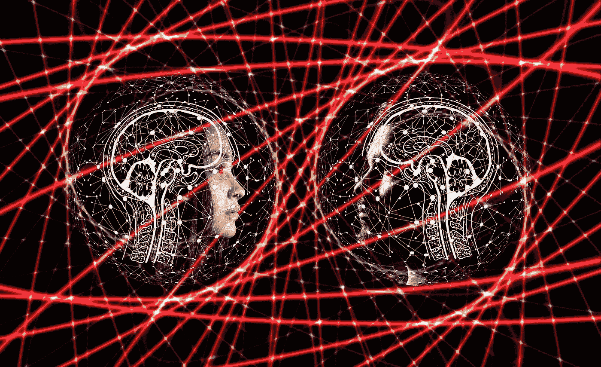
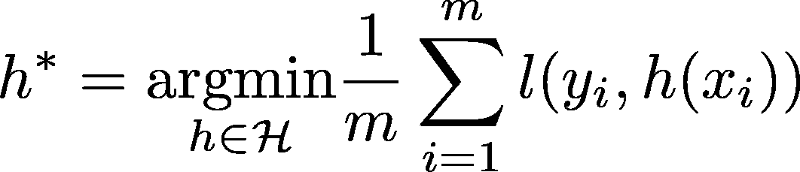
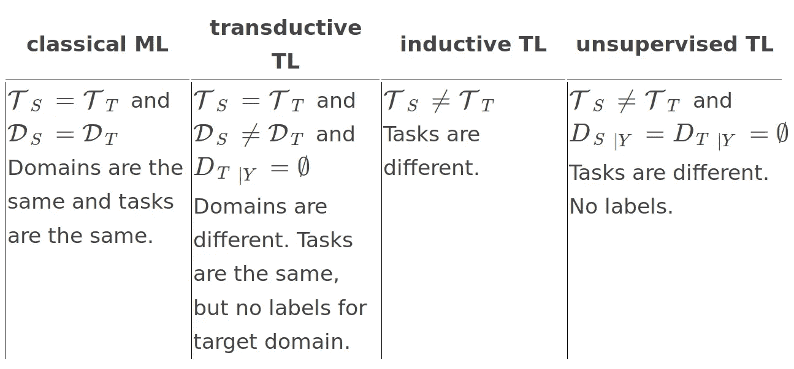
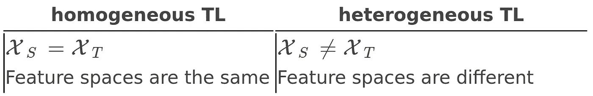

# 迁移学习—第一部分

> 原文：<https://towardsdatascience.com/transfer-learning-part-1-4c2c7839a4b9?source=collection_archive---------26----------------------->

什么是迁移学习(TL)，它与经典机器学习(ML)有什么不同？

ML 的大谎言是训练数据的分布与模型将要使用的数据的分布相同。如果违反了这个假设，即数据在不同的特征空间上有不同的分布，会怎么样呢？

当有足够的数据可用时，可以简单地根据新数据重新训练模型，并完全丢弃旧数据。这并不总是可能的。但是，有一种方法可以改善。如果已知训练数据和其他数据之间存在关系，则将从训练数据获得的知识转移(或转移学习)到其他数据的模型会有所帮助。

迁移学习不同于经典的 ML 设置:不是在一个设置中学习，而是在一个设置中学习的知识被重用来提高在另一个设置中的学习。迁移学习受到人类学习者利用现有知识和技能的方式的启发:知道如何阅读文献的人比根本不知道如何阅读的人更有可能成功阅读科学论文。在监督学习的背景下，迁移学习意味着能够重用在一个设置中学习的特征和标签之间的依赖结构的知识，以改进在另一个设置中的依赖结构的推断。在 Dataswati，我们对这种迁移学习特别感兴趣，我个人也花了相当一部分时间研究这些问题。

在这篇文章中，我将回顾迁移学习的不同方面，但首先，谈谈经典的监督机器学习设置。

我们有一个数据集 *D* ，包含特征向量的样本( *x* ∈ 𝒳)和相应的标签(*y*∈𝒴):*d*= {(*Xi*，*伊* ) : *i* = 1 *，…，m* }。 *D* 由训练实例集*D*|*X*= {*Xi*:*I*= 1*，…，m* }，以及对应标签集 *D* | *Y* = { *伊* : *i* = 1 *，…，组成这里的 *m* 是样本大小。所有的配对( *x* ， *y* )都被假设为从同一个联合分布 *P* ( *X* ， *Y* )(独立同分布假设)中独立采样，反映了随机变量 *X* 和 *Y* 之间的相关性。换句话说，(*，*易*)是对所有 *i* 的一个实现( *X* ，*Y*)∽*P*(*X*， *Y* )。我们的目标是用 *D* 学习一个函数 *h* : 𝒳 → 𝒴 ( *h* 为“假设”)，使 *h* 逼近 *x* 和 *y* 之间的真实关系，这是对*p*(*y*|*x*=【的一些总结当我们在寻找一个好的 *h* 时，我们将我们的搜索限制在某类函数ℋ(例如线性模型)， *h* ∈ ℋ.如果ℋ不太复杂，样本量 *m* 足够大，我们可以学习“好” *h* (例如使用[经验风险最小化](https://en.wikipedia.org/wiki/Empirical_risk_minimization):**

**

*ERM algorithm*

*其中 *l* 是某个损失函数)使得 *h* 不仅在( *x* 、 *y* ) ∈ *D* )上，而且在其他数据( *x* 、上提供了 *x* 和 *y* 之间真实关系的良好近似*

*如果我们没有足够的数据或者没有标签怎么办？有希望吗？*

*如果…会怎样*

*   *…我们有几个不同的数据集，但具有相似的 X-Y 依赖结构？*
*   *…我们只有其中一些数据集的标签，而没有其他数据集的标签，我们希望在没有标签可用时进行预测？*
*   *…当我们有另一个具有大样本量和相似但不同的依赖结构的数据集时，我们想要学习对一个小样本量数据集的依赖？*
*   *…我们有所有这些的组合？*

*的确，有一种希望，叫做……
……转移学习。*

*Pan，Yang 等人(2010)和 Weiss，Khoshgoftaar 和 Wang (2016)对深度学习热之前的迁移学习进行了概述。潘、杨等(2010)将领域定义为一个特征空间，并结合该空间上的概率分布=(， *P* ( *X* ))。一个任务被正式定义为𝒯 = (𝒴， *f* ，这里 *f* 为真，但未知(可能是随机的)函数 *f* : 𝒳 → 𝒴，我们试图用 *h* ∈ ℋ.来近似*

*为了定义迁移学习(TL)的基本类型，让我们考虑一个简化的设置，此时我们只有两个域，每个域一个任务:源域𝒟 *S* 和任务𝒯 *S* ，目标域𝒟 *T* 和任务𝒯 *T* 。在这个简单的设定中，TL 旨在通过使用𝒯 *S* 、𝒟 *S* 中的知识以及𝒯 *T* 、𝒟 *T* 、𝒯 *S* ≠ 𝒯 *T* 或𝒟 *S* ≠ 𝒟 *T* 来提高 *fT* 的学习。*

*下表总结了与传统 ML 相比的 TL 类型。*

**

*Types of transfer learning: inductive, transductive, and unsupervised*

*可以基于特征空间进行额外的分类:*

**

*Homogeneous and heterogeneous transfer learning*

*迁移学习最常见的情况是当特征空间和分布都不同时，任务也不同时。*

*潘、杨等人(2010)根据“传递什么”的问题对翻译策略进行了分类:*

*   ***基于实例的迁移学习**。假设来自源域的一些数据可以在目标域中重用。这里使用了重要性抽样和实例重新加权。*
*   ***特征表示转移**。学习特征表示 *r* 以便于对 *r(X)* 和 *Y* 之间的相关性进行建模。然后用它来提高目标任务的性能。在神经网络的上下文中，可以在源域中训练监督模型，然后从最后一层中的一层获取表示，以转换目标域中的数据，然后在该转换的数据上训练另一个模型。*
*   ***参数传递**。假设源任务和目标任务共享一些参数或先验。简单情况下当 *hS* 、 *hT* ∈ ℋ、*hs*=*f*(*x*； *θS* )，*hT*=*f*(*x*； *θT* ，表示 *θS* 与 *θT* 部分相似。在神经网络的背景下，人们可以采用像 VGG 这样的预训练模型，并根据自己的特定任务数据重新训练最后几层(重新训练一小部分 *θS* )。*

*在这一系列的文章中，我将回顾一下目标语言的一些最新发展，包括领域适应、少量学习和多领域迁移学习的最一般的设置。*

*在同质直推 TL (𝒳 *S* = 𝒳 *T* = 𝒳)的框架中，领域适应(在来自一个联合分布的数据上训练一个模型，并在来自另一个联合分布的数据上使用它)在过去十年中受到了极大的关注，特别是在深度学习的背景下。*

*人们经常希望找到变换 *ϕS* 、 *ϕT* : 𝒳 → 𝒳̃，以便变换后的目标数据的分布与变换后的源数据的分布相同，即*p*(*ϕs*(*x*)=*p*(*ϕt*(*x*)对于 *X* ∈这里的希望是，我们可以有效地将在转换后的源数据上训练的模型应用于转换后的目标数据。*

*在分类(Ben-David 等人，2007 年，2010 年)和回归(Cortes 和 Mohri，2011 年)问题的背景下，从理论上研究了领域适应。Ben-David 等人(2007 年)研究了在源领域数据上训练的分类器可用于目标领域的条件。他们证明了目标域中误差的上限，该上限被表示为源域中误差的函数。他们在 Ben-David 等人(2010)中进一步扩展了他们的分析。总之，该理论表明，对于有效的域适应，需要在数据表示上训练模型，根据该数据表示不可能区分源域和目标域。*

*我首先提到一些通用方法。*

*Daumé III (2009)提出了一种非常简单的领域适应方法。Daumé III (2009)通过对源域和目标域应用简单的数据扩充(复制特征或填充零),然后在从两个域收集的扩充数据上训练模型，将域适应问题转化为监督学习问题。然而，他们的方法需要目标域中的标记数据( *DT* ∣ *Y* ≠ ∅).)*

*在目标域中没有标记数据的情况下，可以找到对齐源和目标分布的转换。Sun，Feng 和 Saenko (2016)提出了相关对齐(CORAL)算法，该算法对齐源和目标分布的二阶统计量。Sun，Feng 和 Saenko (2016)表明，CORAL 可以优于一些基于现代深度学习的方法。*

*Si、Tao 和 Geng (2010)使用基于 Bregman 散度的正则化进行跨域无监督降维，并提出了迁移学习感知版本的 PCA、Fisher 线性判别分析()、局部保持投影()、边际 Fisher 分析(MFA)和判别局部对齐()。Bregman 散度用于最小化源域和目标域中投影数据分布之间的差异。*

*潘等人(2011)在其转移成分分析()中使用最大平均差异()作为分布距离的度量。MMD 用于学习数据集的变换(传递分量),以便最小化分布距离。Long 等人(2013)提出了联合分布适应(JDA)，通过包括条件分布最小化的目标来推广 TCA。*

*最近，最优传输被成功地用于领域适应(Courty，Flamary，和 Tuia 2014Courty，Flamary，Tuia 等 2017；Courty，Flamary，Habrard 等人 2017)。最佳传输通过最小化分布之间的 Wasserstein 距离，找到一个域中的数据到另一个域的转换(Peyré，Cuturi 等，2017)。*

*在基于混合模型的学习环境中，Beninel 等人(2012 年)提出了一种映射源数据的方法，以便模拟转换数据的分布等于模拟目标的分布。*

*Glorot、Bordes 和 Bengio (2011)在情感分类的上下文中使用了基于特征表示的领域适应。使用包含四个不同领域数据的简化版亚马逊数据集，他们首先从所有领域收集数据，并使用堆叠去噪 Autoencoder (Vincent et al. 2008)对数据的词袋表示学习无监督的特征表示。然后，对于每个源-目标域对，他们在源数据的表示上训练二进制 SVM 分类器，并将其用于目标数据的表示。*

*Ganin 和 Lempitsky (2014)提出了一种神经网络架构，该架构将领域适应和深度特征学习结合在一个训练过程中。类似于对抗性训练(Goodfellow 等人，2014 年)，他们同时训练了两个模型:I)域分类器网络，用于区分转换后的源数据和目标数据；以及 ii)预测器网络，用于预测源域中的标签以及“愚弄”域分类器(通过其损失函数中的正则化项实现)。然而，他们引入了允许端到端训练的梯度反转层，而不是域分类器和预测器的交替训练。他们在一系列计算机视觉数据集上展示了他们方法的效率:SVHN、MNIST 和交通标志数据集。Ajakan 等人(2014 年)有效地将一个非常相似的模型应用于亚马逊评论情感分析数据集。Ganin 等人(2016)提出了对这种神经网络的扩展分析，即所谓的域对抗适应神经网络。*

*如需继续，[请点击此处](https://medium.com/dataswati-garage/transfer-learning-part-2-zero-one-few-shot-learning-8d23d2f8583b)。你会发现第二部分复习零/少投学习。在即将到来的第三部分，我还将回顾多域迁移学习，所以如果你不想错过这个故事，请确保[关注我们](https://medium.com/dataswati-garage)。*

*阿贾坎、哈娜、帕斯卡尔·日尔曼、雨果·拉罗歇尔、弗朗索瓦·拉维奥莱特和马里奥·马尔尚。2014."领域对抗性神经网络." *arXiv 预印本 arXiv:1412.4446* 。*

*本-大卫、沙伊、约翰-布利泽、科比-克拉默、亚历克斯-库勒萨、费尔南多-佩雷拉和詹妮弗-沃特曼-沃恩。2010."从不同领域学习的理论."*机器学习*79(1–2):151–75。*

*本-大卫，夏伊，约翰-布利泽，科比-克莱默和费尔南多-佩雷拉。2007."分析领域适应的表现."在*神经信息处理系统的进展*，137–44。*

*贝尼内尔、法里德、克里斯托夫·比尔纳奇、查尔斯·布维龙、朱利安·雅克和亚历山大·卢尔梅。2012.*统计学习中知识转移的参数链接模型*。新星出版社。*

*科尔特斯，科琳娜，和梅尔亚尔·莫赫利。2011."回归中的领域适应."在*算法学习理论国际会议*中，308–23。斯普林格。*

*库蒂、尼古拉斯、雷米·弗拉芒里、阿毛里·哈布拉和阿兰·拉科托马莫尼。2017."领域适应的联合分配最佳运输."在*神经信息处理系统的进展*，3730–9。*

*库蒂、尼古拉斯、雷米·弗拉芒里和德维斯·图伊亚。2014."正则化最佳传输的域适应."在*关于数据库中的机器学习和知识发现的欧洲联合会议*，274–89。斯普林格。*

*库蒂、尼古拉斯、雷米·弗拉芒里、德维斯·图伊亚和阿兰·拉科托马莫尼。2017."领域适应的最佳传输."IEEE 模式分析和机器智能汇刊 39(9):1853–65。*

*多梅三世，哈尔。2009.“令人沮丧的简单领域适应。” *arXiv 预印本 arXiv:0907.1815* 。*

*加宁，雅罗斯拉夫和维克多·兰皮茨基。2014."无监督领域适应反向传播." *arXiv 预印本 arXiv:1409.7495* 。*

*加宁、雅罗斯拉夫、叶夫根尼娅·乌斯季诺娃、哈娜·阿贾坎、帕斯卡尔·热尔曼、雨果·拉罗歇尔、弗朗索瓦·拉维奥莱特、马里奥·马尔尚和维克多·兰皮茨基。2016."神经网络的领域对抗训练."《机器学习研究杂志》17(1):2096–30。*

*格洛特，泽维尔，安托万·博德斯，约舒阿·本吉奥。2011."大规模情感分类的领域适应:一种深度学习方法."在*第 28 届机器学习国际会议(ICML-11)的会议录*，513–20 页。*

*古德菲勒、伊恩、让·普吉-阿巴迪、迈赫迪·米尔扎、徐炳、戴维·沃德-法利、谢尔吉尔·奥泽尔、亚伦·库维尔和约舒阿·本吉奥。2014."生成性对抗网络。"在*神经信息处理系统的进展*，2672–80。*

*龙、、、丁桂光、、孙、俞。2013."具有联合分布适应的转移特征学习."IEEE 计算机视觉国际会议论文集*，2200–2207。**

*潘、辛诺佳林、曾伟华、郭炳湘、杨强。2011."通过转移成分分析的领域适应."IEEE 神经网络汇刊 22(2):199–210。*

*潘、辛诺佳林、杨强等。2010."迁移学习综述."IEEE 知识与数据工程汇刊 22(10):1345–59。*

*佩雷、加布里埃尔、马尔科·库图里和其他人。2017.“计算最优运输。”*

*斯，斯，大成道，伯更。2010."转移子空间学习的基于 Bregman 散度的正则化."IEEE 知识与数据工程汇刊 22:929–42。*

*孙、、冯嘉实和凯特·桑科。2016."令人沮丧的简单领域适应的回归."在 *AAAI* ，6:8。*

*文森特、帕斯卡尔、雨果·拉罗歇尔、约舒阿·本吉奥和皮埃尔·安托万·曼扎戈尔。2008."用去噪自动编码器提取和合成鲁棒特征."第 25 届机器学习国际会议论文集，1096–1103。ACM。*

*魏斯、卡尔、塔希·科什戈夫塔尔和汪丁丁。2016."迁移学习综述."*大数据杂志* 3 (1): 9。*

**原载于 2018 年 11 月 19 日*[*medium.com*](https://medium.com/dataswati-garage/transfer-learning-part-1-c2f87de8df38)*。**