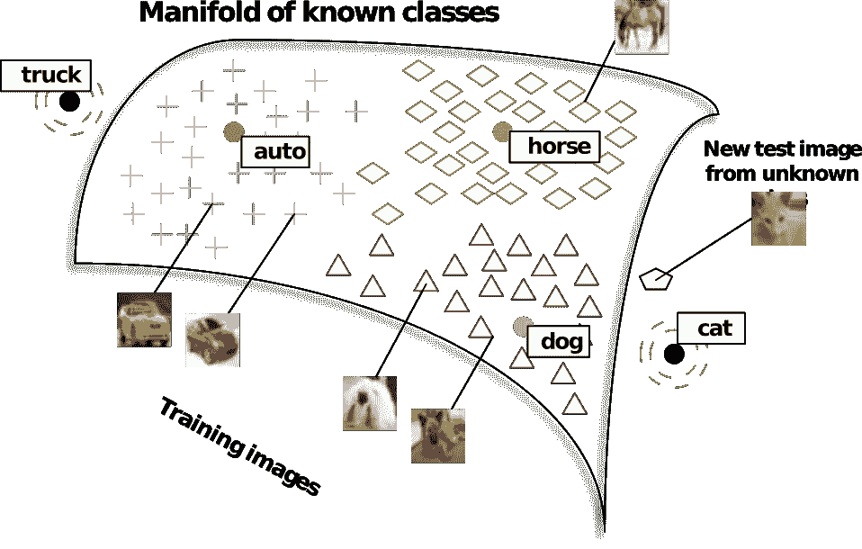
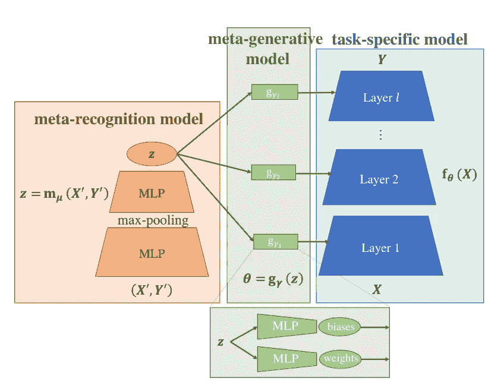

# 迁移学习—第二部分

> 原文：<https://towardsdatascience.com/transfer-learning-part-2-zero-one-few-shot-learning-94d972b6c022?source=collection_archive---------13----------------------->

## 零/一/少量学习

*这个故事的第一部分，请导航至*[*https://medium . com/dataswati-garage/transfer-learning-part-1-C2 f 87 de 8df 38*](https://medium.com/dataswati-garage/transfer-learning-part-1-c2f87de8df38)*。*

当数据丰富时，很容易训练模型。通常情况并非如此，人们只能从几个例子中学习。一种极端形式的迁移学习在这里会有所帮助。

想象一下，训练一个学习区分狗和狼的分类器，并且训练集中的所有狗都是牧羊犬。现在，你想对一张吉娃娃的图片进行分类。如果你有一些标记的吉娃娃图片，你可以试着用它们来适应你的模型。这是一个很少发生的学习问题。你的情况会变得更糟。想象一下，只有一个例子(一次性学习)或者根本没有标记的吉娃娃(零次学习)。如果有人试图使用你的狗/狼分类器对卡车进行分类，情况会变得更糟。你能调整你的模型来分类他的卡车吗？

乍一看，少射/零射学习的最坏情况似乎几乎是不可解的。但是，有一个解决方案。想想 k 近邻(kNN)。如果我们有一个提取输入的最相关特征的数据表示，并使分类变得容易，我们可以将一个新的无标签示例映射到这个表示，并使用 kNN 来确定标签。你可以告诉我:但是，等等，你不是受限于你训练数据中的标签吗？如果所有最近的邻居都不在附近呢？你是对的。这还不是零镜头学习，但是这种方案可以用于少镜头学习。在观察了几个新类的例子之后，你可以希望学会用 kNN 来识别新类。当然，如果你只在牧羊犬/狼的图像上学习你的特征映射，并且吉娃娃相关的特征被从表示中排除，这可能会出错。

## 零射击学习

想象一下，现在我们有了一个很好的映射，它映射输入的空间的所有点都被标记了。在这种情况下，基于 kNN 的方法将起作用。这里的问题是构造这样一个标记空间以及从特征空间到这个空间的映射。

我们可以采取更一般的方法来寻找一个好的代表。我们可以为标签和训练样本构建一个向量空间嵌入，使得训练样本和它的标签在这样一个公共空间中尽可能地相互靠近。

这种方法在图像分类中被积极地使用:为图像和单词学习公共空间嵌入，并且单词用作标签。如果我们有一个嵌入多个标签的向量空间，反映单词标签之间的语义关系，使得单词标签“狗”、“猫”和“哺乳动物”彼此之间比“桌子”更接近，而“桌子”比“猫”更接近“椅子”，这不是很好吗？我们将能够将新图像映射到该空间，然后获取最近邻的标签，即使它不在训练图像集中。幸运的是，可以从大量的文本数据中以无监督的方式学习这样的单词嵌入，参见 [word2vec](https://en.wikipedia.org/wiki/Word2vec) (Mikolov 等人 2013 年)、 [fastText](https://en.wikipedia.org/wiki/FastText) (Bojanowski 等人 2017 年)、 [GloVe](https://en.wikipedia.org/wiki/GloVe_%28machine_learning%29) (Pennington、Socher 和 Manning 2014 年)，或最近的 Poincare 嵌入(Nickel 和 Kiela 2017 年)。使用标记的数据，可以学习狗/狼的图像到单词嵌入空间的嵌入，使得狗的图像被映射到“狗”单词向量的邻域。当一个新的例子被给出时，它被映射到嵌入空间，并且最近的词向量(最近邻居)被作为这个例子的预测标签。

Socher 等人(2013 年)使用在维基百科文本上训练的预训练嵌入，他们学习了基于神经网络的图像到单词嵌入向量空间的映射。

Taken from Socher et al. (2013)

诺鲁齐等人(2013)提出了一种非常简单的方法来将图像嵌入到预训练的词向量嵌入空间中。在训练了多类别图像分类器之后，他们使用类别的预测概率来执行对应于类别标签的单词嵌入向量的概率加权平均。

Romera-Paredes 和 Torr (2015 年)开发了一种基于线性变换的零炮学习方法，但该方法需要根据属性对标签和训练样本进行表征。然后，他们学习矩阵，当矩阵与属性向量结合时，给出了到公共空间的线性映射。这与其他方法类似，但更具限制性，因为到公共空间的映射不是从端到端的数据中学习的，而是需要辅助信息进行训练。

关于零投学习的不同方法的比较，请参见冼等人(2018)。

## 少量学习

少量学习与[元学习](https://en.wikipedia.org/wiki/Meta_learning_%28computer_science%29)(学习如何学习)领域相关，需要一个模型从少量新数据中快速学习新任务。

Lake 等人(2011)提出了一种受人类学习简单视觉概念(手写字符)启发的一次性学习方法。在他们的模型中，手写字符是人们在绘图时使用的笔画的嘈杂组合。他们提出了一个生成模型，该模型学习一个笔画库，并将该库中的笔画组合起来生成字符。给定一个用于一次性学习的新字符和一个用于评估的候选字符，两个字符都被建模为笔画的叠加，Lake 等人(2011)估计了候选字符由与新字符相同的笔画组成并且这些笔画以类似方式混合的概率。

深度学习呢？首先，让我回到我们的 kNN 例子。是什么让 kNN 实现了少拍学习？这是记忆。记忆新的训练样本，然后当类似的新测试样本到达时，kNN 在其存储器中搜索类似的样本，并找到记忆的训练样本及其标签。然而，标准的深度学习架构不允许快速吸收(记忆)新数据，而是需要大量的训练。

为了解决这个问题，可以将 kNN 与通过深度学习(深度学习+基于 kNN 的记忆)获得的数据表示相结合。或者，人们可以尝试以更直接的方式用记忆来增强深度神经网络，从而实现端到端的训练。

Koch、Zemel 和 Salakhutdinov (2015)开发了基于最近邻分类的少镜头学习方法，通过连体神经网络学习相似性度量。连体神经网络是在 90 年代开发的(Bromley 等人，1994 年)，用于学习两个输入之间的相似性度量。暹罗网络由两个相同的子网(共享权重)组成，它们的输出端相连。每个子网接收自己的输入，整个网络的输出决定了两个输入之间的相似性。在 Koch、Zemel 和 Salakhutdinov (2015)了解了该指标后，使用了简单的最近邻分类器。

桑托罗等人(2016 年)开发了一种使用记忆增强神经网络(MANN)的少量学习方法。他们模型的想法类似于神经图灵机(Graves，Wayne 和 Danihelka，2014 年):一个用外部存储模块扩展的神经网络，因此模型是可微分的，可以进行端到端的训练。由于他们的训练程序，他们迫使网络学习一般知识，而快速的内存访问允许将这些一般知识快速绑定到新数据。

Vinyals 等人(2016 年)提出了一个神经网络模型，该模型实现了一个端到端的训练过程，该过程结合了特征提取和具有余弦相似性的可微分 kNN。他们使用一个网络来嵌入一小组已标记的图像(支持集)，使用另一个网络来嵌入一个未标记的图像到同一空间。然后，他们计算在支持集中的每个嵌入图像和嵌入的未标记图像之间计算的余弦相似性的 softmax 变换。这被用作来自支持集的标签的概率分布的近似值。然后，他们提出了一个改进方案，即使用整个支持集(上下文)来嵌入支持集中的每个示例以及未标记的测试示例(他们使用 LSTM 来实现这一点)。

Taken from Vinyals et al. (2016)

Ravi 和 Larochelle (2016)提出修改基于梯度的优化，以允许少量学习。在基于梯度的优化的一般观点中，在优化算法的每一步，优化器(比如 SGD)使用梯度信息来基于它们先前的值提出下一个参数。Ravi 和 Larochelle (2016)用参数更新历史、当前经验风险及其梯度的非线性函数取代了 SGD 更新规则(相对于梯度的线性)。具体来说，他们使用长短期记忆(LSTM)网络(Hochreiter 和 Schmidhuber 1997)来学习非线性更新规则，以训练神经网络。

在他们的模型不可知元学习算法(MAML)论文中，Finn，Abbeel 和 Levine (2017)提出了适用于任何可以用梯度下降训练的模型的少镜头学习方法。引用作者的话:“实际上，我们的目标是找到对任务变化敏感的模型参数，这样，当在损失梯度方向上改变时，参数的小变化将对从任务分布中提取的任何任务的损失函数产生大的改进”。目标是为所有任务学习一个模型，以便它的内部表示很好地适合所有任务(可转移)。为了实现这一点，首先，在几个训练示例上，为单个任务上的一个或多个梯度下降步骤训练通用模型。这产生了一个稍微更适合特定任务的模型，一个特定于任务的模型。第二，特定任务模型用于评估其他任务的累积损失。该多任务损失然后被用于执行元优化步骤:用梯度下降来更新通用模型的参数。

Taken from Wu et al. (2018)

Wu 等人(2018)提出了用于少镜头预测(MeLA)的元学习自动编码器。该模型由元识别模型组成，它以新数据的特征和标签作为输入，并返回一个潜在代码。该代码被用作元生成模型的输入，该元生成模型生成特定于任务的模型的参数。也就是说，特定于任务的模型不是通过梯度下降来训练的，而是从对应于一个任务的几个例子中生成的。此外，生成的模型可以用几个梯度步骤来改进。从对应于任务的几个例子中生成模型的能力可以被解释为模型空间中的插值。为了使它成功，用于训练 MeLA 的任务应该足够相似。

今天到此为止。感谢阅读。请关注我们，以免错过我们下一篇关于多领域/多任务迁移学习的文章。

## 参考

博雅诺斯基，皮奥特，爱德华·格雷夫，阿曼德·朱林和托马斯·米科洛夫。2017."用子词信息丰富词向量."计算语言学协会汇刊 5:135–46。

Bromley、Jane、Isabelle Guyon、Yann LeCun、Eduard Sä ckinger 和 Roopak Shah。1994."使用“连体”时间延迟神经网络的签名验证."在*神经信息处理系统的进展*，737–44。

芬恩，切尔西，彼得·阿贝耳和谢尔盖·莱文。2017."用于深度网络快速适应的模型不可知元学习."在 *ICML* 。

格雷夫斯，亚历克斯，格雷格韦恩和伊沃丹尼尔卡。2014.“神经图灵机。” *arXiv 预印本 arXiv:1410.5401* 。

Hochreiter，Sepp 和 Jürgen Schmidhuber。1997."长短期记忆"*神经计算*9(8):1735–80。

科赫、格雷戈里、理查德·泽梅尔和鲁斯兰·萨拉胡季诺夫。2015."用于一次性图像识别的连体神经网络."在 *ICML 深度学习工场*。第二卷。

莱克、布伦登、鲁斯兰·萨拉赫丁诺夫、杰森·格罗斯和约书亚·特南鲍姆。2011."简单视觉概念的一次性学习."在*认知科学学会年会的会议录*中。第 33 卷。

米科洛夫、托马斯、伊利亚·苏茨基弗、程凯、格雷戈·S·科拉多和杰夫·迪恩。2013."单词和短语的分布式表示及其组合性."在*神经信息处理系统的进展*，3111–9。

尼克尔、马克西米利安和杜韦·凯拉。2017."学习分层表示的庞加莱嵌入."在由 I. Guyon、U. V. Luxburg、S. Bengio、H. Wallach、R. Fergus、S. Vishwanathan 和 R. Garnett 编辑的《神经信息处理系统进展》30 中，6341–50。Curran Associates，Inc .[http://papers . nips . cc/paper/7213-poincare-embeddings-for-learning-hierarchical-presentations . pdf](http://papers.nips.cc/paper/7213-poincare-embeddings-for-learning-hierarchical-representations.pdf)。

诺鲁齐、穆罕默德、托马斯·米科洛夫、萨米·本吉奥、约拉姆·辛格、黄邦贤·施伦斯、安德里亚·弗洛姆、格雷戈里·科拉多和杰弗里·迪恩。2013."语义嵌入的凸组合零镜头学习."abs/1312.5650。

彭宁顿，杰弗里，理查德·索彻和克里斯托弗·曼宁。2014."手套:单词表示的全局向量."在*2014 年自然语言处理经验方法会议录*，1532–43。

拉维，沙钦和雨果·拉罗彻尔。2016."作为少量学习模型的最优化."英寸

罗梅拉-帕雷德斯，贝纳迪诺和菲利普·托尔。2015."一种简单得令人尴尬的零起点学习方法."在*机器学习国际会议*，2152–61。

桑托罗、亚当、谢尔盖·巴图诺夫、马修·博特文尼克、金奎大·威斯特拉和蒂莫西·p·莉莉卡普。2016."记忆增强神经网络的元学习."在 *ICML* 。

索彻、理查德、米林德·甘朱、克里斯托弗·曼宁和吴恩达。2013."通过跨模态迁移进行零射击学习."在*神经信息处理系统的进展*，935–43。

Vinyals、Oriol、Charles Blundell、Timothy P. Lillicrap、Koray Kavukcuoglu 和金奎大·威斯特拉。2016."一次性学习的匹配网络."在*辊隙*中。

吴、泰林、约翰·波利福伊、艾萨克·L·庄和马克斯·泰格马克。2018."用于少量预测的元学习自动编码器." *arXiv 预印本 arXiv:1807.09912* 。

冼、、Christoph H. Lampert、Bernt Schiele 和 Zeynep Akata。2018."零起点学习——对好、坏、丑的综合评价."IEEE 模式分析与机器智能汇刊*。*

*原载于 2018 年 12 月 7 日*[*medium.com*](https://medium.com/dataswati-garage/transfer-learning-part-2-zero-one-few-shot-learning-8d23d2f8583b)*。*