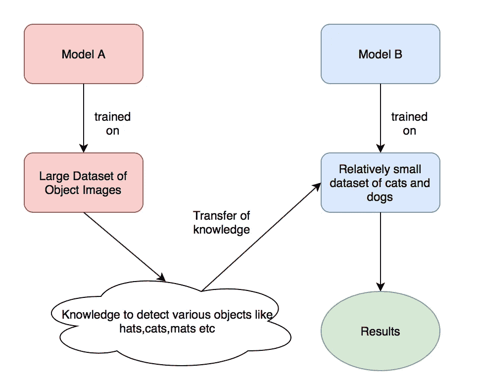
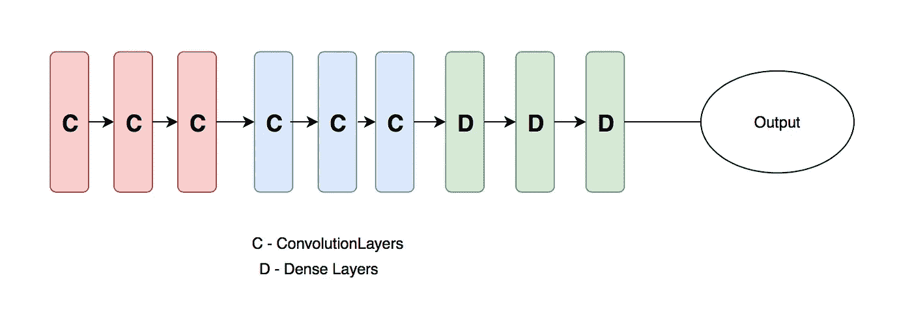
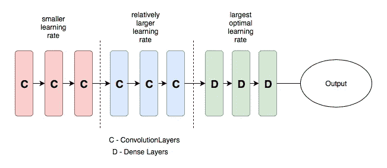

# 使用不同学习率的迁移学习

> 原文：<https://towardsdatascience.com/transfer-learning-using-differential-learning-rates-638455797f00?source=collection_archive---------0----------------------->

在这篇文章中，我将分享如何使用迁移学习将流行的深度学习模型用于自己的特定任务。我们将涵盖一些概念，如差异学习率，这甚至不是目前在一些深度学习库中实现的。这些是我作为国际研究员从 [fast.ai](http://www.fast.ai) 深度学习课程 2017 中了解到的。该课程内容将于 2018 年初作为 MOOC 向公众开放。

## 那么什么是迁移学习呢？

它是使用在一个过程/活动中学到的知识并将其应用于不同任务的过程。让我们举一个小例子，一个擅长 carroms 的玩家可以将该知识应用于学习如何玩台球游戏。

## 因此，进入我们的机器学习/深度学习视角…

这同样适用于我们的机器学习世界。让我们看看下面的图片。

Transfer Learning Example

比方说，模型 A 的任务是识别 1000 种物体，比如帽子、猫、垫子，我们手头就有这样一个训练有素的模型。现在让我们假设我们想要创建一个模型 B 来检测一个猫/狗分类器。即使我们有一个小数据集，我们也可以在模型 B 的训练过程中使用模型 A 的知识，并产生最先进的结果。

## 但是为什么要使用迁移学习呢？

每当我们想要使用机器学习来解决一个独特的问题时，我们很可能无法为我们的模型找到足够的数据。用较少的数据进行训练，结果不会太好。即使我们有大量数据，也有可能没有足够的资源(如 GPU)来获得高质量的结果。因此，迁移学习通过使用预先训练好的模型形式的知识来解决这些问题，这种模型是有人用大型数据集和资源创建的。

## 好吧，那你是怎么做的？

我们用 CNN 的一个网络图样本来理解一下。尽管实际上网络很大、很复杂并且包含各种其他单元。

Sample CNN diagram

最常用的方法是修改密集层，使网络输出适合我们手头的任务，并且只训练新增加的层。当任务相互关联，并且您有少量数据时，这种方法非常有效。例如，如果我们使用一个已经知道如何检测猫的预训练模型，如果我们想用少量数据创建一个猫/狗分类器，这种方法将会起作用。

第二种方法是在训练中甚至包括更接近密集块(图中的蓝色块)的卷积块。如果我们有一个中等大小的数据集，并且任务之间没有那么紧密的联系，那么这就更理想了。

第三种方法是使用预训练模型，但使用数据集训练所有层。这种方法效果很好，但是需要相对较大的数据集和 GPU 资源。如果我们选择这个选项，有几个很酷的技巧，我们将在下面介绍。

## 混合第一种和第三种方法。

如果我们决定使用第三种方法，最好将第一种方法应用于一些时期的训练，以使新添加的层权重达到更好的点。然后我们可以解冻所有的层，并遵循我们的第三种方法。

## 不同的学习率:

短语“不同的学习率”是指在我们的培训中，网络的不同部分有不同的学习率。其思想是将各层划分为不同的层组，并为每组设置不同的学习速率，以便获得理想的结果。简而言之，我们控制训练过程中网络各部分的权重变化率。

## 为什么？有什么帮助？

如果我们考虑上面的第三种方法，有一个小但重要的点值得注意。为了理解这一点，让我们回到 CNN 的示例图。

Sample CNN with differential learning rate

一般而言，红色图层学习边缘、形状等一般特征，中间的蓝色图层学习与数据集相关的特定细节。

鉴于上面的陈述，过多地改变初始层的学习权重不是一个好主意，因为它们已经擅长于它们应该做的事情(检测像边缘等特征)。中间层将了解复杂的特性，如果我们稍微修改它们，这些特性可能在某种程度上有助于我们的任务。所以，我们想稍微调整一下。

在这方面，不同的学习率有助于我们。我们现在可以把样本网络想象成三层组(红、蓝、绿)并设置不同的学习速率。最初的红色层将具有较小的学习率，因为我们不想过多地干扰它们，中间的蓝色层将具有比初始层更高的学习率，而最终的绿色层将具有最佳的最高学习率。

初始层和中间层的学习率的多少取决于预训练模型和我们需要的模型之间的数据相关性。例如，如果任务是创建一个狗/猫分类器，并且我们的预训练模型已经擅长识别猫，那么我们可以使用较小数量级的学习率。但是如果我们的任务是在卫星图像/医学图像上创建一些模型，那么我们的学习率会稍微高一些。

请注意，目前大部分深度学习库都不支持差异学习率。

## 好吧，给我看看代码…

无论我们讨论什么，我都会写一篇关于编码部分的详细文章。

## 结论:

根据手头的任务和资源，人们应该选择一种适当的迁移学习方法。一般来说，如果我们有大量的数据和资源，差异学习率的迁移学习会产生更好的结果。