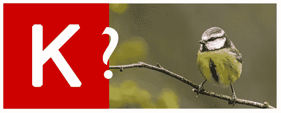
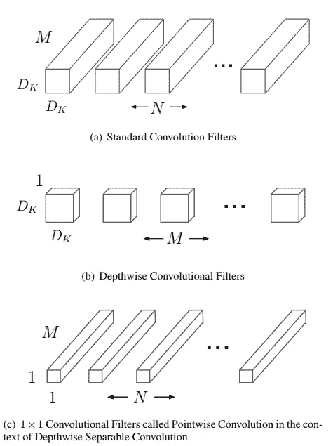
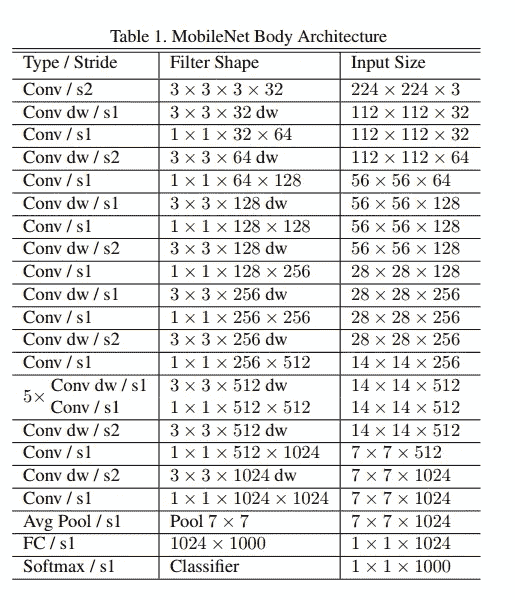
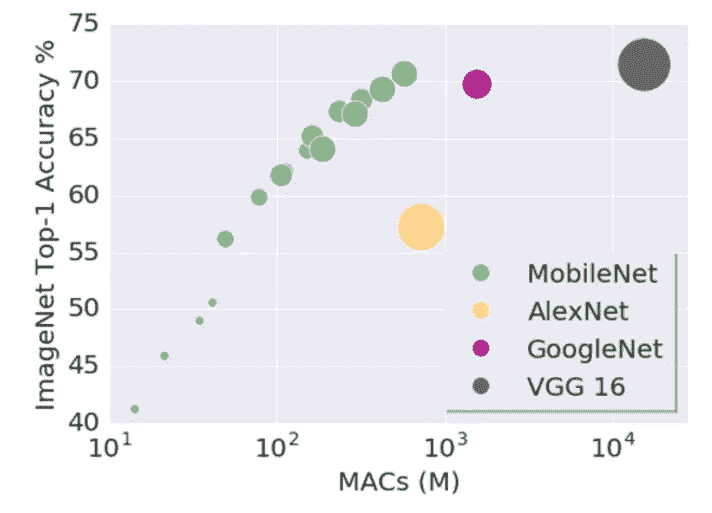
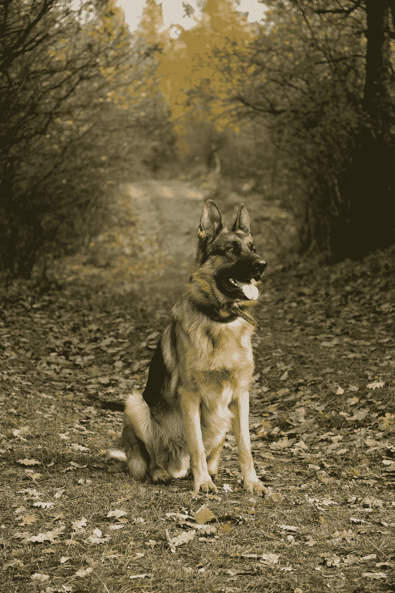
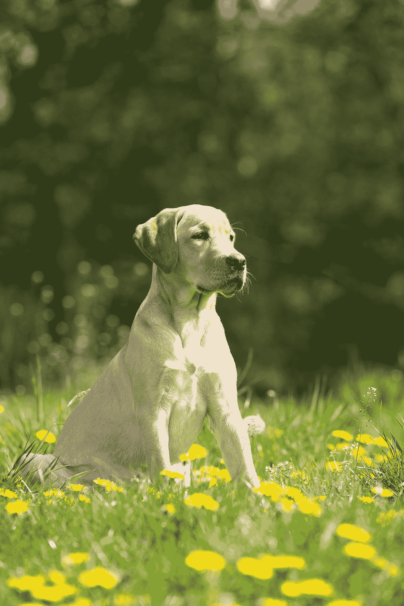
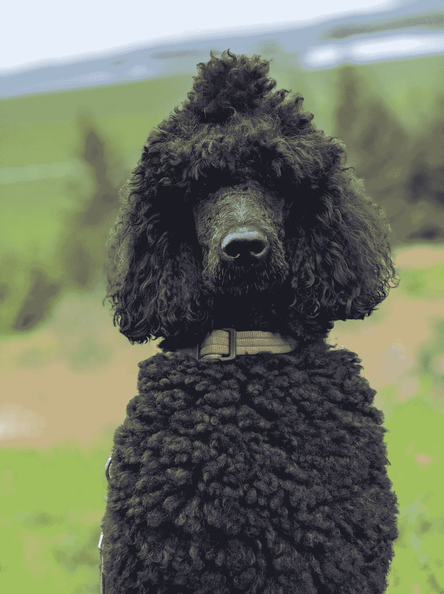
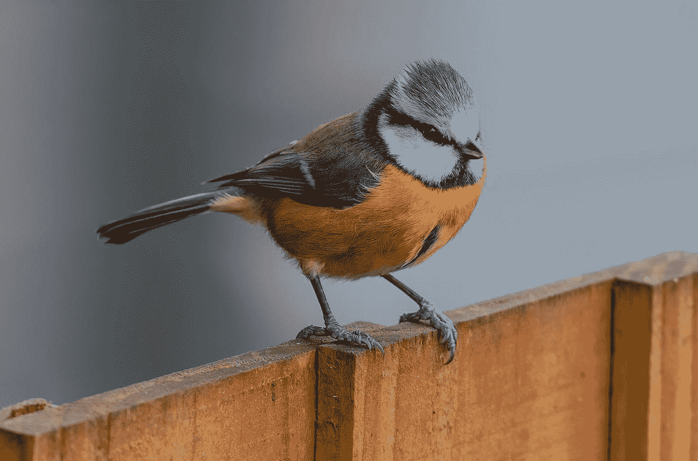
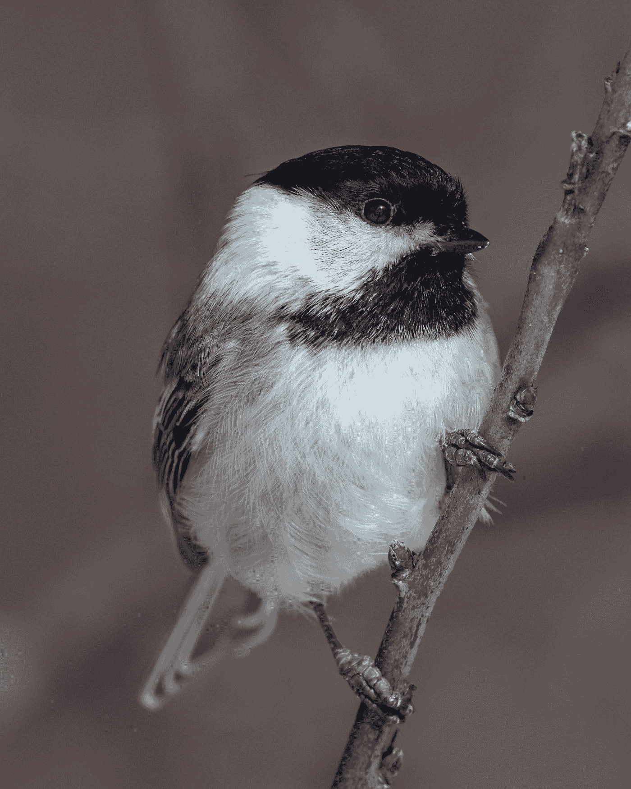
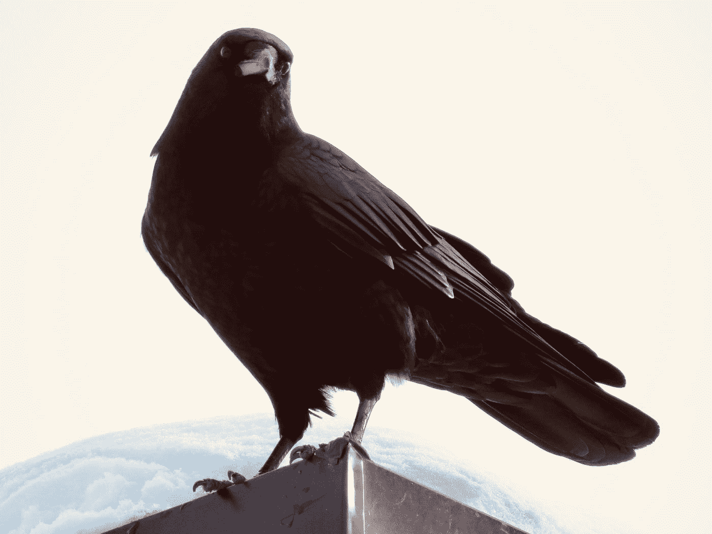

# 使用 Mobilenet 和 Keras 进行迁移学习

> 原文：<https://towardsdatascience.com/transfer-learning-using-mobilenet-and-keras-c75daf7ff299?source=collection_archive---------1----------------------->



在这本笔记本中，我将向你展示一个使用 Mobilenet 对狗的图像进行分类的例子。然后我会给你看一个例子，当它巧妙地错误分类一个蓝色山雀的图像。然后，我将重新训练 Mobilenet 并使用迁移学习，这样它就可以正确地分类相同的输入图像。只使用了两个分类器。但是这可以扩展到您想要的任何数量，受限于您可用的硬件数量和时间。

Mobilenet 的源文件位于此处:[https://arxiv.org/pdf/1704.04861.pdf](https://arxiv.org/pdf/1704.04861.pdf)

*MobileNets:面向移动视觉应用的高效卷积神经网络*，Howard 等， **2017** 。

我们将使用 Mobilenet，因为它的架构是轻量级的。它使用深度方向可分离卷积，这基本上意味着它在每个颜色通道上执行单个卷积，而不是组合所有三个并将其展平。这具有过滤输入通道的效果。或者正如论文作者清楚解释的那样:“*对于 MobileNets，深度方向卷积对每个输入通道应用单个滤波器。逐点卷积然后应用 1×1 卷积来组合深度卷积的输出。标准卷积在一个步骤中将输入滤波并组合成一组新的输出。深度方向可分离卷积将其分为两层，一层用于滤波，另一层用于合并。这种因式分解具有显著减少计算和模型大小的效果*。



Difference between pointwise and depth wise convolutions

因此，Mobilenet 的总体架构如下，有 30 层

1.  步幅为 2 的卷积层
2.  深度方向层
3.  逐点层，通道数量加倍
4.  跨距为 2 的深度方向层
5.  逐点层，通道数量加倍

等等。



Mobilenet full architecture

这也是非常低的维护，因此表现相当好，高速。还有许多预训练模型，内存和磁盘中网络的大小与使用的参数数量成比例。网络的速度和功耗与 MAC(乘法累加)的数量成比例，MAC 是融合乘法和加法运算数量的度量。



现在让我们进入代码！

我的代码位于这里:[https://github . com/fer hat 00/Deep-Learning/tree/master/Transfer % 20 Learning % 20 CNN](https://github.com/ferhat00/Deep-Learning/tree/master/Transfer%20Learning%20CNN)

让我们加载必要的包和库。

让我们输入来自 Keras 的预训练模型。

让我们对不同品种的狗的图像进行一些测试。



Photo by [Jana Ohajdova](https://unsplash.com/@jankao?utm_source=medium&utm_medium=referral) on [Unsplash](https://unsplash.com?utm_source=medium&utm_medium=referral)

输出:

```
[[('n02106662', 'German_shepherd', 0.9796372),
  ('n02105162', 'malinois', 0.020184083),
  ('n02091467', 'Norwegian_elkhound', 0.00015799515),
  ('n02116738', 'African_hunting_dog', 5.2901587e-06),
  ('n02105251', 'briard', 3.9127376e-06)]]
```



Photo by [Vincent van Zalinge](https://unsplash.com/@vincentvanzalinge?utm_source=medium&utm_medium=referral) on [Unsplash](https://unsplash.com?utm_source=medium&utm_medium=referral)

输出:

```
[[(‘n02099712’, ‘Labrador_retriever’, 0.73073703),
 (‘n02087394’, ‘Rhodesian_ridgeback’, 0.03984367),
 (‘n02092339’, ‘Weimaraner’, 0.03359009),
 (‘n02109047’, ‘Great_Dane’, 0.028944707),
 (‘n02110341’, ‘dalmatian’, 0.022403581)]]
```



Photo by [Hans Ole Benonisen](https://unsplash.com/@hansob?utm_source=medium&utm_medium=referral) on [Unsplash](https://unsplash.com?utm_source=medium&utm_medium=referral)

输出:

```
[[('n02113799', 'standard_poodle', 0.5650911),
  ('n02113712', 'miniature_poodle', 0.37279922),
  ('n02102973', 'Irish_water_spaniel', 0.053150617),
  ('n02113624', 'toy_poodle', 0.0072146286),
  ('n02093859', 'Kerry_blue_terrier', 0.0013652634)]]
```

到目前为止一切顺利。它能很好地对每一种狗进行分类。但是让我们在一种鸟身上试试，蓝山雀。



Photo by [Bob Brewer](https://unsplash.com/@brewbottle?utm_source=medium&utm_medium=referral) on [Unsplash](https://unsplash.com?utm_source=medium&utm_medium=referral)

输出:

```
[[('n01592084', 'chickadee', 0.95554715),
  ('n01530575', 'brambling', 0.012973112),
  ('n01828970', 'bee_eater', 0.012916375),
  ('n01532829', 'house_finch', 0.010978725),
  ('n01580077', 'jay', 0.0020677084)]]
```

你可以看到它认不出蓝山雀。它错误地将图像归类为山雀。这是一种原产于北美的鸟，与众不同:



Photo by [Patrice Bouchard](https://unsplash.com/@patriceb?utm_source=medium&utm_medium=referral) on [Unsplash](https://unsplash.com?utm_source=medium&utm_medium=referral)

现在让我们来操作 Mobilenet 架构，重新培训最上面的几层，并采用迁移学习。为此，我们需要在一些图像上训练它。我将在蓝山雀和乌鸦上训练它。但是，与其手动下载它们的图片，不如使用谷歌图片搜索来获取图片。为此，我们可以导入一个很好的包。

看看 https://github.com/hardikvasa/google-images-download

现在让我们重用 MobileNet，因为它是非常轻量级的(17Mb)，冻结基础层，让我们添加和训练顶部的几层。注意，我将只训练两个分类器，蓝山雀和乌鸦。

让我们检查模型架构

我们将使用预训练的权重，因为该模型已经在 Imagenet 数据集上进行了训练。我们确保所有的重量都是不可训练的。我们将只训练最后几个密集层。

现在让我们将训练数据加载到 ImageDataGenerator 中。指定路径，它自动批量发送训练数据，简化代码。

编译模型。现在让我们训练它。在 GTX1070 GPU 上应该不到两分钟。

```
Epoch 1/10
5/5 [==============================] - 5s 952ms/step - loss: 0.9098 - acc: 0.6562
Epoch 2/10
5/5 [==============================] - 3s 563ms/step - loss: 0.0503 - acc: 0.9686
Epoch 3/10
5/5 [==============================] - 3s 687ms/step - loss: 0.0236 - acc: 0.9930
Epoch 4/10
5/5 [==============================] - 4s 716ms/step - loss: 7.5358e-04 - acc: 1.0000
Epoch 5/10
5/5 [==============================] - 3s 522ms/step - loss: 0.0021 - acc: 1.0000
Epoch 6/10
5/5 [==============================] - 4s 780ms/step - loss: 0.0353 - acc: 0.9937
Epoch 7/10
5/5 [==============================] - 3s 654ms/step - loss: 0.0905 - acc: 0.9938
Epoch 8/10
5/5 [==============================] - 4s 890ms/step - loss: 0.0047 - acc: 1.0000
Epoch 9/10
5/5 [==============================] - 3s 649ms/step - loss: 0.0377 - acc: 0.9867
Epoch 10/10
5/5 [==============================] - 5s 929ms/step - loss: 0.0125 - acc: 1.0000
```

模型现在已经训练好了。现在让我们测试一些独立的输入图像来检查预测。

输出:

```
array([[4.5191143e-15, 1.0000000e+00]], dtype=float32)
```

正如你所看到的，它正确地预测了乌鸦，因为蓝色山雀图像被注释掉了。



Photo by [Jaime Dantas](https://unsplash.com/@jaimedantas?utm_source=medium&utm_medium=referral) on [Unsplash](https://unsplash.com?utm_source=medium&utm_medium=referral)

这可以进一步扩展到更多的图像，以使更多的分类器更好地概括，但这是实现 CNN 的迁移学习的最简单的方法和最快的方式。这当然取决于多快，多准确，你想在什么硬件上实现你的模型，以及你有多少时间。