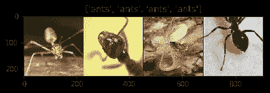

# 使用 pytorch 迁移学习—第 1 部分

> 原文：<https://towardsdatascience.com/transfer-learning-using-pytorch-4c3475f4495?source=collection_archive---------0----------------------->

有没有想过为什么 ML 模特每次都要从头学起？如果模型可以利用从识别猫、狗、鱼、汽车、公共汽车和许多其他事物中学到的知识来识别分心的汽车司机或识别植物疾病，会怎么样？在迁移学习中，我们使用预训练的神经网络来提取特征，并为特定用例训练新模型。不确定是什么..等到博客结束就好了。

# 为什么是 PyTorch

有很多框架像 Keras，Tensoflow，Theano，Torch，Deeplearning.4J 等都可以用于深度学习。在所有这些中，我最喜欢的是 Tensorflow 上的 Keras。Keras 适用于许多成熟的架构，如 CNN、前馈神经网络、用于时间序列的 Lstm，但当您试图实现本质上复杂的新架构时，它会变得有点棘手。由于 Keras 是以良好的模块化方式构建的，因此缺乏灵活性。Pytorch 是一个新成员，它为我们提供了以面向对象的方式构建各种深度学习模型的工具，因此提供了很大的灵活性。最近 PyTorch 正在实现许多复杂的架构。所以我开始探索 PyTorch，在这篇博客中，我们将介绍用很小的数据集和几行代码构建一个最先进的分类器是多么容易。

我们将使用以下步骤构建一个用于检测蚂蚁和蜜蜂的分类器。

1.  从[这里](https://download.pytorch.org/tutorial/hymenoptera_data.zip)下载数据集。



2.数据增强。

3.下载预训练的 resnet 模型(迁移学习)。

4.在数据集上训练模型。

5.如何衰减每第 n 个*时期的学习率。*

## 下载数据集:

从上面的链接下载数据集。它包含训练数据集中的 224 幅图像和验证数据集中的 153 幅图像。

## 数据扩充:

数据扩充是对现有照片进行更改的过程，如调整颜色、水平或垂直翻转、缩放、裁剪等。Pytorch 提供了一个非常有用的名为 torchvision.transforms 的库，它提供了许多有助于应用数据扩充的方法。transforms 附带了一个 compose 方法，它接受一个转换列表。

```
data_transforms **=** { 'train': transforms**.**Compose([
        transforms**.**RandomSizedCrop(224),
        transforms**.**RandomHorizontalFlip(),
        transforms**.**ToTensor(),
        transforms**.**Normalize([0.485, 0.456, 0.406], [0.229, 0.224, 0.225])
    ]),
    'val': transforms**.**Compose([
        transforms**.**Scale(256),
        transforms**.**CenterCrop(224),
        transforms**.**ToTensor(),
        transforms**.**Normalize([0.485, 0.456, 0.406], [0.229, 0.224, 0.225])
    ]),
}
```

## 迁移学习:

我们将使用微软的 ResNet 模型，该模型在 2015 年赢得了 ImageNet 竞赛。它展示了深层网络是如何成为可能的。让我们不要进入 ResNet 的复杂性。我们将下载模型，大多数现代深度学习框架使加载模型更容易。ResNet 模型包括一组 ResNet 块(卷积和单位块的组合)和一个完全连接的层。该模型在 1000 个类别的 Imagenet 数据集上进行训练，我们将移除最后一个完全连接的层，并添加一个新的完全连接的层，该层输出 2 个类别，这表明图像是蚂蚁或蜜蜂的概率。

```
model_conv **=** torchvision**.**models**.**resnet18(pretrained**=**True)
**for** param **in** model_conv**.**parameters():    ----> 1
    param**.**requires_grad **=** False

*# Parameters of newly constructed modules have requires_grad=True by default*
num_ftrs **=** model_conv**.**fc**.**in_features
model_conv**.**fc **=** nn**.**Linear(num_ftrs, 2)   ----> 2**if** use_gpu:
    model_conv **=** model_conv**.**cuda()       ----> 3
```

1.  我们告诉模型不要学习或修改模型的权重/参数。
2.  然后，我们向现有模型添加一个新的全连接层，以训练我们的模型对 2 个类别进行分类。
3.  如果你有 gpu 的话。cuda()在 GPU 中执行模型。

我们的模型已经准备好了，我们需要将数据传递给训练。

## 培训模式:

对于培训模型，除了模型之外，我们还需要几样东西，例如:

1.  PyTorch 变量:包装 pytorch 张量的变量。它包含数据和与数据相关的梯度。
2.  损失函数:它有助于计算我们的模型有多好。我们将在这里使用分类交叉熵。
3.  优化器:我们将使用 SGD 来优化我们的梯度权重。在我们的例子中，我们只更新最后一层的权重。
4.  正向传播:这是我们通过模型传递数据的最简单的部分。
5.  反向传播:这是现代深度学习网络的关键，所有神奇的事情都发生在这里。其中优化器开始计算需要更新多少权重以减少损失或提高准确性。在大多数现代框架中，这是自动化的，因此我们可以专注于构建由深度学习支持的酷应用程序。

```
if use_gpu:
    inputs, labels = Variable(inputs.cuda()), Variable(labels.cuda()) --> 1
else:
    inputs, labels = Variable(inputs), Variable(labels)criterion = nn.CrossEntropyLoss() --> 2# Observe that all parameters are being optimized
optimizer_ft = optim.SGD(model_ft.parameters(), lr=0.001, momentum=0.9) -->3# zero the parameter gradients
optimizer.zero_grad()# forward 
outputs = model(inputs) --> 4
loss = criterion(outputs, labels)# backward + optimize only if in training phase
if phase == 'train': --> 5
    loss.backward()
    optimizer.step()
```

## 衰减学习率:

大多数情况下，我们以较高的学习速率开始，这样我们可以更快地减少损失，然后在几个时期后，你想减少它，这样学习变得更慢。我发现 pytorch [教程](http://pytorch.org/tutorials/beginner/transfer_learning_tutorial.html)中的这个函数非常有用。

```
**def** **lr_scheduler**(optimizer, epoch, init_lr**=**0.001, lr_decay_epoch**=**7):
    """Decay learning rate by a factor of 0.1 every lr_decay_epoch epochs."""
    lr **=** init_lr ***** (0.1******(epoch **//** lr_decay_epoch))

    **if** epoch **%** lr_decay_epoch **==** 0:
        **print**('LR is set to {}'**.**format(lr))

    **for** param_group **in** optimizer**.**param_groups:
        param_group['lr'] **=** lr

    **return** optimizer
```

我们将每第 n 个时段的学习率降低，在上面的示例 7 中为 0.1。decay_rate 是可配置的。即使在较小的数据集上，我们也可以使用这种方法获得最先进的结果。

想用 pytorch 在你的数据集上尝试迁移学习，代码驻留在[这里](http://pytorch.org/tutorials/beginner/transfer_learning_tutorial.html)。

对学习深度学习感兴趣的人，不要忘了看看令人惊叹的 MOOC [深度学习，作者是](http://course.fast.ai/)[杰瑞米·霍华德](https://medium.com/@jeremyphoward)的程序员。

在[的下一部分](https://medium.com/@vishnuvig/transfer-learning-using-pytorch-part-2-9c5b18e15551)中，我们将讨论如何使用 VGG 更快地进行迁移学习的不同技巧。并比较它在 PyTorch 和 Tensorflow 中的表现。