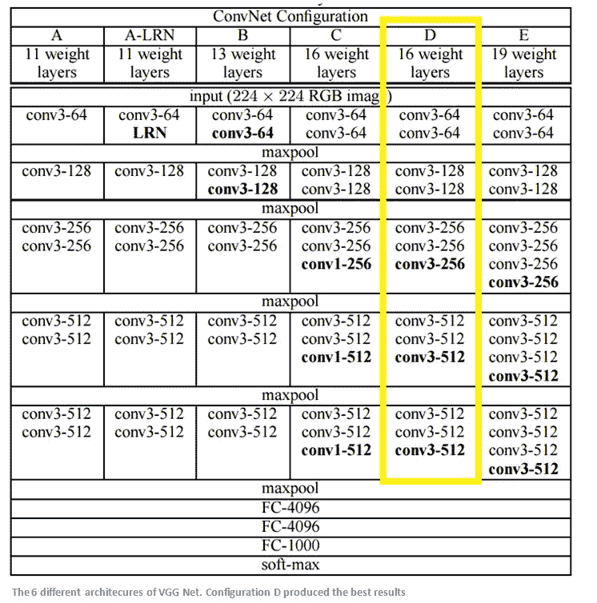
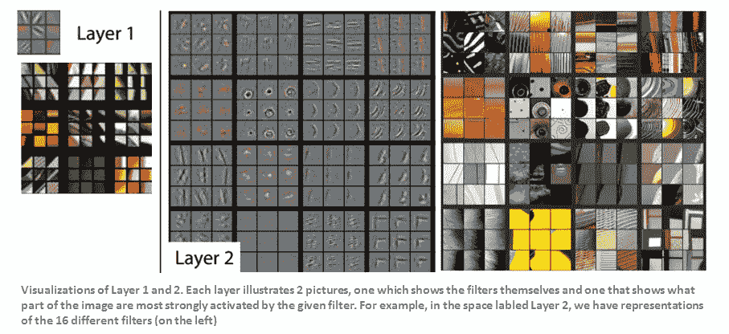
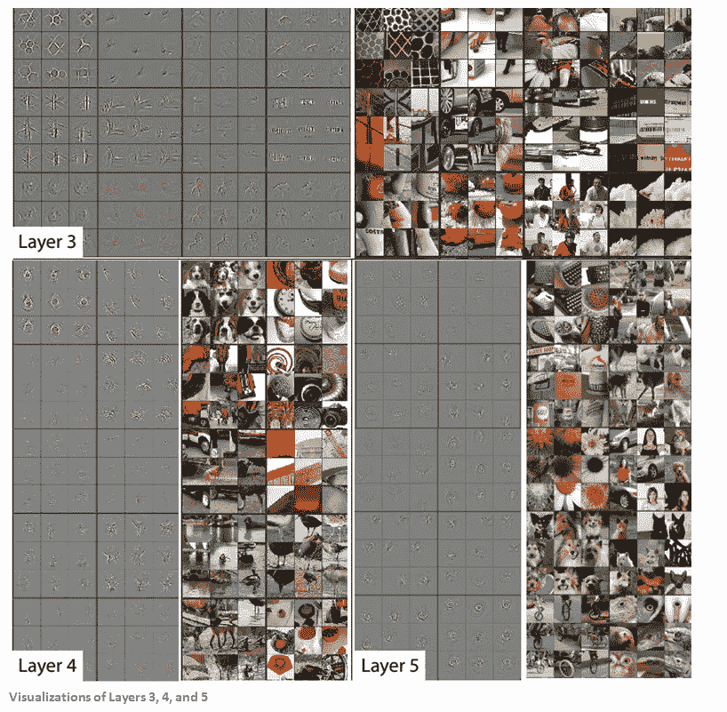
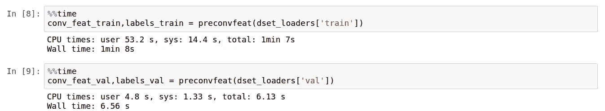
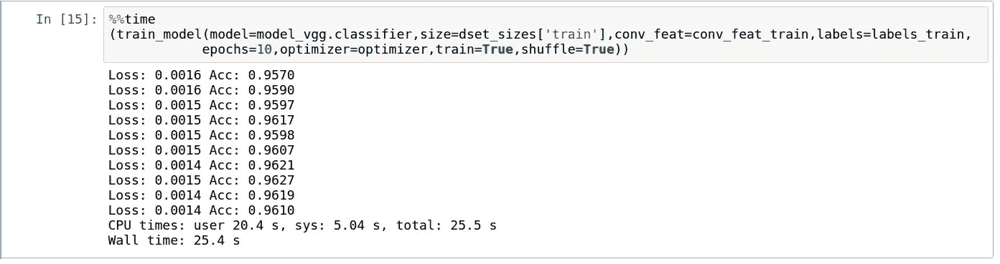

# 使用 PyTorch 进行迁移学习—第二部分

> 原文：<https://towardsdatascience.com/transfer-learning-using-pytorch-part-2-9c5b18e15551?source=collection_archive---------1----------------------->

在之前的博客中，我们讨论了神经网络如何使用迁移学习来完成各种计算机视觉任务。在这篇博客中，我们将探讨以下内容。

1.  VGG 建筑
2.  使用预卷积特征微调 VGG
3.  准确(性)
4.  PyTorch 和 Keras 在 Tensorflow 上的性能比较

## VGG 建筑:

迁移学习中研究最多的深度学习模型之一是 VGG。我们将对 VGG 进行一个高层次的概述，以了解它是如何在迁移学习中得到最佳应用的。



VGG 模型可以分为两种逻辑块

1.  **卷积块:**

预训练的 VGG 模型在超过 1000 个类别的图像网络数据集上被训练。卷积块包含多个卷积层。初始层包含低级特征，如直线、曲线。这个模块中的最后卷积层包含更复杂的图像特征，比如手、腿、眼睛等等。下图捕捉了不同图层中捕捉的特征类型。



从上面的图像中可以看出，预训练模型的卷积层捕捉到的特征可以用于大多数类型的图像问题。上述功能可能不适用于卡通动画、医学图像等问题，因为它们需要完全不同的功能。

卷积层表现出两个重要的特性

1.  与全连接层相比，所需的参数数量要少得多。例如，具有 3 * 3 * 64 大小过滤器的卷积层仅需要 576 个参数。
2.  卷积图层的计算开销很大，计算输出需要更长时间。

**2。全连接块:**

该区块包含密集(在 Keras 中)/线性(在 PyTorch 中)层，并有缺失。FC 层中要学习的参数数量巨大，但计算时间却少得多。

因此，我们通常最终按原样从 VGG 模型的卷积块中提取预卷积特征，并且仅训练通常来自全连接块的 VGG 模型的最后几层。

## **使用预卷积功能微调 VGG:**

正如我们所知，卷积层的计算成本很高，因此计算一次卷积层的输出并使用它们来训练完全连接的层是有意义的。这种方法加快了使用迁移学习训练新模型的过程。例如，如果 1 次迭代需要 3 分钟来训练模型，则通过预先计算卷积层输出(假设需要 2 分钟),而对于 FC 块中的其余迭代，每次迭代只需要几秒钟。

**预卷积特性:**

我使用的是来自 **kaggle** 的 [**猫狗**数据集，包含 25000 张图片。我保留了 2000 张图片用于验证，剩下的 23000 张用于训练。](https://www.kaggle.com/c/dogs-vs-cats-redux-kernels-edition/data)

**硬件基准测试于:**

我在上面提到的实验中使用了英特尔 i7 处理器、64 gb 内存和 Titan X GPU。


My Monster playing with NN weights :)

为了计算卷积特征，我们让所有图像通过卷积层。幸运的是 pytorch 将 VGG 实现为两个逻辑块，由特征(卷积块)和分类器块(FC)组成。在下面的代码中，我们将使用 features 块来计算卷积层的输出。我们将它存储到 bcolz 数组中，以便进一步处理。Bcolz 数组提供了一个压缩和更快的方法来处理数组。

```
model_vgg = models.vgg16(pretrained=True)
for param in model_vgg.parameters():
    param.requires_grad = False
def preconvfeat(dataset):
    conv_features = []
    labels_list = []
    for data in dataset:
        inputs,labels = datainputs , labels = Variable(inputs.cuda()),Variable(labels.cuda())
        x = model_vgg.features(inputs)
        conv_features.extend(x.data.cpu().numpy())
        labels_list.extend(labels.data.cpu().numpy())
    conv_features = np.concatenate([[feat] for feat in conv_features])
    return (conv_features,labels_list)
```

我花了 **1 分 8 秒**来计算 23000 幅图像的训练数据集的特征。大小大约是 600 mb。



**微调:**

我们可以使用处理过的特征来训练完全连接的层。对于 **10 次迭代**，花费了 **25 秒**。使用 VGG 分类器块的代码段。

```
for param in model_vgg.classifier[6].parameters():
    param.requires_grad = True
train_model(model=model_vgg.classifier,size=dset_sizes['train'],conv_feat=conv_feat_train,labels=labels_train,epochs=10,optimizer=optimizer,train=True,shuffle=True)
```



## 精确度:

在运行该模型大约 30 个时期之后，即在不到几分钟的时间内，验证准确度达到 97%。通过增加批次归一化和降低压差值，可以进一步提高精度。在这个笔记本里，我已经包括了我尝试过的其他实验。

## PyTorch VGG 和 Keras 在 Tensorflow VGG 上的性能比较；

我在 Tensorflow 上使用 Keras 已经有一段时间了。所以我很想看看他们在时间方面的表现。我使用 PyTorch 版本 0.1.11 和 Tensorflow 版本 1.0.1 进行实验。

进行的实验:在卷积层权重不变的情况下运行预训练的 VGG 模型。未计算任何卷积特征。运行了 10 个时期的 23000 幅图像。下面是我的结果。

PyTorch — 15 分 19 秒

Tensoflow 上的 keras—31 分 29 秒

PyTorch 有数据加载器，可以一次使用多个线程来加载数据。当使用 6 个线程时，VGG 模型的性能提高到 11 分钟。

**更新:根据下面的推文，我已经尝试使用 keras 和 6 个工人进行预处理，每个时期的性能从 3 分 21 秒提高到 1 分 40 秒。PyTorch 花了 6 个工人 1 分 11 秒。**

**结论:我在使用 Keras 和 pytorch 时所做的一些观察。Keras 太抽象，好上手，快速建立标准模型。预计性能将优于 PyTorch，但看起来并非如此，尽管 TensorFlow 有许多改进。另一方面，PyTorch 提供了类似于 Python NumPy 的 API 以及在 GPU 上操作的能力。学习曲线比 tensorflow 小得多，比 Keras 灵活得多。因此，如果你对深度学习充满热情，那么你绝对应该看看 PyTorch。**

**除了框架，我们还讨论了如何使用预卷积特性更快地训练模型。事实上，杰瑞米·霍华德在他的第二部分课程中，即将推出的** [**MOOC**](http://course.fast.ai/) **讨论了脸书如何使用这些预先令人费解的特性的一种有趣的方法。该方法指出，“当不同的团队在同一数据集上工作时，计算这些卷积特征并使其对所有团队可用是很有意义的。”。这种方法将在建立模型时节省大量时间。事实上，脸书也在用类似的方式处理这个问题。**

你可以在这里找到与实验[相关的代码。](https://github.com/svishnu88/pytorch)

你可以在 LinkedIn 上找到我