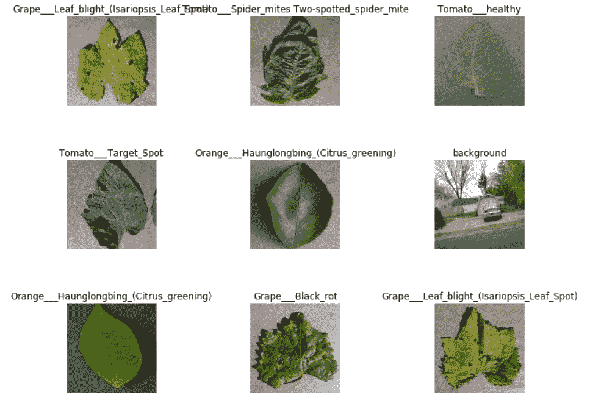
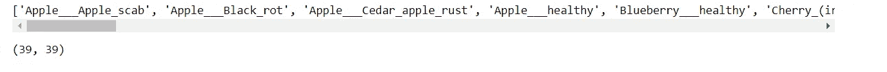
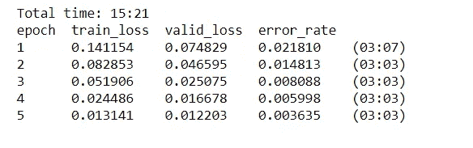
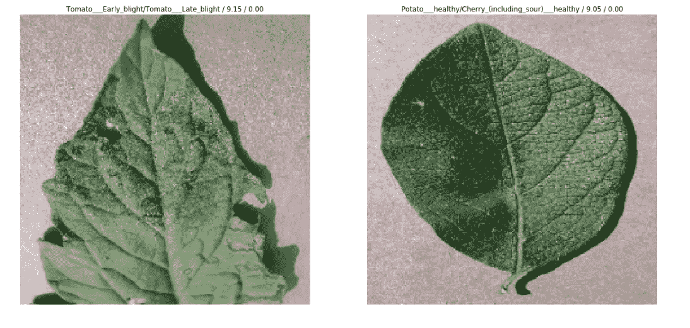
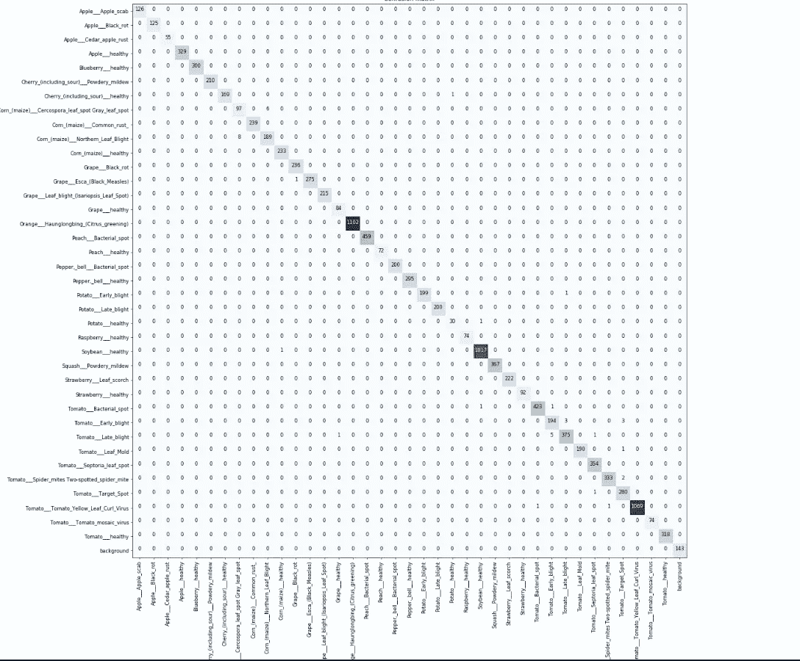
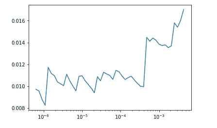
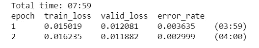

# 使用新的 fastai 库实现世界级的结果

> 原文：<https://towardsdatascience.com/transfer-learning-using-the-fastai-library-d686b238213e?source=collection_archive---------11----------------------->

## 一个温和的介绍转移学习和 FastAI 图书馆的真实世界的例子，植物病害检测使用叶片图像。

# 动机

我目前正在做一个名为“程序员实用深度学习”的 fast.ai Live MOOC，将于 2019 年 1 月在 [fast.ai](http://www.fast.ai/) 网站上公开。以下代码基于该课程的第 1 课。我将使用位于 [Pytorch 1.0](https://hackernoon.com/pytorch-1-0-468332ba5163?gi=b61aa5bd7f45) 之上的 [fastai V1 库](http://www.fast.ai/2018/10/02/fastai-ai/)。fastai 库提供了许多有用的功能，使我们能够快速轻松地构建神经网络并训练我们的模型。我写这篇博客是为了在一个结构和复杂性都不同的数据集上实验课程示例，并展示使用 fastai 库是多么容易。

在下面的例子中，你会看到在 [PlantVintage 数据集](https://plantvillage.psu.edu/)上进行迁移学习并获得世界级的结果是多么的简单。PlantVintage 数据包含植物叶片的图像，这些图像由作物上常见的 38 种疾病类别和一个来自斯坦福背景图像开放数据集的背景类别组成— [DAGS](http://dags.stanford.edu/projects/scenedataset.html) 。我从 Github Repo 上的[链接下载了数据。我对这个例子特别感兴趣，因为在我写这篇博客的时候，我为一个组织工作，该组织通过提供产品和技术解决方案来帮助农民发展他们的业务，以实现更好的农场管理。我们开始吧！](https://github.com/MarkoArsenovic/DeepLearning_PlantDiseases)

PS:这个博客也作为 [jupyter 笔记本](https://github.com/aayushmnit/fastai_v3_experimentation/blob/master/Lesson-1-PlantVintage.ipynb)发布在我的 [GitHub](https://github.com/aayushmnit) 个人资料上。

# 样板命令

用下面三行开始笔记本是一个标准的做法；它们确保您对库所做的任何编辑都会自动重新加载到此处，并且显示的任何图表或图像都会显示在此笔记本中。

```
%**reload_ext** autoreload
%**autoreload** 2
%**matplotlib** inline
```

# 导入快速人工智能库

让我们导入 fastai 库，并将 batch_size 参数定义为 64。通常，图像数据库是巨大的，所以我们需要使用批处理将这些图像馈送到 GPU 中，批处理大小 64 意味着我们将一次馈送 64 个图像，以更新我们的深度学习模型的参数。如果由于 GPU RAM 较小而导致内存不足，可以将批处理大小减少到 32 或 16。

```
**from** **fastai** **import** *
**from** **fastai.vision** **import** *
bs =64
```

# 看着这些数据

当我们处理一个问题时，我们做的第一件事就是看一看数据。我们总是需要非常好地理解问题是什么，数据看起来是什么样的，然后才能想出如何解决它。查看数据意味着了解数据目录的结构，标签是什么，以及一些示例图像是什么样子。我们的数据已经在 train 和 validation 文件夹中进行了拆分，在每个子目录中，我们的文件夹名称表示该子文件夹中所有图像的类名。幸运的是，fastai 库有一个专门为此设计的方便函数，[imagedata bunch . from _ folder](https://docs.fast.ai/vision.data#ImageDataBunch.from_folder)自动从文件夹名称中获取标签名称。fastai library 有[棒极了的文档](https://docs.fast.ai/)来浏览他们的库函数，并附有如何使用它们的实例。一旦加载了数据，我们还可以通过使用。标准化为 ImageNet 参数。

```
*## Declaring path of dataset*
path_img = Path('/home/jupyter/fastai_v3_experimentation/data/PlantVillage/')*## Loading data* 
data = ImageDataBunch.from_folder(path=path_img, train='train', valid='valid', ds_tfms=get_transforms(),size=224, bs=bs, check_ext=**False**)*## Normalizing data based on Image net parameters*
data.normalize(imagenet_stats)
```

为了查看图像的随机样本，我们可以使用。show_batch()函数 ImageDataBunch 类。正如我们在下面看到的，我们有一些不同作物上的病害案例，加上一些来自 DAGS 数据集的背景噪声图像，这些图像将充当噪声。

```
data.show_batch(rows=3, figsize=(10,8))
```



让我们打印数据库中存在的所有数据类。总的来说，我们有 39 个类的图像，如上面在动机部分提到的。

```
print(data.classes)
len(data.classes),data.c
```



# 使用预训练模型进行迁移学习:ResNet 50

现在我们将开始训练我们的模型。我们将使用一个卷积神经网络主干 [ResNet 50](https://medium.com/@14prakash/understanding-and-implementing-architectures-of-resnet-and-resnext-for-state-of-the-art-image-cf51669e1624) 和一个具有单个隐藏层的全连接头作为分类器。如果你想了解所有的架构细节，你也可以阅读 ResNet 论文。要创建迁移学习模型，我们需要使用 Learner 类中的函数 create_cnn，并从 models 类中输入一个预先训练好的模型。

```
*## To create a ResNET 50 with pretrained weights*
learn = create_cnn(data, models.resnet50, metrics=error_rate)
```

create_cnn 函数创建的 ResNet50 模型冻结了初始层，我们将学习最后完全连接的层的权重。

```
learn.fit_one_cycle(5)
```



正如我们在上面看到的，通过使用默认设置运行五个时期，我们在验证数据集上的细粒度分类任务的准确度大约为 99.64%。让我们保存模型，因为我们稍后将对其进行微调。如果你想知道这个结果有多好，已经从这个 [Github 页面](https://github.com/MarkoArsenovic/DeepLearning_PlantDiseases)击败了浅层学习(只训练最后一层)基准 96.53%。

```
learn.save('plant_vintage_stage1')
```

FastAI 库还提供了一些功能来更快地探索结果，并发现我们的模型是否正在学习它应该学习的内容。我们将首先看到模型最容易混淆的类别。我们将尝试使用 ClassificationInterpretation 类来查看模型预测是否合理。

```
interp = ClassificationInterpretation.from_learner(learn)interp.plot_top_losses(4, figsize=(20,25))
```



在这种情况下，该模型在从玉米植株上的灰色叶斑中检测北方叶枯病和在视觉上看起来非常相似的番茄叶中的早期/晚期叶枯病时变得混乱。这表明我们的分类器工作正常。此外，当我们绘制混淆矩阵时，我们可以看到大多数东西都被正确分类，这几乎是一个近乎完美的模型。

```
interp.plot_confusion_matrix(figsize=(20,20), dpi=60)
```



因此，到目前为止，我们只训练了最后的分类层，但如果我们想优化更早的层。在迁移学习中，调整初始层应该谨慎，学习速度应该保持在相当低的水平。FastAI 库提供了一个函数来查看训练的理想学习率，所以让我们来画一个图。lr_find 函数以多种学习速率运行数据子集的模型，以确定哪种学习速率最好。

```
learn.lr_find()
learn.recorder.plot()
```



看起来我们应该保持我们的学习率低于 10e-4。对于网络中的不同层，我们可以使用切片函数在 10e-6 到 10e-4 之间对数分布学习速率。保持初始层的最低学习速率，并增加后续层的学习速率。让我们解冻所有层，以便我们可以使用 unfreeze()函数训练整个模型。

```
learn.unfreeze()
learn.fit_one_cycle(2, max_lr=slice(1e-7,1e-5))
```



正如我们通过训练所有层所看到的，我们将准确率提高到了 99.7%，与使用 Inception-v3 模型的 [Github 基准测试](https://github.com/MarkoArsenovic/DeepLearning_PlantDiseases)的 99.76%相当。

# 结论

Fast.ai 是[杰瑞米·霍华德](https://twitter.com/jeremyphoward)和他的团队的一个很好的倡议，我相信 fastai library 可以通过让构建深度学习模型变得超级简单来真正实现将深度学习民主化到每个人的动机。

我希望你喜欢阅读，并随时使用我的代码来尝试它为您的目的。此外，如果对代码或博客帖子有任何反馈，请随时联系 LinkedIn 或给我发电子邮件，地址是 aayushmnit@gmail.com。