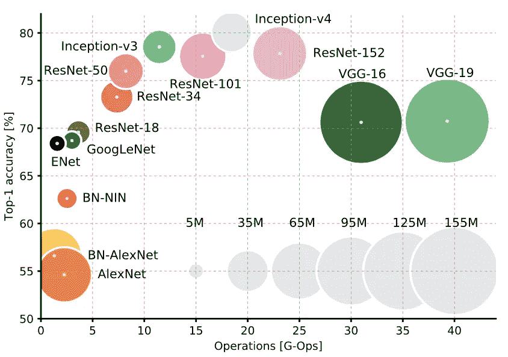
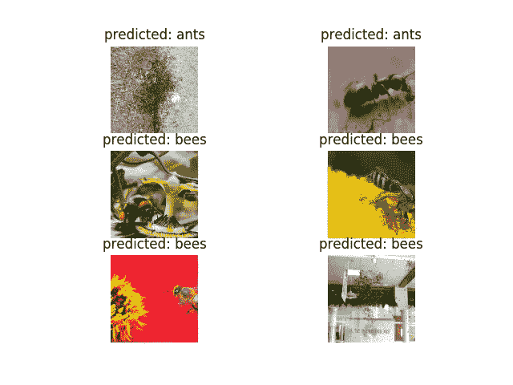

# 用 PyTorch 迁移学习

> 原文：<https://towardsdatascience.com/transfer-learning-with-pytorch-72a052297c51?source=collection_archive---------4----------------------->

机器学习的未来如此光明，因为激励措施是全面一致的:大玩家急切地*开源工具*并投资*更快的硬件*以摆脱他们基于广告的商业模式。修补匠发现*小众应用*前所未闻。数据变得更加可替代，用于私人、公共、科学、休闲和不利用途。我可以就未来的完美风暴谈上几个小时(也许还有一些逆向思维)，但让我们坚持一件实际的事情:如何利用最近可用的**预训练机器学习模型**的上升。

## **迁移学习**

相关的任务需要一小部分*潜在能力来辨别看不见的数据*。例如，无论你是弹吉他还是弹钢琴，你都会比不习惯弹吉他的人更擅长弹奏和弦。用机器学习的术语来说，这意味着你可以复制其他人的训练成果，并对其进行调整，以快速分类[热狗和非热狗](https://www.theverge.com/tldr/2017/5/14/15639784/hbo-silicon-valley-not-hotdog-app-download)的图片，或者让其[生成相当新颖的产品评论](https://github.com/ahirner/generating-reviews-discovering-sentiment)。

Sebastian Ruder 很好地概括了模型重用的复合收益。

特别是，迁移学习改善了决定机器学习项目技术方面的所有维度:

*   **人的效率**。如果你想挤出最后一点信号，让模型变得可解释、易处理和健壮，你需要专家。多亏了学术研究，在相关任务中经过实战检验的架构应运而生。
*   **计算效率**。最先进的论文通常在 2 到 8 个 GPU 的集群上训练大约两周。虽然，真的没有限制。有了迁移学习，你可以通过部分地或更少地改变内部参数来节省时间。
*   **数据效率**。如果其他人在大型数据集上受过训练(他或她甚至不需要透露)，那么在大多数情况下需要的领域特定数据就更少。事实上，在不到 5MB 的下载中，你如何能够[重新利用一个型号](https://github.com/lizeng614/SqueezeNet-Neural-Style-Pytorch)是令人难以置信的。

## 地标建筑

迁移学习被广泛用于更好地区分特定的图像类别。 [Canziani 等人(2016)](https://arxiv.org/abs/1605.07678) 在 imagenet 数据集上比较了主要架构的计算效率。

具体来说，根据您的设备限制，您可以将计算成本进一步划分为*训练时间、推理时间和内存需求*。在最近的一次兼职中，考虑到非常具体的限制，我需要更深入地挖掘。

首先，新数据经常出现。第二，这些图像也是*潜在的专利*。因此，*再培训必须在本地中间层 GPU 上可靠地进行*，而不需要外部专家的纵容。从用户的角度来看，如果再培训能在一致的时间内给出一致的结果，那么它就是可靠的，就像你点击要完成的打印任务一样。因此，基准测试将使用一种简单的*优化方法，这种方法*比数据效率更有利于收敛。第三，对于一批大约四幅图像，每个预测需要接近实时地发生。因此，我们关心*推理次数*。最后，我们关心作为业务决策输入的图像(或图像的一部分)的确切类别。因此，我们将*最高精度*考虑在内。

现在，为了通过不断发展的数据集将专家的成本降低到几乎为零，并使计算时间符合硬约束，让我们来看看业界最令人垂涎的工具之一的模型动物园:PyTorch。

## 结果

PyTorch 如今大受欢迎有几个原因。

够公平:该框架相当完整、简洁，用代码动态定义了整个计算图，并且易于调试。torchvision 软件包中的一行代码可以加载六个原型:AlexNet、DenseNets、Inception、SqueezeNet 和 VGG。为了了解它们是如何产生的，我推荐[阅读](https://adeshpande3.github.io/adeshpande3.github.io/The-9-Deep-Learning-Papers-You-Need-To-Know-About.html)。

不幸的是，API 不允许用自定义数量的类加载预先训练好的模型，而不用手动重新实现最终层。因此，我写了一个函数，从原理上解决了这个问题。它合并预先训练的参数，使它们不会干扰自定义输出层。因此，我们可以系统地比较所有可用架构中我们关心的性能指标。

SGD with same momentum and learning rate for each model and 15 epochs on 2xK80

图表中的模型仅在最终层(浅层)、针对整个参数集(深层)或从其初始化状态(从头开始)被重新训练。在所有运行中，双 K80 GPUs 运行了大约 75%。

如数据所示，SqueezeNet 1.1 兑现了成为高效计算架构的承诺。因为再训练层和静态层的划分有些武断，仅仅基于浅再训练模型的结论太牵强。例如，VGG13 的最终分类器有 8194 个参数，而 ResNet34 的最终层更窄，有 1026 个参数。因此，只有对学习策略的超参数搜索才能使给定目标的比较真正有效。然而，对于这个数据集中的少量类(准确地说是二进制)，SqueezeNet 学习的速度快得令人难以置信。

## 结论

需要注意的一点是，在相同的训练时间内，深度再训练比浅度再训练产生的准确度要低。在其他任务中，我和其他模特也遇到过这种情况。我对此的理论是，从先前的局部最优解中拧出更深的卷积平均来说发生得很慢(小误差梯度)，并且是在随机初始化后的不太平滑的流形上。因此，参数在转换阶段结束并列。如果看不见的特征与原始数据相比在规模上有所不同，这种间歇性的混乱应该是特别真实的，这就是今天的玩具数据集的情况:有时近距离有蚂蚁，有时你观察到整个群体。

所以事实上，你可能会被很好地建议选择更高的学习率，你调整的层数越多，或者在某个时候使用而不是[比例不变网络](https://github.com/msracver/Deformable-ConvNets)。

为了评估由推理和重新训练时间组成的计算效率，这是一个很好的开始。如果你想进一步提高再训练的效率，你可以跳过[数据扩充](http://pytorch.org/docs/torchvision/transforms.html#transforms-on-pil-image)，缓存来自未训练层的结果。当然，结论会随着类的数量、前面提到的其他因素和特定的约束而不同。这就是为什么你想自己到达。为此，我[在 github 上发布了原始指标和附带代码](https://github.com/ahirner/pytorch-retraining)。

重新训练快乐！