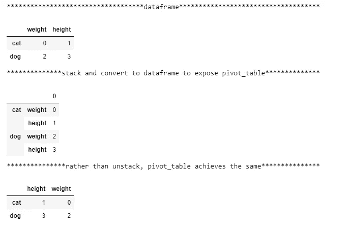

# 熊猫中堆栈、融化、数据透视表的转换

> 原文：<https://towardsdatascience.com/transformations-of-stack-melt-pivot-table-901292196d9e?source=collection_archive---------9----------------------->

## 改变数据表示和恢复的 3 种方法


Photo by [Outer Digit](https://unsplash.com/@weareouterdigit?utm_source=medium&utm_medium=referral) on [Unsplash](https://unsplash.com?utm_source=medium&utm_medium=referral)

完整笔记本在[https://gist . github . com/git githan/0ba 595 e 3e F9 cf 8 fab 7 deeb 7 b 8 b 533 ba 3](https://gist.github.com/gitgithan/0ba595e3ef9cf8fab7deeb7b8b533ba3)
或者，点击这个可滚动框右下角的“查看原始数据”并将 json 保存为。ipynb 文件

在本文中，我将探索 python 的 pandas 数据操作库的 **dataframe.stack()、dataframe.melt()、dataframe.pivot_table** 如何在转换管道中相互交互，以重塑数据帧并恢复原始数据帧，同时通过遵循代码来了解许多注意事项。

```
from IPython.core.interactiveshell import InteractiveShell
InteractiveShell.ast_node_interactivity = “all”import pandas as pd
```

默认情况下，jupyter 笔记本只显示每个单元格的最后一行。前两行让 jupyter 显示所有变量的输出，以方便避免将 print()放在我希望看到的每个变量周围。接下来，我们导入 pandas 库，在这里我们从。

# 方法一:df→栈→reset_index →pivot →df


Figure 1

```
df= pd.DataFrame([[0, 1], [2, 3]],index=['cat', 'dog'],columns=['weight', 'height'])print('{:*^80}'.format('dataframe'))
dfprint('{:*^80}'.format('stacked dataframe'))
df.stack()
```

在这里，我们创建数据帧。然后，df.stack()将我们的单级列 df 转换为具有多索引索引的数据序列，方法是将这些列放入一个新的内部索引(索引级别 1 ),用于旧的外部索引(索引级别 0)中的每个值。外层看起来只有 2 个值[猫，狗]，但这只是为了整齐显示，实际上是 4 个值[猫，猫，狗，狗]。有用的注意事项来自:[*https://pandas . pydata . org/pandas-docs/stable/generated/pandas。DataFrame.stack.html*](https://pandas.pydata.org/pandas-docs/stable/generated/pandas.DataFrame.stack.html)
**如果列有多个级别，则新的索引级别取自指定的级别，并且输出是数据帧。**所以最好记住转换输出是数据序列还是数据帧。

```
print('{:*^80}'.format('stacked dataframe with index in column'))
df.stack().reset_index(level = 1)   #AttributeError: 'Series' object has no attribute 'pivot_table' , so must convert to dataframe before pivot_table
stacked = df.stack().reset_index(level = 1)
```

这些值根据索引对齐，将数据帧从宽格式转换为长格式数据序列。因为 pivot_table 是一个 dataframe 方法，并不适用于 dataseries，所以我们可以使用 reset_index(level = 1)提取多索引的第 1 级，以准备转回。指定 level = 0 会将外部索引提取到列中。请注意，在 reset_index()之后会自动添加“level_1”作为列名。这将是额外的信息，可以在以后使用或清除并忽略。值上方的 0 列也会自动添加。

在此阶段提取 0 级还是 1 级并不重要。您可以稍后简单地将输入切换到 pivot_table 的 index 和 columns 参数，以获得相同的输出(除了微小的 df.columns.name 差异)并恢复原始数据帧。

```
print('{:*^80}'.format('pivot_table recovered original dataframe (with extra name for columns)'))
recovered_df1 = df.stack().reset_index(level = 1).pivot_table(index = stacked.index, columns = 'level_1',values = 0) #pivot_table orders columns alphabetically,specifying values parameter prevents creation of useless multiindex column 
recovered_df1.columns.name = None  #remove 'level_1' column.name
recovered_df1
```

最后，我们通过从当前列名中选择来指定 pivot_table 中的索引和列参数，以描述最终的透视数据帧应该是什么样子。values 参数是可选的，但不指定它会将尚未在 index 或 columns 参数中指定的列名添加到当前列的外层，从而创建看起来很难看的多索引列，并使数据访问变得不必要的困难。

# 方法 2:df→堆栈→转换为数据帧→透视→df



Figure 2

```
print('{:*^80}'.format('dataframe'))
df
print('{:*^80}'.format('stack and convert to dataframe to expose pivot_table'))
stacked_df = pd.DataFrame(df.stack())
stacked_df
```

请记住，pivot_table 是一个 dataframe 方法，并不适用于数据序列，因此，我们可以使用 pd 从数据序列中直接构造一个 dataframe，而不是像第 1 部分那样使用 reset_index。DataFrame(df.stack())创建一个多索引的 DataFrame，使 pivot_table 方法可用，并更加努力地正确指定其参数。

```
print('{:*^80}'.format('rather than unstack, pivot_table achieves the same'))
idx_lvl0, idx_lvl1 = stacked_df.index.get_level_values(0), stacked_df.index.get_level_values(1)
recovered_df2 = stacked_df.pivot_table(index=idx_lvl0,columns = idx_lvl1,values = 0)
recovered_df2
```

index.get_level_values(0)是一种以 pandas.core.indexes.base.Index 对象的形式获取指定多索引级别(在本例中为 0)的索引值的方法，接受序列/列表的函数可以方便地使用该对象。在第 2 部分中，我们将每个级别的正确索引信息匹配到数据透视表的索引和列参数中，以恢复原始数据帧。第 2 部分比第 1 部分更清晰，因为没有 reset_index 来在 df.columns.name 中创建额外的“level_0”或“level_1 ”,我们在第 1 部分中将其设置为 None。

# 方法三:df→融→加指数→支点→df


Figure 3

```
print('{:*^80}'.format('dataframe'))
df
print('{:*^80}'.format('melting loses index information'))
melted = df.melt()   #melt appends columns into new "variable" column, while stack adds columns to new inner index layer (same information end up different places)
melted
```

与堆栈类似，melt 通过将压缩列放入单个列表中，将宽格式数据转换为长格式数据。不同的是，stack 将这个列表插入到内部索引中，而 melt 将这个列表作为一个名为' variable '(可以重命名)的新列插入。

```
print('{:*^80}'.format('manually enrich index')) # until this is solved: [https://github.com/pandas-dev/pandas/issues/17440](https://github.com/pandas-dev/pandas/issues/17440)
melted.index = ['cat','dog']*2   #list(df.index)*len(df.columns) for more generalizable index generation
melted
```

注意，melt 已经让索引中的猫狗信息消失了。这使得无法恢复原始数据帧。在这个问题([https://github.com/pandas-dev/pandas/issues/17440](https://github.com/pandas-dev/pandas/issues/17440))解决之前，我们必须手动添加回索引。

```
print('{:*^80}'.format('pivot_table recovered original dataframe (with extra name for columns)'))
recovered_df3 = melted.pivot_table(index = melted.index, columns = 'variable',values = 'value')
recovered_df3.columns.name=None  #remove 'variable' column.name
recovered_df3
```

最后，带有正确参数的 pivot_table 将恢复我们的原始数据帧。与第 1 部分一样，为了精确恢复，从 df.columns.name 中删除了“variable”。

# 结论

我希望这些转换能让这些函数的初学者更好地理解 pandas 有多灵活。可以使用 set_index 和 reset_index 将相同的信息放在索引或列中，这取决于它们在何处发挥最大作用。例如，当信息在列中时，不使用 df.loc[df.col == value]进行筛选，而是将 col 设置为索引，然后使用 df.loc[value]就简单多了。信息是在索引中还是在列中也会极大地影响 pd.merge、pd.concat、dataframe.join 如何处理这样的数据系列/数据帧，但那将是另一篇完整的文章。

Stack 允许信息从列到索引，反之亦然(使用 unstack())。Melt 将列组合成 id_vars，variable，value 的标准 3 列格式，以允许在用编辑的列值旋转回来之前对变量进行列处理。Pivot_table 是 3 个参数中最强大的，其他参数如 aggfunc(聚合)允许自定义函数，因此可能性是无限的。
最后，这里有一个对我帮助很大的实际例子:[http://pbpython.com/pandas-pivot-table-explained.html](http://pbpython.com/pandas-pivot-table-explained.html)