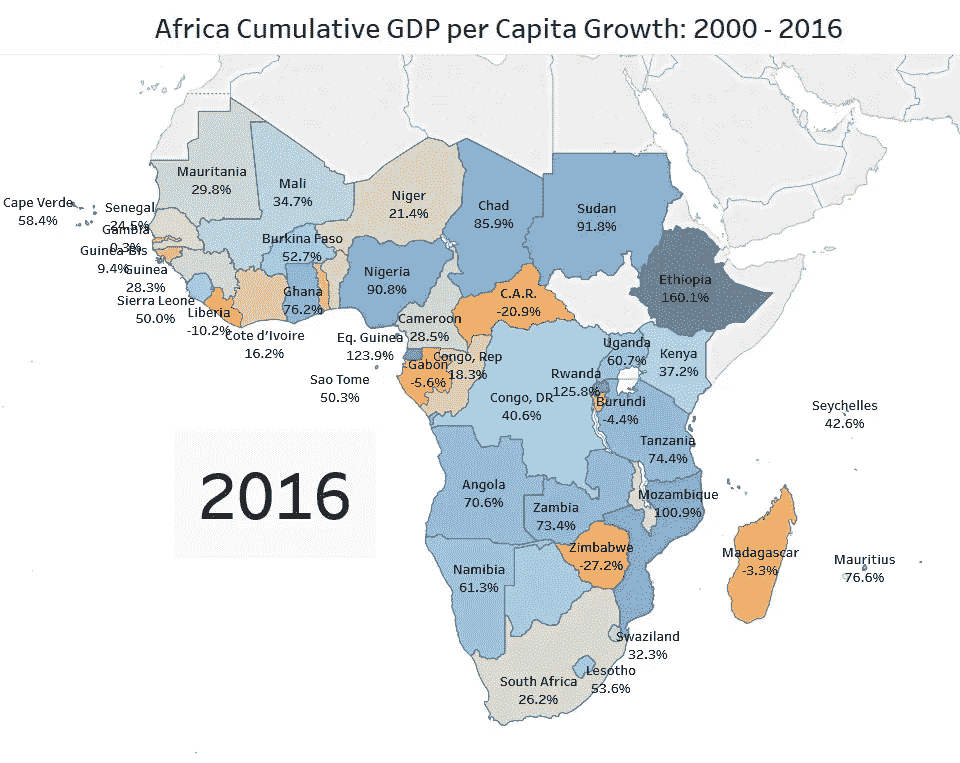
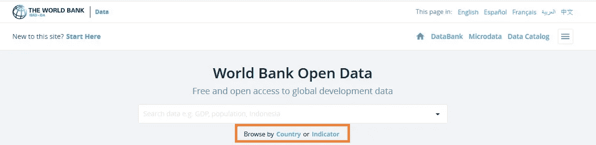
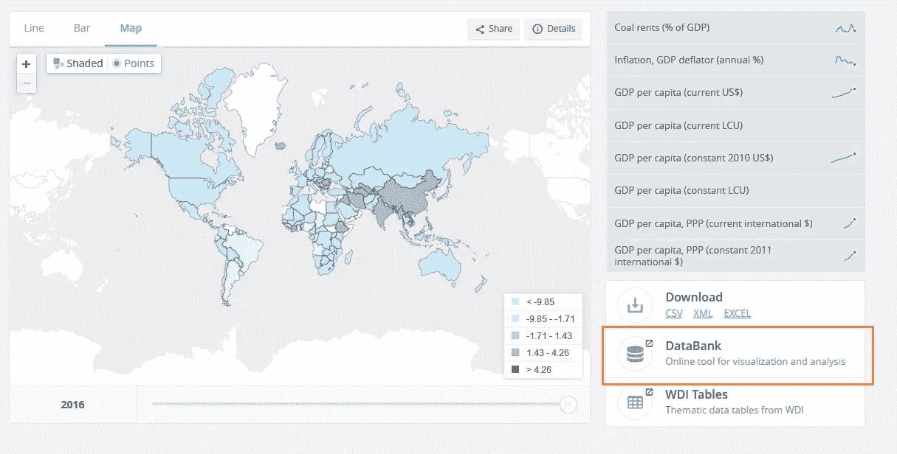
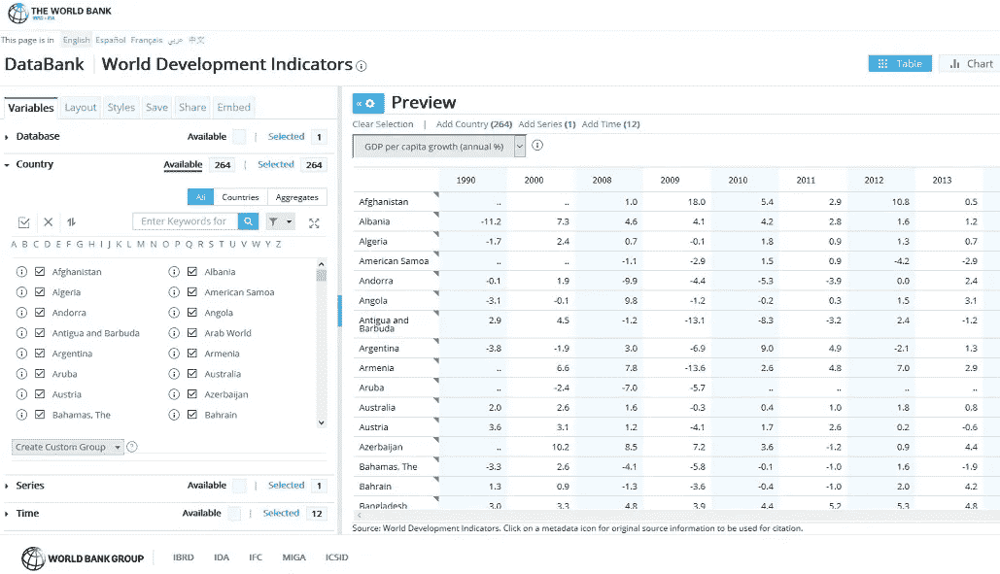
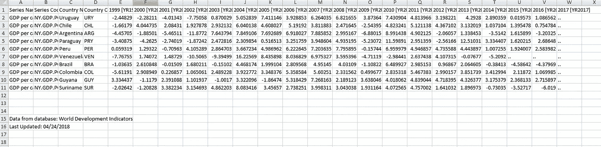
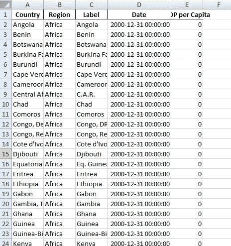
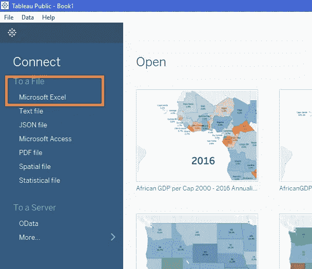
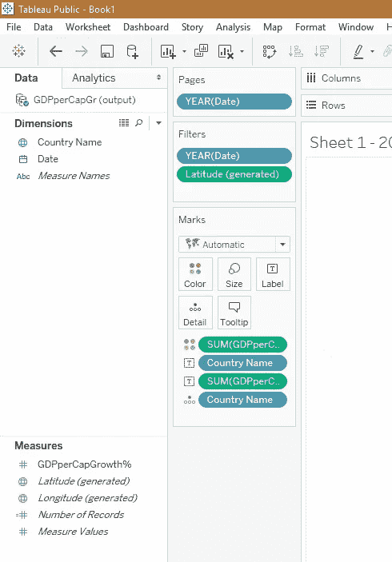
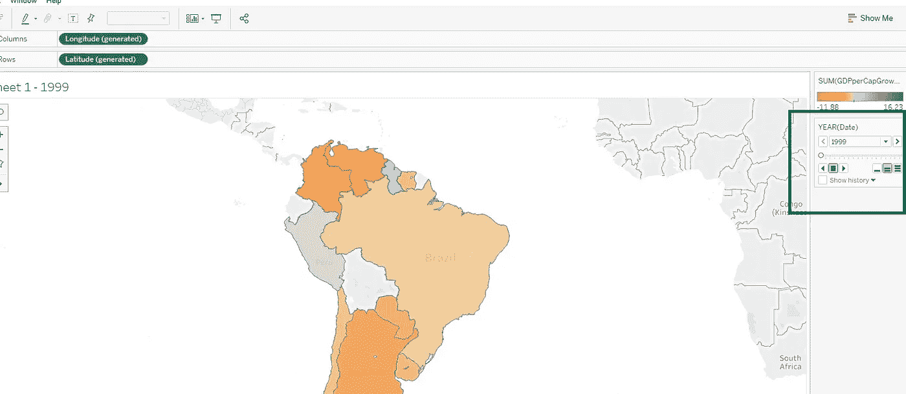

# 用熊猫融化在 Python 中转换数据

> 原文：<https://towardsdatascience.com/transforming-data-in-python-with-pandas-melt-854221daf507?source=collection_archive---------5----------------------->

世界银行拥有互联网上最丰富的数据来源之一。这些数据有许多实际应用，如预测经济增长或[用机器学习预测贫困](http://www.worldbank.org/en/events/2018/02/27/machine-learning-poverty-prediction)。我最近用这些数据制作了一些撒哈拉以南非洲人均 GDP 增长的可视化表格([年化增长](https://public.tableau.com/profile/jake.huneycutt#!/vizhome/AfricanGDPperCap2000-2016Annualized/Sheet1)、[累积增长](https://public.tableau.com/profile/jake.huneycutt#!/vizhome/AfricanGDPperCap2000-2016/Sheet1))。



然而，前进的道路上有一个巨大的路障。我的世界银行数据无法在 Tableau 上使用。Tableau 更适合数据库样式的格式，而不是您在 Excel 中看到的金融和经济数据的典型格式。


我必须转换数据，使其在 Tableau 中工作。用 Python 来做这件事的一个方法是用[熊猫融化](https://pandas.pydata.org/pandas-docs/stable/generated/pandas.melt.html)。Pd.melt 允许您将数据从“宽格式”转换为“长格式”，非常适合我的任务:获取“宽格式”经济数据，每列代表一年，然后将其转换为“长格式”数据，每行代表一个数据点。

**获取数据**

在我开始编码之前，我想向您展示如何访问数据。如果您只想了解 pandas.melt，请随意跳到下一部分(“用 Pandas Melt 进行改造”)。如果想做完整教程(取世行数据，做 Tableau 动画)，第一步是去[世行公开数据](https://data.worldbank.org/)网站。

有许多不同的方法来获取人均国内生产总值数据。你可以点击主页上的“按指标浏览”(见下图中的橙色框)，然后向下滚动到“经济和增长”部分，在那里你会找到一些人均 GDP 指标。



或者，您可以开始在搜索栏中键入您想要的度量。

对于我的分析，我做了年化和累积人均 GDP 增长；这两个指标都需要稍微复杂一点，所以让我们简化一下，把重点放在“人均 GDP 增长率(年%)”上。一旦你选择了你的类别，你将得到世界数据。你可以点击“地图”查看国家和年份的数据。我们需要去“数据库”直接研究这些数据。



我们将得到一个复杂的屏幕，看起来像下面的图片:



在处理世界银行的数据时有一些挫折。如果你正在跟进，我建议尝试做一些比撒哈拉以南非洲增长更简单的事情。而是关注国家更少的南美。

首先，我们需要“取消全选”然后我们将选择几个南美国家:阿根廷、巴西、智利、秘鲁和委内瑞拉。如果您想要更全面的演示，也可以随意将其他国家添加到您的数据集中(巴拉圭、乌拉圭、玻利维亚、厄瓜多尔、哥伦比亚、圭亚那、苏里南)。现在查看“时间”,确保检查了 2000 年至 2016 年的所有年份。

在屏幕右上角找到“下载选项”并下载 Excel 文件。我们有一大堆看起来像这样的数据:



问题是 Tableau 想要一种数据库风格的格式。我们需要我们的数据看起来更像这样:



请注意，不同之处在于，数据库样式的格式为每个国家和日期提供了单独的一行，而不是为每个单独的年份提供列。

在我们使用 pandas.melt 之前，我们需要先清理一下我们的数据。让我们删除无用的列，如“系列名称”、“系列代码”和“国家代码”我们还需要将日期更改为 mm/dd/yyyy 格式。我们可以在 Python 中做到这一点，但通常情况下，更简单的方法是只输入前两年的 12/31/yyyy(输入“yyyy”的年份)，然后使用 Excel 的 [fill 命令](https://support.office.com/en-us/article/create-a-list-of-sequential-dates-aa1c0fa7-c76a-4762-8bc9-46f1691defec)来完成剩下的工作。最后，删除底部的源数据(“数据库中的数据”，“上次更新”)。现在我们准备用 Python 来转换数据。

**变身熊猫融化**

首先，我们需要导入熊猫和数据集。这将取决于您的文件位置，但您的代码应该看起来像这样。

```
import pandas as pddf = pd.read_excel('C:\PlaceYourDataComesFrom\data.xlsx', sheetname='data')print(df.head())
```

使用 df.head()确保数据正确加载。现在，我们将使用 pd.melt 来重新格式化它。

```
d = pd.melt(df, 'Country Name', var_name='Date', value_name='GDPperCapGrowth%')print(d.head())
```

最后一步是用我们转换后的输出生成一个新的 Excel 文件。

```
d.to_excel(r'C:\PlaceYouWantYourDataToGo\output.xlsx', sheet_name='GDPperCapGr', index=False)
```

现在，转换后的数据在 Tableau 中应该工作得很好。

**一点点 o' Tableau**

由于这是一个熊猫融化教程，我不会花太多时间在 Tableau 上，但如果你想看看你的地图会是什么样子，你首先需要在你的电脑上 Tableau。你可以在 [Tableau 公共](https://public.tableau.com/en-us/s/)网站下载免费版本。

公开展示画面。连接到 Excel 文件。加载转换后的 Excel 数据。单击 Tableau 底部的“Sheet 1 ”,您应该会看到您的数据。



在“维度”部分，您会看到“国家名称”将它拖到屏幕中间的大框中(“拖放到此处”)。向下浏览“Measures”部分，您会看到“GDPperCapGr%”。将它拖到“颜色”框中。在“维度”部分找到“日期”,并将其拖动到“过滤器”框中。选择“全部”表示年份。



现在，再次转到“日期”并将其拖动到“过滤器”上方的“页面”框中你会看到一个新的框出现在屏幕的最右边(我在下图中突出显示了它，被一个黑色的框包围着。)按下前进按钮，你会得到一个漂亮的人均 GDP 逐年增长的动画。在“标签”框中添加“国家名称”和“GDPperCapGr%”以添加标签。



现在你有一个简单的(虽然还不优雅)Tableau 动画来玩。

**结论**

熊猫融化是一个非常强大的数据转换工具。如果你要处理大量广泛的经济和金融数据，它会特别有用；并且需要一种对数据库更友好的长格式。