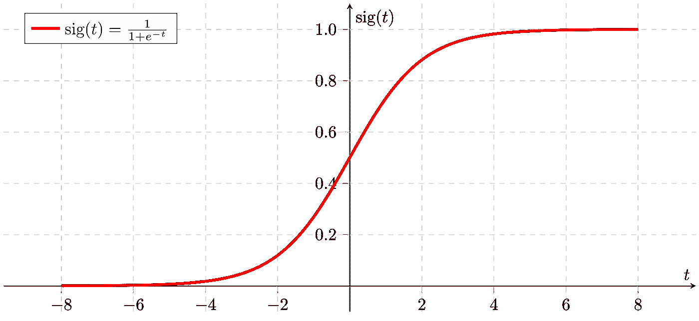
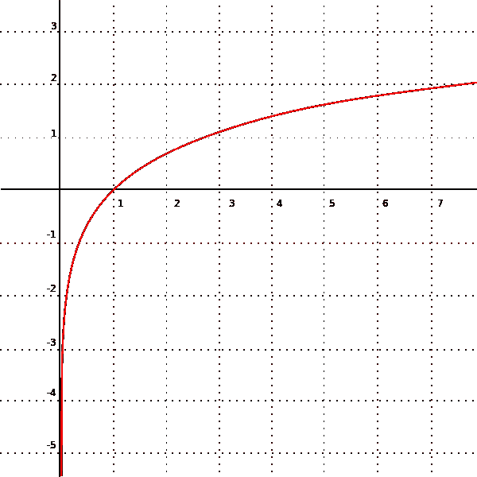
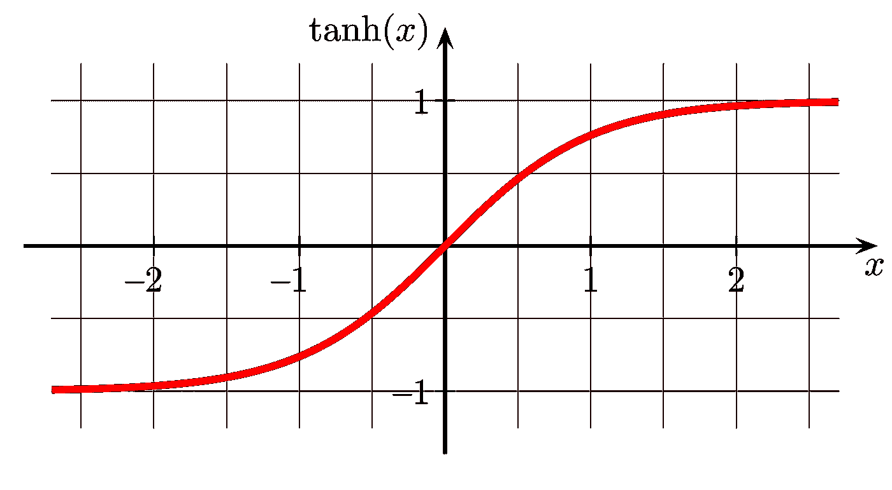

# 转换扭曲的数据

> 原文：<https://towardsdatascience.com/transforming-skewed-data-73da4c2d0d16?source=collection_archive---------0----------------------->

## 友好函数综述

*注:以下代码用 Python 编写，摘自各种 Jupyter 笔记本。为了使文章更具可读性，行内注释被删除了。*


扭曲的数据既麻烦又常见。通常需要转换倾斜的数据，并将其转换为 0 到 1 之间的值。

用于这种转换的标准函数包括归一化、Sigmoid、对数、立方根和双曲正切。这完全取决于一个人试图完成什么。

这里有一个我从 890 万行[亚马逊图书评论数据集](http://jmcauley.ucsd.edu/data/amazon/)中生成的倾斜列的例子。df。Helpful _ Votes 给出每篇书评收到的有用投票(相对于无用投票)的总数。

## **df _ helper _ Votes 原始数据**

```
**IN** df.Helpful_Votes.describe()**OUT** count    4.756338e+06
mean     5.625667e+00
std      2.663631e+01
min      0.000000e+00
25%      1.000000e+00
50%      2.000000e+00
75%      4.000000e+00
max      2.331100e+04
```

0, 1, 2, 4, 23311.那是相当大的一跳！

删除异常值是一个选项，但不是我想在这里使用的。我的最终目标是建立一个机器学习算法来预测给定的评论是否有帮助，因此拥有最有帮助投票的评论是必不可少的。

我将使用上面列出的函数来转换数据，并解释其优缺点。和大多数数据科学一样，没有正确的函数。这取决于数据和分析师的目标。

规范化将所有数据点转换为 0 到 1 之间的小数。如果最小值为 0，只需将每个点除以最大值。

如果最小值不为 0，则从每个点中减去最小值，然后除以最小值-最大值差。

以下函数包括这两种情况。

## **归一化功能**

```
**IN**
def normalize(column):
    upper = column.max()
    lower = column.min()
    y = (column - lower)/(upper-lower)
    return yhelpful_normalized = normalize(df.Helpful_Votes)
helpful_normalized.describe()**OUT**
count    4.756338e+06
mean     2.413310e-04
std      1.142650e-03
min      0.000000e+00
25%      4.289820e-05
50%      8.579641e-05
75%      1.715928e-04
max      1.000000e+00
```

归一化后，数据还是和以前一样偏斜。如果目标只是简单地将数据转换成 0 到 1 之间的点，那么规范化是一条可行的途径。否则，规范化应该与其他函数结合使用。

接下来是 Sigmoid 函数。如果你以前没有见过乙状结肠，值得看一看。



这是一条非常平滑的曲线，保证了 0 到 1 的范围。我们来看看它在 df 上的表现如何。有帮助的 _ 投票。

## Sigmoid 函数

```
**IN**
def sigmoid(x):
    e = np.exp(1)
    y = 1/(1+e**(-x))
    return yhelpful_sigmoid = sigmoid(df.Helpful_Votes)
helpful_sigmoid.describe()**OUT**
count    4.756338e+06
mean     8.237590e-01
std      1.598215e-01
min      5.000000e-01
25%      7.310586e-01
50%      8.807971e-01
75%      9.820138e-01
max      1.000000e+00
```

明显的进步。新数据在预期的 0 和 1 之间，但最小值是 0.5。这在查看图表时是有意义的，因为在统计投票时没有负值。

另一个需要考虑的问题是价差。这里，第 75 百分位在第 100 百分位的 0.2 以内，与其他四分位相当。但是在原始数据中，第 75 个百分位数与第 100 个百分位数相差 20，000 多，与其他四分位数相差甚远。在这种情况下，数据被扭曲了。

sigmoid 函数可以调整以改善结果，但现在，让我们探索其他选项。

接下来，对数。减少数据失真的绝佳选择。在 Python 中使用 log 时，默认基数通常是 *e* 。

## 对数函数

```
**IN**
helpful_log = np.log(df.Helpful_Votes)
helpful_log.describe()**OUT**
RuntimeWarning: divide by zero encountered in log
```

哎呦！被零除！这是怎么发生的？也许一个视觉会澄清事情。

## 对数图



Af Adrian Neumann — Eget arbejde, CC BY-SA 3.0, [https://commons.wikimedia.org/w/index.php?curid=1834287](https://commons.wikimedia.org/w/index.php?curid=1834287)

啊，是的。日志的域严格大于 0。这是一条沿着 y 轴的垂直渐近线。当 x 接近 0 时，y 接近负无穷大。换句话说，0 被排除在域之外。

我的很多数据点都是 0，因为很多评论没有收到有用的投票。为了快速解决问题，我可以在每个数据点上加 1。因为 1 的对数是 0，所以这样做很好。此外，由于*所有的*点都增加 1，所以保持了相同的分布。

## 对数函数+ 1

```
**IN**
helpful_log = np.log(df.Helpful_Votes + 1)
helpful_log.describe()**OUT**
count    4.756338e+06
mean     1.230977e+00
std      9.189495e-01
min      0.000000e+00
25%      6.931472e-01
50%      1.098612e+00
75%      1.609438e+00
max      1.005672e+01
Name: Helpful_Votes, dtype: float64
```

非常好。新的范围是从 0 到 10，四分位数反映了原始数据。

是时候正常化了。

## 对数函数+ 1 标准化

```
**IN**
helpful_log_normalized = normalize(helpful_log)
helpful_log_normalized.describe()**OUT**
count    4.756338e+06
mean     1.224034e-01
std      9.137663e-02
min      0.000000e+00
25%      6.892376e-02
50%      1.092416e-01
75%      1.600360e-01
max      1.000000e+00
Name: Helpful_Votes, dtype: float64
```

这看起来很有道理。如果结果仍然有偏差，对数函数加归一化是转换有偏差数据的一种很好的方法。然而，这种情况有一个主要的缺点。

为什么首先要将数据转换为 0 到 1 之间的值？通常百分比和概率会起作用。就我而言，我希望中位数在 50%左右。这里归一化后，中位数在 0.1。

当数字太大时，可以尝试用分数指数作为变换的手段。考虑立方根。

## 立方根

```
**IN**
helpful_cube_root = df.Helpful_Votes**(1/3)
helpful_cube_root.describe()**OUT**
count    4.756338e+06
mean     1.321149e+00
std      8.024150e-01
min      0.000000e+00
25%      1.000000e+00
50%      1.259921e+00
75%      1.587401e+00
max      2.856628e+01
```

这与 log 非常相似，但是这里的范围更大，从 0 到 28。

## 立方根归一化

```
**IN**
helpful_cube_root_normalized = normalize(helpful_cube_root)
helpful_cube_root_normalized.describe()**OUT**
count    4.756338e+06
mean     4.624857e-02
std      2.808959e-02
min      0.000000e+00
25%      3.500631e-02
50%      4.410519e-02
75%      5.556906e-02
max      1.000000e+00
```

不出所料，新数据归一化后问题更多。现在中位数是 0.04，离 50%相差甚远。

我喜欢玩数字游戏，所以我尝试了一些超能力。有趣的结果来自 1/log_max。我定义 log_max 为最大值的对数。(23311 的对数是 10.06。)

## 对数最大根

```
**IN**
log_max = np.log(df.Helpful_Votes.max())
helpful_log_max_root = df.Helpful_Votes**(1/log_max)
helpful_log_max_root.describe()**OUT**
count    4.756338e+06
mean     9.824853e-01
std      3.712224e-01
min      0.000000e+00
25%      1.000000e+00
50%      1.071355e+00
75%      1.147801e+00
max      2.718282e+00
```

从 0 到 2.7 的范围非常吸引人。

**对数最大根归一化**

```
**IN**
helpful_log_max_root_normalized = normalize(helpful_log_max_root)
helpful_log_max_root_normalized.describe()**OUT**
count    4.756338e+06
mean     3.614362e-01
std      1.365651e-01
min      0.000000e+00
25%      3.678794e-01
50%      3.941294e-01
75%      4.222525e-01
max      1.000000e+00
```

这看起来不错，但是数据非常集中在 25–75%的范围内，这个范围可能会延伸得更远。因此，尽管整体传播更令人满意，但在这里还不够。

现在是我们最后一个标准函数，双曲正切函数。先来个图。



这看起来很像乙状结肠。一个主要的区别是范围。双曲正切的范围是从-1 到 1，而 sigmoid 的范围是从 0 到 1。

在我的资料里，从 df 开始。有帮助的 _ 投票都是非负的，我的输出会从 0 到 1。

## 双曲正切

```
**IN**
helpful_hyperbolic_tangent = np.tanh(df.Helpful_Votes)
helpful_hyperbolic_tangent.describe()**OUT**
count    4.756338e+06
mean     7.953343e-01
std      3.033794e-01
min      0.000000e+00
25%      7.615942e-01
50%      9.640276e-01
75%      9.993293e-01
max      1.000000e+00
```

没有必要标准化，但没有突出的问题。

双曲正切比 sigmoid 更扭曲数据。第 75 个和第 100 个百分位数之间有 0.001 的差异，比其他任何四分位数都要接近。在原始数据中，这一差异比其他四分位数之间的差异大 23，307，1000 倍。

差远了。

百分位数提供了另一种选择。每个数据点都可以根据其百分位数进行排序，pandas 提供了一个很好的内置方法。兰克，来处理这件事。

一般的想法是，每个点接收其百分位数的值。在我的例子中，因为有许多数据点的有用票数很低，所以有不同的方法来选择这些百分点。我喜欢“最小”方法，在这种方法中，所有的数据点都接受给予组中第一个成员的百分位数。默认方法是“平均”，其中具有相同值的所有数据点取该组的平均百分位数。

## 百分位线性化

```
**IN**
size = len(df.Helpful_Votes)-1
helpful_percentile_linearization = df.Helpful_Votes.rank(method=’min’).apply(lambda x: (x-1)/size)
helpful_percentile_linearization.describe()**OUT** count    4.756338e+06
mean     4.111921e-01
std      3.351097e-01
min      0.000000e+00
25%      1.133505e-01
50%      4.719447e-01
75%      7.059382e-01
max      1.000000e+00
```

很有趣。百分位数线性化基本上与排名系统相同。如果第一个数据点和第二个数据点之间的差异应该与作为一个单位部分的所有数据点相同，则可以采用百分点线性化。

不利的一面是，百分位数线性化消除了关键的偏斜迹象。这个数据看起来有点倾斜，因为有成千上万的 1 票和 2 票的评论，而不是因为有几个评论的投票数高得惊人。

因为我主要是在处理一个排名系统，所以我把百分位数线性化和我自己的分段线性化函数结合起来。原木也发挥了作用。

无论你的选择或风格如何，永远不要局限于标准选项。数学函数极其丰富，它们与数据科学的交集值得更多的认可和灵活性。

我很想听听人们用来转换扭曲数据的其他函数。我听说过 boxcox 函数，尽管我还没有详细研究过它。

*更多关于 Wade 的亚马逊书评项目的详情可以在他的 Github 页面查看，*[*helified _ Reviews*](https://github.com/coreyjwade/Helpful_Reviews)*。*