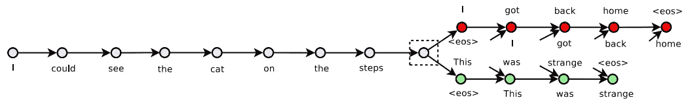
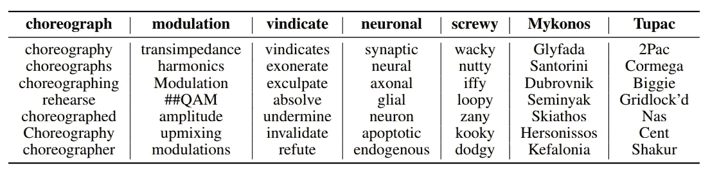

# 通过一些想法将文本转化为句子嵌入

> 原文：<https://towardsdatascience.com/transforming-text-to-sentence-embeddings-layer-via-some-thoughts-b77bed60822c?source=collection_archive---------11----------------------->

“man standing on mountain peak” by [Sammie Vasquez](https://unsplash.com/@sammieeev?utm_source=medium&utm_medium=referral) on [Unsplash](https://unsplash.com?utm_source=medium&utm_medium=referral)

学习一个通用的分布式嵌入层是 NLP 问题中的一个重要步骤。从 Mikolov 等人(2013)开始，引入了许多监督学习和非监督学习方法来检索高质量的文本表示。

Kiros 等人在 2015 年引入了 skip-thinks，其目标是提供句子级向量。看完这篇文章，你会明白:

*   跳跃式设计
*   体系结构
*   履行
*   拿走

# 跳跃式设计

如果您不熟悉构建单词嵌入的跳格方法，您可以查看这个[博客](/3-silver-bullets-of-word-embedding-in-nlp-10fa8f50cc5a)了解更多细节。

“women's white tank top on top of the hill” by [Cristina Gottardi](https://unsplash.com/@cristina_gottardi?utm_source=medium&utm_medium=referral) on [Unsplash](https://unsplash.com?utm_source=medium&utm_medium=referral)

Skip-thoughts 将 skip-grams 模型从单词嵌入扩展到句子嵌入。跳跃思维不是通过周围的词来预测上下文，而是通过周围的句子来预测目标句子。典型的例子是用上一句和下一句来预测当前句。

Kiros et al. (2015)

从上面的例子中，

*   上一句:我回到了家。
*   我能看见台阶上的猫。
*   下一句:这很奇怪。

第二，单词嵌入提供了更好的单词表示，而不考虑句子中的顺序。递归神经网络(RNN)可以处理句子中的单词顺序，但 skip-thoughts 也会考虑这个问题。

作者证明了该模型能够捕获句子的语义和句法，从而可以将高质量的嵌入结果转移到下游问题。

# 体系结构

该模型遵循编码器-解码器框架架构来计算矢量。在神经网络层，它可以是 GRU(门控循环单元)，LSTM(长短期记忆)或注意机制。

***编码器*** :输入的是每句话的词向量序列，传递给 RNN (GRU 或 LSTM)。经过训练的模型，将用于下游任务，如分类问题。

***解码器*** :解码器的架构与编码器类似，只是引入了一些矩阵。此外，有两个解码器而不是一个。第一个是为了消耗上一个句子而决定的，而第二个是为了消耗下一个句子。不同之处在于它们彼此之间不共享解码器权重(隐藏状态),但是它们共享词汇向量。解码器帮助训练编码器，之后就不再使用了。

“gray concrete post on seashore under gray sky” by [Perminder Klair](https://unsplash.com/@perminder_klair?utm_source=medium&utm_medium=referral) on [Unsplash](https://unsplash.com?utm_source=medium&utm_medium=referral)

**其思想是使用预先训练的嵌入(例如 word2vec)作为输入(即 x 或特征)和输出(即 y 或标签)是嵌入层的另一个维度。以便它可以“预测”每个单词的嵌入，即使它从未在训练数据中出现过。**

Kiros et al. (2015). Showing the nearest neighbors of words after vocabulary expansion. For example, “chorepgraph” is OOV and the the nearest neighbors of words are “choreography“, “choreographs”.

文中没有详细的解释，所以我进一步研究了源代码，以了解它是如何工作的。你也可以参考[源代码](https://github.com/ryankiros/skip-thoughts/blob/master/training/tools.py) (train_regresso 函数)来浏览它。

根据 Kiros 等人的设计，有两种方法，即单跳和双跳。Uni-skip 指使用单向神经网络来构建句子嵌入，而 bi-skip 使用双向 RNN (LSTM 或 GRU)来构建句子嵌入。单跳(或双跳)的输出是句子的 2400 维(如果使用组合跳过方法，则是 4800 维)。我们可以通过给定下游任务(例如分类)输出来训练模型。

# 履行

最初的作者是 Kiros 等人，他们通过 Theano 实现了跳过思想。有 Pytorch，Tensorflow 和 Keras 版本可用。我将使用 Pytorch 版本来演示我们如何将数据转换成句子向量。对于其他人，您可以查看参考资料部分提到的 githubs。

给定预先训练好的模型、词汇文件和输入(句子)，你将得到 2400 维向量的输出(对于 uni-skip)。

# 拿走

要访问所有代码，你可以访问我的 [github](https://github.com/makcedward/nlp/blob/master/sample/nlp-skip_thoughts.ipynb) repo。

*   skip-thoughts 和 skip-gram 都是**无监督学习**。
*   Skip-thoughts 的目标是学习一个**句子级向量**而不是单词向量。
*   由于它是固定的句子表示，如果你的“句子”很长，它将消耗大量的内存。它不应该用于段落或文档嵌入。

# 参考

*   Ryan Kiros、Yukun Zhu、Ruslan Salakhutdinov、Richard S. Zemel、Antonio Torralba、Raquel Urtasun 和 Sanja Fidler。[跳过思维向量](http://arxiv.org/abs/1506.06726)
*   s[kip-thinks the ano github](https://github.com/ryankiros/skip-thoughts)
*   [Skip-thought py torch github](https://github.com/Cadene/skip-thoughts.torch/tree/master/pytorch)
*   [Skip-Thoughts tensor flow github](https://github.com/tensorflow/models/tree/master/research/skip_thoughts)
*   [Skip-Thoughts Keras github](https://github.com/phdowling/skip-thought-keras)