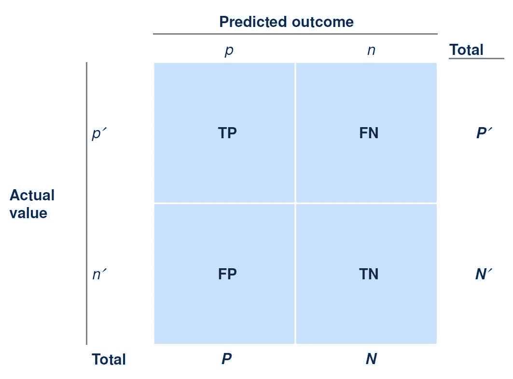
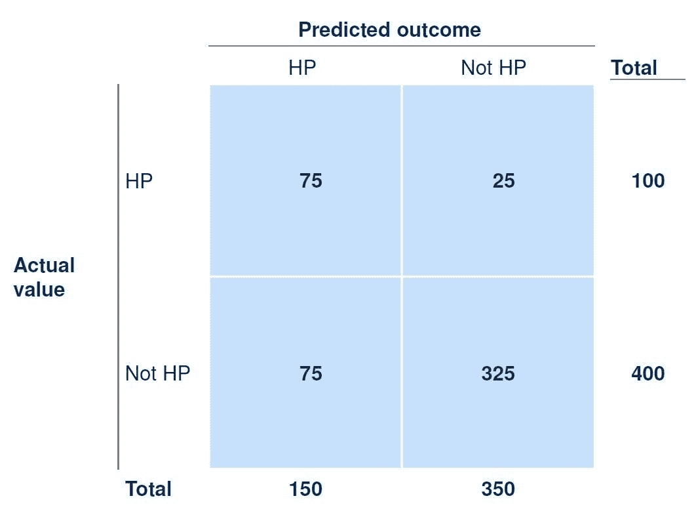
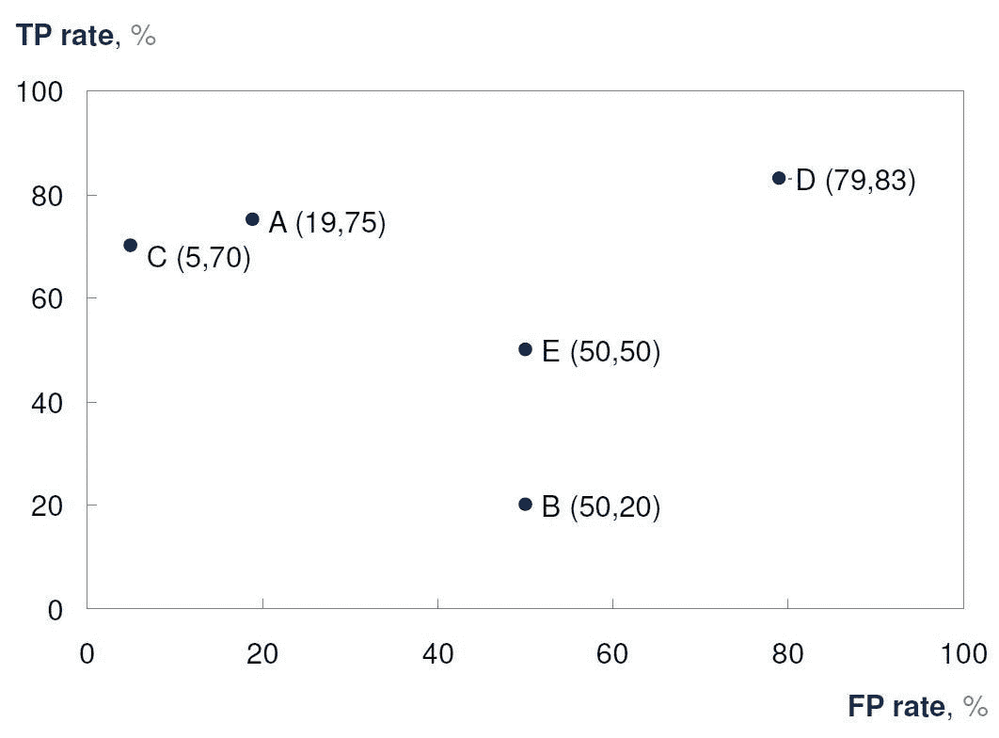
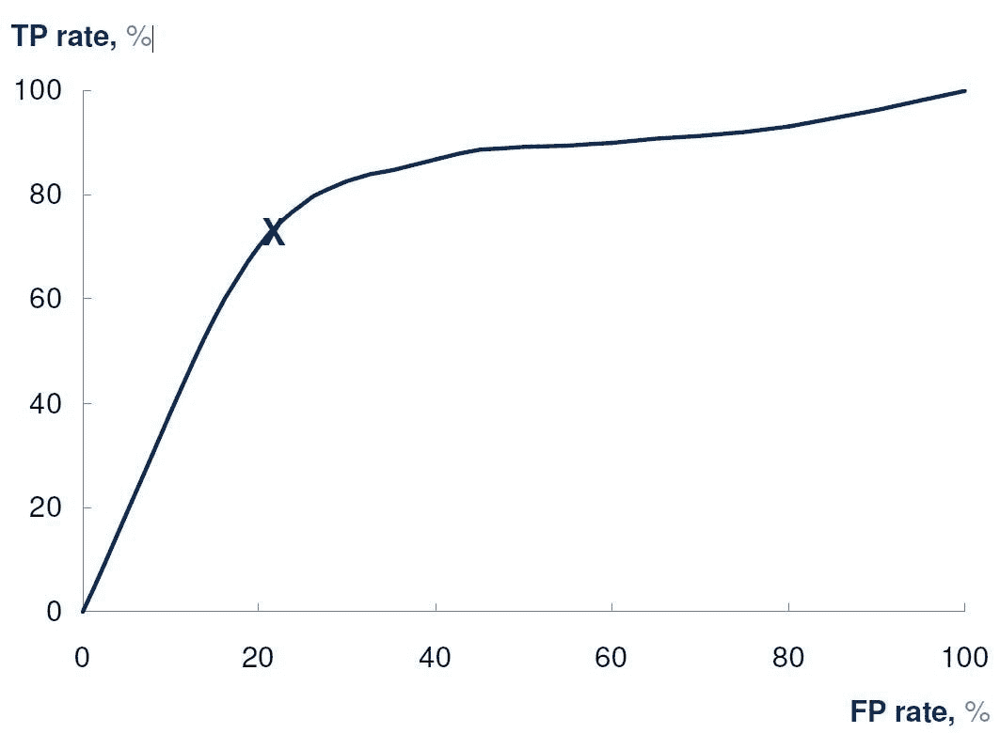
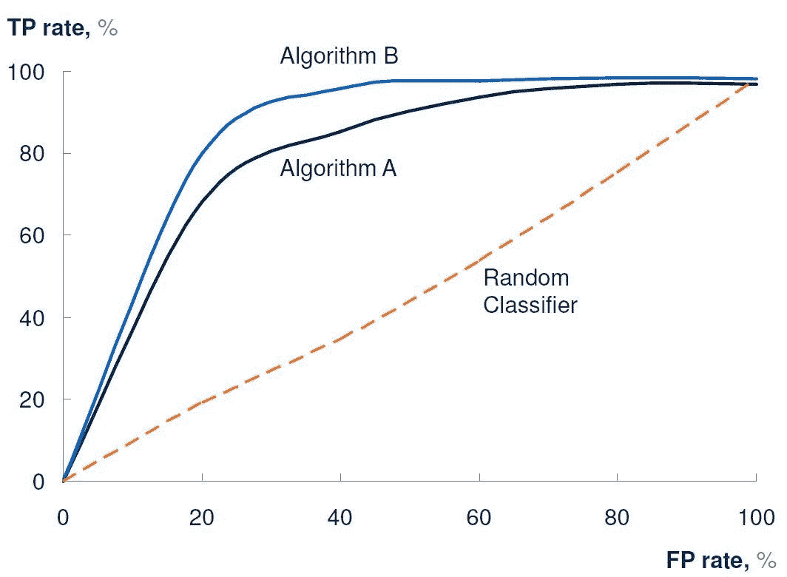
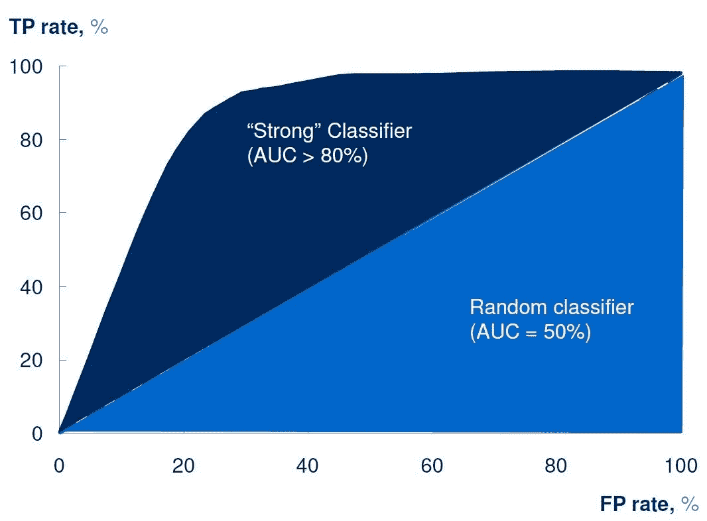
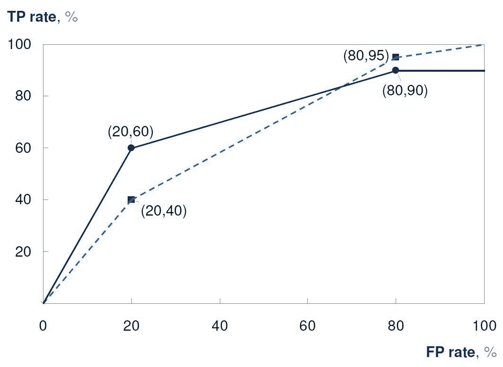

# 垃圾还是宝藏——如何判断分类算法是否有用

> 原文：<https://towardsdatascience.com/trash-or-treasure-how-to-tell-if-a-classification-algorithm-is-any-good-cb491180b7a6?source=collection_archive---------8----------------------->

这是一系列文章中的第四篇，旨在使机器学习对那些没有受过技术培训的人来说更容易理解。以前的文章介绍了机器学习的概念，展示了学习的一般过程，并描述了常用的算法。你可以在这里开始**系列。**

*在本系列的这一部分中，我们回顾了在评估分类算法的有效性和价值时的一些常见度量和注意事项。*

*首先，让我们假设已经在训练集上开发了一个算法，并且该算法具有良好的泛化能力。我们现在考虑如何在测试集上测量算法的性能。如果你没有理解我刚才说的话，你需要回到[这一期](/how-does-machine-learning-work-6dd97f2be46c)。*

## *混乱矩阵*

*让我们假设我们的算法是一个简单的离散分类器，如果实例被预测为感兴趣的类的一部分(肯定)，则返回 p，否则返回 n(否定)。我们还假设，在测试集中的实际数据中，p '代表正实例，n '代表负实例。回想一下以前的一篇文章中关于真阳性(TP)、真阴性(TN)、假阳性(FP)和假阴性(FN)的定义:*

*TP = p 和 p '*

*TN = n 和 n '*

*FP = p 和 n '*

*FN = n 和 p '*

*在一个矩阵中显示其中每一个的总实例是有用的，该矩阵被称为*混淆矩阵*(或*误差矩阵*或*列联表*)，例如:*

**

*从混淆矩阵中可以计算出许多有价值的度量，如下所示:*

*   ***精度** = (TP + TN)/(P + N)。准确度是所有被正确预测的实例的比例*。**
*   ****精度** = TP/P，精度是*准确预测阳性的比例*。**
*   ****TP 速率**或**召回**或**灵敏度**= TP/P’。TP 率是准确预测的阳性样本的比例*。***
*   *****FP 率**= FP/N’。FP 率是被错误预测为阳性的阴性样本的*比例*。***
*   ****特异性**= TN/N’= 1-FP 率。特异性是正确预测的阴性样本的比例*。***

***根据具体情况，数据科学家对所有这些指标都感兴趣。然而，特别令人感兴趣的是 TP 率和 FP 率之间的权衡。对于一个有价值的算法，它需要正确地分类正例(好处)，同时确保被错误地分类为正例(代价)的负例的数量保持在可接受的水平。***

## ***混淆矩阵示例***

***让我们回到我们最初的例子从[分期付款 2](/how-does-machine-learning-work-6dd97f2be46c) 。让我们假设我们开发了一种算法，可以预测哪些工作申请是“高潜力”的。***

***该算法只返回“HP”或“Not HP”。我们通过 500 份以前的工作申请测试集运行我们的算法，并生成这个混淆矩阵:***

******

***因此，对于该算法，我们可以计算:***

*   ***准确率= 80%。五分之四的测试集实例被正确预测。***
*   ***精度= 50%。一半的正面预测是准确的。***
*   ***TP 率= 75%。四分之三的正面例子被正确预测。***
*   ***FP 率= 19%。大约五分之一的负面例子被错误地预测为正面。***
*   ***特异性= 81%。大约五分之四的负面例子被正确预测。***

***虽然 75%的 TP 率本身可能被认为是非常好的，但它是以 19%的 FP 率为代价实现的。这个 FP 率可能高得不可接受。假设可以实现 TP 速率和 FP 速率的可接受平衡，这取决于人类决策者与数据科学家的合作。通常有必要将数量作为决策的一部分。如果公司收到 5000 份申请，这意味着几乎有 1000 份会被错误地归类为“高潜力”，公司可能没有能力处理这些。***

## ***ROC 图***

***考虑到 TP 速率和 FP 速率之间的折衷如此令人感兴趣，通过在二维图上绘制 TP 速率和 FP 速率来可视化和比较算法是很自然的。这样的图叫做 *ROC 图*。(接收机工作特性，这个术语源于第二次世界大战期间的工程和雷达发展)。***

**使用我们上面的“高潜力”示例，并假设数据科学家开发了其他四种具有不同 TP 和 FP 速率的算法，我们可以使用 ROC 图来比较这些算法，下面绘制的算法 A 与上一节中讨论的算法 A 相同。我们可以立即确定算法 C 是性能最好的算法。算法 E 是一个完全随机的算法，它选择相同比率的真阳性和假阳性。算法 B 比真阳性更能识别假阳性。**

****

## **ROC 曲线**

**现在让我们假设我们的算法是一个概率分类器，并返回实例落入某一类的概率。在这种情况下，混淆矩阵只能基于“截止”概率来确定。**

**使用我们的示例，我们可以想象算法可能已经为测试集中的每个应用程序计算了一个概率，并且公司可能已经决定尝试将截止值 0.8 作为被视为“高潜力”的最小概率。**

**因此，这种概率分类器对于不同的截止点将具有不同的混淆矩阵，因此 TP 率和 FP 率将根据所应用的截止点而变化。**

**在这种情况下，画出算法的 *ROC 曲线*是有帮助的，也就是画出当使用不同的截断点时 TP 率和 FP 率如何相对于彼此变化。随着截止点的降低，TP 率保持不变或增加。**

**因此，FP 率也必须保持不变或增加。这种曲线被称为*洛伦兹曲线*。**

**下面给出了我们的概率“高潜力”算法的 ROC 曲线的一个例子，给出了我们前面的例子中用 x 标记的具体截止点。**

****

**ROC 曲线可以与体积因素结合使用，以确定概率分类器的最佳截止点。如果数量是一个问题，例如如果组织的资源是有限的，那么就需要尽量减少误报。否则，更高水平的假阳性可以被接受为高 TP 率的折衷。**

## **什么是“好的”ROC 曲线？**

**想象一下，我们开发了一个完全随机的概率分类算法，在每个截止点，以相同的速度识别真阳性和假阳性。如果我们在 ROC 图上绘制这样一个分类器，它看起来就像一条连接点(0，0)和点(100，100)的对角线。这种算法对我们没有价值，因为我们还不如用盲目的运气来分类我们的数据集。**

**通常，如果我们正在测量一个已经在测试集上开发并具有良好泛化能力的算法，该算法将明显优于随机分类器，其 ROC 曲线将采取凸形式，如这里所示的两个算法 A 和 B。**

****

**很明显，ROC 图上的“黄金区域”是左上角，这里有高 TP 率和低 FP 率。因此，数据科学家喜欢看到 ROC 曲线的顶点尽可能深入 ROC 图的这个角落。**

**在这种情况下，数据科学家可能会根据 ROC 曲线的比较，认为算法 B 比算法 A“更好”。**

## **曲线下面积**

**假设观察到“好的”ROC 曲线的顶点尽可能位于 ROC 图的左上方，ROC 曲线下方的面积可以作为算法强度的一般指标。曲线占据的面积越大，曲线占据 ROC 图左上方“黄金区域”的可能性就越大。**

**因此，曲线下的*面积，或 *AUC* ，通常被用作概率分类器强度的一般指标。注意，随机分类器的 AUC 是 50%,因此理想情况下，一种有前途的算法将显示出显著高于此的 AUC，并且通常大于 80%。这是一个例子。***

**

*请注意，AUC 与基尼系数是线性等价的，基尼系数是衡量财富分配的一个常用宏观经济指标。具体来说，*

**基尼= 2 × AUC — 1* 。*

*AUC 作为概率分类器强度的一般度量表现得非常好。但是，应该谨慎使用。完全有可能产生高 AUC 的算法在 ROC 图上感兴趣的特定点表现不佳。下面举例说明了具有相似 AUC 的两种算法，但是这些算法的性能根据 ROC 图上的兴趣点而有很大不同。*

**

## *摘要*

*总结这一期的观察结果:*

1.  *可以使用简单的混淆矩阵以及诸如准确度、TP 率、FP 率等度量来评估离散分类器。这些措施，结合对容量的考虑，可以帮助确定算法是否满足操作要求。*
2.  *概率分类器可以使用 ROC 曲线绘制。曲线下面积(AUC)是算法预测效用的良好通用指标，AUC 大于 80%应为目标。然而，即使 AUC 很高，也有必要更深入地观察 ROC 图中感兴趣的特定点，并考虑体积因素，以确定是否存在符合操作要求的临界值。*

*下一次，为了结束这个系列，我将提供一个与机器学习相关的关键术语的词汇表‘备忘单’。找到它 [*这里*](/bluff-the-bots-a-glossary-of-key-terms-in-machine-learning-3d528c8d86f4) *。**