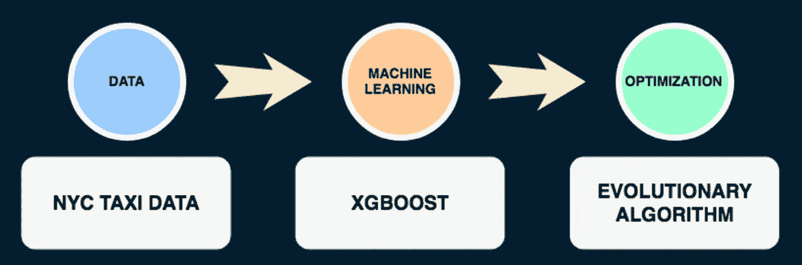
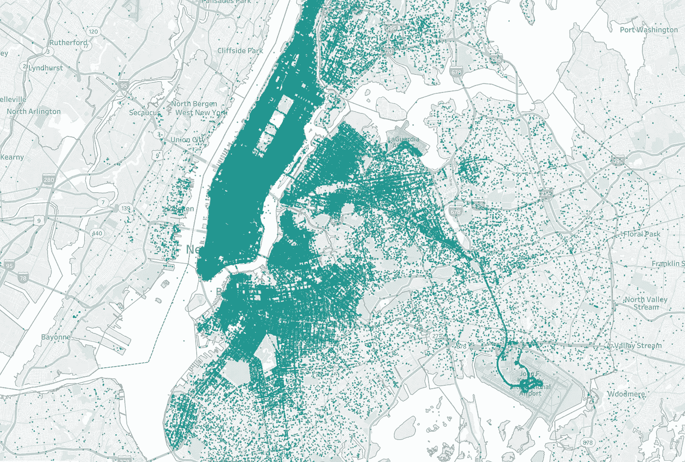
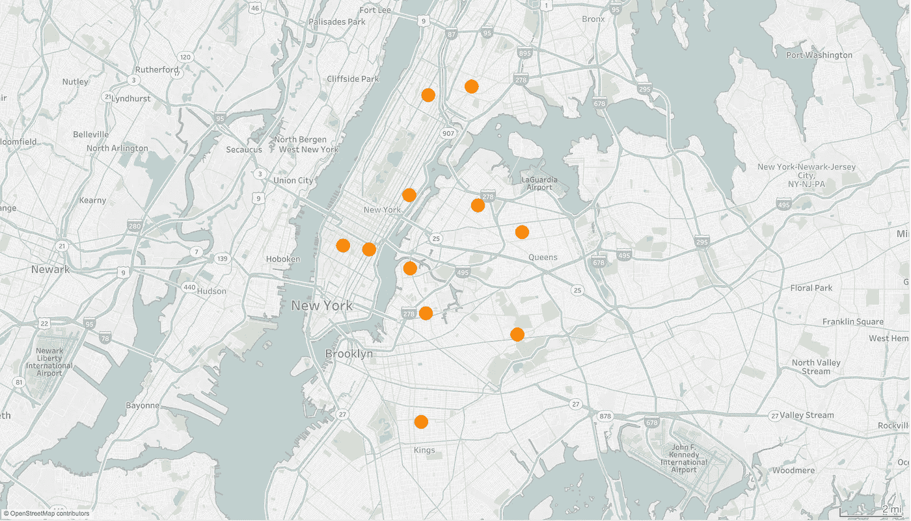
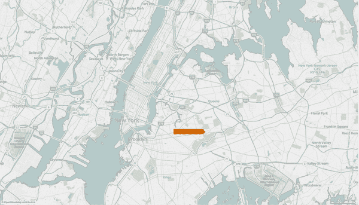

# 基于机器学习和遗传算法的行程时间优化

> 原文：<https://towardsdatascience.com/travel-time-optimization-with-machine-learning-and-genetic-algorithm-71b40a3a4c2?source=collection_archive---------2----------------------->

机器学习和优化有什么关系？—一方面，在模型训练期间，当我们试图最小化模型和数据点之间的错误成本时，数学优化被用于机器学习。另一方面，用机器学习解决优化问题会怎么样？

考虑一下:一个有 25 个包裹的 UPS 司机有 15 万亿条可能的路线可供选择。如果每个司机每天多开一英里，公司每年将损失 3000 万美元。

虽然 UPS 拥有他们卡车和路线的所有数据，但他们不可能在每个司机带着 25 个包裹的情况下运行 15 万亿次计算。然而，这个旅行推销员问题可以用一种叫做“遗传算法”的东西来解决这里的问题是，这种算法需要一些输入，比如每对位置之间的旅行时间，而 UPS 没有这些信息，因为地址的组合甚至超过万亿。但是如果我们使用机器学习的预测能力来增强遗传算法呢？

# **想法**

简单来说，我们可以使用机器学习的力量来预测每两个位置之间的旅行时间，并使用遗传算法来为我们的送货卡车找到最佳的旅行路线。

我们遇到的第一个问题是，没有商业公司会与陌生人分享他们的数据。那么，在没有数据的情况下，我们如何进行这样一个项目——其目标是帮助像 UPS 这样的服务？我们可以使用哪些数据集来很好地代表我们的送货卡车？那么，出租车呢？—就像送货车一样，是机动车辆，运送的是……人。幸运的是，出租车数据集是公开的，因为它们是提供给市政府的。

下图说明了项目的设计:我们从出租车数据开始，使用这些数据来预测位置之间的行程时间，然后运行遗传算法来优化总行程时间。我们也可以倒着看图表:为了优化旅行时间，我们需要知道每对点从一个点到另一个点需要多长时间，为了获得这些信息，我们使用基于出租车数据的预测建模。



# 数据和特征工程

为了便于说明，让我们坚持使用[这个 Kaggle 数据集](https://www.kaggle.com/c/nyc-taxi-trip-duration/data)，它是纽约市提供的[完整出租车数据集](http://www.nyc.gov/html/tlc/html/about/trip_record_data.shtml)的样本。Kaggle 上的数据集通常处理得很好，并不总是需要很多工作(如果您想练习数据清理，这是一个缺点)，但查看数据以检查错误并考虑特征选择总是很重要的。

既然我们得到了每个位置的坐标，让我们计算每对点之间的曼哈顿距离，并计算经度和纬度的差异，以获得方向感(从东到西，从北到南)。我们可以稍微清理一下时间戳，保留最初的特性，这些特性乍一看可能对我们没有用。

当处理地理空间数据时，Tableau 是在 pandas 中映射数据点的一个非常有用的替代方法。在地图上快速初步检查显示，一些下车地点在加拿大，在太平洋，或在爱丽丝岛(自由女神像)，在那里汽车根本不去。如果没有内置的面向地理的包，删除这些点是一项非常困难的任务，但我们也可以将它们留在数据中，因为一些机器学习模型可以很好地处理离群值。



In Tableau, we can quickly get a sense of our drop off locations and their density, as well as outliers.

作为奖励，Kaggle 方便地为[提供了 2016 年](https://www.kaggle.com/mathijs/weather-data-in-new-york-city-2016)纽约市天气的数据。这是我们在分析中可能要考虑的事情。但是，因为有许多相似的天气条件——部分多云或大部分多云——让我们把它们分成几个主要的天气条件，以便对这些特定的特征有一个较小的变化。我们可以在熊猫身上这样做:

```
sample_df["Conditions"] = sample_df["Conditions"].fillna('Unknown')

weather_dict = {'Overcast' : 0, 
                'Haze' : 0,
                'Partly Cloudy' : 0, 
                'Mostly Cloudy' : 0, 
                'Scattered Clouds' : 0, 
                'Light Freezing Fog' : 0,

                'Unknown' : 1,
                'Clear' : 2, 

                'Heavy Rain' : 3, 
                'Rain' : 3, 
                'Light Freezing Rain' : 3,
                'Light Rain' : 3, 

                'Heavy Snow' : 4,
                'Light Snow' : 4,
                'Snow' : 4}sample_df["Conditions"] = sample_df["Conditions"].apply(**lambda** x: weather_dict[x])
```

# 选择正确的模型

有了我们的数据和目标，简单的线性回归就不行了。我们不仅希望有一个低方差模型，我们还知道坐标虽然是数字，但对于给定的目标变量并不携带数值。此外，我们希望将路线的方向添加为正或负的数值，并尝试用天气数据集补充模型，这几乎是完全明确的。

在一个巨大的数据集中有一些随机的异常值，可能有一些无关的特征，以及一些可能的分类特征，我们需要一个基于树的模型。具体来说，提升树将在这个特定的数据集上表现得非常好，并且能够容易地捕捉非线性关系，适应复杂性，并处理分类特征。

除了标准的 XGBoost 模型，我们还可以尝试 LightGBM 模型，因为它速度更快，对分类特性的编码也更好。将这些特征编码为整数后，只需用分类变量指定列，模型就会相应地处理:

```
bst = lgb.train(params,
                dtrain,
                num_boost_round = nrounds,
                valid_sets = [dtrain, dval],
                valid_names = ['train', 'valid'],
                categorical_feature = [20, 24]
                )
```

这些模型很容易建立，但是很难微调和解释。Kaggle 方便地提供均方根对数误差(RMSLE)作为评估指标，因为它降低了误差幅度。使用 RMSLE，我们可以运行不同的树深度和学习率参数，并比较结果。让我们还创建一个验证“观察列表”集，以便在模型迭代时跟踪错误:

```
dtrain = xgb.DMatrix(X_train, np.log(y_train+1))
dval = xgb.DMatrix(X_val, np.log(y_val+1))

watchlist = [(dval, 'eval'), (dtrain, 'train')]gbm = xgb.train(params,
                dtrain,
                num_boost_round = nrounds,
                evals = watchlist,
                verbose_eval = **True**
                )
```

# 遗传算法优化

现在，机器学习部分只是项目的第一步。一旦模型被训练和保存，我们就可以开始遗传算法。对于那些不知道的人来说，在遗传算法中，一个优化问题的候选解群体朝着更好的解进化，每个候选解都有一组可以变异和改变的属性。基本上，我们从问题的随机解决方案开始，并尝试基于一些适合度来“进化”解决方案。结果不能保证是可能的最佳解决方案，但应该足够接近。



假设我们在地图上有 11 个点。我们希望我们的送货卡车在同一天访问所有这些地点，我们想知道最佳路线。然而，我们不知道司机在每个点之间要花多长时间，因为我们没有所有地址组合的数据。

这就是机器学习部分的用武之地。通过我们的预测模型，我们可以找出卡车从一个地点到另一个地点需要多长时间，并且我们可以对每一对点进行预测。

当我们使用我们的模型作为遗传算法的一部分时，我们从每个点的随机访问顺序开始。然后，基于总旅行时间最短的适应度分数，该算法试图找到更好的访问顺序，从机器学习模型中获得预测。这个过程不断重复，直到我们找到一个接近理想的解决方案。

# 结果

在测试了这两个预测模型后，我惊讶地发现，没有天气数据的更基本的 XGBoost 比 LightGBM 表现略好，与 LightGBM 的 4.9 分钟相比，平均绝对误差为 4.8 分钟。

在选择 XGBoost 并保存模型后，我将其传递给我的遗传算法，以生成一个样本解决方案并进行演示。这是最终结果的可视化:我们从一个给定的位置开始，遗传算法和机器学习可以为我们的送货卡车规划出最佳路线。



请注意，在点 3–4–5–6 之间有一个小循环。如果你仔细看地图，你会看到建议的路线穿过高速公路，这是一个比住宅区更快更短的车程。此外，请注意，该演示并不是确切的路线规划，它只是建议访问顺序。

# 后续步骤

路线规划将是这个项目的下一个逻辑步骤。例如，可以整合 Google Maps API 并规划出每一对点之间的精确路径。此外，遗传算法假设一天中的静态时间。计算一天中的时间虽然重要，但要解决的问题要复杂得多，可能需要一种不同的方法来构建输入空间。

如果您有任何问题、想法或建议，请随时通过 [LinkedIn](https://www.linkedin.com/in/vladimir-lazovskiy/) 联系我。代码和项目描述可以在 [GitHub](https://github.com/vlazovskiy/route-optimizer-machine-learning) 上找到。

感谢阅读！