# 趋势，季节性，移动平均，自回归模型:我的时间序列数据之旅

> 原文：<https://towardsdatascience.com/trend-seasonality-moving-average-auto-regressive-model-my-journey-to-time-series-data-with-edc4c0c8284b?source=collection_archive---------3----------------------->

GIF from this [website](https://giphy.com/gifs/animation-time-2d-3oz8xKaR836UJOYeOc/media)

最近我一直在处理时间序列数据。我想回顾什么是时间序列，并使我对时间序列数据的理解更加一致。

> **请注意，这篇文章是为了我未来的自己，也是为了让我对时间序列有更深入的了解。**

**定义**

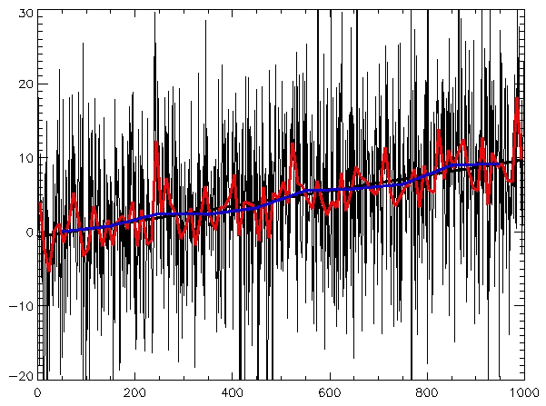

Image from this [website](https://en.wikipedia.org/wiki/Time_series)

有多种不同的来源来定义术语“时间序列”，所以在这里我将尝试给出一个我自己容易理解的一般定义。

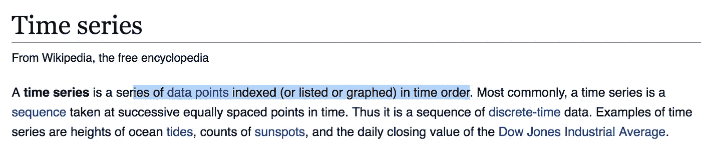

Image from this [website](https://en.wikipedia.org/wiki/Time_series)

> 一个**时间序列**是一系列按照时间顺序索引的[数据点](https://en.wikipedia.org/wiki/Data_point)。

如上所述，wiki 给出了非常直截了当的定义，即按时间顺序排列的任何数据。现在让我们看看来自 [investopedia](https://www.investopedia.com/terms/t/timeseries.asp) 的定义。

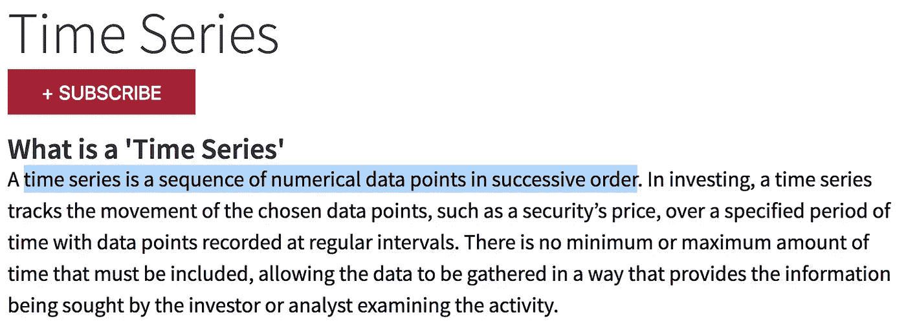

Image from this [website](https://www.investopedia.com/terms/t/timeseries.asp)

> 时间序列是按连续顺序排列的数字数据点序列。

如上所述，我们可以对时间序列数据有一个大概的了解。它可以是按顺序随时间记录的任何数据。一开始我们可以想到股票价格，但是视频、语言、歌曲和核磁共振扫描也可以想到时间序列数据。

**时间序列数据的类型**

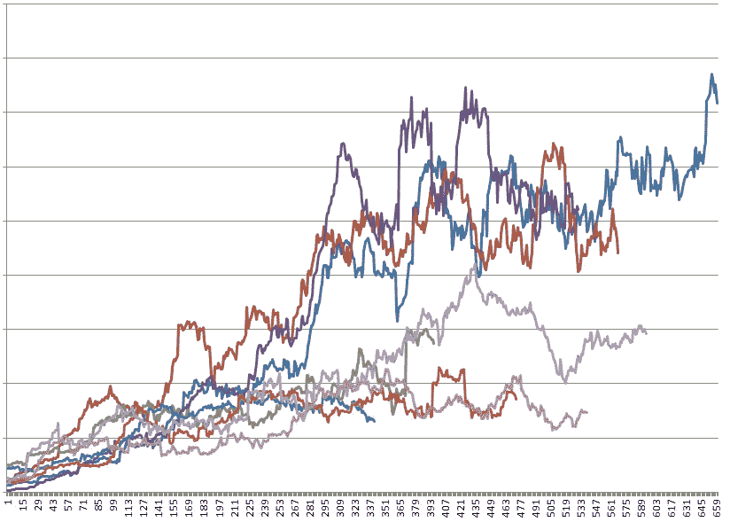

Image from this [website](https://stats.stackexchange.com/questions/20053/how-to-aggregate-deal-with-time-series-data-in-multiple-markets)

上面是一个股票价格的示例图像，我们可以观察到，x 轴上是时间指数，y 轴上是不同市场的股票价格。

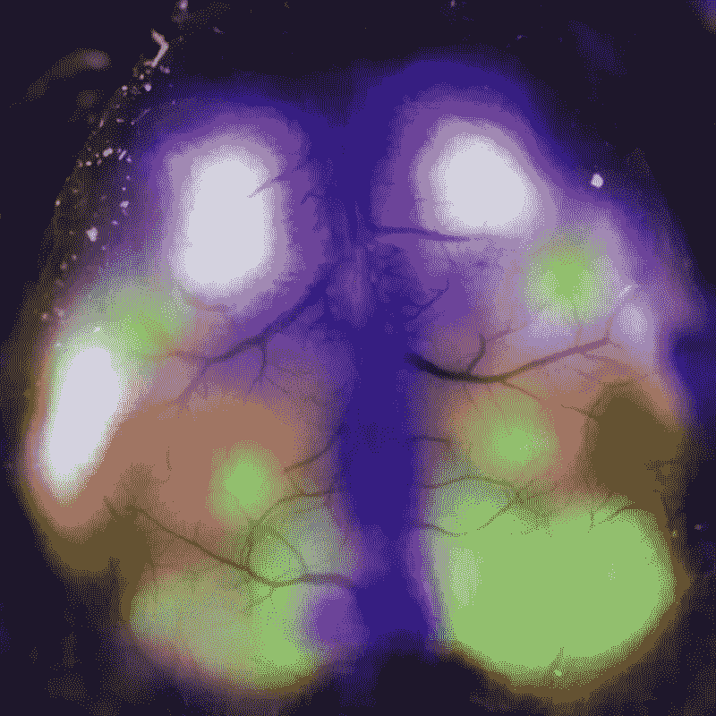

Image from this [website](https://www.wired.com/2016/12/watch-brain-flicker-activity-rests/)

计算机视觉世界中时间序列数据的另一个很好的例子是视频(上面是 GIF)，因为我们在一个时间序列中一帧一帧地捕捉。我们可以清楚地看到 fMRI 扫描可以被命名为时间序列数据。

**时序目标**

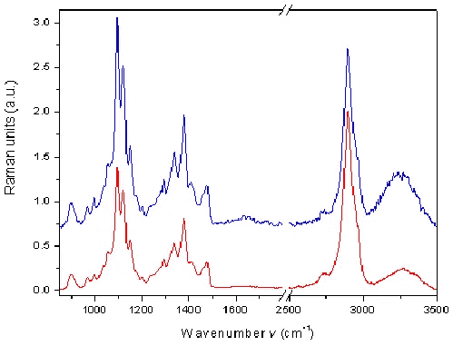

Image from this [website](https://www.researchgate.net/figure/Raman-spectra-of-the-MCC-101-raw-material-with-123-water-content-top-and-of-the-MCC_fig11_8508180)

时间序列的一个明显的用例是预测股票价格。(如果这很容易，许多数据科学家将会很富有。)但我想添加一些不同的用例，我们甚至可以使用 GAN 来预测给定视频的下一帧，或 MRI 扫描。想象一下，如果你体内有癌症，GAN 接收你的 MRI 扫描的几个序列并生成 MRI 扫描。(那会很酷。).所以一般来说，我们希望预测时间序列的下一个值。

**趋势/季节性/噪音**

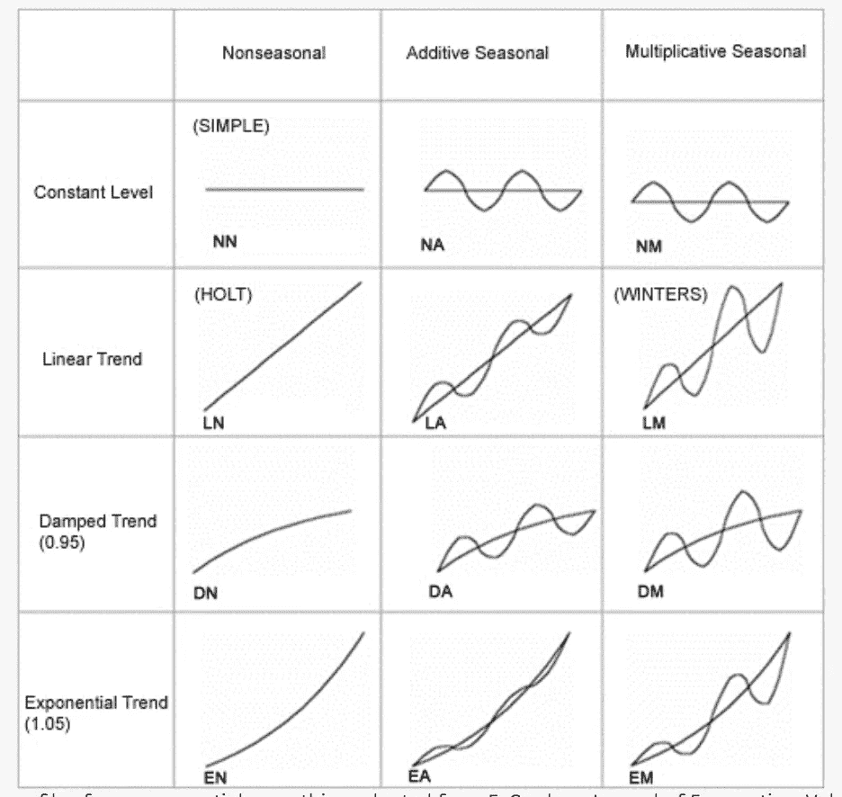

Image from this [website](http://www.simafore.com/blog/bid/205420/Time-series-forecasting-understanding-trend-and-seasonality)

在我们继续之前，我们需要讨论一些重要的东西，大多数时间序列数据可以由三个部分来描述。那就是趋势、季节性和偏差。

**趋势** →随时间变化且不重复的一般系统线性或(最常见的)非线性成分
**季节性** →随时间变化且不重复的一般系统线性或(最常见的)非线性成分
**噪声** →在数据内非趋势/季节性的非系统成分

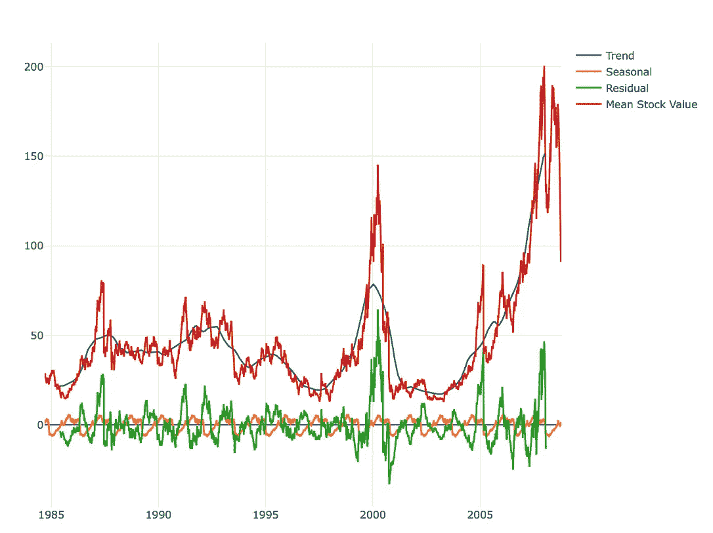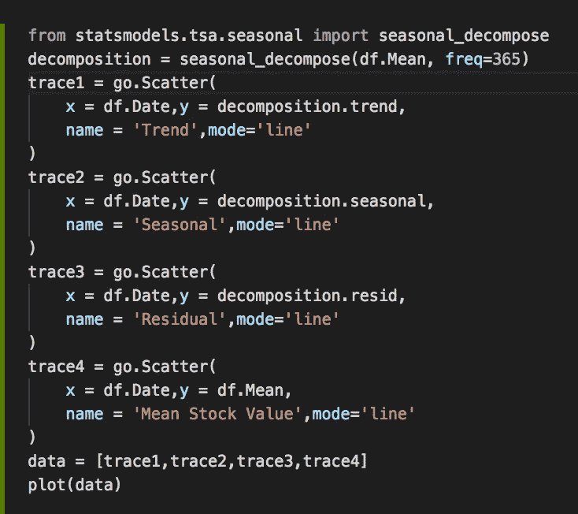

**右图** → Python 代码创建可视化
**红线→**1985 年以来的苹果股价
**蓝线→** 苹果股价趋势
**绿线→** 苹果股价残差(噪声)
**橙线** →苹果股价季节性(年度)趋势

通过简单的代码和 [statsmodel](https://www.statsmodels.org/stable/index.html) 库，我们可以很容易地看到每个组件是如何相互关联的。我们可以观察到每年都有季节性的上涨，苹果股票价格的总趋势也是上涨的。

**预测/预报方法**

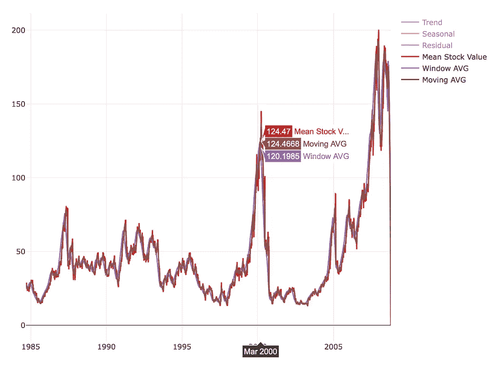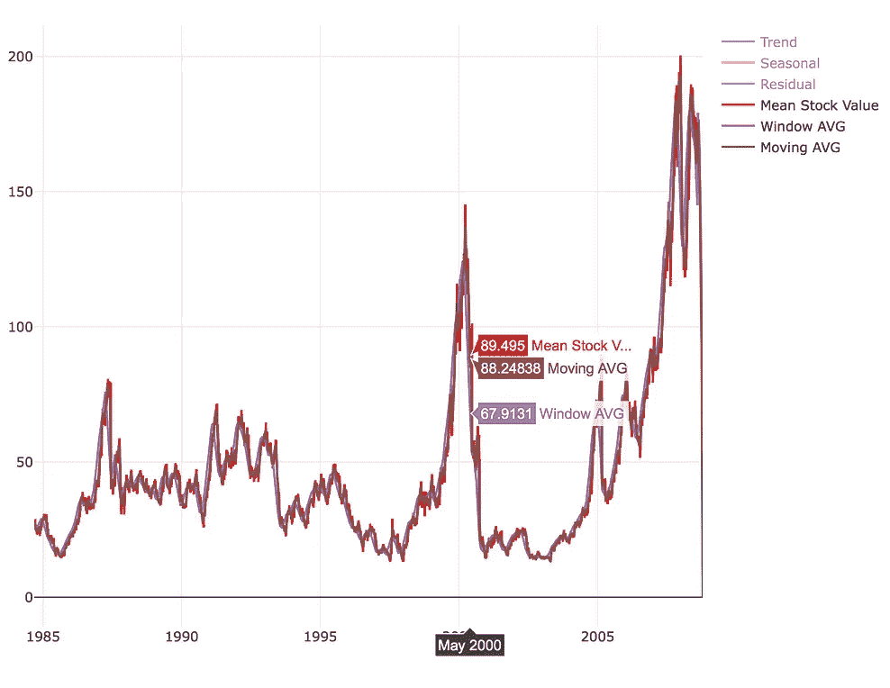

**左/右图像** →标准窗口平均值/指数移动平均值

当我们想要进行预测时，有许多不同的方法可以使用。我将提到我在研究中发现的方法。

[**标准/指数移动平均**](https://en.wikipedia.org/wiki/Moving_average) →通过创建完整数据集不同子集的一系列[平均值](https://en.wikipedia.org/wiki/Average)来分析数据点的计算

[**自动回归**](https://en.wikipedia.org/wiki/Autoregressive_model) →是一类[随机过程](https://en.wikipedia.org/wiki/Random_process)的代表；因此，在[自然](https://en.wikipedia.org/wiki/Natural_science)、[经济](https://en.wikipedia.org/wiki/Economics)等中，它被用来描述某些时变过程

[**线性**](https://en.wikipedia.org/wiki/Linear_regression) **/** [**多项式回归**](https://en.wikipedia.org/wiki/Polynomial_regression) → [回归分析](https://en.wikipedia.org/wiki/Regression_analysis)其中[自变量](https://en.wikipedia.org/wiki/Independent_variable) *x* 与[因变量](https://en.wikipedia.org/wiki/Dependent_variable) *y* 之间的关系被建模为一个 *n* 次 p [多项式](https://en.wikipedia.org/wiki/Polynomial)(或 1 次线性)

[**ARMA**](https://en.wikipedia.org/wiki/Autoregressive%E2%80%93moving-average_model)**→用两个多项式对[(弱)平稳随机过程](https://en.wikipedia.org/wiki/Stationary_stochastic_process)进行简洁描述的模型，一个用于[自回归](https://en.wikipedia.org/wiki/AR_model)，另一个用于[移动平均](https://en.wikipedia.org/wiki/MA_model)。**

**[**【ARIMA】**](https://en.wikipedia.org/wiki/Autoregressive_integrated_moving_average)**→是一个[自回归移动平均](https://en.wikipedia.org/wiki/Autoregressive_moving_average) (ARMA)模型的推广。这两个模型都符合[时间序列](https://en.wikipedia.org/wiki/Time_series)数据，以便更好地理解数据或预测序列中的未来点([预测](https://en.wikipedia.org/wiki/Forecasting))****

****[**季节性 ARIMA**](https://newonlinecourses.science.psu.edu/stat510/node/67/) →季节性 AR 和 MA 术语预测 *xt* 使用滞后时间为 *S* (季节性跨度)倍数的数据值和误差****

****[**ARIMAX**](https://robjhyndman.com/hyndsight/arimax/) →右手边有协变量的 ARIMA 模型****

****[**递归神经网络(LSTM)**](https://en.wikipedia.org/wiki/Long_short-term_memory) →一类[人工神经网络](https://en.wikipedia.org/wiki/Artificial_neural_network)其中节点之间的连接沿着一个序列形成一个[有向图](https://en.wikipedia.org/wiki/Directed_graph)，在该图中允许它展示一个时间序列的动态时间行为。****

****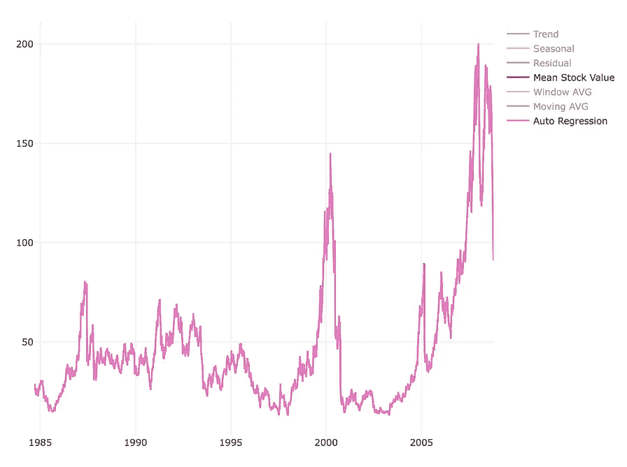********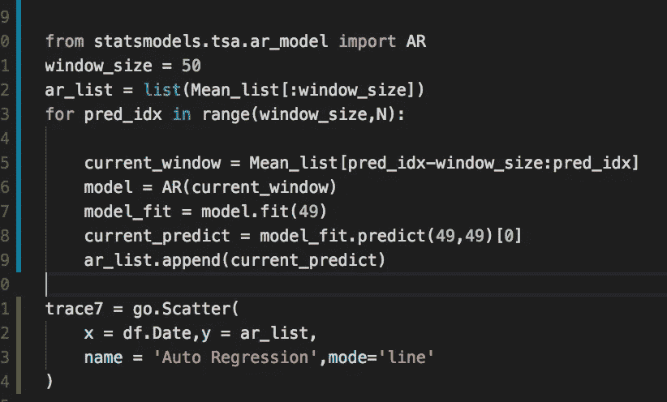****

****如上所述，即使简单的自回归模型也能很好地拟合股票价格。请点击[此处](https://www.quora.com/Whats-the-difference-between-ARMA-ARIMA-and-ARIMAX-in-laymans-terms-What-exactly-do-P-D-Q-mean-and-how-do-you-know-what-to-put-in-for-them-in-say-R-1-0-2-or-2-1-1)阅读 ARMA、ARIMA 和 ARIMAX 之间的区别。****

******交互代码******

****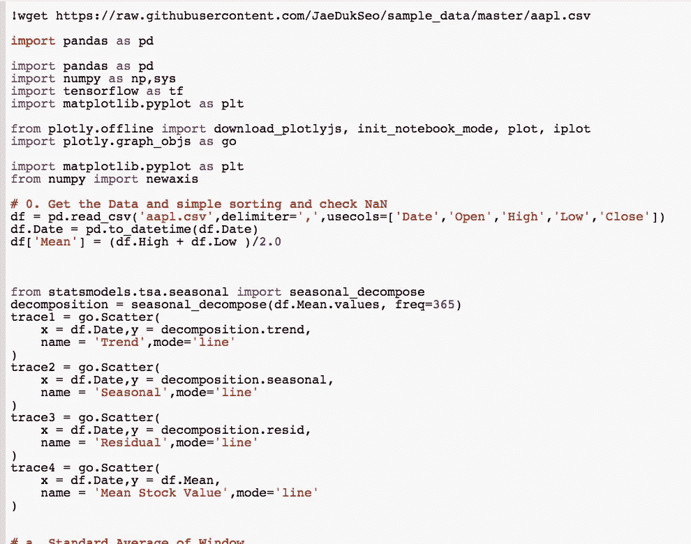****

****对于 Google Colab，你需要一个 Google 帐户来查看代码，而且你不能在 Google Colab 中运行只读脚本，所以在你的操场上复制一份。最后，我永远不会请求允许访问你在 Google Drive 上的文件，仅供参考。编码快乐！****

****要获取这篇文章使用的代码，请点击这里。****

******最后的话******

****我希望继续我的研究，对时间序列有更深入的了解。因为我认为这是每个行业都存在的问题。****

****如果发现任何错误，请发电子邮件到 jae.duk.seo@gmail.com 给我，如果你希望看到我所有写作的列表，请[在这里查看我的网站](https://jaedukseo.me/)。****

****同时，在我的 twitter 上关注我[这里](https://twitter.com/JaeDukSeo)，访问[我的网站](https://jaedukseo.me/)，或者我的 [Youtube 频道](https://www.youtube.com/c/JaeDukSeo)了解更多内容。我还实现了[广残网，请点击这里查看博文](https://medium.com/@SeoJaeDuk/wide-residual-networks-with-interactive-code-5e190f8f25ec) t。****

******参考******

1.  ****时间序列。(2018).En.wikipedia.org。检索于 2018 年 6 月 2 日，来自[https://en.wikipedia.org/wiki/Time_series](https://en.wikipedia.org/wiki/Time_series)****
2.  ****工作人员，I. (2006 年)。时间序列。Investopedia。检索于 2018 年 6 月 2 日，来自[https://www.investopedia.com/terms/t/timeseries.asp](https://www.investopedia.com/terms/t/timeseries.asp)****
3.  ****如何识别时间序列数据中的模式:时间序列分析？(2018).Statsoft.com。检索于 2018 年 6 月 2 日，来自[http://www.statsoft.com/Textbook/Time-Series-Analysis](http://www.statsoft.com/Textbook/Time-Series-Analysis)****
4.  ****stats models . TSA . seasonal . seasonal _ decompose-stats models 0 . 9 . 0 文档。(2018).Statsmodels.org。检索于 2018 年 6 月 2 日，来自[http://www . stats models . org/dev/generated/stats models . TSA . seasonal . seasonal _ decompose . html](http://www.statsmodels.org/dev/generated/statsmodels.tsa.seasonal.seasonal_decompose.html)****
5.  ****stats models:Python 中的统计数据— statsmodels 0.9.0 文档。(2018).Statsmodels.org。检索于 2018 年 6 月 2 日，来自[https://www.statsmodels.org/stable/index.html](https://www.statsmodels.org/stable/index.html)****
6.  ****b . desh pande(2018)。时间序列预测:理解趋势和季节性。Simafore.com。检索于 2018 年 6 月 2 日，来自[http://www . simafore . com/blog/bid/205420/Time-series-forecasting-understanding-trend-and-seasonity](http://www.simafore.com/blog/bid/205420/Time-series-forecasting-understanding-trend-and-seasonality)****
7.  ****移动平均线。(2018).En.wikipedia.org。检索于 2018 年 6 月 2 日，来自[https://en.wikipedia.org/wiki/Moving_average](https://en.wikipedia.org/wiki/Moving_average)****
8.  ****线性回归。(2018).En.wikipedia.org。检索于 2018 年 6 月 2 日，来自[https://en.wikipedia.org/wiki/Linear_regression](https://en.wikipedia.org/wiki/Linear_regression)****
9.  ****多项式回归。(2018).En.wikipedia.org。检索于 2018 年 6 月 2 日，来自[https://en.wikipedia.org/wiki/Polynomial_regression](https://en.wikipedia.org/wiki/Polynomial_regression)****
10.  ****自回归-移动平均模型。(2018).En.wikipedia.org。检索于 2018 年 6 月 2 日，来自[https://en . Wikipedia . org/wiki/auto regressive % E2 % 80% 93 moving-average _ model](https://en.wikipedia.org/wiki/Autoregressive%E2%80%93moving-average_model)****
11.  ****递归神经网络。(2018).En.wikipedia.org。检索于 2018 年 6 月 2 日，来自 https://en.wikipedia.org/wiki/Recurrent_neural_network****
12.  ****自回归模型。(2018).En.wikipedia.org。检索于 2018 年 6 月 2 日，来自[https://en.wikipedia.org/wiki/Autoregressive_model](https://en.wikipedia.org/wiki/Autoregressive_model)****
13.  ****ARIMAX 模型的混乱。(2010).Robjhyndman.com。检索于 2018 年 6 月 2 日，来自[https://robjhyndman.com/hyndsight/arimax/](https://robjhyndman.com/hyndsight/arimax/)****
14.  ****4.1 季节性 ARIMA 车型| STAT 510。(2018).Newonlinecourses.science.psu.edu。检索于 2018 年 6 月 2 日，来自[https://newonlinecourses.science.psu.edu/stat510/node/67/](https://newonlinecourses.science.psu.edu/stat510/node/67/)****
15.  ****statsmodels.tsa.ar_model。ar . predict-stats models 0 . 9 . 0 文档。(2018).Statsmodels.org。检索于 2018 年 6 月 2 日，来自[http://www . stats models . org/dev/generated/stats models . TSA . ar _ model。ar . predict . html # stats models . TSA . ar _ model。AR.predict](http://www.statsmodels.org/dev/generated/statsmodels.tsa.ar_model.AR.predict.html#statsmodels.tsa.ar_model.AR.predict)****
16.  ****Python，A. (2018)。Python 中使用 statsmodels 的自回归模型。堆栈溢出。检索于 2018 年 6 月 2 日，来自[https://stack overflow . com/questions/28094538/auto regressive-model-using-stats models-in-python](https://stackoverflow.com/questions/28094538/autoregressive-model-using-statsmodels-in-python)****
17.  ****Anon，(2018)。[在线]见:[https://www . research gate . net/figure/Raman-spectra-of-the-the-MCC-101-raw-material-with-123-water-content-top-and-of-the-the-MCC _ fig 11 _ 8508180](https://www.researchgate.net/figure/Raman-spectra-of-the-MCC-101-raw-material-with-123-water-content-top-and-of-the-MCC_fig11_8508180)【2018 年 6 月 2 日获取】。****