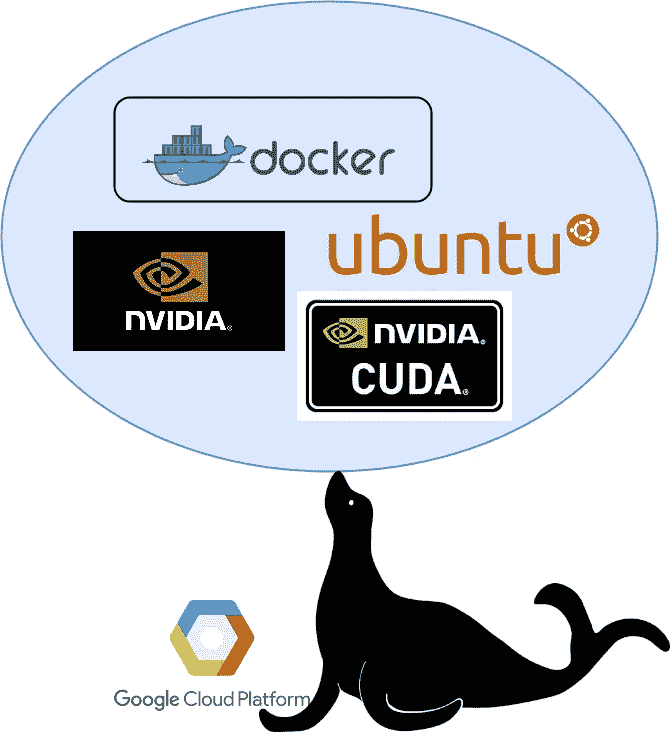
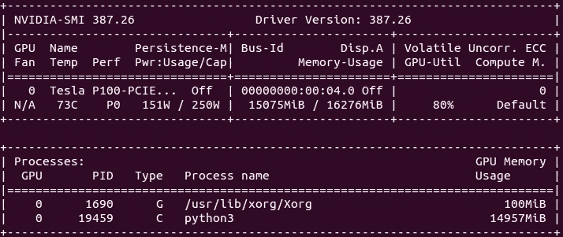
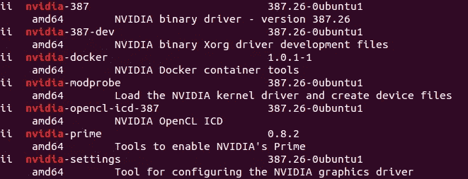
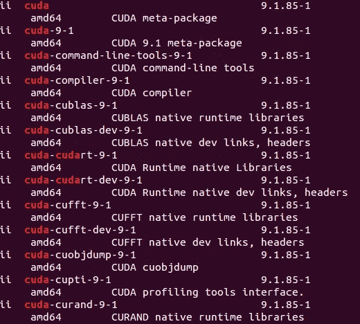
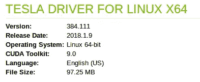

# 排除 GCP + CUDA/NVIDIA + Docker 故障并保持其运行！

> 原文：<https://towardsdatascience.com/troubleshooting-gcp-cuda-nvidia-docker-and-keeping-it-running-d5c8b34b6a4c?source=collection_archive---------4----------------------->



我有一个谷歌云平台(GCP)实例，一天前已经设置好并运行良好，它是在我的[之前的教程](/whats-after-setting-up-a-gcp-computing-instance-running-a-custom-docker-container-with-tensorflow-eb0f077983c6)之后设置的。

[](https://medium.com/@thushv89/whats-after-setting-up-a-gcp-computing-instance-running-a-custom-docker-container-with-tensorflow-eb0f077983c6) [## 设置 GCP 计算实例后会发生什么？使用 Tensorflow 运行自定义 Docker 容器

### 介绍

medium.com](https://medium.com/@thushv89/whats-after-setting-up-a-gcp-computing-instance-running-a-custom-docker-container-with-tensorflow-eb0f077983c6) 

让我告诉你一些关于我的机器的事情，

*   Ubuntu: 16.04
*   GPU: 1 个 P100
*   CUDA: 9.1
*   英伟达:387.xx

但是，当我昨天启动我的 GCP 实例并尝试运行 docker 容器时，发生了一些非常奇怪的事情，

```
sudo docker start <container_name>
sudo docker attach <container_name>
```

# 发生了什么事？

不，它不像我希望的那样工作，并把我带进了集装箱。相反，它给了我以下错误

```
Error response from daemon: linux runtime spec devices: error gathering device information while adding custom device “/dev/nvidiactl”: no such file or directory
Error: failed to start containers: x
```

这很可能已经发生了，因为我的 GCP 实例勇敢地决定继续下去并更新一切本身是完全没问题的，事情会神奇地变得更好！嗯，我有消息！不会这样的。**所以如果 GCP 能给我们一个在初始设置时关闭自动更新的方法，我将不胜感激**。事实上，已经有许多关于 NVIDIA 驱动程序发疯(或失踪)以及其他更新的报告(证据 [1](https://ubuntuforums.org/showthread.php?t=2117801) 、 [2](https://askubuntu.com/questions/799815/lost-nvidia-drivers-on-14-04) 、 [3](https://codeyarns.com/2013/02/07/how-to-fix-nvidia-driver-failure-on-ubuntu/) )。

# 向下钻取…

好了，在进入故障诊断的细节之前，让我一步一步总结一下我要做的事情。

*   检查机器是否(在物理上)识别了我的 GPU
*   检查 NVIDIA 是否可以看到 GPU
*   如果 NVIDIA 看不到 GPU，请查看您是否安装了 CUDA/NVIDIA 软件包，并检查 NVIDIA 驱动程序是否正确加载
*   如果 CUDA/NVIDIA 软件包安装正确，尝试修复路径变量
*   如果修复路径变量没有修复，卸载任何现有的 CUDA/NVIDIA 软件包，并尝试重新安装兼容的 CUDA 和 NVIDIA 软件包
*   关闭自动更新，所以我会手动更新，而不会破坏一切。

# 我的 GPU 被机器识别了吗？

首先也是最重要的，在检查库是否正确安装之前，请通过键入，

```
lspci | grep 3D
```

这应该给出类似于，

```
00:04.0 3D controller: NVIDIA Corporation Device 15f8 (rev a1)
```

如果没有，这可能是由于 GPU 被拔掉或只是从插座中轻轻推出，因为你移动了机器或其他东西。

# 使用 NVIDIA 系统管理界面(NVIDIA-SMI)检查 GPU 的状态

首先要做的是，**而不是**妄下结论，并严格地开始输入`sudo apt-get install <this-and-that>` 希望得到最好的结果！事实上，在这种情况下，最好的事情(也是大多数人忽略的)是找出问题所在。首先让我们看看我们有什么。继续打字，

```
nvidia-smi
```

理想情况下，您应该得到这样的结果，



Figure 1: Output of nvidia-smi

# 那没用:(…

如果你得到这样的信息，

```
NVIDIA-SMI has failed because it couldn’t communicate with the NVIDIA driver. Make sure that the latest NVIDIA driver is installed and running.
```

这可能是由于两个原因，

*   您没有以 root 用户身份登录，因此 NVIDIA 无法通信(**解决方案:**键入`sudo -s`以 root 用户身份登录，然后再次尝试`nvidia-smi`
*   您实际上没有安装兼容的 NVIDIA 驱动程序(或者配置已损坏)(**解决方案需要更多工作**)。这也是我在这里讨论的问题类型)

# 修复缺失的 CUDA/NVIDIA 库

因此，为了让 NVIDIA-SMI 正常工作，您需要一些适当的设置。他们是，

*   CUDA(包括 cuda- <version>、cuda-blas- <version>、cuda-nvcc- <version>、cuda-toolkit- <version>等。)</version></version></version></version>
*   NVIDIA 库(包括 nvidia- <version>、nvidia-docker、nvidia-modprobe、nvidia-settings 等)。)</version>

让我们检查一下是否安装了这些，试着键入

```
dpkg -l | grep nvidia
```

你应该得到



Figure 2: Output of dpkg -l | grep nvidia

下一次尝试，

```
dpkg -l | grep cuda
```

这应该给



Figure 3: Output of dpkg -l | grep cuda

请注意，实际列表要长得多。但是如果 CUDA 获得了相当多的点击，事情应该是好的。但是不要太舒服了！我遇到过即使安装了这些东西也无法工作的情况。

# 检查是否加载了 NVIDIA 内核模块

让我们再做一次检查，看看 NVIDIA 内核模块是否被正确加载，

```
dmesg | grep NVIDIA
```

理想情况下，你应该看到，

```
[ 2.261511] nvidia: module license ‘NVIDIA’ taints kernel.
[ 2.316304] NVRM: loading NVIDIA UNIX x86_64 Kernel Module 384.111 Tue Dec 19 23:51:45 PST 2017 (using threaded interrupts)
[ 2.319524] nvidia-modeset: Loading NVIDIA Kernel Mode Setting Driver for UNIX platforms 384.111 Tue Dec 19 22:56:18 PST 2017
```

如果你什么都看不到，那就有问题了！这意味着 NVIDIA 驱动程序没有被正确加载。

# 会不会是路径变量配置错误？

如果您得到如图所示的这两个输出，但不是正确的`dmesg`消息，那么您需要的东西都在机器中了。所以这可能是由于路径变量的一些简单的错误配置。所以打开`.bashrc`文件，在它后面添加下面两行。

```
PATH=/usr/local/cuda-9.1/bin${PATH:+:${PATH}}
LD_LIBRARY_PATH=/usr/local/cuda-9.1/lib64\                          ${LD_LIBRARY_PATH:+:${LD_LIBRARY_PATH}}
```

然后退出文本编辑器并运行，

```
source ~/.bashrc
```

重启机器，再次尝试`nvidia-smi`看看是否一切正常。(PS:记得用`sudo`权限试试)

# 没那么幸运？是时候手动重装了

如果你正在读这部分，你可能没有其他人那么幸运。好吧，让我们继续耕耘土地吧！在我看来，不值得再深入挖掘，试图在满是库的碗里找到一粒错误。事实上，如果我们移除当前损坏的库并从头开始正确安装，事情会容易得多。

# 找出正确的库版本

首先，我们需要弄清楚哪一个与哪一个相配。我的意思是，我们需要确保我们下载的特定(正确)版本的 CUDA 和 NVIDIA 驱动程序与您的显卡相匹配。所以让我们先去了解一下最新的情况。

转到，

[](http://www.nvidia.com/Download/index.aspx?lang=en-us) [## 下载驱动程序| NVIDIA

### 下载 NVIDIA 产品的驱动程序，包括 GeForce 显卡、nForce 主板、Quadro 工作站和…

www.nvidia.com](http://www.nvidia.com/Download/index.aspx?lang=en-us) 

并输入详细信息，

*   显卡:我有一个英伟达特斯拉 P100
*   CUDA:我们用 9.x 吧

这是我得到的结果，



Figure 4: Driver/Library versions

现在，我们将确保在安装时坚持使用这些特定的版本，以避免任何差异。

# 移除现有的 CUDA/NVIDIA 库

首先让我们删除任何现有的 CUDA/NVIDIA 库，

```
sudo apt-get remove --purge cuda*
sudo apt-get remove --purge nvidia*
```

# 安装 CUDA/NVIDIA

首先获得 CUDA 工具包`.deb`,

```
wget [http://developer.download.nvidia.com/compute/cuda/repos/ubuntu1604/x86_64/cuda-repo-ubuntu1604_9.1.85-1_amd64.deb](http://developer.download.nvidia.com/compute/cuda/repos/ubuntu1604/x86_64/cuda-repo-ubuntu1604_9.1.85-1_amd64.deb)sudo dpkg -i cuda-repo-*sudo apt-get updatesudo apt-get install cuda -y
```

重启系统并尝试，

```
sudo dpkg -l | grep cuda
sudo dpkg -l | grep nvidia
```

您应该会看到如图 2 和图 3 所示的正确输出。

# 是时候进行一些黑客攻击了…

我刚刚意识到搭载 CUDA 9.1 的 NVIDIA 驱动程序 **387.xx** 在我的 NVIDIA Tesla P100 上不工作。所以我必须先卸载它，然后安装 NVIDIA **384.xx** 。根据您实例中的 GPU 卡，这可能会有所不同。

你知道什么是怪异吗！如图 1 所示，我完全可以使用 CUDA 9.1 和 NVIDIA 387.xx。但是现在，NVIDIA 387.xx 不再与 CUDA 9.1 兼容。我不知道为什么，但希望能找到原因！

让我们这样做，

```
sudo apt-get remove --purge nvidia-*
```

现在，让我们手动安装 NVIDIA 384.xx 驱动程序，

```
sudo apt-get install nvidia-384
sudo apt-get install nvidia-modprobe
```

对于`nvidia-docker`，你将需要`nvidia-modprobe` 。现在快速检查一下路径变量，看看它们的设置是否正确

```
echo $PATH : You should have /usr/local/cuda-<version>/bin in this variable
echo $LD_LIBRARY_PATH : You should have/usr/local/cuda-<version>/lib64 in this variable
```

现在尝试`nvidia-smi`，您应该会看到类似于图 1 的内容，这意味着一切都恢复正常了(希望如此！).

# 关闭自动更新！

还有一件事，不要忘记是什么开始了这整个折磨。是自动更新。更新是重要的，以保持您的机器安全，从外部威胁和一切，但如果它将打破我的机器每 5 秒钟我更新，没有谢谢你！我自己手动更新。为此，请在文本编辑器中打开以下文件，

```
/etc/apt/apt.conf.d/10periodic
```

并设置

```
APT::Periodic::Update-Package-Lists “0”;
```

这将阻止那些“讨厌的”(然而，重要的)自动更新。但是记住要持续更新你的操作系统，因为你不希望有人侵入你的机器。

# 结论


pixabay.com

因此，在这篇文章中，我们讨论了如果您遇到配置损坏、驱动程序丢失等问题，如何对 GCP 实例进行故障诊断。我推荐的过程是，

*   检查机器是否(在物理上)识别了我的 GPU
*   检查 NVIDIA 是否可以看到 GPU
*   如果 NVIDIA 看不到 GPU，请查看您是否安装了 CUDA/NVIDIA 软件包，并检查 NVIDIA 驱动程序是否正确加载
*   如果 CUDA/NVIDIA 软件包安装正确，尝试修复路径变量
*   如果修复路径变量没有修复，卸载任何现有的 CUDA/NVIDIA 软件包，并尝试重新安装兼容的 CUDA 和 NVIDIA 软件包
*   关闭自动更新，所以我会手动更新，而不会破坏一切。

干杯！