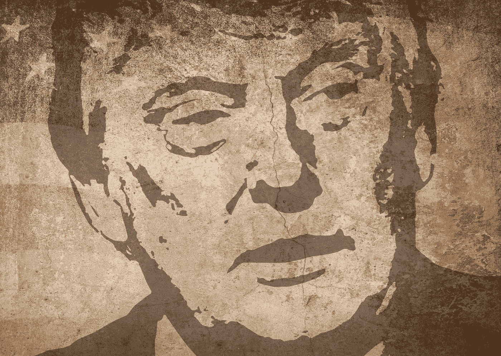
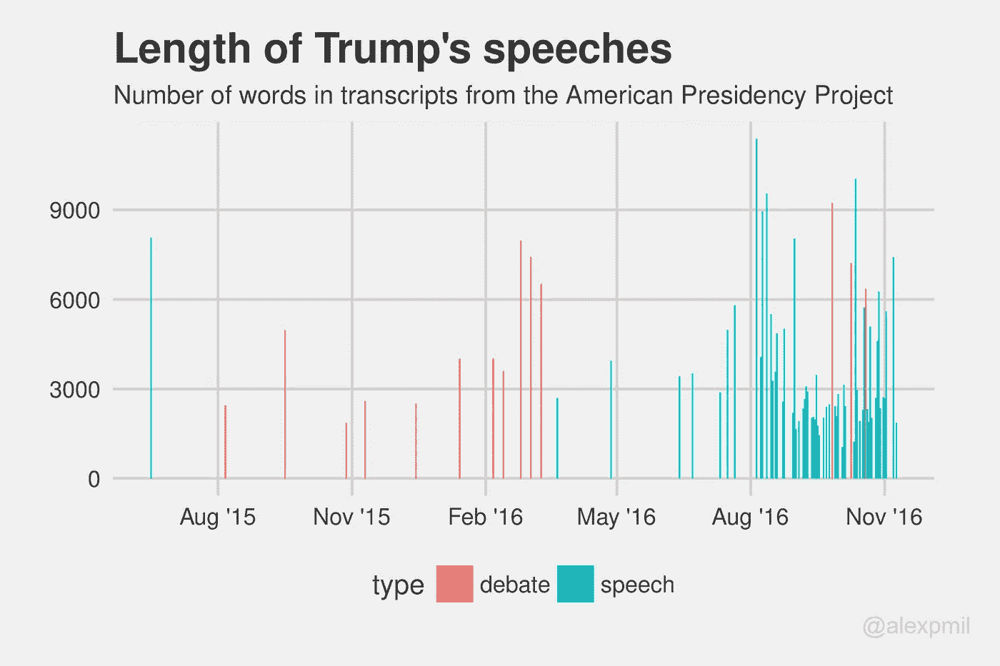
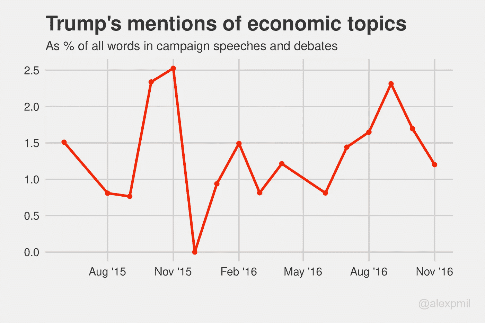
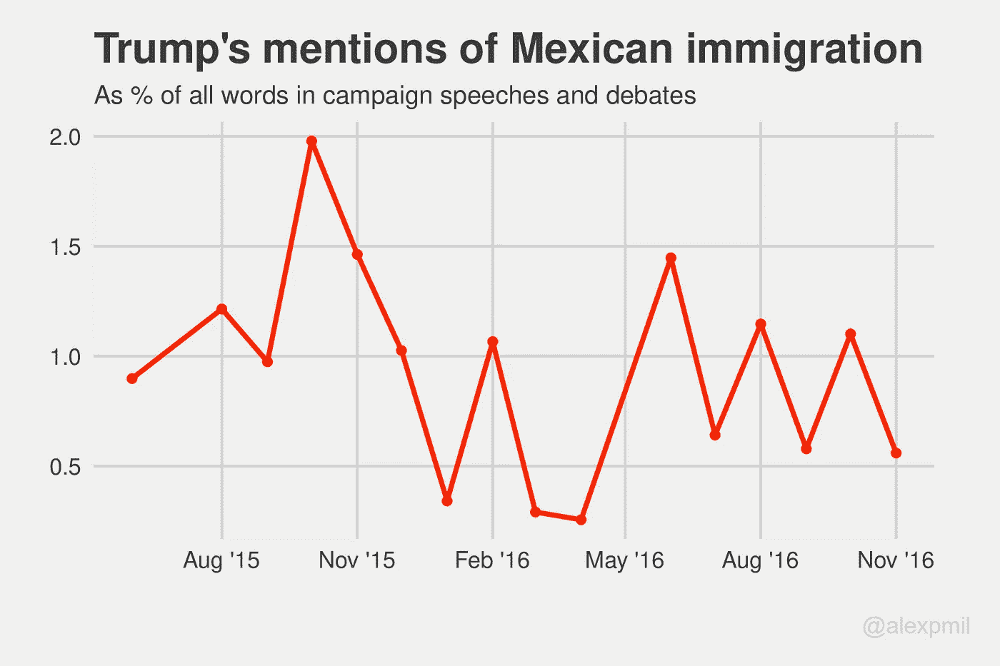
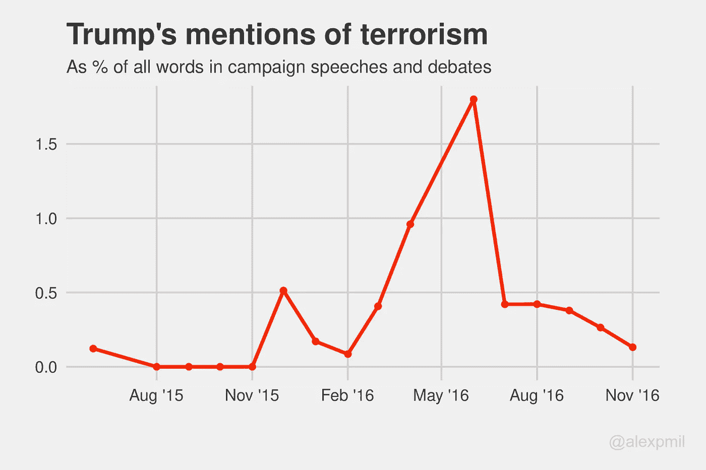
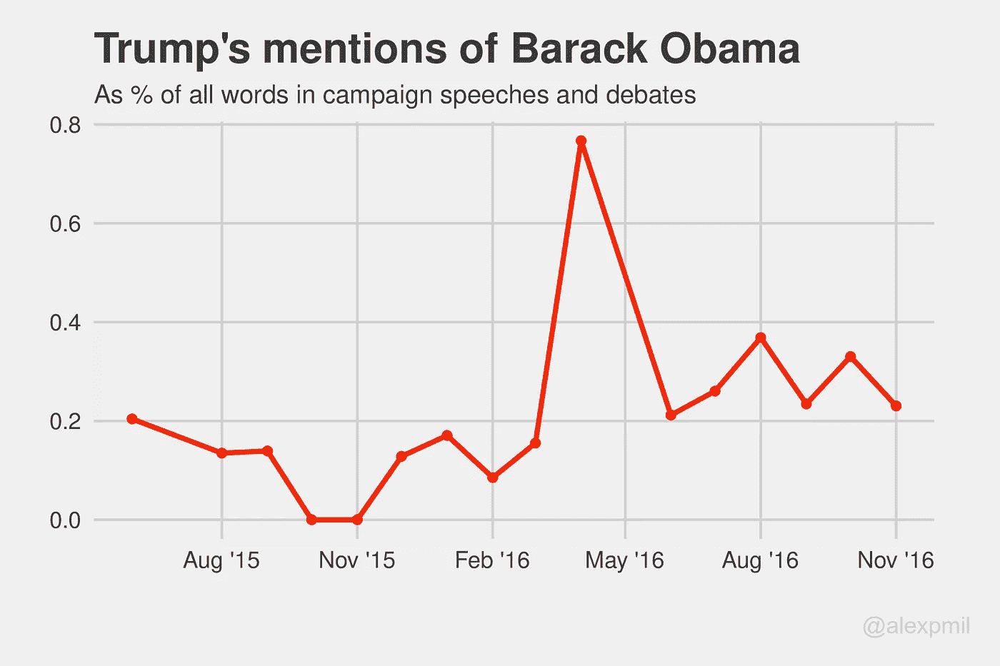
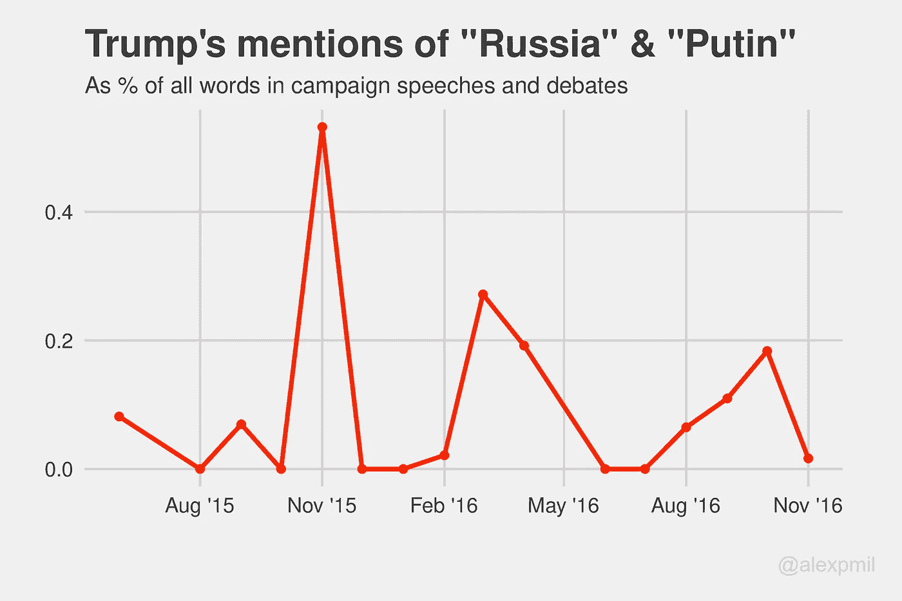
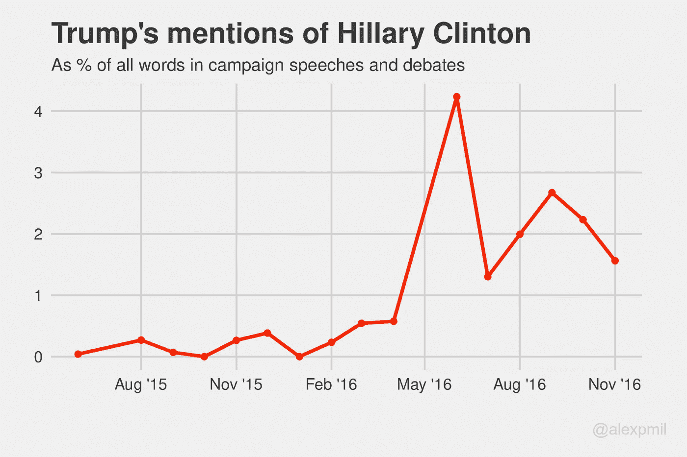
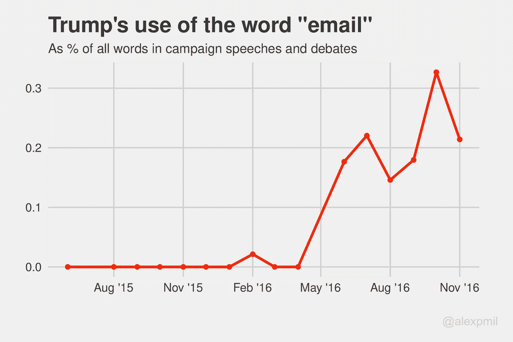
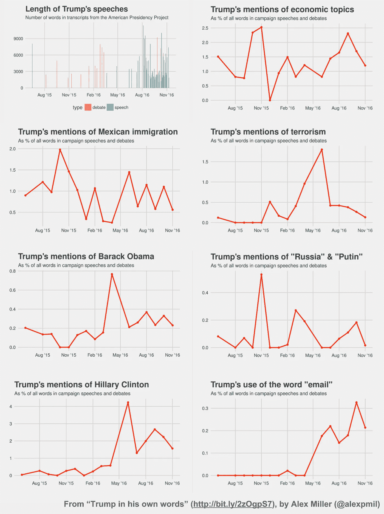

# 特朗普，用他自己的话说

> 原文：<https://towardsdatascience.com/trump-in-his-own-words-62af05ad76d4?source=collection_archive---------2----------------------->

## 对特朗普在 2016 年总统竞选过程中不断变化的优先事项的数据驱动研究

唐纳德·特朗普(Donald Trump)在 2016 年总统竞选过程中的优先事项发生了怎样的变化？随着竞选的临近，他在移民问题上变得更强硬了吗？还是他把重心转移到了经济上？他什么时候开始谈论希拉里的邮件的？

这些都是数据可以帮助我们回答的问题。加州大学圣巴巴拉分校的美国总统项目有一个庞大的目录，记录了几十年来几十位政治人物的文字记录。其中包括唐纳德·川普从 2015 年 6 月 16 日宣布参选到 2016 年 11 月 9 日接受提名的 60 篇竞选演讲。他们也有[11 场共和党初选和 3 场大选辩论的抄本。](http://www.presidency.ucsb.edu/debates.php)

我冒昧地抓取了这些抄本，并把它们放在一个半结构化的数据库中，可以用于文本分析( [GitHub repo](https://github.com/alexmill/trump_transcripts) )。对于辩论，我做了一些简单的处理，只包括了特朗普本人的部分文字记录。然后，我开始描绘特朗普在竞选过程中使用语言的演变过程。为此，我使用了相当简单的语言分析技术来确定特朗普在一段时间内提到某些话题的频率。我可以画出特朗普提到某些词的次数，但特朗普演讲的数量和长度都随着时间的推移而变化。

正如所料，特朗普在竞选的最后几个月开始发表更多演讲。因此，与其绘制原始字数，我将向你展示特朗普使用某些词的频率图，*作为我的文字记录中所有词的比例*，在每月一次的水平上汇总。

## 数据不言自明

我们将从 2016 年竞选中一些常见的政策相关主题的相关单词开始。

Words counted (including variants): “economy”, “tax”, “GDP”, “jobs”, “employment”

特朗普在竞选中提到经济话题的频率似乎没有任何明显的时变趋势。然而，当我们谈到移民问题时，随着竞选活动的进行，似乎有一种轻微的负面趋势。

Words counted (including variants): “wall”, “mexico”, “immigration”, “illegals”

恐怖主义也是 2016 年竞选中的一个大话题，2016 年 6 月初发生了恐怖的 Pulse 夜总会枪击案。事件发生后的第二天，特朗普在新罕布什尔州发表了一个演讲，他在演讲中重点强调了恐怖主义的话题，下图中观察到的大幅飙升就证明了这一点。

Words counted (including variants): “terror”, “terrorist”

我们还可以看看特朗普在整个竞选过程中提到某些人或实体的频率。我们从提到“奥巴马”开始，看下面的图表。特朗普在 2016 年 4 月发表了一次关于外交政策的演讲，他在演讲中花了很多时间批评巴拉克·奥巴马。除此之外，随着时间的推移，奥巴马的提及率似乎有微弱的上升趋势。

我还在下面画出了特朗普讨论“俄罗斯”和“普京”话题的频率。前两次高峰来自于讨论俄罗斯和外交政策的初选辩论。我们还看到，在 2016 年 9 月和 10 月，即维基解密发布波德斯塔电子邮件的时间附近，俄罗斯的提及率出现了飙升。

最后，我们来看看特朗普提到他的民主党对手希拉里的频率。

正如所料，特朗普在大选中比初选中更多地提到了希拉里(在初选中，他的主要对手将是其他共和党人)。特朗普在 2016 年 5 月 26 日获得了党内初选提名，希拉里在 2016 年 6 月 6 日获得了民主党提名，这与上文观察到的趋势中的明显转折点一致。

我们还可以锁定特朗普何时(以何种强度)开始讨论希拉里的电子邮件。在下面的图表中，我们看到了从六月到十一月非常明显的持续上升趋势。特朗普在 6 月份之前只提到过一次希拉里的电子邮件，但随着竞选活动的进行，他越来越关注电子邮件这个话题。

这些都是有趣的趋势，尤其是最后一个趋势，因为人们对希拉里·克林顿电子邮件的关注度急剧上升。虽然我们通常无法确定是什么导致了一个峰值与另一个峰值的对比，但直接进入原始材料并应用一些简单的数据分析技术可以让我们获得一些经验主义的见解，了解特朗普的优先事项似乎是如何在他的竞选活动中演变的。

## 开型代码

[想试试自己的分析吗？你可以在 GitHub](https://github.com/alexmill/trump_speech_analysis/blob/master/TrumpSpeechAnalsysis.ipynb) 上的 Jupyter 笔记本中找到我用来生成这些图的代码版本。

## 合成图像

