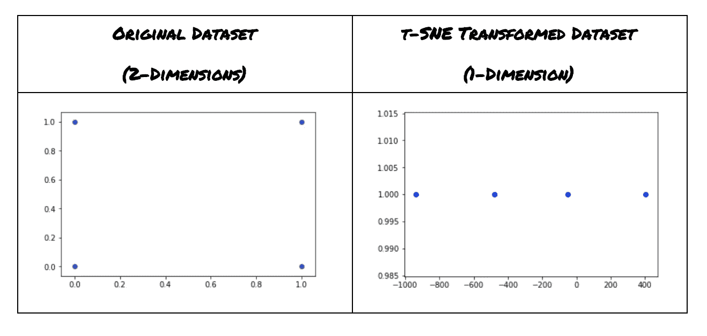
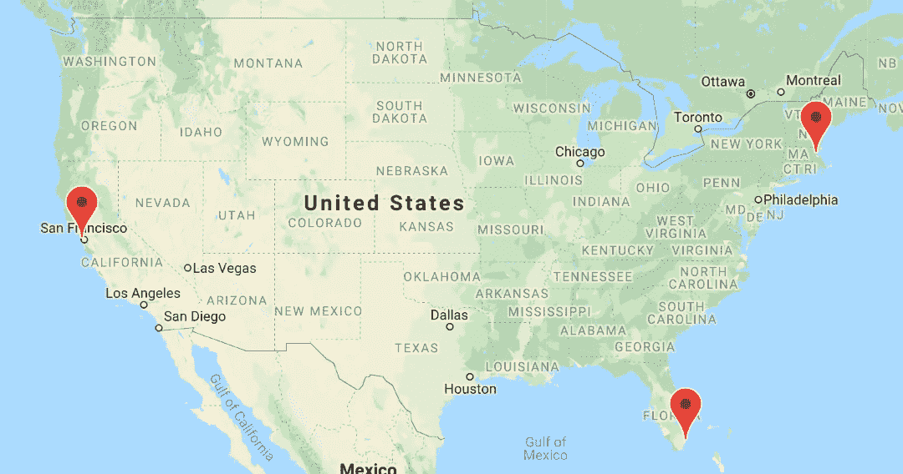
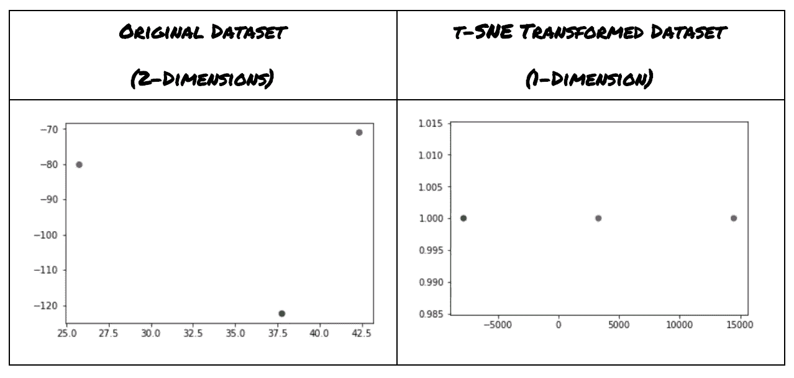

# 地图数据的聚类

> 原文：<https://towardsdatascience.com/tsne-clustering-for-map-data-507ba4e62b20?source=collection_archive---------9----------------------->

在这篇简短的博文中，我将向您展示如何在 Lat/Lng 坐标对上使用 tSNE 来创建地图数据的一维表示。这种表示有助于开发新的地图搜索算法。这对于诸如“这个 lat/lng 坐标对是在新泽西还是在纽约？”的查询可能是有用的或者“离我最近的披萨店在哪里？”。更快的地图搜索可能对优步、谷歌地图和方向、Yelp 等等非常有用。

在这篇文章中，我们将首先看看如何在真值表逻辑数据集上使用 tSNE 维度映射，然后我们将引入相同的概念来将 Lat/Lng 坐标映射到一维空间。有了一维表示后，我们就可以实现算法，用集合成员操作等方式进行常数时间搜索。

tSNE(t-分布式随机邻居嵌入)是一种聚类技术，其最终结果类似于 PCA(主成分分析)。PCA 使用线性代数概念来构建正交向量的新维度空间，而 tSNE 使用更简单的理解、排斥/吸引方法来将点从高维空间映射到低维空间。许多聚类算法的重点是在高维数据集中识别相似性，从而降低维数。tSNE 算法用于保持较高空间中的线性空间关系，而一些聚类算法，例如在径向基函数网络中使用的算法，试图增加空间关系，使得新空间是线性可分的，例如 XOR 逻辑问题的解决方案。

在 python 中使用 tSNE 的一个简单方法是使用 sklearn 包:

```
from sklearn.manifold import TSNE
# sample data set
X = np.array([[0,0],[0,1],[1,0],[1,1]])
X_embedded = TSNE(n_components=1).fit_transform(X)
```



*Note to programmer: 1-Dimensional Line Plots can be created in Python by holding the y axis to a constant value using something like:* ***plt.scatter(X_embedded,y=[1,1,1,1])***

现在我们已经了解了 tSNE 如何将逻辑真值表映射到一维空间，让我们输入一个示例地图数据集，该数据集由波士顿、迈阿密和旧金山的 lat/lng 对组成。



```
Boston: [42.3601, -71.0589], 
Miami: [25.7617, -80.1918], 
SF: [37.7749, -122.4194]
```



```
# This is done with the following code
from sklearn.manifold import TSNE
X = np.array([[42.3601, -71.0589], [25.7617, -80.1918], [37.7749, -122.4194]])
X_embedded = TSNE(n_components=1).fit_transform(X)
```

现在，我们已经将这些 Lat/Lng 对转换成一维空间

```
Boston: [42.3601, -71.0589]  -> 14,473.32
Miami:  [25.7617, -80.1918]  -> 3299.8037
SF:     [37.7749, -122.4194] -> -7838.6094
```

在与采样的高维空间相同的坐标空间中保存空间信息的同时，具有较低维度的空间表示有许多优点。我们可以对来自基本数据结构的数据使用所有一维排序和搜索算法。此外，将纬度/液化天然气维度减少到 1 维可以将距离计算所需的计算量减少一半。我们可以只取新的一维表示的差，而不是取 lat 和 lng 值之间的差。

如果您对更快的地图搜索算法感兴趣，请查看这篇文章，了解我们如何在二维空间中保持 Lat/Lng 坐标的同时加快搜索速度:

[](/kmeans-hash-search-map-search-in-o-n²lgn-33743ece434f) [## kMeans 对地图数据进行哈希搜索

### kMeans 聚类算法作为一种“无监督的人工智能”非常受欢迎…

towardsdatascience.com](/kmeans-hash-search-map-search-in-o-n²lgn-33743ece434f) 

感谢您的阅读！如果你认为这篇文章有什么问题、想法或问题，请留下评论。

# [CShorten](https://medium.com/@connorshorten300)

Connor Shorten 是佛罗里达大西洋大学计算机科学专业的学生。对数据科学、深度学习和软件工程感兴趣。主要用 Python，JavaScript，C++编码。请关注更多关于这些主题的文章。