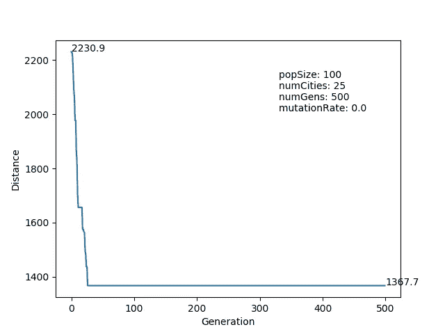
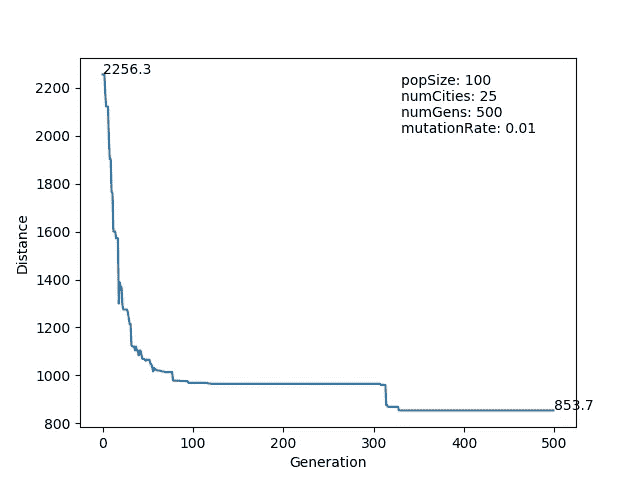
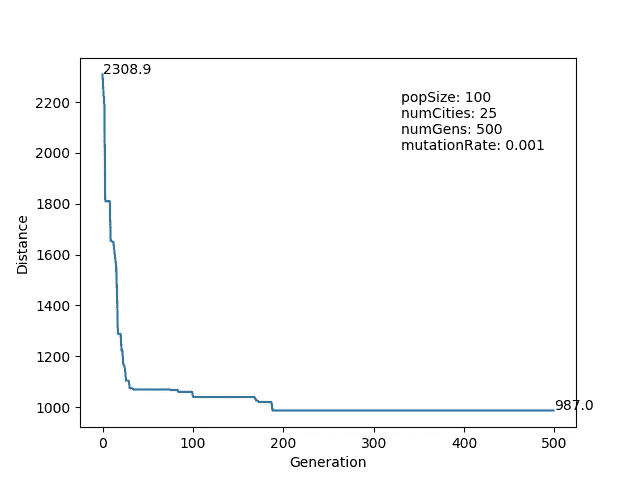
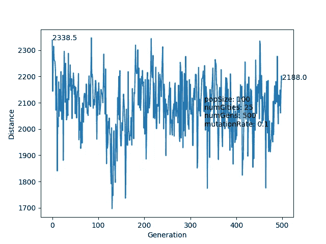
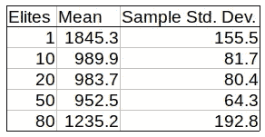
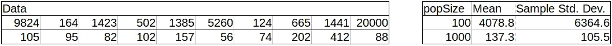
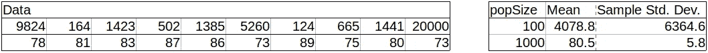
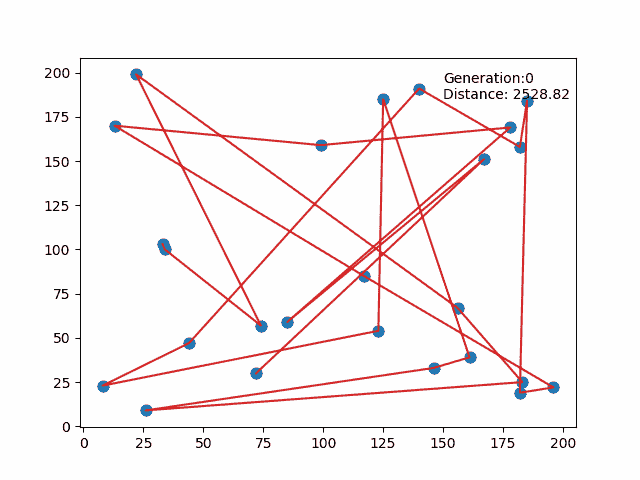
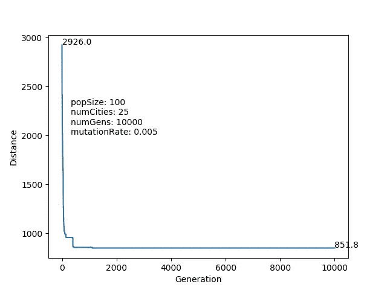
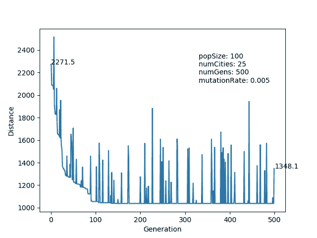

# 调音旅行推销员

> 原文：<https://towardsdatascience.com/tuning-a-traveling-salesman-cadfd7d22e1c?source=collection_archive---------11----------------------->

[The Traveling Salesman,](https://commons.wikimedia.org/wiki/File:Traveling_Salesman_(1921)_-_4.jpg) a 1921 comedy with the right title for this article

# 介绍

几个月前，我发现了艾瑞克·斯托罗兹写的这篇关于遗传算法的文章,他写的这篇文章是为了找到旅行推销员问题的最优解。我觉得很有意思，为了更深入的理解，[从头重写项目](https://github.com/adinhobl/GeneticAlg)，对问题空间做了一点探索。

我将让读者参考原始帖子来了解算法的一般解释，但我确实做了一些更改:

*   我在一些/很多/大部分代码中使用了 Python 的显式类型化功能，来感受一下
*   我使功能更加灵活和模块化，并为每个功能编写了一个简短的单元测试，这样用户就可以看到幕后发生了什么
*   我添加了一个可视化，这样用户就可以观看算法的运行

本来我开始这个项目是出于自己的学习和兴趣。然而，我发现了一些我认为值得分享的结果，因为它们突出了调整基因模型的容易和力量。此外，我发现选择一个项目并把它推向一个有趣的方向是多么容易。

# 调谐

作为一个基准，正常的第一代通常从 2100 到 2400 之间的总行驶距离开始。对于这里介绍的实验，城市的初始人口是相同的，但是第一代的初始顺序是随机的。除了动画之外，使用每代中最合适的个体(到达每个城市的最短距离)来生成图和数字。我在大多数实验中使用了 500 代，不是因为 500 是一个科学挑选的数字，而是它似乎为收敛提供了足够的时间，而没有为糟糕的超参数初始化提供足够的时间来收敛。方便的是，500 英镑也提供了合理的等待时间。

## 突变率

> 变异率如何影响种群中最佳个体的收敛时间和路径适应度？

*   总的来说，似乎没有突变的试验以更长的路线结束，大约 1100-1300 的距离。我从未见过第 500 代跑完 1000 米的。没有突变，每一个连续的世代仅仅依靠繁殖和随机产生新的个体来改进。

*   突变率为 0.01 的种群在 500 代中很少超过 1000。我怀疑这是最佳突变率的正确数量级。5 次连续运行的快照显示了一致性:890、939、998、880、953。

*   突变率为 0.001 的人群表现良好，但结果的变化比突变率为 0.01 的人群更大。值为 0.001 时，似乎初始的起始路线对于最终的解决方案非常重要。如果起始路线是好的，它可以很快收敛到一个好的解决方案，否则，在没有太多基因变化的情况下，可能会花费更多代。5 次连续运行的快照:866、1046、996、880、1024。

*   突变率为 0.1 的群体无法收敛。太多的个体经历突变，使得群体无法传递有用的遗传信息。对于交换变异，好路由和差路由之间的区别可能只是几个节点的一次交换。尽管下图*中最终最佳个体的平均距离比最初一代的*好几百点，但这是高初始路线距离的产物，我不相信有任何真正重大的进化发生。

mutationRate: 0.1

## 精英人数

> 精英的数量如何影响种群的遗传多样性和保留率？

分析精英的影响需要比突变率更细微的差别。对于测试的每个“精英数量”，我进行了 10 次试验(我知道，不是很多)，并记录了 500 代后种群中最佳个体的最终距离，保持其他超参数不变。取这些值的平均值和标准偏差，得出以下结果:

Total population is 100 individuals, Elites included

我敢说，在只有 5 个数据点的情况下，精英数量与均值和标准差之间的关系看起来大致呈抛物线状，趋势相似。当群体规模为 100 时，精英的最佳数量似乎接近 50。

精英的最佳数量不在任何一个极端，这有一定的直观意义。一些“基因搜索空间”(我肯定有一个技术术语)应该致力于在没有实质性变化的情况下在几代人之间传递好的基因。然而，太多的精英和你的遗传算法没有遇到足够的遗传多样性来快速进步。

## 群体大小

> 拥有一大群人会有规模效应吗？

在我所做的大多数试验中，我都在寻找 25 个城市之间的最佳路线，在每一代算法中，都有 100 条可能的路线。在这里，我们可以看到 100 是不是一个好的人口数量选择，或者多生几个会有很大的影响。这可以通过两种方式实现:保持精英的数量不变，或者占总人口的百分比不变。让我们两个都试试。

我运行算法的最大值为 20000 代，但是如果一代中最好的个体的距离小于 852(稍后将详细介绍)，我会提前停止并打印这一代。结果是:

Elites = 50, mutationRate = 0.01

Elites = 0.50 * popSize, mutationRate = 0.01

基于这些结果，我敢说将群体规模从 100 个个体增加到 1000 个个体会极大地提高算法的性能。此外，使用精英的数量是人口规模的高百分比，而不是低的、平坦的数字，允许算法一致地找到解决方案。我认为这比增加群体规模带来的性能提升更重要。

我认为值得注意的是，对于 100 popSize 组，有些试验完成得很快，有些试验需要 5000、10000 或超过 20000 代(在我砍掉它之前的最大值)。这个分布有一个长尾巴，这使得持续使用令人沮丧。

这些试验进行了很长时间。我不确定我是不是有记忆问题，还是真的花了很长时间。一些人口规模为 100 和 1000(只有 50 个精英)的试验超过了 20000 代，尽管很难对这种情况发生的频率有好的感觉，因为运行它们需要很长时间。此外，我试图查看 10000 人的人口规模，但在等待第一个解决方案 10 分钟后，我放弃了。对这些结果持保留态度(我没有使用超级计算机)，但我确实认为总体趋势是成立的。即使 10000 人口所需的世代数减少了 75%,我觉得我们可能会达到收益递减点。

使用较大群体时需要考虑的一个问题是所需的计算量会增加。这在生产环境中可能非常重要，但这里不做分析。

## 溶液质量

> 最终解与最优解有多接近？

一般来说，遗传算法可以很快达到一个体面的次优解。可以在下面的 gif 中观看进化进度:

50 elites, 0.01 mutation rate

然而，在许多情况下，当观看融合解决方案的静态帧时，人眼会立即看到明显的改进。会有交叉的路径，通常效率很低。经常会有两个不相连的城市紧挨着，解决方案倾向于将它们分开。后者很容易通过局部的、较小的路径交换来解决。

通常，到 500 代时，总距离不会有很多大的阶梯式下降，任何改善通常都是微小的。有趣的是，我还没有见过任何距离在 851 以下的解，我多次看到同一个数字(到~10 位小数)，有多种设置，让我相信它是这些起点的最优解，或者至少是强局部极小值，所以在这种情况下，有时会找到正确的解。

我看着一大堆 10，000 代的运行完成，在大多数情况下，到 851 的最后一小步花了几代才最终发生。由此，我感觉在从随机初始条件中寻找巨大改进方面，遗传方法要比随机搜索好得多，但是寻找最优解主要是在已经很好的解的基础上进行大量的反复试验。

# 前进

总的来说，这个项目很有趣，感觉相对简单。仅仅几个小时的工作，我就在性能和一致性方面获得了几个数量级的提升。

有一个很好的调试，我经历了几代人以来最优秀的个体之间的巨大差距。这种现象产生了这样的训练曲线:

The final result is not the most fit individual for its generation.

尽管这通常不会影响算法的收敛，但有时会影响最终的解决方案，如上所示。这是因为在记录最佳个体之前，群体中的个体发生了变异。我肯定我不是第一个考虑到遗传算法的人群适应性令人不安的峰值的人，但我很高兴我找到了我的答案。

我还学到了其他一些东西:

*   从一种非常自由的 Python 风格转变为一种所有内容都显式类型化的风格是很困难的，并且感觉这剥夺了 Python 的通用性。然而，当你越来越抽象的时候，它确实迫使你更多地思考背景中发生的事情。
*   Matplotlib 中的动画没有我预期的那么难，找到其他人的例子帮助很大，尤其是在使用多个艺术家时。
*   遗传算法似乎适合于在搜索空间很大的情况下进行优化，并且这种改进具有随机性。
*   我需要在做项目的时候开始写作，这样我就不会忘记我在工作中遇到的所有小片段。

我也有一些想法给那些希望在这方面有所改进的人:

*   除了`self.fitness = 1 / self.routeDistance()`还要考虑健身功能。这可能会也可能不会产生有趣的结果，因为选择过程是单调的。
*   为估计最佳超参数进行更稳健的实验设计。进行多次运行，改变变异率或精英的数量，并找到不同组合的平均值和标准偏差，并不需要太多时间。为了找到最佳的代数，可以使用诸如“120 代后 95%的运行达到最小值”的度量。
*   调查不同的突变类型，或更多的局部突变。很多时候，会有一小群 3 到 4 个彼此相邻的点，有一个公认的最佳方式来遍历这些点。可能在一个频率上进行短距离交换，而在另一个频率上进行长距离交换。这可以使用基于提议的交换距离的惩罚变异率来合并。
*   现在，代码使用了许多“for”循环。研究加速/并行化的方法。

我可以看到遗传算法在航班定价、拼车应用程序中匹配乘客和司机或城市规划等领域的潜在用例。目前，我正在阅读两篇论文:UberAI 实验室的[深度神经进化](https://arxiv.org/abs/1712.06567)和[进化出玩雅达利游戏的简单程序](https://arxiv.org/abs/1806.05695)。我对在这个领域更深入一点或者复制论文很感兴趣，所以如果任何人有他们正在做的有趣的项目，请告诉我！