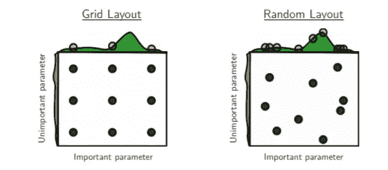
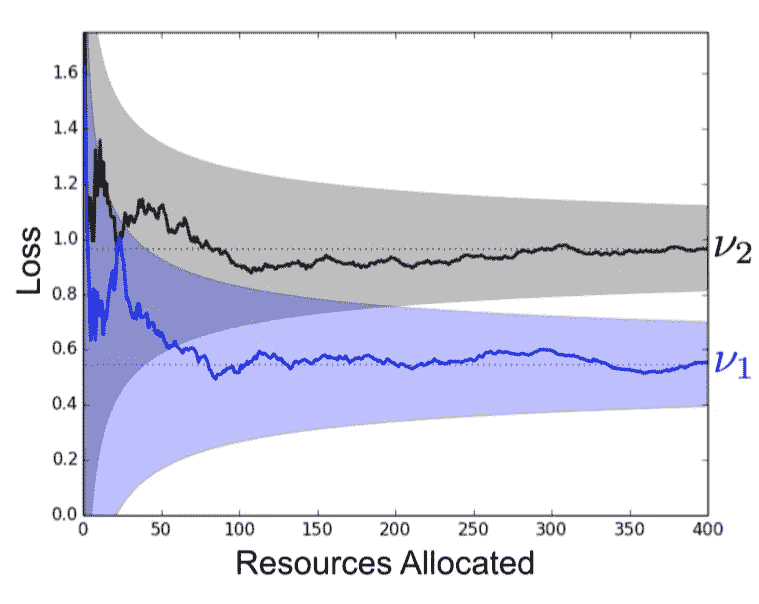

# 调整超参数(第一部分):成功减半

> 原文：<https://towardsdatascience.com/tuning-hyperparameters-part-i-successivehalving-c6c602865619?source=collection_archive---------7----------------------->

Photo by [rawpixel](https://unsplash.com/photos/RqzW7zFB6y0?utm_source=unsplash&utm_medium=referral&utm_content=creditCopyText) on [Unsplash](https://unsplash.com/search/photos/half?utm_source=unsplash&utm_medium=referral&utm_content=creditCopyText)

在这个系列中，我想讨论一些超参数优化技术，它们的优点/缺点等。我目前不打算遵循任何特定的时间顺序。每一部分都应该单独阅读。

# 介绍

为什么我们应该关心优化超参数？

当我们在机器学习中建立各种模型管道时，我们经常会发现自己有十个、二十个甚至更多的超参数需要我们做出决策。这个决策空间随着每个额外的超参数呈指数增长，使得仔细的分析不切实际，如果不是不可能的话。

为了加速项目的开发过程，我们可能希望将这部分工作自动化。

但是怎么做呢？

简单的网格搜索可能是我们的第一选择，但是正如我们所讨论的，由于维数灾难，这是效率最低(时间)的选择。

下一个最佳解决方案是随机采样超参数空间。这个解决方案是由 [Bengio 等人](http://www.jmlr.org/papers/volume13/bergstra12a/bergstra12a.pdf)提出的，并且已经被证明优于网格搜索。在这种情况下，通过超越，我的意思是**随机搜索**能够在更短的时间内使用更少的资源找到模型的更可靠和得分最高的超参数配置。为了理解这一点，让我们看一下图 1。摘自[原文](http://www.jmlr.org/papers/volume13/bergstra12a/bergstra12a.pdf)。

Figure 1.: Grid Search vs Random Search

正如我们所见，这是经常发生的情况，一些超参数比其他更具决定性。在**网格搜索的情况下，**尽管采样了 9 次试验，但实际上我们只试验了一个重要参数的 3 个不同值。在**随机搜索**的情况下，9 次试验将仅测试 9 个不同的决定性参数。

我们能做的比**随机搜索**更好/更多吗？当然可以！但是*“如何”*可能取决于我们所说的*“更好*”的确切含义。

存在两种类型的算法，它们是对**随机搜索**的自然扩展。第一个是贝叶斯优化算法，如 **Tree-Parzen Estimators** ，它有助于找到统计上更稳健(可靠)和得分更高的配置。

第二种类型，例如**成功减半**和**超带**，在资源分配上进行优化。在下一节中，我将讨论 [**成功减半**](https://arxiv.org/abs/1502.07943) 如何通过比**随机搜索**更有效地划分和选择随机生成的超参数配置来改进**随机搜索**，而无需对配置空间的性质做更多假设。更有效的资源分配，意味着给定相同的配置集，**成功减半**将比**随机搜索**更快地找到最优配置。

# 成功减半

那么，我们如何更有效地分配我们的资源呢？让我们来看看摘自本文的图 2。

Figure 2: The validation loss as a function of total resources allocated for two configurations.

通常在实践中，相对于最差的配置，有希望的配置往往得分更高，甚至在过程的早期。

我们走吧！这就是成功减半的意义所在！下面是该算法如何利用这一假设:

1.  随机抽样一组超参数配置
2.  评估所有当前剩余配置的性能
3.  抛出，最差得分配置的下半部分
4.  回到 2。并重复直到剩下一个配置。

与其浪费大量的训练时间在毫无结果的配置上，不如尽快成功地将投掷减半。因此，可以将更多的训练时间(即资源)分配给更有潜在价值的模型。

# 实际上…

为了成功应用减半，我们需要找到机器学习库，它允许我们**暂时停止模型的训练**，最终**保存模型**，然后稍后**重新加载模型**并且**继续训练**。

不幸的是，后一点是最有问题的一点。作为一名从业者，不幸的是，您没有时间/预算从头开发自己的库，并且经常依赖于开源云中的可用资源。不幸的是，实践中使用的一些算法缺少这个选项，但幸运的是，我们有很多强大和/或流行的算法！所有 Scikit-Learn 的“热启动”超参数实施都是如此，例如(Extreme)RandomForest、GradientBoosting 等

对于极端的梯度增强库，我只能找到 xgboost 的方法，而 LGBM 在提取增强器时产生了一个 bug。不幸的是，Catboost 没有这个选项，很可能是由于算法本身的性质，它试图通过移动数据来取消每次 boost 迭代的偏向。

对于深度学习，Pytorch，Keras 和 TensorFlow 仍然允许最大的灵活性，所以没有问题！

让我们一步一步来，看看如何在 SuccessiveHalving 的实现中包含所有这些库。

首先，我们需要这些模型的包装器，这迫使我们实现保存/加载模型的定义，更重要的是**在重载**后进一步训练模型。

下面的基类对此进行了描述:

下面是一个没有提前停止的 XGBOOST 示例:

在这种情况下，我们必须提取助推器并使用功能 API 来进一步训练。出于某种原因，这个类似的技巧会为 Lightgbm 产生一个错误。

借助热启动超参数，Scikit-learn 变得更加简单。

如果这个超参数不存在，恐怕您将不得不完全改装模型，从而损失重新分配资源所获得的时间。

现在我们有了 wapper，我们可以继续实施成功减半了！

变量“eta”是我们增加资源的速率，直到我们达到我们希望使用的资源的最大值。

例如，假设我们最终的 xgboost 模型在 200 个配置的样本中最多应该有 1000 棵树。我们将资源单位设置为 10，这样最初的一批配置将只训练 10 次提升。在每一步，我们用“eta ”= 1.93 倍的估计量来训练新的一批。

更多的例子和实现是可用的[这里](https://github.com/benoitdescamps/Hyperparameters-tuning)。

# 没有灵丹妙药…

应用成功减半时的一个大问题是在总资源和配置总数之间找到合适的平衡。

较小的学习率通常与更多的资源、更多的树(在(极端)梯度提升的情况下)或更多的神经网络时期密切相关。

我们如何能调整这样一个选择？ **HyperBand** 提出了一个解决方案，但这是下次的事了！

# 我写了更多精彩的东西！

@ [在 TensorFlow 中构建决策树](https://medium.com/bigdatarepublic/building-a-decision-tree-in-tensorflow-742438cb483e)

@[tensor flow 中的自定义优化器](https://www.kdnuggets.com/2018/01/custom-optimizer-tensorflow.html)

@[XGBOOST 回归预测区间](https://medium.com/bigdatarepublic/regression-prediction-intervals-with-xgboost-428e0a018b)

# 参考资料:

1.  J.Bergstra 和 Y. Bengio，超参数优化的随机搜索，2011 年
2.  K.Jamieson，A. Talwalka，非随机最佳臂识别和超参数优化，2015 年
3.  长度李、贾米森、德萨沃、罗斯塔米扎德、塔瓦尔卡尔。超带:基于 Bandit 的超参数优化新方法。arXiv 预印本 arXiv:1711.09784，2017 年
4.  Scikit-Learn，url，[http://scikit-learn.org/stable/](http://scikit-learn.org/stable/)
5.  J.Bergstra，R. Bardenet，Y. Bengio，B. Kégl，超参数优化算法
6.  github:【https://github.com/benoitdescamps/Hyperparameters-tuning 