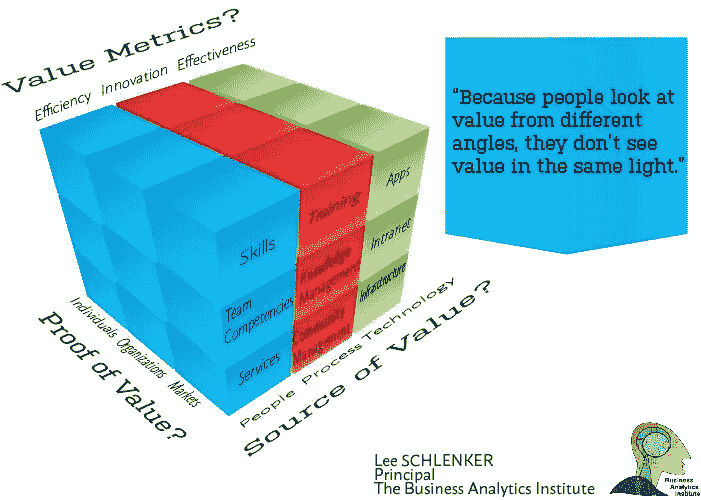

# 把数据变成美元？

> 原文：<https://towardsdatascience.com/turning-data-into-dollars-15fa2d0961af?source=collection_archive---------7----------------------->

Image Credits: Managed Data Center News

上周在 DataWorks 峰会上接受采访时，Bill Schmarzo 提出了一个基本问题，即组织每次点击鼠标收集的数据的价值。[【I】](#_edn1)当面对“数据是新货币”[【ii】](#_edn2)以及组织应努力“将数据货币化”[【iii】](#_edn3)的主张时；应该指出数据的交换价值和使用价值之间的区别。我完全同意他的结论:“数据的价值来自于将其用于做出更好的决策。”正如我们之前所建议的，数据只不过是我们业务现实的代理，除了我们的同事、业务合作伙伴和外部利益相关者的客户体验之外，它没有任何内在价值。哪些类型的数据会突出这些不同的价值观？

*因为人们看待价值的角度不同，所以看待数据的角度也不一样。*几年前，我们与微软的 Kees Pronk 合作推出了 Business Value Matrix(BVM ),以强调手头数据的不同用途，从而强化客户故事。[【v】](#_edn5)BVM 认为数据提供了将业务挑战与其潜在解决方案联系起来的故事的构建模块。这个立方体用于沿着三个轴探索客户对价值的看法:他们如何使用数据来说明他们的挑战和机遇，他们使用什么类型的证据来证明问题，什么形式的数据将用于判断成功？

The Business Value Matrix™

第一个问题强调了每个利益相关者都有一个主要的信念，即把人、过程或技术作为企业价值的源泉。首先，利益相关者深信人才是企业价值的主要来源——管理层的角色是提高员工、业务合作伙伴和最终客户的知识和技能。在第二种思维模式中，人才不如组织良好的流程重要——业务的价值与组织优化与关键业务流程相关的活动的努力直接相关。最后，在第三种情况下，人们深信技术(信息和物理)的存在本身就足以提高底线。在每种情况下，涉众将收集和监控不同种类的数据，作为组织当前问题和未来机会的证据。

第二个问题说明了关于概念证明的可能性:利益相关者在个人、公司和市场层面寻找证明价值。那些相信个人可以改变公司表现的人；个人生产力的数据是组织成功的代表。对其他人来说，一个企业的好坏取决于它最薄弱的环节——在这里，关于组织如何运作的数据比衡量成功的个人标准更重要。最后，对于一定数量的经理或股东来说，唯一真正的证据是市场本身——组织指标被淡化，而倾向于客户满意度和市场份额的数据。这里，数据科学家需要考虑如何指定组织挑战、分析级别的难度以及哪些证据是可以直接观察到的。

第三个问题集中在利益相关者如何展望成功。对于一定数量的管理者来说，成功就是效率——数据需要关注相关活动的成本和收益。对许多人来说，有效性是比效率更好的成功衡量标准——数据需要衡量组织与其客户之间关系的质量。对于其他人来说，创新是关键指标，数据需要说明组织如何应对外部威胁和机遇。对于其他人来说，利用率是一个不同的指标，这表明当强调组织资源在一段时间内的利用情况时，成功是更好的衡量标准。在这里的每一种情况下，基本问题是数据如何转化为个人或集体行动。客户故事从他们自己在矩阵每个轴上的位置出现。

*商业分析与其说是处理数据，不如说是过滤信息，以帮助客户在他们想要讲述的故事中取得成功*。如果业务价值矩阵为利益相关方提供了一种工具来设想数据和客户价值之间的潜在桥梁，那么数据科学可以提供将描述性、预测性和规范性分析应用于组织的机制。在我们位于巴约纳的[暑期学校](http://baisummer.com)，以及我们在欧洲的[大师班](http://baimasterclass.com)，我们将帮助您发展您的分析技能。该研究所专注于数据科学在管理人员中的五个应用:在数字时代工作、数据驱动的决策、机器学习、社区管理和可视通信。数据驱动的决策会对你未来的工作和职业产生影响。

Lee Schlenker 是商业分析和社区管理教授，也是 http://baieurope.com 商业分析学院 [*的负责人。【www.linkedin.com/in/leeschlenker.】*](http://baieurope.com.)*你可以在推特上关注我们*[*https://twitter.com/DSign4Analytics*](https://twitter.com/DSign4Analytics)

— — — — — — -

[【我】](#_ednref1)艾伯特森，m .(2017)[数据的价值？都是关于终结游戏](https://siliconangle.com/blog/2017/06/20/datas-value-end-game-says-dean-big-data-dws17/)，硅角度

[【ii】](#_ednref2)摩根·l .(2016)[8 种数据货币化的方式](http://www.informationweek.com/big-data/big-data-analytics/8-ways-to-monetize-data/d/d-id/1323932)《信息周刊》

[【iii】](#_ednref3)Wixom，b .和 Ross，J. (2017)，[如何将你的数据货币化](http://sloanreview.mit.edu/article/how-to-monetize-your-data/)，麻省理工斯隆管理评论

[【iv】](#_ednref4)Schlenker，L. (2017)，[数据不仅仅是数据…，](https://medium.com/@LeeSchlenker/data-is-not-just-data-c7e5721faadd)媒介

Schlenker，l .和 Pronk K. (2009)，价值之旅，Goodfellow 出版社