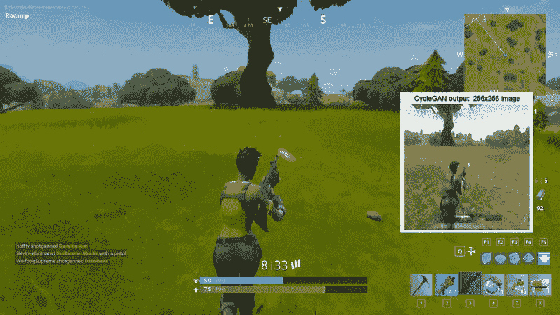
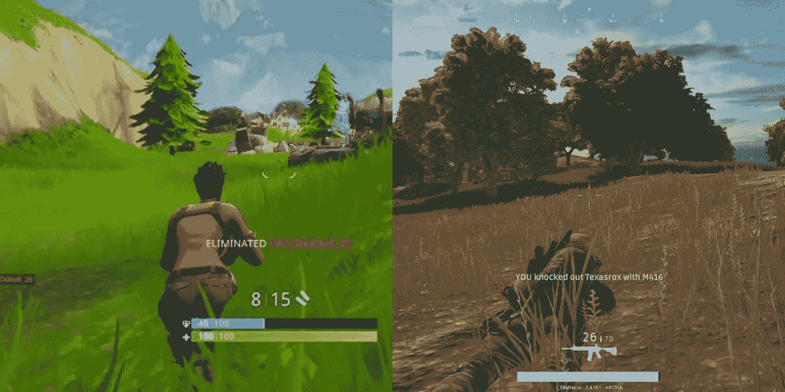
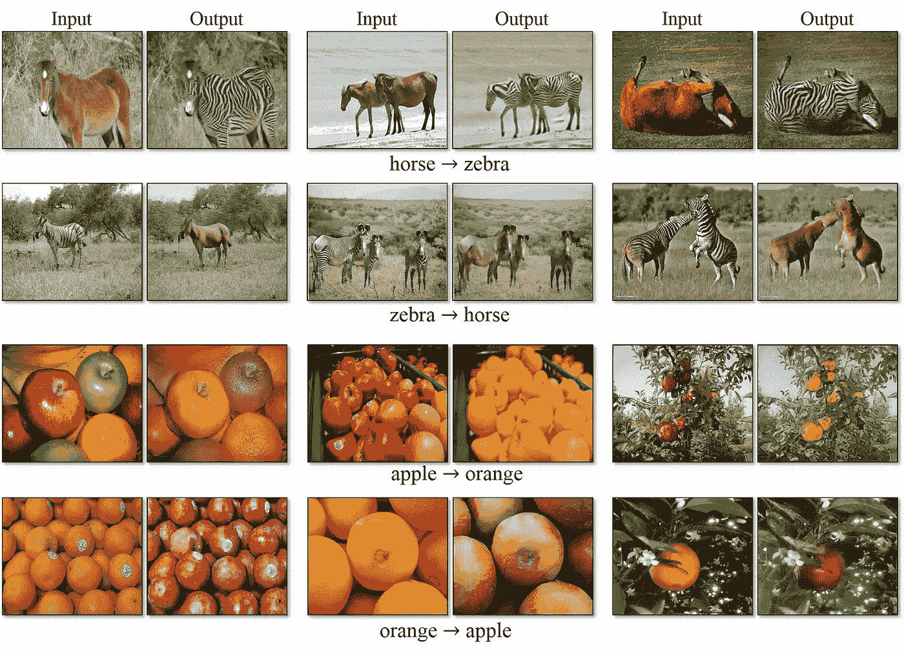
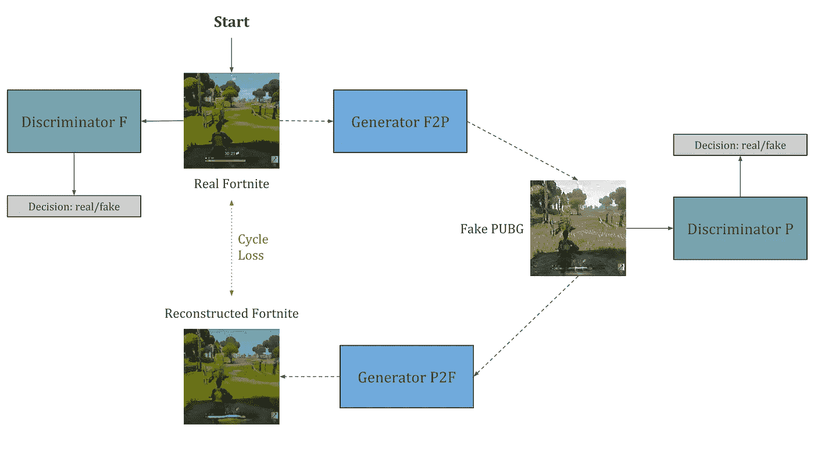
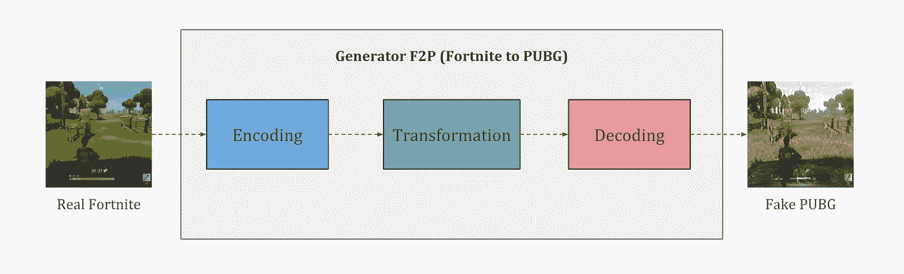

# 用深度学习把堡垒之夜变成 PUBG(cycle gan)

> 原文：<https://towardsdatascience.com/turning-fortnite-into-pubg-with-deep-learning-cyclegan-2f9d339dcdb0?source=collection_archive---------4----------------------->

## 理解用于图像风格转换的 CycleGAN 并探索其在游戏图形模块中的应用。

A Neural Network’s attempt at recreating Fortnite in the visual style of PUBG.

如果你是一个游戏玩家，你一定听说过两个疯狂流行的皇家战役游戏，堡垒之夜和 PUBG。这是两个非常相似的游戏，100 名玩家在一个小岛上决一雌雄，直到只剩下一名幸存者。我喜欢堡垒之夜的游戏性，但倾向于更喜欢 PUBG 的更真实的视觉效果。这让我想到，我们能不能有游戏的图形模块，让我们可以选择我们喜欢的视觉效果，而不必依赖游戏开发商为我们提供这种选择？如果有一个 mod 可以在 PUBG 的视觉效果中渲染堡垒之夜的画面会怎么样？这就是我决定探索深度学习是否有所帮助的地方，我遇到了一种叫做 CycleGANs 的神经网络，它碰巧非常擅长图像风格转移。在本文中，我将介绍 CycleGANs 是如何工作的，然后训练它们将堡垒之夜视觉转换成 PUBG。

Fortnite (left) with it’s cartoonish visuals and PUBG (right) with its more realistic visuals.

## 什么是 CycleGANs？

CycleGANs 是一种用于跨域图像风格传递的[生成对抗网络](https://deeplearning4j.org/generative-adversarial-network)。他们可以被训练将一个领域的图像，比如堡垒之夜，转换成另一个领域的图像，比如 PUBG。这项任务是以无人监督的方式执行的，即，没有来自这两个域的图像的一对一映射。

Original Github implementation and its results can be found [here](https://github.com/junyanz/pytorch-CycleGAN-and-pix2pix).

网络能够理解原始域的图像中的对象，并应用必要的变换来匹配目标域的图像中的相同对象的外观。该算法的[原始实现](https://junyanz.github.io/CycleGAN/)被训练成将马转换成斑马，将苹果转换成橙子，将照片转换成绘画，结果令人惊叹。

## 它们是如何工作的？

让我们以堡垒之夜为例，以 PUBG 为例，尝试理解 CycleGANs 是如何工作的。使用两个游戏的大量截图，我们训练了一对生成性对抗网络，其中一个网络学习堡垒之夜的视觉风格，另一个学习 PUBG 的视觉风格。这两个网络以循环的方式同时被训练，以便它们学会在两个游戏中的相同对象之间形成关系，从而进行适当的视觉转换。下图显示了这两个网络循环设置的一般架构。

Cycle from “Real Fortnite” to “Fake PUBG” to “Reconstructed Fortnite”.

我们从堡垒之夜的原始图像开始训练过程。我们将训练两个深度网络，一个生成器和一个鉴别器。随着时间的推移，鉴别者将学会区分堡垒之夜的真假图像。生成器将被训练为使用来自训练集的 PUBG 的随机截图将输入图像从原始域转换到目标域。

为了确保这个转换是有意义的，我们强加了一个重建条件。这意味着我们同时训练另一组生成器/鉴别器，该生成器/鉴别器从伪域重建原始域中的图像。我们强加了这样一个条件，即该重建必须与原始图像相似，给我们一个循环损失值，我们的目标是在训练过程中最小化该值。这类似于自动编码器，除了我们不是在中间步骤的潜在空间中寻找编码，而是在我们的目标域中寻找整个图像。

Overview of Generator F2P shown in the previous figure.

这里使用的发生器网络(F2P)由三个主要卷积模块组成。第一个在低维潜在空间中找到了堡垒之夜截图的编码。这种编码被转换成在相同的潜在空间中表示 PUBG 的编码。然后，解码器从转换后的编码构建输出图像，给我们看起来像 PUBG 的堡垒之夜图像。

在这个培训过程中，我面临的一个限制是，由于 GPU 内存的限制，我只能处理 256x256 的图像。这会显著影响结果，但是如果您的视频内存超过 8gb，您可以尝试生成多达 512x512 的图像。如果可以，请在这里告诉我[！](https://twitter.com/deepgamingai)

## 结果

经过 12 个小时的训练后，CycleGAN 生成的图像似乎很有希望。该网络成功地将堡垒之夜的天空、树木和草地的颜色转换成了 PUBG 的颜色。堡垒之夜过度饱和的颜色被转换成了 PUBG 更真实的颜色。

天空看起来不那么蓝，草和树的卡通绿色看起来更接近在 PUBG 看到的。它甚至学会了用 PUBG 的枪和弹药指示器替换屏幕底部的生命计！在这两个领域中无法联系的是玩家的外观，这就是为什么它周围的像素有点模糊。总的来说，该网络在识别跨两个领域的对象并转换它们的外观方面做得不错。

要查看更长的结果，请查看下面嵌入的视频。如果你喜欢你所看到的，别忘了[点击这里](http://www.youtube.com/subscription_center?add_user=DeepGamingAI)并订阅我的 YouTube 频道！

## 游戏中图形模块的应用

虽然结果对我来说很好，但很明显，在我可以用 PUBG graphics 真正玩堡垒之夜之前，我们还有很长的路要走。但是，一旦我们能够使用这些网络实时生成更高分辨率的图像，未来就有可能为游戏构建图形 mod 引擎，而不必依赖游戏开发者。我们可以使用我们喜欢的游戏的视觉风格，并将其应用到任何其他游戏中！

我将探索如何通过使用我在本文中讨论的相同技术将游戏视觉转换成现实生活中的照片来实现游戏中的照片真实感。如果你想保持跟踪，请在[媒体](https://medium.com/@chintan.t93)或我的 [YouTube 频道](http://youtube.com/c/DeepGamingAI)上关注我。感谢您的阅读！

编辑:这里是一些相同的更新结果。