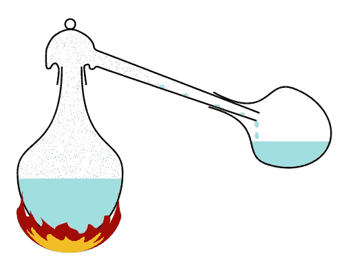
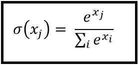
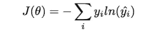
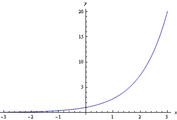
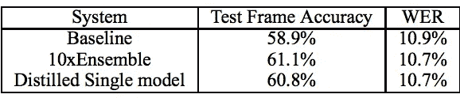

# 升温:模型蒸馏的机制

> 原文：<https://towardsdatascience.com/turning-up-the-heat-the-mechanics-of-model-distillation-25ca337b5c7c?source=collection_archive---------5----------------------->

当我第一次读到这篇论文时，我被两种冲动所触动。首先，我绝对应该写一个帖子来解释它，因为它的许多想法都是优雅而令人信服的——从它对网络存储信息意味着什么的思考，到对 softmax 正在做什么的更好的直观感受。第二，也许这样做是白费力气，因为原著本身写得太好了。

在这种情况下，我认为我无法给出比 Hinton，Vinyal & Dean 的原始论文更好的介绍了:

> 许多昆虫的幼虫形态最适合从环境中吸取能量和营养，而完全不同的成虫形态最适合完全不同的旅行和繁殖要求。…与昆虫的类比表明，如果能更容易地从数据中提取结构，我们应该愿意训练非常繁琐的模型。繁琐的模型可以是单独训练的模型的集合，或者是用非常强的正则化子(例如 dropout [9])训练的单个非常大的模型。一旦繁琐的模型被训练，我们就可以使用不同种类的训练，我们称之为“提炼”,将知识从繁琐的模型转移到更适合部署的小模型

乍一看，这似乎难以置信，违反直觉。提取信息意味着什么？如何使用简单模型的架构和参数结构来表示复杂模型学习到的函数？

一个对我有用的比喻——为简单和抽象道歉——是主模型本质上像一只母鸟，消化她的食物，以便更小、更简单的模型可以更容易地消耗它。最初，每个观察仅由其训练集标签表示:0 或 1(在两个类的情况下)。现实并没有告诉我们单个事件的概率，而是告诉我们表面下的结果有多大的可能性或边际性；我们只看到发生了什么。

但是，在学习决策边界的过程中，复杂模型隐含地开始捕捉更细微的信息。一个给定的例子显然是其类的中心代表，还是它是边缘的，接近决策边界，从而难以与备选类区分？如果我们在一个多种类的环境中操作，这个例子中最有可能的种类“哈士奇”是否更接近作为次优选择的“雪橇犬”或“吉娃娃”的决策界限？希望这些例子能给我们一些直觉，让我们知道在一个模型的输出分数中捕捉到的这类问题的答案，可以为复杂模型所学习到的内部表征提供线索。模型提炼的关键思想是:模仿这种学习到的表示应该比一开始就学习它要容易得多，这意味着(近似)模仿的任务可以通过更简单的模型来完成。

# 打开暖气

温度在(模型)蒸馏过程中的作用是将模型推到一个极端概率较小的区域，这样它们对我们的计算更有帮助。

为了理解这是怎么回事，我发现绕一圈了解一下 softmax 在做什么以及为什么要这么做是很有价值的。

直到我最近更深入地考虑它，我基本上把 softmax 作为“一个将实数输出压缩成概率分布的运算符”存储在我的脑海中。当然，它确实是这样做的:数学上很清楚，分子中所有类的 sigmas 加起来就是一，只是通过构造。但是我从来没有认真思考过“softmax”名字中的“max”部分。softmax 不仅仅是一个规范化操作符:它是一个规范化操作符，对较大的值有很强的特权。

当其他人第一次看到这个公式时，这可能是他们完全内化的东西，但我在这里找到了放大一些具体细节的价值。(术语注释:在上面的公式中，当您看到下标 x 值时，对于所有 j 类，我将这些值称为“logits ”,有点不精确地遵循输入到逻辑转换中的实数值的命名约定)。如果有(1，2，3)的 logit，那么在 logit 空间中，每对相邻的有序数之间有相等的间隙。然而，在指数空间中，差距随着 logit 的大小而变大。(2.7，7.38，20.08)是这些逻辑在被指数化后的翻译。当在指数空间中进行归一化时，得到的是(0.08，. 25，. 67)，而不是仅归一化逻辑本身得到的(. 166，. 33，. 5)。如您所见，指数化的输出更接近于 argmax 函数，它将所有权重放在单个最高值上，而不是其他位置(这里的“argmax”指的是一个布尔函数，它指示哪个类包含某个输入的最高值)

从通常用于训练神经网络的交叉熵损失函数的角度来看，这种与 argmax 的相似性是有益的，因为该损失函数是真正对应于给定观察的类的对数模型分数的-1 倍。不关心精确校准的概率:它希望将尽可能多的概率放在真实类上。像这样的目标函数显然受益于 argmax 框架，而这正是 softmax 想要逼近的。

The cross-entropy loss equation

但是，当您的目标不仅是与另一个模型交流您的最佳猜测类是什么，而且交流可能性较小的类的相对大小时，这种策略就不那么有益了。这是因为，除了夸大最可能类的值，softmax 还会将可能性较小的类的值推得更小、更接近。你可以首先想到两个简单的归一化(即每个值除以所有值的总和)，一个是你的值为(1，6，10)，另一个是你的值为(1，6，100)。前者的归一化值为(0.06，0.35，0.59)。对于后者，我们得到(0.009，0.056，0.934)。因此，在最大值相对于其他两个值非常大的世界中，较小值之间的相对差异被压缩并且大部分丢失，这两个次要类之间的差异从 0.294 到 0.047。这让我们更接近 arg max 的情况，其中模型只传达一个信号:它认为哪个类更有可能。

考虑到我们希望在模型提炼过程中传递的各种微妙信息，任何导致我们学习到的模型输出崩溃到 1/0，甚至更强烈地倾向于这种离散输出的东西，都是一种障碍。更具体地说，在交叉熵框架中，如果我们想象*对*这些概率进行训练(也就是说:用概率替换 y-i 值)，这些概率最终会在该类别的学习概率对你的总体损失的影响的线性组合中起作用。这意味着这种价值上的线性差异将对我们从这些二级课堂中学习信息的能力产生有意义的影响。

The e^x function: a good one to have in your head to build intuition here

Temperature 的工作原理是降低发送到 softmax 函数的逻辑值的绝对值，将它们除以固定的恒定温度值 T，然后对这些较小的值求幂并求和。简单地说，如果您考虑一下标度一端的逻辑值本身和另一端的指数逻辑值，温度可以用于在这两端之间进行插值，随着温度值变高，指数运算的 argmax 倾向会降低。这是因为，当您将 logits 划分为更小的值时，您会将所有指数化的类值进一步推向左侧，从而使给定输入的类输出之间的比例差异变得更接近线性。具体来说，如果你看上面的图，你可以很容易地说服自己，你从(2，1)的输入得到的相对差异与从(1，0.5)的输入产生的相对差异有意义，后者对应于温度 T=2。

这种方法是蒸馏框架的关键，它类似于:

*   正常训练复杂模型(CM ),即温度为 1
*   获取一些额外的数据集，并通过 CM 运行，但在 softmax 层中将 logits 转换为概率时使用大于 1 的温度。这个温度值在这里是一个超参数。这里有一个有趣的注意事项是，这个额外的数据集实际上不需要贴上基本事实标签:我们所关心的是了解复杂模型对给定观察的想法，而不是基本事实是什么。也就是说，如果你有基本事实标签，你通常可以通过使用它们来改进训练(为了简单起见，我不会在这里讨论)
*   使用这些“软目标”概率来训练你的简单模型(SM)，也是在温度> 1 的情况下。
*   一旦你的提取模型被训练，在温度 1 下操作它，这样你得到的结果可能更 argmax-esque，因此可以更清楚地与使用典型 softmax 训练的模型进行比较

# 更好地在一起:整体应用

尽管该论文概述的提取策略适用于任何可以输出概率得分的分类器，但作者特别关注提取集成的价值。

集成是有效的，因为当你获取多个样本时——在这种情况下，这里的样本是一个模型，用一些不同的初始条件训练——并对它们进行平均，这相对于训练单个模型来说减少了方差。从理论上讲，方差和偏差是模型误差的两个来源，因此方差的减少是集成在许多机器学习应用中表现非常好的经验现实背后的理论证明。

出于解释或部署后勤方面的原因，可能需要将该集合所获得的信息压缩到一个模型中。但是，根据定义，如果您训练组成集成的任何模型的单一版本，您将只获得一个高方差估计点，而不是整个集成的好处。然而，如果你训练的是全体成员的平均值(也可以看作是概率得分)，那么你就是在教二级模型学习所有成员的聚合意见，而不是简单地根据原始标签生成它自己的函数。

事实上，作者发现，当他们在语音识别数据集上测试他们的方法时，根据聚合集成输出训练的提取模型比简单地根据真实情况训练的单一模型做得更好。

A diagram from the paper; WER here corresponds to “Word Error Rate”

# 一些最后的想法

在我最喜欢的漫画《T1》中，主角认为最好的知识是产生有趣的新问题的知识，而不仅仅是答案。虽然我承认这有点浪漫，而不是务实的知识方法，但它对我很有吸引力。

所以，在这篇文章的最后，我将举起一杯从这篇论文留给我的问题中提炼出来的东西。(注意:完全有可能存在回答这些问题的范围研究:我没有对这个领域做全面的文献综述。如果你知道他们，一定要把他们送到我这里来！)

Raise a glass to freed-er, I mean, free parameters

*   当问题的类别数量较少，因而可供学习的第二类信号不丰富时，蒸馏的有效性会下降到什么程度？
*   有没有办法将这种温度/插值软目标框架推广到像随机森林这样不使用 softmax 来生成输出的技术？
*   通过对复杂模型进行更多的剖析，并直接模拟复杂模型的表示空间，我们可以获得多大的性能提升？(即使用 softmax 之前的层的单位作为辅助信号)。