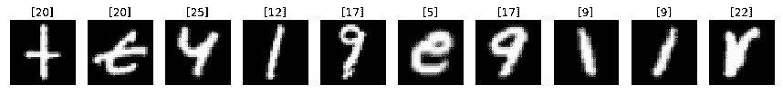
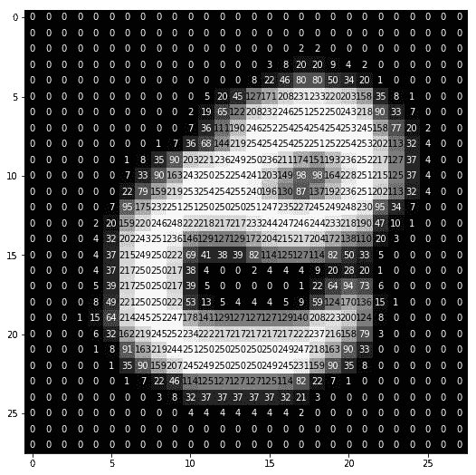
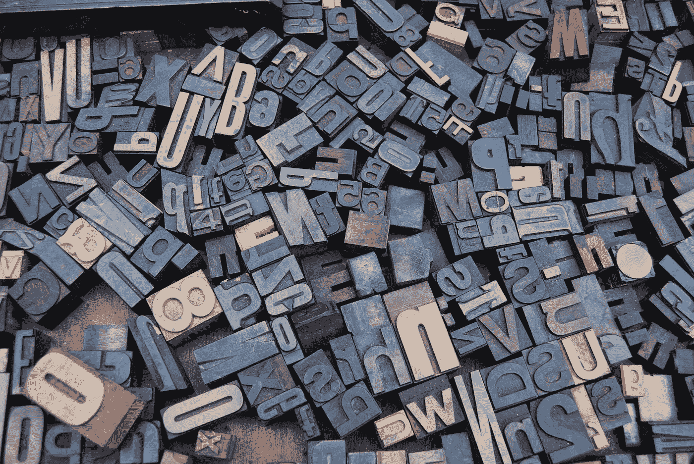

# 教程:通过手势识别字母——深度学习和 OpenCV 应用

> 原文：<https://towardsdatascience.com/tutorial-alphabet-recognition-deeplearning-opencv-97e697b8fb86?source=collection_archive---------3----------------------->

注意:文章过时了。我更改了我的 GitHub 用户名，结果 GitHub 列表不显示。请在此访问[项目代码。](https://github.com/acl21/Alphabet_Recognition_Gestures)

这是一个关于如何构建深度学习应用程序的教程，该应用程序可以实时识别由感兴趣的对象(在这种情况下是瓶盖)书写的字母表。

# 项目描述

深度学习技术能力的一个流行演示是图像数据中的对象识别。

python 中的这个深度学习应用程序通过网络摄像头实时捕捉的手势来识别字母表。允许用户使用感兴趣的对象(在这种情况下是水瓶盖)在屏幕上书写字母表。

您可以访问完整的项目代码:

 [## ACL 21/Alphabet _ Recognition _ 手势

### 更新]:我将不再关注与回购相关的问题或邮件，因为我目前非常忙…

github.com](https://github.com/acl21/Alphabet_Recognition_Gestures) 

# 工作示例

# 代码要求

代码在 Python 版本中，使用 OpenCV 和 Keras 库。

跟随[这篇中帖](https://medium.com/@akshaychandra21/how-to-install-opencv-and-keras-in-python-3-6-f5f721f0d0b3)在 Python 3 中安装 OpenCV 和 Keras。

# 数据描述

机器学习和深度学习的对象识别的“扩展 Hello World”是用于手写字母识别的 [EMNIST](https://www.kaggle.com/crawford/emnist) 数据集。它是 [MNIST](https://en.wikipedia.org/wiki/MNIST_database) 数据集的扩展版本(物体识别的“Hello World”)。



The letter ‘e’ is stored in a 28 x 28 numpy array as shown above.

# 代码解释

## 步骤 1:训练一个多层感知器模型

**1.1 负载数据**

我们使用 Python 的 *mnist* 库来加载数据。

现在让我们准备好数据，以供模型使用。将数据分成训练集和测试集，标准化图像和其他初步的东西。

**1.2 定义模型**

在 Keras 中，模型被定义为一系列层。我们首先初始化一个“序列模型”,然后添加包含各自神经元的层。下面的代码做了同样的事情。

正如预期的那样，该模型采用 28 x 28 像素(我们展平图像，并将每个像素传递到一维向量中)作为输入。模型的输出必须是对其中一个字母的决策，因此我们将输出层设置为 26 个神经元(决策是根据概率做出的)。

**1.3 编译模型**

既然模型已经定义好了，我们就可以编译它了。编译模型使用了后台(所谓的后端)的高效数值库，如 Theano 或 TensorFlow。

这里，我们指定了训练网络所需的一些属性。通过训练，我们试图找到最佳的权重集来对输入做出决策。我们必须指定用于评估一组权重的损失函数、用于搜索网络的不同权重的优化器以及我们希望在训练期间收集和报告的任何可选指标。

**1.4 拟合模型**

在这里，我们使用模型检查点来训练模型，这将帮助我们保存最佳模型(根据我们在上一步中定义的指标最佳)。

**1.5 评估模型**

该模型在 EMNIST 数据集上的测试精度为 **91.1%** 。

**1.6 把所有东西放在一起**

将所有步骤放在一起，我们得到了构建一个基于 EMNIST 数据的体面的 MLP 模型所需的完整代码。

## 步骤 2:训练卷积神经网络模型

**2.1 和 2.2 —加载数据并定义模型**

这两个步骤与我们在构建 MLP 模型时实施的步骤完全相同。

**2.3 定义模型**

出于超出本教程范围的原因，我定义了上面的 CNN 架构来解决手头的问题。要了解更多关于 CNN 的信息，请访问[这个教程页面](http://cs231n.github.io/convolutional-networks/)，它是最好的！

**2.3 编译模型**

Unlike the MLP model, this time I am using the ADADELTA optimizer

**2.4 适合车型**

要了解模型变量*和 ***历元*** 如何影响出模型性能，请访问[本](/epoch-vs-iterations-vs-batch-size-4dfb9c7ce9c9)。*

***2.5 评估模型***

*该模型在 EMNIST 数据集上的测试精度为 **93.1%** 。*

***2.6 把所有东西放在一起***

*将所有这些放在一起，我们得到了构建一个基于 EMNIST 数据训练的像样的 CNN 模型所需的完整代码。*

## *第三步:初始化东西*

*在我们研究识别代码之前，让我们初始化一些东西。*

*首先，我们加载在前面步骤中构建的模型。然后我们创建一个字母字典， ***blueLower*** 和 ***blueUpper*** 边界来检测蓝色瓶盖，一个 ***kernal*** 来平滑沿途的事物，一个空的 ***黑板*** 来存储白色的文字(就像 EMNIST 数据集中的字母表)，一个 deque 来存储所有的 ***点****

## *第四步:捕捉文字*

*一旦我们开始逐帧读取输入的视频，我们就试图找到蓝色的瓶盖，并将其用作一支笔。我们使用 OpenCV 的 ***cv2。VideoCapture()*** 从视频文件或网络摄像头实时逐帧(使用 while 循环)读取视频的方法。在这种情况下，我们将 0 传递给方法以从网络摄像头读取数据。下面的代码演示了同样的情况。*

*一旦我们开始读取网络摄像头馈送，我们就会借助 ***cv2.inRange()*** 方法不断在帧中寻找蓝色对象，并使用事先初始化的 *blueUpper* 和 *blueLower* 变量。一旦我们找到轮廓，我们做一系列的图像操作，并使其平滑。平滑只是让我们的生活更轻松。如果你想知道更多关于这些操作——侵蚀、变形和扩张，请查看[这个](https://docs.opencv.org/3.0-beta/doc/py_tutorials/py_imgproc/py_morphological_ops/py_morphological_ops.html)。*

*一旦我们找到轮廓(当找到轮廓时， ***if*** 条件通过)，我们使用轮廓的中心(蓝色帽)在屏幕上绘制它的移动。下面的代码做了同样的事情。*

*上面的代码检查是否找到了轮廓，如果是，它取最大的一个(假设是瓶盖)，使用***cv2 . minenclosingcircle()***和 ***cv2.circle()*** 方法围绕它画一个圆，借助***cv2 . moments()***方法得到找到的轮廓的中心。最后，中心被存储在一个名为 ***点*** 的 deque 中，这样我们就可以将它们全部连接起来，形成一个完整的文字。*

*我们在 ***框架*** 和 ***黑板*** 上显示图纸。一个用于外部显示，另一个将其传递给模型。*

**注意:我已经写了一个关于建立一个绘图环境的简短教程，它允许我们像在一个画图应用程序中一样绘图，在这里查看*[](https://medium.com/@akshaychandra21/tutorial-webcam-paint-opencv-dbe356ab5d6c)**以清楚地理解正在发生的事情。***

## **第五步:刮掉书写内容，并将其传递给模型**

**一旦用户写完了，我们就把之前存储的点连接起来，放在黑板上，然后传给模型。**

**当我们停止书写时，控制进入这个 ***elif*** 块(因为没有检测到轮廓)。一旦我们验证了 ***点*** deque 不为空，我们现在就可以确定写入已经完成。现在我们取 ***黑板*** 图像，再做一次快速轮廓搜索(刮掉字迹)。找到后，我们对其进行适当的剪切，调整其大小以满足我们构建的模型的输入尺寸要求，即 28 x 28 像素。然后传给两个模特。**

## **步骤 6:显示模型预测**

**然后，我们在 ***帧*** 窗口上显示我们的模型做出的预测。然后我们使用 ***cv2.imshow()*** 方法显示它。当我们进入 循环从网络摄像头读取数据时，脱离 ***后，我们释放摄像头并破坏所有窗口。*****

# **执行**

****1。下载数据****

**从[这里](https://github.com/akshaychandra21/Alphabet_Recognition_RealTime/tree/master/data)下载数据文件夹，放入你的项目目录。**

****2。建立 MLP 模型****

```
**> python mlp_model_builder.py**
```

****3。建立 CNN 模型****

```
**> python cnn_model_builder.py**
```

****4。运行引擎文件****

```
**> python alphabet_recognition.py**
```

****5。抓起蓝色瓶盖****

**玩得开心点。**

# **结论**

**在本教程中，我们建立了两个深度学习模型，一个 MLP 模型和一个 CNN 模型，在著名的 EMNIST 数据上进行训练。并用这些模型来实时预测我们感兴趣的物体所写的字母。我鼓励你调整两个模型的架构，看看它们如何影响你的预测。**

**希望这个教程是有趣的。感谢阅读。**

**活也让别人活！
答**

****

**Photo by [Amador Loureiro](https://unsplash.com/photos/BVyNlchWqzs?utm_source=unsplash&utm_medium=referral&utm_content=creditCopyText) on [Unsplash](https://unsplash.com/?utm_source=unsplash&utm_medium=referral&utm_content=creditCopyText)**